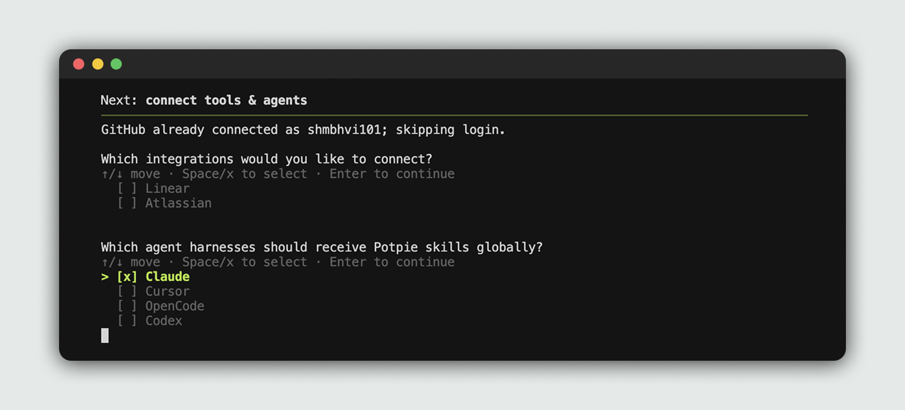
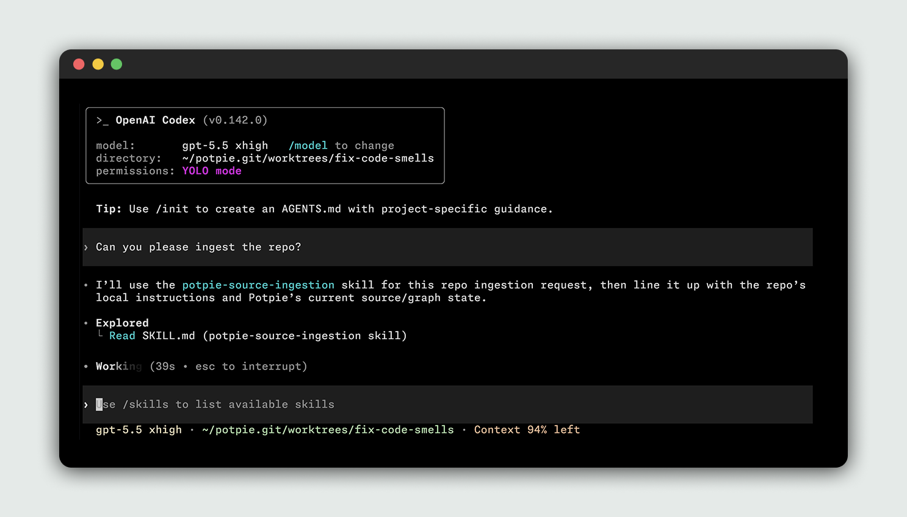
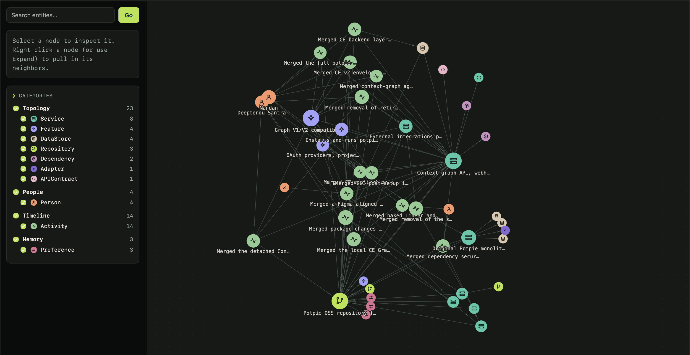

<p align="center">
  <a href="https://potpie.ai?utm_source=github">
    <picture>
      <source media="(prefers-color-scheme: dark)" srcset="./assets/readme_logo_dark.svg" />
      <source media="(prefers-color-scheme: light)" srcset="./assets/readme_logo_light.svg" />
      
    </picture>
  </a>
</p>

<p align="center">
  <a href="https://docs.potpie.ai"></a>
  <a href="https://github.com/potpie-ai/potpie/actions/workflows/test.yml"></a>
  <a href="https://discord.gg/ryk5CMD5v6"></a>
  <a href="./LICENSE"></a>
</p>

[Potpie](https://potpie.ai) turns your codebase and software development lifecycle into a living context graph for AI agents.
It indexes code, structure, decisions, source history, team knowledge and engineering workflows, so agents can answer questions, plan changes, debug failures, and write code with project-specific context.

<p align="center">
  <a href="./docs/context-graph/README.md">
    <picture>
      <source srcset="./assets/context_graph.webp" type="image/webp" />
      
    </picture>
  </a>
</p>

## Install and setup Potpie

### Step 1: install the CLI through [pypi](https://pypi.org/project/potpie/) with `uv` or `pip`:

```bash
uv tool install potpie
```

or:

```bash
python3 -m pip install --user potpie
```

> [!NOTE]
> `uv tool install potpie` is recommended for CLI installs because global
> mutation of Python packages is generally not recommended.

### Step 2: Run potpie setup wizard

```bash
potpie setup 
```

Potpie setup wizard walks you through the entire setup, choose integrations of your choice and set it up with your preferred harness.



### Step 3: Ingest the repo

Potpie is already integrated into your selected harness.
You can start using potpie with repo of your choice.

Open your previously selected harness and tell it ingest the repo.



> [!NOTE]
> You don't need to ingest the repo manually, the agent will ingest the repo and update it incrementally when required. 

You can view your contex graph in web:

```
potpie ui
```

This will open a graph explorer in your browser.



## Usage

The main cli commands are:

| Command | Purpose |
|---|---|
| `potpie status --host` | Check local daemon, pot, graph, and skill readiness. |
| `potpie status --verify` | Check connected integration credentials. |
| `potpie resolve "<task>"` | Pull the context an agent should read before doing a task. |
| `potpie search "<query>"` | Look up a specific file, workflow, bug, decision, or convention. |
| `potpie record --type <type> --summary "..."` | Save a reusable project learning. |
| `potpie skills install --agent <agent>` | Install or refresh Potpie guidance for an agent harness. |

Example:

```bash
potpie status --host
potpie resolve "what should I know before working in this repository?"
potpie search "authentication flow"
potpie record --type decision --summary "Use the existing billing adapter for Stripe events"
```

You can find a exhaustive list with more examples in our [docs](docs.potpie.ai).

## Architecture

Potpie's current architecture is CLI-first. CLI is desinged to be used by both humans and agents. Read the deeper architecture notes in [`docs/context-graph/architecture.md`](./docs/context-graph/architecture.md).

## License

This project is licensed under the Apache 2.0 License. See [LICENSE](./LICENSE).


## Community & Support

- [GitHub Issues](https://github.com/potpie-ai/potpie/issues): bugs and repository-scoped requests
- [Discord](https://discord.gg/ryk5CMD5v6): community discussion and support
- [Docs](https://docs.potpie.ai): setup, product guides, and integration details

New contributions are always welcome. Read the [Contributing Guide](./.github/CONTRIBUTING.md)
to set up your environment, understand the workflow, and open a pull request.

<a href="https://github.com/potpie-ai/potpie/graphs/contributors">
  
</a>

