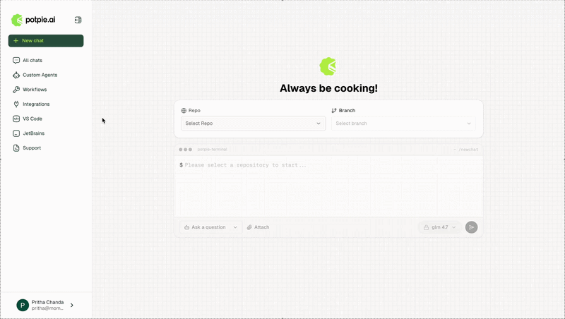

<p align="center">
  <a href="https://potpie.ai?utm_source=github">
    <picture>
      <source media="(prefers-color-scheme: dark)" srcset="./assets/readme_logo_dark.svg" />
      <source media="(prefers-color-scheme: light)" srcset="./assets/readme_logo_light.svg" />
      
    </picture>
  </a>
</p>


# Potpie

[Potpie](https://potpie.ai) turns your entire codebase into a **knowledge graph** - a structural index of every file, class, and function, capturing all their relationships and what each part of the code does in context of everything else. AI agents built on this graph can reason about your code with the precision of someone who wrote it - from debugging to feature development.


<p align="center">


</p>

<p align="center">
  <a href="https://docs.potpie.ai"></a>
  <a href="https://github.com/potpie-ai/potpie/blob/main/LICENSE"></a>
  <a href="https://github.com/potpie-ai/potpie"></a>
  <a href="https://discord.gg/ryk5CMD5v6"></a>
  <a href="https://marketplace.visualstudio.com/items?itemName=PotpieAI.potpie-vscode-extension"></a>
</p>


## Install

Create a context graph for the current repository:

```bash
pip install potpie
potpie setup --repo . --pot default --agent claude --scan
potpie resolve "what should I know before working in this repository?"
```

Potpie installs a small CLI and MCP surface that agents can use to resolve
task context, search project memory, and record durable learnings while they
work.

## What Potpie Does

Potpie gives coding agents a project memory layer they can call from the
terminal:

- `resolve` pulls task-specific context before an agent edits code.
- `search` finds prior decisions, bugs, conventions, and architecture notes.
- `record` saves reusable learnings from fixes, investigations, and reviews.
- `status` checks graph readiness, source freshness, and installed agent skills.

The default setup creates a graph for the current repository and makes it
available through the `potpie` CLI and `potpie-mcp` server.

## Setup

### For Humans

Recommended: let your coding agent set up Potpie for the repo. It can install
the right harness guidance, scan the project, and verify that context is
available.

Paste this into Claude Code, Codex, Cursor, OpenCode, or another coding agent:

```text
Set up Potpie Context Graph for this repository.

1. Check whether `potpie` is installed.
2. If it is missing, install it with `pip install potpie`.
3. Run:
   `potpie setup --repo . --pot default --agent <your-harness> --scan`
4. Install the matching agent guidance:
   `potpie skills install --agent <your-harness>`
5. Verify setup with:
   `potpie status --host`
6. Run one task-context check:
   `potpie resolve "what should I know before working in this repository?"`

Use `claude`, `codex`, `cursor`, or `opencode` as the harness name.
Report the commands you ran and any setup issue that needs a human decision.
```

If you want to run it yourself:

```bash
pip install potpie
potpie setup --repo . --pot default --agent claude --scan
potpie skills install --agent claude
potpie status --host
```

### For LLM Agents

Follow these steps before doing non-trivial work in a repository with Potpie:

```bash
potpie status --host
```

If Potpie is not initialized, run:

```bash
potpie setup --repo . --pot default --agent <harness> --scan
potpie skills install --agent <harness>
```

Before editing code, ask the graph for task context:

```bash
potpie resolve "<the task you are about to do>"
```

For targeted follow-up lookups:

```bash
potpie search "<specific file, service, decision, bug, or workflow>"
```

After you learn something reusable, record it:

```bash
potpie record --type decision --summary "..."
potpie record --type fix --summary "..."
potpie record --type preference --summary "..."
potpie record --type verification --summary "..."
```

Do not add new public tools for new workflows. Use `resolve`, `search`,
`record`, and `status`.

## Supported Harnesses

| Harness | Setup |
|---|---|
| Claude Code | `potpie skills install --agent claude` |
| Codex | `potpie skills install --agent codex` |
| Cursor | `potpie skills install --agent cursor` |
| OpenCode | `potpie skills install --agent opencode` |
| MCP-compatible agents | `potpie-mcp` |

## Core Commands

| Command | Purpose |
|---|---|
| `potpie setup` | Initialize config, graph backend, pot, skills, and optional repo scan. |
| `potpie status --host` | Check graph, pot, backend, source, and skill readiness. |
| `potpie resolve "<task>"` | Get task-specific context for agent work. |
| `potpie search "<query>"` | Look up known project context. |
| `potpie record --type ...` | Save reusable project memory. |
| `potpie ingest scan` | Scan repository files into the graph. |
| `potpie skills install` | Install agent guidance for a supported harness. |

## How It Works

```text
repo files + docs + agent records
        |
        v
potpie setup / ingest scan
        |
        v
Context Graph
        |
        v
CLI + MCP
        |
        v
agents resolve, search, record, and check status
```

The public agent surface is intentionally small:

- `context_resolve`
- `context_search`
- `context_record`
- `context_status`

New workflows should become better records, readers, skills, or includes, not a
larger public tool surface.

## Learn More

For architecture, backend profiles, daemon behavior, ingestion, and managed
deployment details, see [`docs/context-graph/`](./docs/context-graph/).
