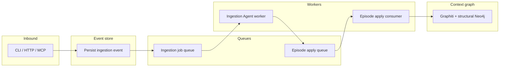

# Ingestion async pipeline & Ingestion Agent — implementation plan

This document is the **source of truth** for the next ingestion architecture in `app/src/context-engine`.

It defines the **target architecture** and a **phased rollout** for making context-graph ingestion **asynchronous by default**, backing it with an **event store** and **queues**, and evolving the **reconciliation** model into an **Ingestion Agent** that plans **episodes one-by-one** with **ordered apply** (including optional **bulk apply** on the consumer).

This revision resolves the earlier open questions around:

- how raw `/ingest` fits into the event-first model
- what ordering guarantees are required
- how retries work across planner and apply stages

It builds on the existing package layout under `app/src/context-engine` and Potpie’s Celery integration where applicable.

---

## 1. Goals

| Goal | Description |
|------|-------------|
| **Async by default** | Ingestion requests return **202 Accepted** (or equivalent) with a **job / event id**; work runs **off the request thread**. |
| **Sync on demand** | Callers that need inline results pass an explicit **sync flag** (query param, header, or CLI flag). |
| **Event store** | Every ingestion is recorded as a **durable ingestion event** before background processing (idempotency, audit, replay). |
| **Raw ingest stays first-class** | Raw episodic ingest remains supported as a separate ingestion family; it does **not** get forced through provider-oriented reconciliation semantics. |
| **Ingestion Agent** | Rename and refocus “reconciliation” naming: an agent that **updates the context graph** using **context-graph reads** + **integration tools** (GitHub, Linear, …) under a **read-first / plan-then-apply** contract. |
| **Episodes one-by-one** | The agent **plans and emits episodes in order**; each episode is **queued** and **applied** in sequence; the consumer **may batch-read** messages for **bulk apply** while preserving strict **per-pot ordering**. |

---

## 2. Current state (snapshot)

These observations are approximate; verify against `git` when implementing.

| Area | Today |
|------|--------|
| **Potpie HTTP** | `POST /api/v1/context/sync` and `POST /api/v1/context/ingest-pr` can **enqueue Celery** tasks on queue `context-graph-etl` (`context_graph_backfill_pot`, `context_graph_ingest_pr`). |
| **Standalone context-engine HTTP** | Routes such as `/sync`, `/ingest-pr`, `/ingest`, `/events/reconcile` often run **inline** unless the host injects different handlers. |
| **CLI** | `ingest` and related commands call use cases **synchronously**. |
| **Event persistence** | Tables like `context_events`, `context_reconciliation_runs`, `context_reconciliation_artifacts` exist for lifecycle / audit; not yet the **universal** front door for all ingestions. |
| **Agent naming** | Domain and HTTP use **reconciliation** (`ReconciliationPlan`, `reconcile_event`, `/events/reconcile`). |
| **Apply path** | `apply_reconciliation_plan` calls `write_episode_drafts` with **all** `EpisodeDraft`s in **one** invocation. |
| **Jobs abstraction** | `JobEnqueuePort` / `NoOpJobEnqueue` cover **backfill** and **ingest-pr** only. |

**Gap:** There is **no** first-class **episode queue**, **no** default **202 + enqueue** for all surfaces, and **no** contract that forces **one episode per plan step** at the orchestration layer.

---

## 3. Target architecture (conceptual)

1. **Inbound** validates payload → **writes event** → **enqueues ingestion job** → **202 + ids** (unless sync).
2. **Ingestion Agent worker** loads event, tools, and context → produces an **ordered list of episode steps** (see §5) → persists episode steps durably → **enqueues one message per episode** (or durable rows + notify).
3. **Episode apply consumer** reads messages (optionally **in bulk**), preserves **pot-scoped ordering**, **applies** to Graphiti/structural with **idempotency**, updates **episode / run / event state**.

---

## 4. Async vs sync contract

### 4.1 Default: asynchronous

- **HTTP:** `202 Accepted` with body like `{ "event_id": "...", "job_id": "..." }` (exact shape TBD).
- **CLI:** Print **event/job id**; optional **`--wait`** to poll until terminal state.
- **MCP:** Return job/event id; tools document async behavior.

### 4.2 Synchronous (explicit)

- **HTTP:** e.g. `?sync=true` or header `X-Context-Ingest-Sync: true` → **200** with full result or error (today’s inline semantics).
- **CLI:** `--sync` → current blocking behavior.
- **Implementation:** shared use case; sync path **skips enqueue** and runs the pipeline **in-process** (for dev/tests and urgent paths).

### 4.3 Two ingestion families

The architecture supports two distinct families under one event-first shell:

| Family | Examples | Planner required | Notes |
|-------|----------|------------------|-------|
| **Raw episodic ingest** | `POST /ingest`, CLI `ingest` | No | Stores a canonical raw-ingest event, then applies a deterministic single-episode write. |
| **Agent-backed ingest** | `POST /ingest-pr`, `POST /events/reconcile`, future webhook/event entrypoints | Yes | Stores a canonical event, runs the Ingestion Agent, emits episode steps, then applies them in order. |

Raw ingest must not be forced into provider-specific fields such as GitHub repo/source ids. It gets its own normalized event shape and idempotency rules.

---

## 5. Ingestion Agent (naming & role)

### 5.1 Rename strategy (phased)

“Reconciliation” → **Ingestion Agent** across user-facing surfaces and domain types.

| Phase | Action |
|-------|--------|
| **A** | New public names: `IngestionAgentPort`, `IngestionPlan`, env `CONTEXT_ENGINE_INGESTION_AGENT_*`, routes/docs. Keep **deprecated aliases** (`ReconciliationPlan`, old env) for one release cycle. |
| **B** | Move/rename modules (`domain/reconciliation*.py` → `domain/ingestion/` or similar); re-export aliases from old paths. |
| **C** | Remove deprecated names. |

Avoid a single mega-PR: **aliases + re-exports** first, then internal renames.

### 5.2 Agent responsibilities

- **Inputs:** normalized **ingestion event**, **pot scope**, **tool descriptors** (context-graph read tools + integration read tools).
- **Outputs:** **ordered episode steps** (and later: structural mutation steps per policy).
- **Constraints:** No direct writes to Graphiti/Neo4j from the model; only **typed plans** consumed by **deterministic appliers** (existing principle).

### 5.3 Episodes “one by one”

**Target behavior:** the runtime **orchestrates** multiple **small** agent invocations or a **streaming** contract so that **each episode is emitted and queued separately**.

**MVP option (simpler):** keep structured output but cap **`episodes` length to 1** per agent call; outer loop calls the agent until a **“done”** signal (or max steps). Each iteration **enqueues one episode**.

**Later option:** true streaming / tool loop from the LLM runtime (higher complexity).

Structural updates follow a fixed policy in this plan:

- each episode step may carry its own structural mutations
- the apply worker writes the episode first, then applies the structural mutations for that same sequence
- later sequences do not apply if an earlier sequence for the same event fails

---

## 6. Event store

### 6.1 Canonical record

- Continue using **`context_events`** as the canonical source of truth for “what was requested.”
- Fields to add or clarify as needed:
  - **Event kind:** at minimum distinguish `raw_episode` vs `agent_reconciliation` (final naming may use `ingestion_kind` / `event_kind`).
  - **Processing state:** `received` → `queued` → `agent_running` → `episodes_queued` → `applying` → `completed` | `failed`.
  - **Job / correlation ids** for tracing across broker and DB.
  - **Idempotency key** per ingestion family, not one universal provider-shaped key.

Idempotency rules:

- **Agent-backed events:** dedupe by a provider/source scoped identity such as `(pot_id, provider, provider_host, repo_name, source_system, source_id)`.
- **Raw episodic ingest:** use an explicit request id when provided; otherwise treat requests as non-deduplicated one-offs by default. Do not infer fake repo/provider identities just to satisfy the agent-backed schema.

### 6.2 Episode durability (recommended)

- Add durable episode-step storage: **`(event_id, sequence, payload_ref, status, attempt_count, applied_at, error)`** so **replay** and **bulk apply** do not depend solely on the message broker.
- Unique constraint: **`(event_id, sequence)`** for one logical step.
- Apply idempotency key: **`(event_id, sequence)`**.

Recommended statuses:

- `pending`
- `queued`
- `applying`
- `applied`
- `failed`
- `superseded`

### 6.3 Plan durability

Persist the produced plan, or plan fragments, before enqueueing episode apply work.

Minimum requirement:

- one run row for the agent attempt
- one durable artifact containing the validated plan, or a durable row per episode step

This is required so replay can resume from stored steps instead of blindly rerunning the model after partial apply.

---

## 7. Queues & consumers

### 7.1 Queues (logical)

| Queue / topic | Purpose |
|---------------|---------|
| **Ingestion jobs** | “Run Ingestion Agent for `event_id`.” |
| **Episode apply** | “Apply episode `sequence` for `event_id`” (or batch of sequences with explicit ordering). |

### 7.2 Potpie (Celery)

- New tasks, e.g. `context_graph_ingestion_agent_run`, `context_graph_apply_episodes`, bound to dedicated queue(s) (e.g. `context-graph-ingestion`, `context-graph-episodes`) or reuse/extend `context-graph-etl` with routing — **decide based on ops** (rate limits, isolation).

### 7.3 context-engine library

- Extend **`JobEnqueuePort`** (or introduce **`IngestionJobPort`**) with:
  - `enqueue_ingestion_event(event_id: str) -> None`
  - `enqueue_episode_apply(event_id: str, sequence: int, draft_ref: str | None) -> None`
- **`NoOpJobEnqueue`** remains default for CLI unless **sync** or explicit **inline worker** mode.

### 7.4 Bulk apply consumer

- Consumer partition key is **`pot_id`**, not `event_id`.
- Consumer may batch-read multiple messages for the same `pot_id`, but must apply them in the durable order recorded for that pot.
- Within an event, consumer applies only **contiguous ready** sequences starting from the next unapplied sequence.
- **Idempotency:** apply side checks **`(event_id, sequence)`** applied bit or ledger row.

This is a correctness requirement, not an optimization choice. Shared graph state is pot-scoped, so ordering must be pot-scoped too.

---

## 8. Ordering & failure semantics

These decisions are fixed for implementation:

| Topic | Decision |
|-------|----------|
| **Parallelism** | Serialize apply **per `pot_id`**; parallelize across pots only. |
| **Per-event sequencing** | Apply episode steps in ascending `sequence`; later steps do not bypass failed earlier steps for the same event. |
| **Structural writes** | For each sequence: write episode first, then apply that step’s structural mutations. |
| **Failure handling** | A failed episode step blocks later steps for the same event until retry or operator action. |
| **Delivery semantics** | Design for **at-least-once** queue delivery with idempotent step apply. |
| **Planner replay** | Do not rerun the planner automatically if a validated plan already exists for the active run and apply has only partially completed. Resume from stored episode steps first. |

Implications:

- A planner failure and an apply failure are different recovery modes.
- Event status must reflect whether failure happened before planning, during planning, or during step apply.
- The system may later support operator-forced “discard stored plan and rerun planner”, but that is an explicit action, not default retry behavior.

### 8.1 Retry model

Retry policy:

1. If the event failed **before** a validated plan was persisted, retry may rerun the planner.
2. If the event failed **after** a validated plan was persisted and at least one episode step was queued or applied, retry resumes from stored episode steps.
3. If an operator explicitly requests a fresh planning attempt, the previous unapplied steps are marked **`superseded`** before the new run becomes active.

This avoids duplicate later episodes and duplicate structural writes after partial success.

---

## 9. API / route mapping (illustrative)

| Current / planned | Async default | Sync flag |
|-------------------|---------------|-----------|
| `POST /ingest` | 202 + enqueue raw-episode event | inline deterministic raw episode write |
| `POST /ingest-pr` | 202 + enqueue | inline ingest PR |
| `POST /sync` | 202 + enqueue backfill | inline backfill |
| `POST /events/reconcile` | 202 + enqueue agent run | inline reconcile |

Add **`GET /events/{id}`** (or **`GET /jobs/{id}`**) extensions for **state**, **per-episode progress**, and **errors**.

Rename **`/events/reconcile`** → e.g. **`/events/ingest`** or **`/ingestion/events`** when doing Phase A (with redirects/aliases if needed).

---

## 10. Phased implementation checklist

1. **Schema first** — Extend `context_events` with ingestion family / state metadata and add durable episode-step storage keyed by `(event_id, sequence)`.
2. **Separate raw vs agent-backed normalization** — Introduce explicit normalization and idempotency rules for `raw_episode` events instead of forcing `/ingest` through provider/repo semantics.
3. **Plan persistence** — Persist validated plans or durable episode-step rows before enqueueing apply work.
4. **Queue contract** — Extend jobs port for `enqueue_ingestion_event(...)` and `enqueue_episode_apply(...)`; define `pot_id` as the routing/serialization key for apply workers.
5. **Apply worker** — Split **plan** from **apply**; enforce contiguous per-event sequences and idempotent `(event_id, sequence)` apply.
6. **HTTP 202 + job ids** — Router + Potpie handlers; shared response schema for `/ingest`, `/ingest-pr`, `/sync`, and event endpoints.
7. **Retry semantics** — Implement “resume from stored steps” as the default retry path after partial apply; make “rerun planner” explicit.
8. **Bulk apply optimization** — Batch reads + batched `write_episode_drafts` only within already-ordered pot partitions.
9. **Rename** — Ingestion Agent naming + deprecated aliases.
10. **Tooling** — Wire **integration read tools** + **context-graph read tools** behind `IngestionAgentPort` implementations.
11. **CLI/MCP** — Default async + **`--sync`** / tool flags; **`--wait`** optional.
12. **Observability** — Metrics: queue depth, blocked sequences, apply latency, planner failures, apply failures, duplicate suppressions.

---

## 11. Non-goals (initial iterations)

- Replacing **all** of Potpie’s event bus with this pipeline in one step.
- **Write** tools to external systems (Jira create, etc.) inside the agent loop — keep **read-only** integrations first (aligns with earlier reconciliation safety rules).
- **Guaranteed exactly-once** delivery without **idempotent** apply (design for **at-least-once** + dedupe).

---

## 12. Review notes (self-critique)

- **Scope:** Renaming “reconciliation” everywhere is **high churn**; **Phase A (aliases)** is mandatory to avoid breaking hosts.
- **Raw ingest:** Treating raw `/ingest` as its own ingestion family avoids contaminating it with GitHub/provider-specific dedupe fields.
- **Ordering:** Pot-scoped serialization is required because Graphiti and structural writes mutate shared pot state.
- **Retries:** Resume-from-plan is the safe default after partial apply; rerunning the planner by default is unsafe.
- **Standalone vs hosted:** The **library** should stay **queue-agnostic**; **Potpie** (or another host) owns **Celery** bindings.

---

## 13. References

- Existing reconciliation design: `AGENT_RECONCILIATION_PLAN.md` (historical; concepts migrate to Ingestion Agent terminology over time).
- Celery tasks (Potpie): `app/modules/context_graph/tasks.py`
- Potpie route wiring (enqueue vs inline): `app/modules/context_graph/context_engine_http.py`
- HTTP router: `adapters/inbound/http/api/v1/context/router.py`
- Jobs port: `domain/ports/jobs.py`
- CLI entry: `adapters/inbound/cli/main.py` (sync/async flags to align with §4)

---

*Last updated: 2026-04-01 — source-of-truth plan for implementation breakdown and phased PRs.*
