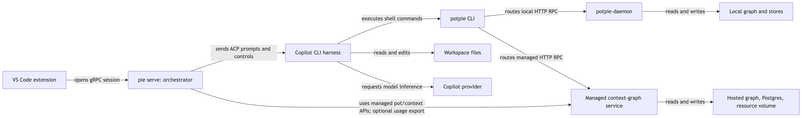
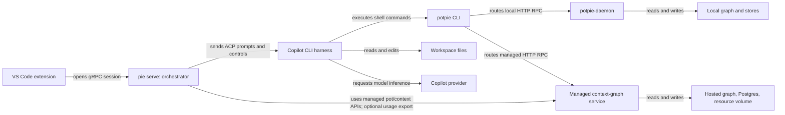

# Potpie and Pie: service architecture

| Status | Reviewed | Source snapshots |
|---|---|---|
| As built; source inspection, not deployment verification | 2026-09-10 | `potpie@631cf218`, sibling `pie@a363822d`, standalone extension `@5f51559` |

The [Windows packaging supplement](windows-packaging-and-runtime.md) was reviewed on 2026-09-11 against the current Pie working tree, including local installer edits; it distinguishes that source from older packaged releases.

## Problem

`pie`, `potpie`, the daemon, the managed backend, and the VS Code extension have different jobs even when they ship in the same installer. Understanding a request requires separating agent execution, project memory, and the hosted application. These pages describe the checked-out implementations and identify incompatible or unfinished connections.

## Solution

**Pie runs agent sessions; Potpie stores and retrieves project context.** The current Pie VS Code extension starts a local Pie service, which drives a harness such as Copilot. The harness can execute the Potpie CLI to read or update a pot on either a local daemon or a managed context-graph host. Selecting a managed graph moves project memory to that host; the editor's agent process and workspace remain local.

## Service map

[Open SVG](diagrams/readme-1.svg)

Mermaid source

The two CLI-to-host arrows are routing alternatives, not replication. Pie also has a local in-process context path, explained in [Editor runtime](editor-runtime.md); the diagram focuses on the managed editor journey.

| Component | Owns | Does not imply |
|---|---|---|
| `pie` CLI / `pie serve` | Runs, sessions, harness transport, conversations, permissions and UI events | A graph database server |
| `potpie` CLI | Human/agent command contract, host selection, pot resolution, graph and resource operations | A model inference loop |
| `potpie-daemon` | Local HTTP host, graph lifetime, local state and graph explorer | A multi-tenant cloud service |
| Managed context-graph service | Actor authorization, shared pots, graph runtime, durable server stores | The Pie Platform API or a remote coding sandbox |
| Pie VS Code extension | Chat UI, editor attachments, setup, local service lifecycle, permission interactions | The built-in GitHub Copilot VS Code extension |
| Copilot CLI | Agent/model loop and workspace tools, controlled through ACP | The owner of Potpie's ontology or persistence |
| Context core / engine | Ontology, contracts, validation, workbench, retrieval and backend adapters | Independently deployed network services |
| Graph workbench | `potpie graph …` discovery, reads, plans, commits, inbox and quality | The VS Code workbench or the browser explorer |

## Reading map

| Page | Questions answered |
|---|---|
| [Editor runtime](editor-runtime.md) | How do VS Code, Pie, Copilot, permissions, skills and conversations interact? |
| [Hosts and storage](hosts-and-storage.md) | Which host receives a command, over what protocol, with which identity and stores? |
| [Graph ontology](graph-ontology.md) | What are entities, claims, predicates, pots, views and document resources? |
| [Graph workbench and data flow](graph-workbench.md) | How does source information become graph memory, and how do reads and writes work? |
| [Setup and commands](setup-and-commands.md) | How do I set up local, managed and editor paths, and verify routing? |
| [Windows packaging and runtime](windows-packaging-and-runtime.md) | Which executables are bundled, where do they install, and how do `.pie`, `.potpie` and Windows PATH relate? |
| [Platform and other surfaces](platform-and-other-surfaces.md) | Where do the web platform, worker, sandbox and standalone extension fit? |

## Contracts and current limits

- Local agent transport is **gRPC between extension and Pie**, then **ACP JSON-RPC over stdio between Pie and Copilot**. Potpie graph calls use a separate **HTTP JSON RPC** protocol.
- A **pot** scopes graph memory and sources. A **Pie conversation/run** scopes agent execution and history. Their identifiers and stores are distinct.
- Potpie account login, managed-host authentication, source-integration credentials and Copilot login are separate credential domains.
- Pie pins Potpie/core/engine to `abe2a25203ea8beac42668c2026634d4c779154e` in its [dependency configuration](../../../pie/pyproject.toml). This Potpie checkout is newer. Matching package version strings alone do not establish wire compatibility.
- One observed mismatch is resource import: this CLI sends inline `files`; the inspected managed service accepts `source_dir`. See [Hosts and storage](hosts-and-storage.md#compatibility-and-unfinished-surfaces).
- Managed ledger connectors and nudge are unfinished. The standalone streaming gateway and cloud-harness-runner directories are reserved. They are not required hops in the editor path.

## Evidence and verification

The diagrams describe source, not a claim that every service is deployed or that the current laptop is configured this way. Setup examples are instructions; no product installation, host switch, graph mutation or service startup was performed to write these docs. Ontology values were inspected directly from the checkout. All 33 diagrams across this directory and `docs/context-graph` were browser-rendered with Mermaid 9.4.3, 10.9.8, 11.17.2 and 12.0.0; all preview image links resolve. The original Potpie/Pie command groups passed help checks in their respective environments; the Windows supplement's commands were checked against source, not executed on Windows. No end-to-end deployment test was run.

Diagrams display as checked-in PNG previews, with scalable SVG links and expandable Mermaid source, so the main illustration does not depend on a viewer's Mermaid plugin. The previews were generated with Mermaid 11.17.2; regenerate both image formats when editing the corresponding source block.

Links into `../../../pie/` and `../../../potpie-vscode-extension/` assume sibling checkouts beside this repository. They work in the shared local workspace; an isolated clone or GitHub viewer needs those repositories opened separately at the revisions above. Links within Potpie are repository-relative.

The older [context-graph docs](../context-graph/README.md) retain deeper subsystem detail, but some passages predate managed routing, resource transport and the core/engine split. Use these pages for the reviewed cross-service topology and the serving host's `graph catalog` for its executable schema.

## Code map

| Entry point | Responsibility |
|---|---|
| [CLI](../../potpie/cli/main.py), [host registry](../../potpie/cli/hosts.py) | Commands and local/managed routing |
| [Daemon](../../potpie/daemon/main.py) | Local HTTP server and browser UI mounting |
| [Local composition](../../potpie/context-engine/src/potpie_context_engine/bootstrap/host_wiring.py) | Constructs graph runtime and workstation services |
| [Pie extension](../../../pie/apps/vscode/src/extension.ts) | Editor activation, setup and session UI |
| [Pie server](../../../pie/packages/py/orchestrator/src/pie_orchestrator/transport/grpc/server.py) | Wires gRPC, conversations, context and harness execution |
| [Managed composition](../../../pie/services/context-graph/src/pie_context_graph/composition.py) | Wires shared graph runtime, tenancy and storage |
