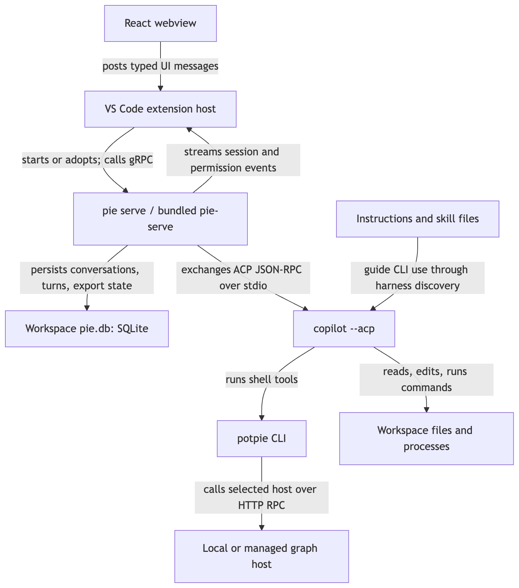
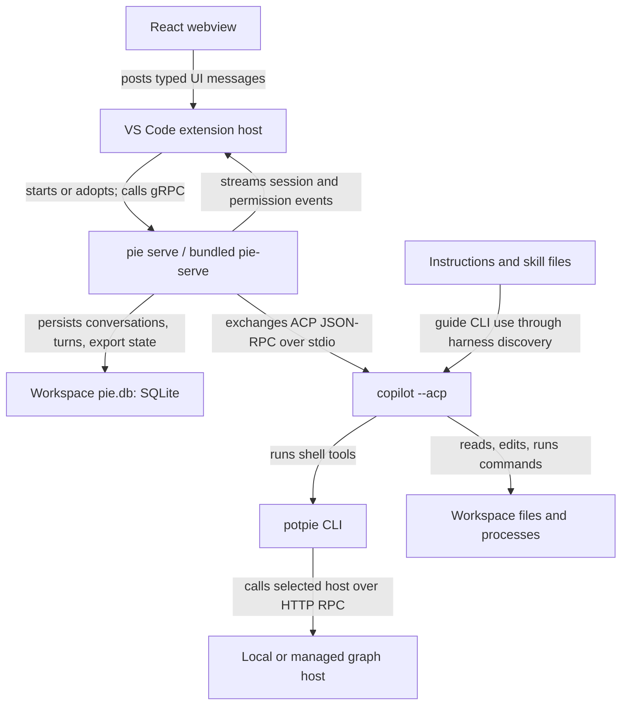
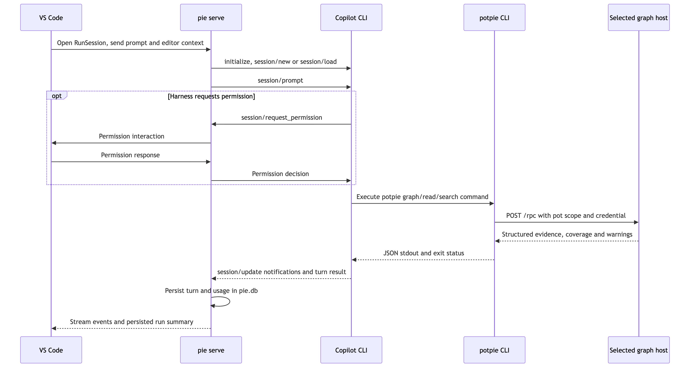
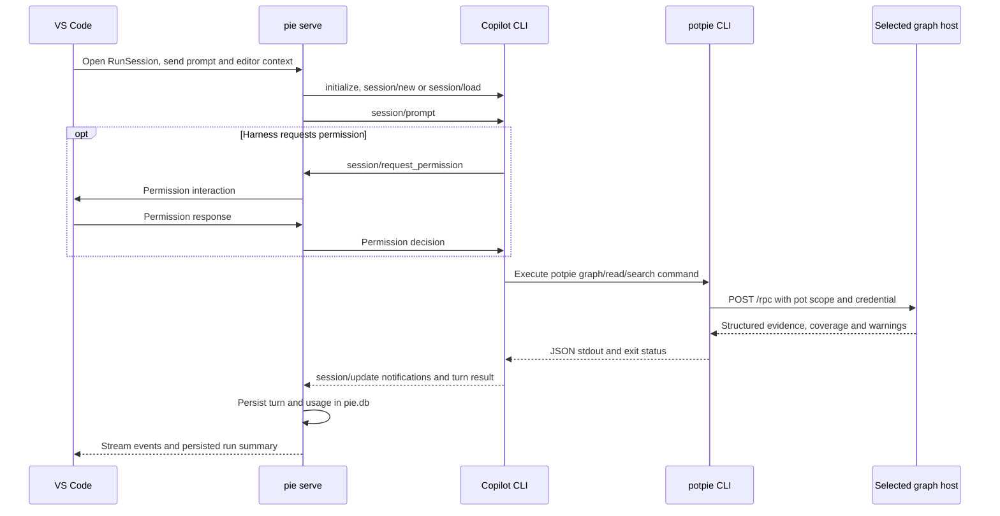

# Editor runtime: VS Code → Pie → Copilot

| Status | Reviewed | Code |
|---|---|---|
| As built from sibling Pie checkout | 2026-09-10 | [Extension](../../../pie/apps/vscode/src/extension.ts), [gRPC server](../../../pie/packages/py/orchestrator/src/pie_orchestrator/transport/grpc/server.py) |

## Problem and solution

The editor needs a persistent conversation and interactive tool permissions while the harness performs a long-running task. The extension owns the UI; `pie serve` translates the session protocol into harness actions and stores history. Copilot runs as a child process on the workspace machine. The extension is a Potpie chat surface controlling the **Copilot CLI**, not an adapter to the built-in Copilot VS Code extension.

## Process and protocol boundaries

[Open SVG](diagrams/editor-runtime-1.svg)

Mermaid source

The extension's [ServiceManager](../../../pie/apps/vscode/src/host/serviceManager.ts) prefers the packaged launcher; development can use `pie serve` on PATH. It resolves the workspace state directory, starts the child, waits for `serve.endpoint`, and probes `DescribeCapabilities` before adopting a listener. Packaged builds additionally check `serve.info` and build identity. A TCP listener alone is insufficient.

The [client](../../../pie/apps/vscode/src/host/client.ts) uses gRPC over local HTTP/2. The server binds loopback and an ephemeral port by default. `RunSession` is bidirectional streaming; conversation, capability, usage and pot operations also have unary RPCs. This is a different port and protocol from the daemon's `/rpc`.

## A task from prompt to graph read

[Open SVG](diagrams/editor-runtime-2.svg)

Mermaid source

ACP is newline-delimited JSON-RPC 2.0 over subprocess pipes. Session prompts are serialized; notifications carry incremental output. The permission branch occurs when the harness asks; policy can resolve requests without showing every one to the user. The [ACP adapter](../../../pie/packages/py/orchestrator/src/pie_orchestrator/harness/acp.py) handles permission responses and cancellation separately from ordinary output.

Graph retrieval returns context to the agent. The agent constructs the answer and performs edits using its own workspace tools. Graph access does not move those tools to the managed backend.

## Direct context calls and persistence

Pie also calls graph services directly through [ContextHost](../../../pie/packages/py/orchestrator/src/pie_orchestrator/context/host.py) and [ContextEngineAdapter](../../../pie/packages/py/orchestrator/src/pie_orchestrator/context/context_engine.py). These support pot operations, context hints and recording structured learnings. They do not have to spawn the CLI for every operation.

| Path | Implementation detail that matters |
|---|---|
| Harness executes `potpie …` | Normal CLI routing: local daemon or managed HTTP host |
| Pie direct context, managed selected | Builds a remote host using the CLI host registry |
| Pie direct context, local selected | Builds an in-process `HostShell`; it does not route through the daemon |
| Pie cannot construct its selected managed host | `ContextHost` catches the construction error and tries a local shell; later remote call failures are separate |
| Pie conversation history | SQLite `pie.db` and per-run files under the workspace state directory |

The in-process branch and fallback are real differences from CLI targeting, which refuses a failed explicit managed target. Do not interpret a working editor or a local pot label as proof that managed context succeeded. `ContextHost` also caches its shell, so restart the service after changing routing externally.

## Skills, login and usage export

The extension stages Copilot guidance under `~/.pie/copilot/`, then sets `COPILOT_SKILLS_DIRS` and `COPILOT_CUSTOM_INSTRUCTIONS_DIRS` on the child environment. Bundled skills teach the agent to use `potpie`; they are files, not a separate network service. With the global bundle disabled, workspace setup can install `AGENTS.md` and `.agents/skills/` instead. See [bundle staging](../../../pie/apps/vscode/src/host/copilotBundle.ts).

`pie.copilotHost` selects the GitHub host used for Copilot login and execution through `COPILOT_GH_HOST`. `pie.managedHost` selects the project-memory backend. They are independent. The managed key is held in VS Code SecretStorage and copied into the CLI's protected host registry during configuration; see [managedHostKey.ts](../../../pie/apps/vscode/src/host/managedHostKey.ts).

An optional [usage exporter](../../../pie/packages/py/orchestrator/src/pie_orchestrator/usage_export/exporter.py) sends `usage.report` to the managed graph host. Modes are `off`, `metrics`, and `metrics+chats`; transcript export depends on the selected mode and consent timestamps, and Potpie telemetry opt-out disables export. This is a second data flow: shared graph claims do not imply that conversations are automatically stored as graph facts.

## Verification and code map

Use `pie harness list`, `pie harness setup copilot --path . --no-bundle`, `potpie host list`, and `potpie --version` to distinguish harness readiness, context routing and build identity. In VS Code, inspect **Potpie: Show Logs** and `serve.info`; packaged launcher and PATH CLI revisions should agree.

| Source | Contract |
|---|---|
| [session.proto](../../../pie/packages/contracts/proto/pie/v1/session.proto) | Session stream, messages, capabilities, history and pot RPCs |
| [Session driver](../../../pie/packages/py/orchestrator/src/pie_orchestrator/transport/grpc/driver.py) | Turns, controls, event translation and persistence |
| [State directory](../../../pie/packages/py/orchestrator/src/pie_orchestrator/state.py) | Workspace isolation and migration from old `.potpie/` state |
| [Runtime anatomy](../../../pie/docs/vscode-vsix-runtime-anatomy.md) | Packaging, installed files, build reconciliation and process shutdown |
| [Windows packaging and runtime](windows-packaging-and-runtime.md) | Windows executables, current `.pie` paths, persistent user PATH and repair |
