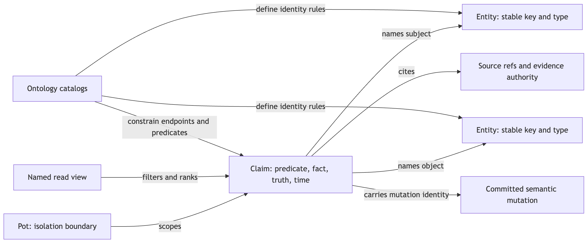
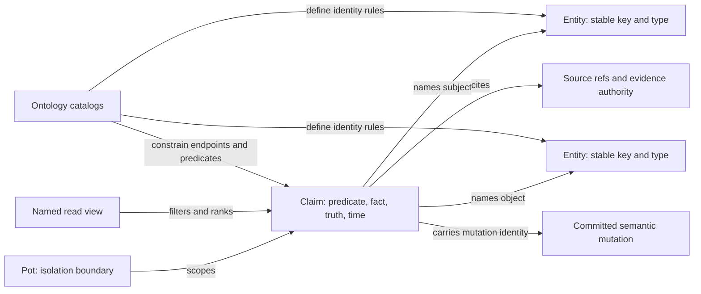
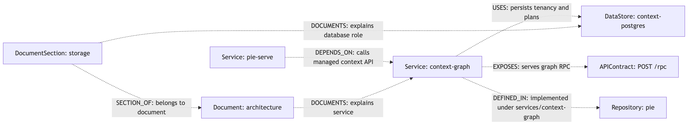
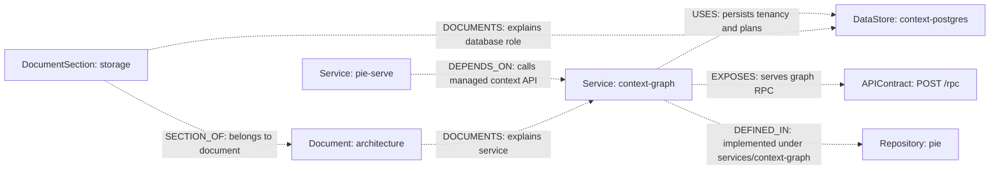

# Graph ontology: how project memory is represented

| Status | Reviewed | Code |
|---|---|---|
| As built from Potpie checkout | 2026-09-10 | [Ontology](../../potpie/context-core/src/potpie_context_core/ontology.py), [contract](../../potpie/context-core/src/potpie_context_core/graph_contract.py) |

## Problem and solution

An agent needs to distinguish a service dependency from a preference, a past incident from an active fact, and document structure from document text. Potpie represents project memory as typed entities connected by sourced claims within a pot. The ontology declares legal entity identities, relation endpoints, truth classes and views so ingestion and retrieval use the same vocabulary.

## Logical model



[Open SVG](diagrams/graph-ontology-1.svg)

<details>
<summary>Mermaid source</summary>



</details>

This is a logical model, not a promise of separate database tables. In the Cypher adapters, canonical claims are `:RELATES_TO` edges between `:Entity` nodes. The semantic predicate, such as `DEPENDS_ON`, is carried in claim properties. [ClaimQueryPort](../../potpie/context-core/src/potpie_context_core/ports/claim_query.py) exposes typed claim rows so readers need not depend on that storage representation.

Every graph operation is scoped by `pot_id`; graph adapters use pot isolation through `group_id`. A repository is an entity/source within a pot, not the pot itself. A pot can contain multiple repositories, services and documents.

## Entity and relation vocabulary

The inspected catalog contains **25 entity types, 28 predicates including `RELATED_TO`, and 15 record types**. These are snapshot counts; run the selected host's catalog before authoring against another build.

| Entity family | Types |
|---|---|
| Architecture | `Repository`, `Service`, `Environment`, `DataStore`, `Cluster`, `Dependency`, `APIContract`, `Adapter`, `ConfigVariable`, `DeploymentTarget`, `CodeAsset`, `Feature` |
| People and activity | `Team`, `Person`, `Activity`, `Period` |
| Durable memory | `Preference`, `Policy`, `BugPattern`, `Fix`, `Decision` |
| Knowledge and diagnostics | `Document`, `DocumentSection`, `Observation`, `QualityIssue` |

| Predicate | Meaning and allowed endpoints |
|---|---|
| `DEPENDS_ON` | Service → Service: one service depends on or calls another |
| `USES` | Service → DataStore or Dependency |
| `EXPOSES` | Service → APIContract |
| `DEFINED_IN` | Service → Repository; subtree can be an edge property |
| `DEPLOYED_TO` | Service → Environment |
| `DECIDED` | Decision → a scope entity |
| `POLICY_APPLIES_TO` | Preference/policy guidance attached to its permitted scope |
| `SECTION_OF` | DocumentSection → Document; a section has one current parent |
| `DOCUMENTS` | Document or DocumentSection → an entity it documents |
| `RELATED_TO` | Generic fallback; use a declared typed predicate when its meaning fits |

For this architecture, a **possible modeling example** is below. It illustrates ontology usage; these docs do not insert these entities into a live pot. Dashed relations carry example facts, not independently verified deployment inventory.



[Open SVG](diagrams/graph-ontology-2.svg)

<details>
<summary>Mermaid source</summary>



</details>

The runtime diagrams elsewhere use plain verbs to explain transport. They are not literal ontology edges: not every arrow labeled “spawns” or “streams” maps to a public graph predicate.

## Identity, truth and lifecycle

Entity identity comes from an external identifier, a canonical slug/alias, or a content hash according to its entity specification. Examples of exact prefixes are `service:`, `repo:`, `api_contract:`, `config:`, `document:` and `docsection:`. `APIContract` uses external identity; `Service` and `Document` use slug/alias identity. Do not replace underscores with hyphens or mint new keys before checking existing identities.

A claim carries subject/object keys, predicate, fact or description, confidence, truth, evidence, source references, validity/observation times, mutation identity and contract versions. Environment contributes to relation identity when supplied: a staging claim should not supersede its production counterpart. Retraction or ending validity changes which claims are current while retaining history.

| Truth class | How the claim is asserted |
|---|---|
| `authoritative_fact` | A fact grounded in an authoritative source |
| `source_observation` | An observation grounded in source evidence |
| `agent_claim` | An attributed agent assertion |
| `user_decision` | A user's decision |
| `preference` | An attributed preference |
| `timeline_event` | A historical occurrence |
| `quality_finding` | A diagnostic finding about graph quality |

`authoritative_fact` and `source_observation` require evidence. Supported authorities are `authoritative_code`, `repository_metadata`, `external_system`, `ci_run`, `user_statement`, and `agent_observation`. The validator checks how authority and truth fit; a truth label alone does not turn an inference into a sourced fact. Truth also maps to evidence strength for ranking.

## Subgraphs, views and payloads

Subgraphs are semantic groupings of memory, not additional database services. Ten named views span eight subgraphs in this checkout:

| Subgraph | Views | Reader/include family |
|---|---|---|
| `decisions` | `preferences_for_scope`, `active_decisions` | `coding_preferences`, `decisions` |
| `debugging` | `prior_occurrences` | `prior_bugs` |
| `recent_changes` | `timeline` | `timeline` |
| `infra_topology` | `service_neighborhood` | `infra_topology` |
| `features` | `feature_context` | `features` |
| `admin` | `inspection_slice` | `raw_graph` |
| `code_topology` | `ownership_by_path` | `owners` |
| `knowledge` | `document_context`, `document_passages` | `docs`, `resources` |

All ten are declared reader-backed here. Actual results still depend on backend capabilities, indexed data, required scope and query support. `Document`/`DocumentSection` and their claims describe reference material; chunk text resides in the resource store. The `docs` view retrieves graph context, while `resources` searches passages through the resource index.

## Contracts and verification

The data-plane contract is `v1.5`, the workbench envelope is `v2`, and ontology version is `2026-06-graph`. These are different layers. The current parser normalizes inbound mutation `v2` to `v1.5`; another server build may not. The outer workbench version is not a second graph database.

```bash
potpie --json graph catalog
potpie --json graph describe infra_topology --view service_neighborhood --examples
potpie --json graph describe knowledge --view document_passages --examples
```

| Source | Responsibility |
|---|---|
| [Ontology](../../potpie/context-core/src/potpie_context_core/ontology.py) | Entity, edge and record catalogs; identities and endpoint rules |
| [Graph views](../../potpie/context-core/src/potpie_context_core/graph_views.py) | Named views, inputs, relation expansion and reader mappings |
| [Workbench ontology](../../potpie/context-core/src/potpie_context_core/graph_workbench_ontology.py) | Executable catalog/describe contracts |
| [Graph contract](../../potpie/context-core/src/potpie_context_core/graph_contract.py) | Truth, operations, authority, versions and identity helpers |
