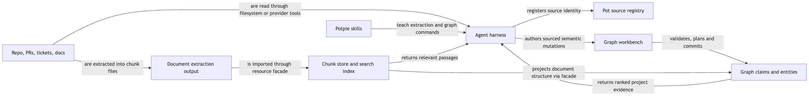
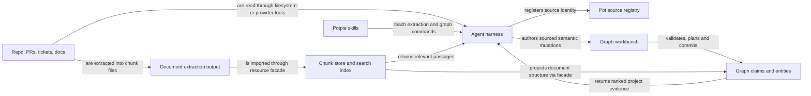
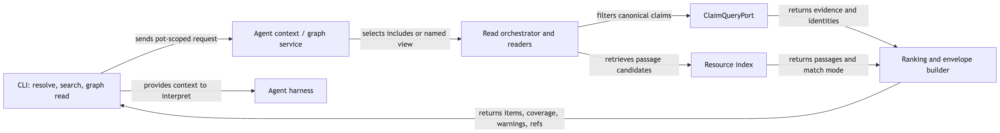
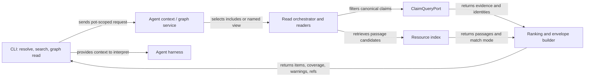
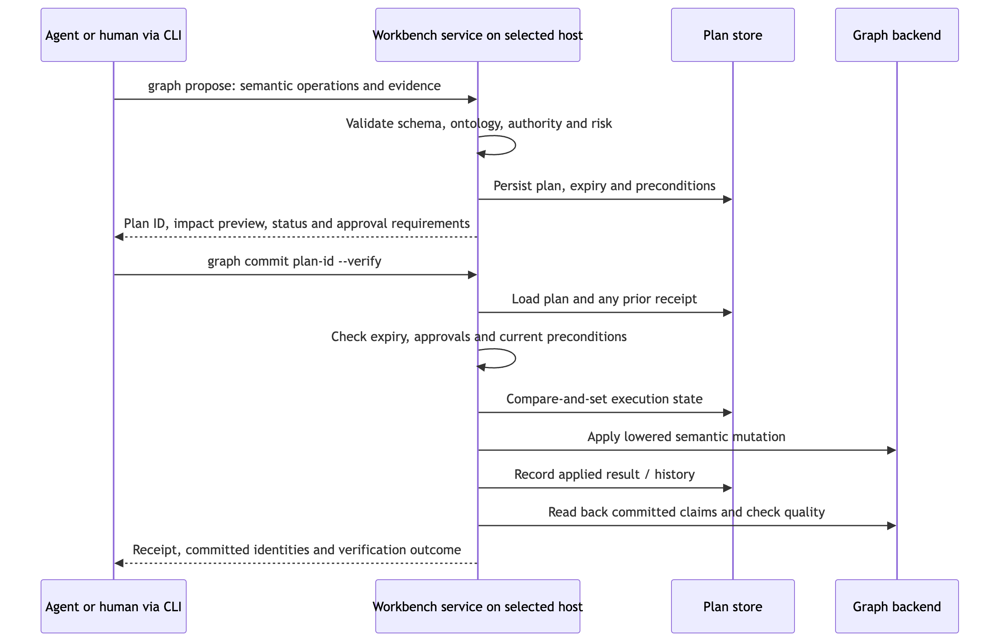
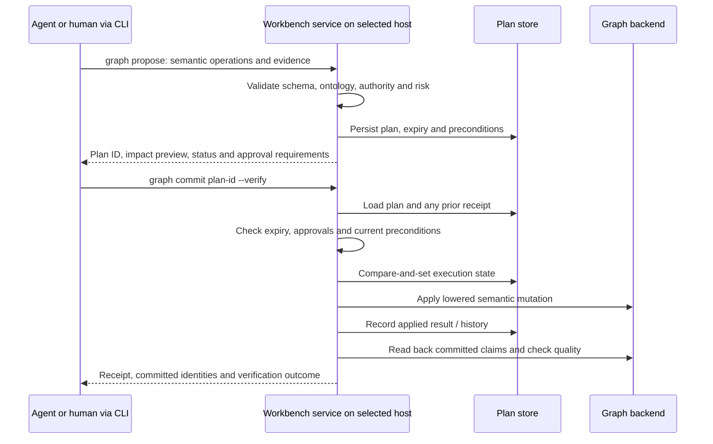

# Graph workbench: source evidence → durable memory → agent context

| Status | Reviewed | Code |
|---|---|---|
| As built from Potpie checkout | 2026-09-10 | [CLI workbench](../../potpie/cli/commands/graph.py), [workbench service](../../potpie/context-core/src/potpie_context_core/workbench_service.py) |

## Problem and solution

The graph must preserve useful knowledge without treating every agent guess as source truth. An agent reads source material and proposes semantic changes; the host validates those changes and persists a plan before commit. Retrieval then selects and ranks the resulting evidence for subsequent tasks. The workbench is the `potpie graph …` command family and its host service, not a separate deployed process.

## How sources enter



[Open SVG](diagrams/graph-workbench-1.svg)

<details>
<summary>Mermaid source</summary>



</details>

`potpie source add repo .` registers provenance and scope; it does not itself scan all files or construct the baseline graph. Harness skills guide the agent to inspect source evidence and write useful memory. The source integrations supply credentials and source access; managed source registration does not imply a hosted connector is polling it.

Document import is a distinct pipeline: an extractor produces a chunk directory, `resource import` stores those chunks, the resource facade updates document structure in the graph, and the search index makes passages retrievable. Lexical indexing happens before deferred vector work finishes. Extraction, chunk storage, graph projection and index readiness are separate outcomes; inspect the import receipt and index status.

The engine also has ingestion/reconciliation infrastructure; see [existing ingestion notes](../context-graph/ingestion-nudge.md) for that separate path. The inspected managed service's ledger and nudge surfaces remain unsupported, so they are not automatic steps in this diagram.

## Read flow



[Open SVG](diagrams/graph-workbench-2.svg)

<details>
<summary>Mermaid source</summary>



</details>

There are three independent read controls: **retrieve** candidates by query, **filter** them by scope/provenance/time/environment, and **traverse** bounded relationships. A read envelope reports evidence and coverage rather than a generated answer. Sparse coverage, unsupported filters and degraded match modes are actionable output; an empty result does not prove the source contains no relevant fact.

`resolve` provides task-oriented context; `search` supports targeted lookup; `graph read` selects a named view; `search-entities` resolves stable identities; `neighborhood` explores relationships. These share graph internals. Use `--detail full` and `--relations full` on graph reads when validating exact relationships. `--current` selects the pot associated with the current repo; `--repo current` additionally requests repo scope where the view supports it.

## Write flow



[Open SVG](diagrams/graph-workbench-3.svg)

<details>
<summary>Mermaid source</summary>



</details>

Proposal validates and persists a plan; it does not apply the proposed graph changes. Commit checks the plan's validity and policy before mutation. Review-required operations need the required approval identity. Use the returned plan and receipt for retries; a timeout can occur after application, and issuing a new mutation blindly can duplicate intent. The CLI has [commit recovery](../../potpie/cli/commit_recovery.py) for this uncertain-result case.

`--verify` reads back committed claim keys and runs quality checks. A missing committed claim is a failure; a quality regression is reported in `verification.status` and warnings and can still leave the command successful. Read both the exit code and receipt. Plan compare-and-set coordinates claims on execution; it is not a distributed transaction spanning graph, Postgres and resource files.

## Operations and supporting tools

| Surface | Purpose |
|---|---|
| `catalog`, `describe` | Discover the serving host's legal schema, views and examples |
| `propose`, `commit`, `history` | Reviewable, durable write workflow and receipts |
| `upsert_entity`, `link_entities`, `assert_claim`, `append_event` | Create/enrich identities, relationships, assertions and timeline facts |
| `patch_entity`, `transition_state` | Change allowed properties or lifecycle state |
| `end_relation_validity`, `retract_claim`, `supersede_claim`, `merge_duplicate_entities` | Correct or retire knowledge under write policy |
| `graph inbox …` | Queue and track candidate work; adding an item is not committing a fact |
| `graph quality …` | Diagnose duplicates, stale/conflicting facts, orphans and projection drift |
| `record` | Convenience path for durable learnings using the shared semantic graph machinery |
| `graph mutate` | Legacy wrapper around propose/commit |
| `graph bulk apply` | Batch semantic writes; consult help and each receipt before retrying |

## Verification commands

Use an existing pot for the reads below. The final two commands are an intentional write recipe: first author and inspect `mutation.json` from actual source evidence, then replace `PLAN_ID` with the proposal's result. Add an explicit `--pot local:<ref>` or `--pot managed:<ref>` to both calls when routing must be fixed.

```bash
potpie --json graph catalog
potpie --json graph read --subgraph infra_topology --view service_neighborhood --repo current
potpie --json graph search-entities --query "context graph" --type Service
potpie --json graph quality summary
potpie --json graph history
potpie --json graph propose --file mutation.json
potpie --json graph commit PLAN_ID --verify
```

The complete mutation contract is discoverable through `graph catalog`; `graph mutation-template --kind repo-baseline` provides a placeholder skeleton that must be filled and reviewed. A template is not evidence.

| Source | Responsibility |
|---|---|
| [Workbench service](../../potpie/context-core/src/potpie_context_core/workbench_service.py) | Plans, commit, history, inbox and verification |
| [Semantic validator](../../potpie/context-core/src/potpie_context_core/semantic_mutation_validator.py), [lowering](../../potpie/context-core/src/potpie_context_core/semantic_mutation_lowering.py) | Validate meaning and convert to backend mutations |
| [Read orchestrator](../../potpie/context-engine/src/potpie_context_engine/application/services/read_orchestrator.py), [envelope builder](../../potpie/context-engine/src/potpie_context_engine/application/services/envelope_builder.py) | Reader selection, ranking and response shaping |
| [Resource facade](../../potpie/context-engine/src/potpie_context_engine/application/services/resource_facade.py) | Chunk storage, index maintenance and document graph projection |
