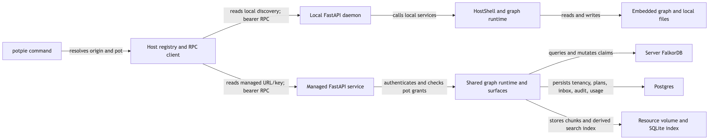
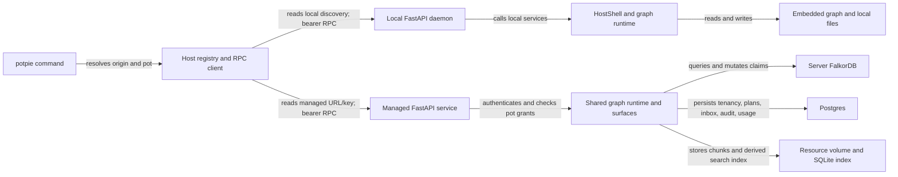
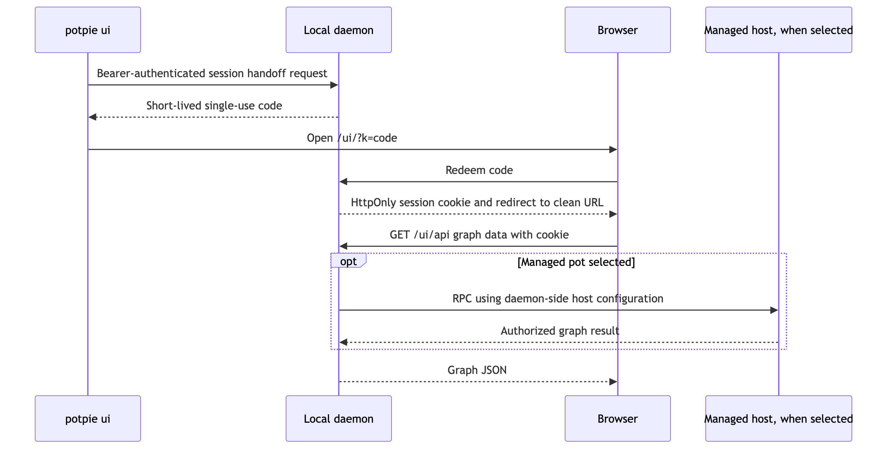
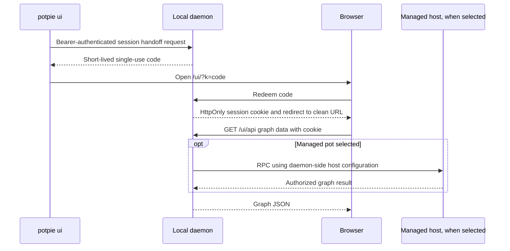

# Hosts and storage: local daemon versus managed context graph

| Status | Reviewed | Code |
|---|---|---|
| As built; cross-version gaps called out | 2026-09-10 | [Host registry](../../potpie/cli/hosts.py), [daemon](../../potpie/daemon/main.py), [managed composition](../../../pie/services/context-graph/src/pie_context_graph/composition.py) |

## Routing boundary

The CLI chooses a host, resolves a pot there, then calls service methods. The remote facade preserves the service-shaped interface while encoding requests over HTTP. Local and managed pots remain in their own stores; switching hosts does not upload, copy or merge them.

[Open SVG](diagrams/hosts-and-storage-1.svg)

Mermaid source

| Selection | Meaning |
|---|---|
| `potpie --host local …` / `--host managed …` | Select origin for this invocation |
| `--pot local:<ref>` / `--pot managed:<ref>` on pot-scoped commands | Qualify the pot's owning host explicitly |
| `potpie host use local` / `managed` | Persist the CLI's active origin |
| `potpie pot use managed:<ref>` | Select the host and its active pot |
| `POTPIE_MANAGED_URL`, `POTPIE_MANAGED_TOKEN` | Override configured managed connection values, with credential/address matching checks |
| `CONTEXT_ENGINE_HOME` | Choose local state and CLI registry directory; defaults to `~/.potpie` |

Each host retains its own active pot; managed active-pot state is actor scoped. Bare pot references use the registry's resolution rules, with ambiguity checks when searching across origins. Use qualified references in reproducible scripts. Listing can return local results plus a managed-unavailable diagnostic; a command explicitly targeting a failed managed host must not silently write locally.

## Wire and identity contracts

| Boundary | Transport and authentication | Payload / responsibility |
|---|---|---|
| CLI → local daemon | Loopback HTTP; bearer from `discovery.json` | `POST /rpc`, `POST /attr`; local machine services |
| CLI / Pie → managed graph | HTTP RPC; deploy with HTTPS externally; static API key or explicit dev auth-disabled mode | Same service/method codec; server derives actor/org and checks pot grants |
| CLI → daemon discovery | Local files | `base_url`, token, PID, log path; daemon publishes and removes these with its lifetime |
| Browser → daemon explorer | `/ui/api`; session cookie or daemon bearer | Graph reads and host/pot selection |
| Account or integration auth | Separate provider/API flows | Neither `potpie login` nor Copilot login configures the managed graph key |

The RPC request contract is `{"surface": "…", "method": "…", "args": <encoded tuple>, "kwargs": <encoded mapping>}`. `/attr` takes `surface` and `name`. Responses have an outer `ok` with encoded `result` or structured error. Some method results contain their own workbench `ok`, warnings and status, so HTTP success alone is insufficient.

The codec carries Python type tags and reconstructs DTOs by import path. Surface discovery can identify supported methods, but does not translate incompatible DTO versions. The local daemon offers authenticated `GET /surfaces`; the inspected managed routes expose `/health`, `/rpc` and `/attr`. Its optional `X-Potpie-Protocol-Version` check is a rejection mechanism, not a migration layer.

## Storage ownership

| Data | Local host | Managed host |
|---|---|---|
| CLI origin, managed URL/key | `<home>/cli_hosts.json` (0600) | Still client-side, not a server setting |
| Pots, sources, active-pot/config | Local pot/config stores | Postgres in durable profile; active selection belongs to actor |
| Canonical graph entities and claims | Default `falkordb_lite` embedded graph | Server FalkorDB when configured |
| Mutation plans and inbox | `graph_plans.json`, `graph_inbox.json` | Postgres with compare-and-set adapters |
| Document payloads | `<home>/resources/` | Mounted resource root; file store, not Postgres document bodies |
| Passage retrieval | SQLite resource index and background embedding drain | Resource-root SQLite index; replica/shared-volume constraints apply |
| Conversations and run artifacts | Pie workspace `pie.db` and `runs/` | Only optional exported usage/transcripts reach `usage`; graph host does not own local run execution |

The managed **development defaults** are in-memory graph, memory stores and authentication disabled. Durable shared operation requires explicit FalkorDB, Postgres, authentication and a persistent resource volume. The service composes `GraphRuntime` through the engine API; it replaces pot/auth/config services instead of running the workstation `HostShell` wholesale.

## Graph explorer browser handoff

[Open SVG](diagrams/hosts-and-storage-2.svg)

Mermaid source

The explorer is served by a local daemon even when it displays a managed pot. It reads the same service model as the CLI, but is primarily a graph viewer; it also changes host/pot selection. The daemon token and managed key are not placed in the browser URL. A remote-only CLI installation does not include this local UI server.

## Compatibility and unfinished surfaces

**Resource import is currently incompatible across these two checkouts.** This Potpie CLI reads a local extraction directory and sends `files=`. Pie's managed `ResourcesSurface.import_dir` still requires `source_dir=` on the server. The CLI converts an old-host keyword refusal into `resource_import.inline_files` unavailability. Upgrade the managed adapter and aligned dependencies before using the current CLI to upload remotely; mounting a directory alone does not fix the keyword mismatch.

Managed `ledger` and `nudge` calls return unsupported results; they do not run hosted connector ingestion. Server resource indexing is process-local and needs explicit care with multiple replicas/shared filesystems. Snapshot import/export uses host-side paths. These limits remain separate from basic graph reads and propose/commit support.

## Verification and map

Run `potpie host list`, `potpie --host managed pot list`, `potpie --host managed graph catalog`, and `potpie --host local daemon status` to inspect each boundary. Do not print discovery files or host registries into shared logs: they contain credentials.

| Source | Responsibility |
|---|---|
| [RPC client](../../potpie/daemon/client.py), [surface declaration](../../potpie/daemon/surfaces.py) | Codec calls and capability discovery |
| [Local composition](../../potpie/context-engine/src/potpie_context_engine/bootstrap/host_wiring.py) | Local backend, stores, resources and graph runtime |
| [UI routes](../../potpie/daemon/http/ui/router.py), [UI auth](../../potpie/daemon/http/ui/auth.py) | Explorer routing and browser handoff |
| [Managed authorization](../../../pie/services/context-graph/src/pie_context_graph/application/authorization.py) | Deny-by-default pot access |
| [Managed resources](../../../pie/services/context-graph/src/pie_context_graph/application/surfaces/resources.py), [CLI import](../../potpie/cli/commands/resource.py) | Observed import contract mismatch |
