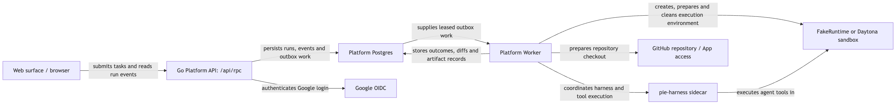
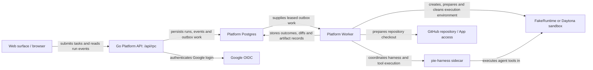
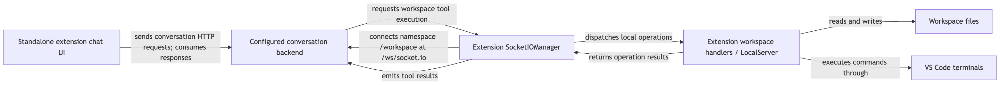
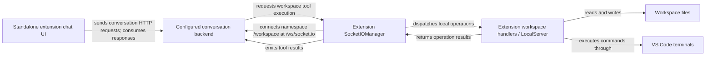

# Hosted platform and other extension: separate execution paths

| Status | Reviewed | Code |
|---|---|---|
| As built from sibling checkouts; reserved components labeled | 2026-09-10 | [Pie services](../../../pie/services/), [standalone extension](../../../potpie-vscode-extension/src/) |

## Problem and solution

“Backend” can mean the managed context-graph host, the hosted Pie application API, or the older conversation backend used by the standalone extension. They expose different contracts and do different work. The current editor journey in [Editor runtime](editor-runtime.md) runs a local orchestrator; the hosted application uses a durable worker and execution runtime.

## Pie hosted application

[Open SVG](diagrams/platform-and-other-surfaces-1.svg)

Mermaid source

The API owns application authentication and task submission. Its Surface RPC envelope contains `id`, `method`, `params`, and optional idempotency/correlation fields; methods include `run/create` and `run/events/list`. The worker consumes durable outbox work with Postgres leases, prepares a workspace, drives the harness, persists results and performs cleanup.

This API's `/api/rpc` is **not** the context graph's `/rpc`: pointing `potpie host set` at the Platform API does not create a graph connection. Platform Postgres and context-graph Postgres are separate logical schemas/stores; using the same database technology does not imply shared tables or identity mappings.

The checked local app script starts Postgres, Platform API, Platform Worker and web UI; `bun run dev:app` or `task app:dev` is its entrypoint. It requires the AuthN/GitHub configuration described in the [Pie README](../../../pie/README.md). FakeRuntime uses a local workspace path; Daytona is the remote sandbox alternative. Harness execution and sandbox provisioning are different configuration choices (`PIE_HARNESS_RUNTIME` versus `PIE_SANDBOX_RUNTIME`).

No automatic Platform API → context-graph request is asserted in this diagram. To give a particular hosted agent graph access, its runtime needs the client, skills, credentials and selected pot wired explicitly; the verified desktop managed connection does not establish that hosted wiring.

## Current, optional and reserved components

| Component | Evidence-backed status |
|---|---|
| `services/platform-api` | Go application API with auth, integrations and run Surface RPC |
| `services/platform-worker` | Real Postgres outbox consumer; provisions runtime and coordinates harness/tools |
| `services/context-graph` | Real Python managed graph service with separate HTTP contract and stores |
| `pie-harness` | Harness sidecar used by execution paths; distinct from `pie serve` |
| `services/streaming-gateway` | README reserves it for live event delivery; do not add it as a required running hop |
| `services/cloud-harness-runner` | README reserves a hosted/reference harness runtime; distinct from the implemented worker path |
| `surfaces/mcp`, `surfaces/desktop`, `surfaces/cli` | Repository organization is not evidence that each is a deployed service |

## The standalone VS Code extension checkout

Two extension codebases are present in this workspace. The current Pie extension lives under `pie/apps/vscode`; the sibling `potpie-vscode-extension` has a different cloud-chat/tool-execution architecture. Keep their configuration and troubleshooting instructions separate.

[Open SVG](diagrams/platform-and-other-surfaces-2.svg)

Mermaid source

This graph documents the extension-side connections visible in source; it does not reconstruct the entire conversation backend. Its local HTTP server and Socket.IO tool bridge must not be mistaken for `pie serve` gRPC or for `potpie-daemon`. No Copilot ACP hop is inferred for this older path.

| Question | Pie extension | Standalone extension |
|---|---|---|
| Source | `pie/apps/vscode/src/extension.ts` | `potpie-vscode-extension/src/ChatViewProvider.ts` |
| Agent/session connection | Local gRPC to `pie serve`, then harness protocol | Configured cloud conversation API and Socket.IO workspace channel |
| Workspace access | Harness tools, with Pie permission/UI handling | Extension-side file/terminal handlers and local server |
| Graph integration shown here | Agent CLI calls plus Pie context adapter | Not assumed from the presence of the older chat backend |

## Verification and source map

Inspect the extension's actual installed build and output channel before choosing one of these troubleshooting paths. For the web stack, verify API and worker startup independently and inspect the run's persisted state; an accepting API does not establish that a worker is running.

| Source | Responsibility |
|---|---|
| [Platform server](../../../pie/services/platform-api/internal/app/server.go), [Surface RPC handler](../../../pie/services/platform-api/internal/app/surfacerpc/handler.go) | Actual application endpoints and request envelope |
| [Worker README](../../../pie/services/platform-worker/README.md) | Runtime choices, Postgres leases and worker startup |
| [Local app script](../../../pie/scripts/dev-app.sh) | Which processes the development stack starts |
| [Streaming gateway](../../../pie/services/streaming-gateway/README.md), [cloud runner](../../../pie/services/cloud-harness-runner/README.md) | Explicit reserved status |
| [Standalone Socket.IO manager](../../../potpie-vscode-extension/src/SocketIOManager.ts) | Workspace channel and tool request/result handling |
| [Standalone LocalServer](../../../potpie-vscode-extension/src/LocalServer.ts), [chat provider](../../../potpie-vscode-extension/src/ChatViewProvider.ts) | Local operations and conversation requests |
