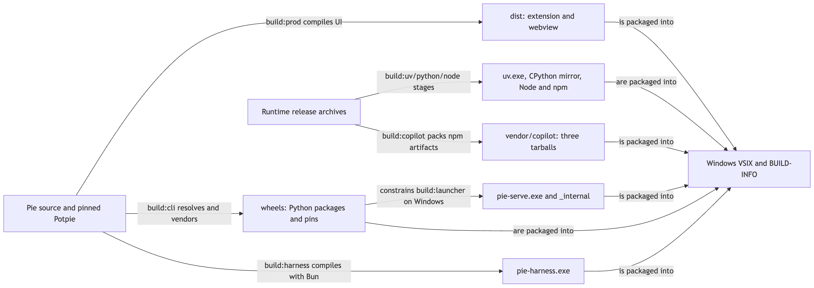
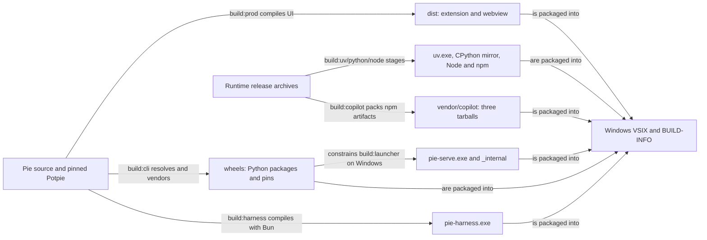
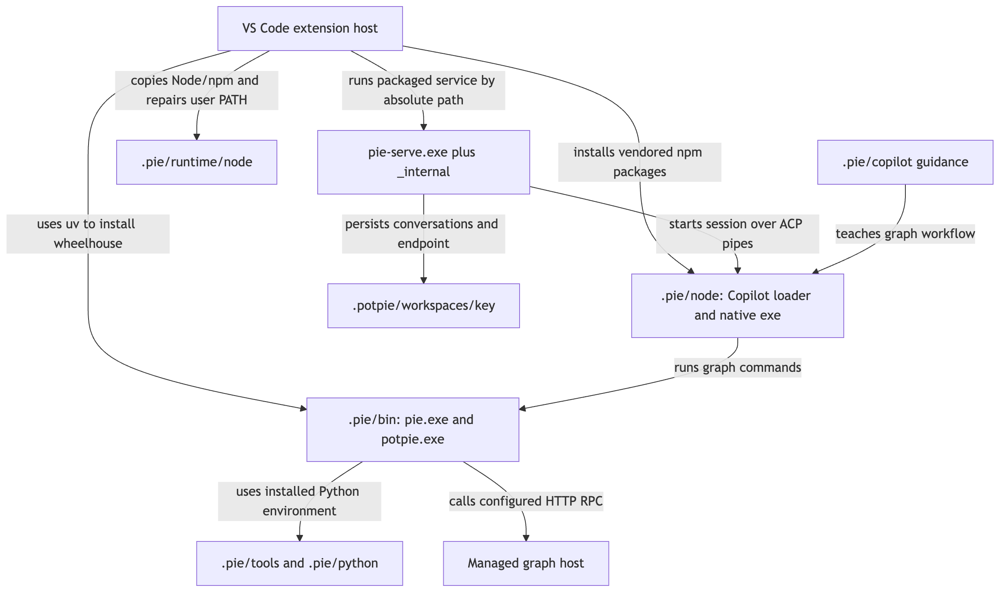
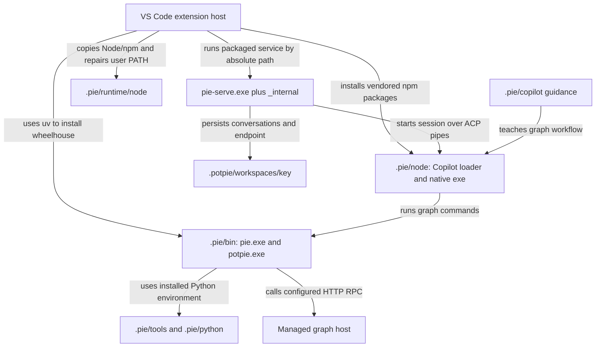

# Windows: bundled executables, installation paths and runtime state

| Status | Reviewed | Source |
|---|---|---|
| As built in source; Windows execution not tested here | 2026-09-11 | Pie `a363822d` working tree, manifest `0.2.20`, including local edits to `onboarding.ts` |

## Problem and solution

A Windows VSIX contains several runtimes, but only some executables run directly from the extension directory. Setup installs other commands into persistent user directories and configures PATH. **`.pie` holds the extension-managed tools and runtimes; `.potpie` holds context configuration and workspace state.** The versioned VS Code extension folder holds the packaged service and its installation inputs. These locations have different owners and update lifecycles.

This page describes the current [Pie extension](../../../pie/apps/vscode/), not the separate `potpie-vscode-extension` checkout. Older packaged builds may still use uv's default directories. Inspect the actual VSIX's `BUILD-INFO.json` before applying a source snapshot to an installed machine.

## What the Windows build produces



[Open SVG](diagrams/windows-packaging-and-runtime-1.svg)

<details>
<summary>Mermaid source</summary>



</details>

Build from a **Windows x64 host** for the complete `win32-x64` artifact. The launcher uses PyInstaller with the build host's interpreter/native modules, and the script rejects cross-OS freezing. Some inputs can be cross-built or downloaded from another OS, but that does not produce a complete Windows VSIX by itself.

| Packaged path, relative to the installed extension | Produced by | Why it exists |
|---|---|---|
| `dist/` | `build:prod` | Extension-host JavaScript, webview JavaScript and CSS; VS Code supplies the extension host |
| `bin/win32-x64/pie-serve.exe` **and** `_internal/` | `build:launcher` | Frozen Python orchestrator and dependencies; serves local gRPC |
| `bin/win32-x64/pie-harness.exe` | `build:harness` | Compiled harness sidecar with Bun embedded; separate from Copilot ACP |
| `bin/win32-x64/uv.exe` | `build:uv` | Installs the managed Python interpreter and Python CLI tool environment |
| `bin/win32-x64/python-mirror/<release>/<archive>.tar.gz` | `build:python` | Offline CPython installation source, matched to the wheelhouse's interpreter line |
| `bin/win32-x64/node/node.exe`, `npm.cmd`, `npx.cmd`, `node_modules/npm/` | `build:node` | Node interpreter and npm implementation, needed for installation and npm CLI execution |
| `wheels/*.whl` | `build:cli` | `pie-cli`, orchestrator, Potpie/core/engine and dependencies for the installed Python CLI |
| `wheels/requirements.txt`, `extras.txt`, `PLATFORM`, `SOURCE.json` | `build:cli` | Dependency closure, selected extras, target and provenance |
| `vendor/copilot/*.tgz` | `build:copilot` | Copilot meta-package, `@github/copilot-win32-x64` native package and `detect-libc` |
| `skills/`, `pins.json`, `BUILD-INFO.json` | Source/build packaging | Agent guidance, runtime pins and build identity used during reconciliation |

**Keep `pie-serve.exe` together with `_internal/`.** Windows uses PyInstaller's directory layout rather than a self-extracting executable because the latter caused parent-process failures when launched by VS Code. The build flattens that directory under `bin/win32-x64/`; copying just the `.exe` is incomplete.

The current `package` script includes `build:copilot`, and `.vscodeignore` includes its tarballs. The older packaging guide's statement that Copilot vendoring is manual no longer describes this working tree. Copilot's version comes from `pins.json` (`1.0.82` at review), not a hardcoded filename in an operator's script. Node and CPython versions are build inputs/metadata; they need not match a system installation.

## Where files land on the user's machine

The following are **default Windows locations**. `%USERPROFILE%` normally means `C:\Users\<user>`. VS Code's extension directory can differ for portable installs, Insiders or a custom `--extensions-dir`; the code uses `context.extensionPath` rather than assuming this default.

```text
%USERPROFILE%\
  .vscode\extensions\potpie.potpie-<version>[-win32-x64]\
    bin\win32-x64\                   packaged executables and runtime inputs
    wheels\                          Python install inputs
    vendor\copilot\                  Copilot npm install inputs
    BUILD-INFO.json                   identity of this VSIX
  .pie\
    bin\pie.exe                      installed Python CLI launcher
    bin\potpie.exe                   installed context CLI launcher
    bin\potpie-daemon.exe             installed daemon entry point
    tools\pie-cli\                   Python tool environment and packages
    python\                          uv-managed CPython installation(s)
    node\copilot.cmd                  npm command shim (plus other wrappers)
    node\node_modules\               Copilot loader/native package and npm tools
    runtime\node\                    stable Node/npm copy for external terminals
    runtime\uv\<version>\uv.exe       recovery installer, only when needed
    copilot\                         staged instructions and .agents\skills
  .potpie\
    cli_hosts.json                   origin, managed URL/key
    discovery.json, daemon.pid       present when a local daemon is running
    workspaces\<workspace-key>\
      serve.endpoint, serve.info     workspace service endpoint and identity
      pie.db                         conversations, turns and export bookkeeping
      runs\                          run artifacts/logs
  .copilot\                          Copilot-owned state; separate from .pie
```

| Location | Written/used by | Lifetime and overrides |
|---|---|---|
| Versioned extension directory | VS Code install; launcher runs here | Replaced on extension update; source for repair inputs |
| `.pie\bin`, `.pie\tools`, `.pie\python` | `installBundledPieCli` invokes uv with explicit `UV_TOOL_BIN_DIR`, `UV_TOOL_DIR`, `UV_PYTHON_INSTALL_DIR` | Survive VSIX replacement; current installer deliberately overrides inherited uv directory settings for these three paths |
| `.pie\node` | npm with `--prefix` | Persistent harness install, not the bundled Node distribution; optional Codex/Codex ACP shims also land here |
| `.pie\runtime\node` | Dependency setup copies bundled Node/npm, checks versions | Stable interpreter for npm wrappers outside VS Code |
| `.pie\runtime\uv\<version>` | `ensureUv` recovery | Used if packaged/recovered/PATH uv candidates fail; not added to user PATH as a general `uv` command |
| `.pie\copilot` | CLI skill installation and extension instructions staging | Repaired against the current bundle independently of CLI installation |
| `.potpie` | CLI and daemon | `CONTEXT_ENGINE_HOME` overrides it; may contain credentials and graph/resource data from local configurations |
| `.potpie\workspaces\<workspace-key>` | Pie service and extension | `PIE_STATE_DIR` overrides the whole workspace state directory; key is basename plus first 12 SHA-256 characters of the normalized root, lowercased on Windows |
| VS Code state/SecretStorage | Extension | Build/dependency verification stamps, workspace selection and managed-key copy; separate from these filesystem trees |

The installed `pie.exe` and `potpie.exe` are entry-point launchers for the uv-managed environment. They are different artifacts from the frozen `pie-serve.exe`, which carries its own Python runtime. Thus two copies of Python/application dependencies are intentional: one starts the editor service reliably; the other exposes shell commands to users and agents. The build constrains the frozen launcher to the wheelhouse's dependency versions so these copies agree.

## PATH has two scopes

| Scope | Directories added, in precedence order | When it takes effect |
|---|---|---|
| VS Code integrated terminals and Pie child processes | `.pie\bin`; user uv bin (`UV_TOOL_BIN_DIR` or `.local\bin`); `.pie\node`; `<extension>\bin\win32-x64\node`; then inherited PATH | Extension activation/process spawn; terminal environment collection is non-persistent and rebuilt on activation |
| Persistent Windows **user** PATH | `.pie\bin`; `.pie\node`; `.pie\runtime\node`; existing user entries retained | Dependency setup/repair writes and verifies `HKCU\Environment\Path`; new processes must inherit the change |

The user PATH update does not write the machine PATH or require elevation. Existing PowerShell, Command Prompt, Windows Terminal and VS Code processes can retain old environments; reopen the terminal application after setup. Another machine-PATH entry or shell alias can still win in an external terminal. The extension's child environments explicitly prepend its managed paths.

**Neither `.potpie` nor the whole `.pie` directory belongs on PATH.** PATH points to directories containing command executables/shims. The packaged `pie-serve.exe`, sidecar and bundled/recovery `uv.exe` are found by explicit paths, not by adding all packaged files to the user PATH. `CONTEXT_ENGINE_HOME` moves state, not the `.pie` tool installation.

Older builds used `%USERPROFILE%\.local\bin` and uv's normal data directories, such as `%APPDATA%\uv\tools`. Those can coexist with the current `.pie` installation. `where.exe potpie` and `Get-Command potpie -All` reveal which one a terminal actually resolves; do not assume the first installed copy is the current extension's copy.

## First activation and runtime ownership



[Open SVG](diagrams/windows-packaging-and-runtime-2.svg)

<details>
<summary>Mermaid source</summary>



</details>

Packaged activation compares `BUILD-INFO.buildId` with the recorded CLI build and performs dependency verification/repair when necessary. A verified build can use lighter file checks on later activations. Setup installs Python from the bundled mirror, installs `pie-cli` with `--with-executables-from potpie` and `--with-requirements wheels/extras.txt`, and probes actual commands. The current CLI installer tries offline first and can retry with network access; Copilot's vendored tarballs support an offline npm installation. Login and model requests still require the provider connection.

`pie-serve.exe` owns the local gRPC listener and harness child. Copilot ACP is part of Copilot: **there is no separate `acp.exe`**. `pie-harness.exe` is the separate sidecar used by the pi harness; shipping it does not mean every Copilot conversation runs it. The inspected pi descriptor still gates Windows use behind `PIE_PI_ALLOW_WINDOWS=1` because it is marked unverified in that build.

The Windows Potpie extras are `daemon,auth,telemetry`, excluding `local`. The daemon entry point can therefore exist without an embedded graph backend. The packaged Windows graph journey uses a managed host; `.potpie` existing, or `potpie-daemon.exe` existing, does not prove a local graph is available. The remote graph does not move the workspace, Copilot process or local conversation database to the server.

On service shutdown the extension closes stdin and allows a bounded graceful stop; Windows force cleanup uses `taskkill /T /F` for the process tree. A local Potpie daemon has its own lifecycle and can outlive the editor. Persistent `.pie` tools, `.potpie` state and Copilot login are not erased by replacing the VSIX.

## Build and artifact verification

Run on Windows x64 with the repository's build prerequisites (`git`, `uv`, Bun and Node/npm). These are build-machine prerequisites; the packaged user runtime supplies Python/Node/Bun equivalents for its own execution.

```powershell
# Start at the sibling pie repository root.
bun install --frozen-lockfile
Set-Location apps/vscode
$env:PIE_TARGET_PLATFORM = 'win32'
$env:VSCE_TARGET = 'win32-x64'
$env:PIE_MANAGED_URL = 'https://context.example.com' # replace, or use ''
bun run package

# Recheck a specific artifact; replace its filename.
node scripts/verify-vsix.mjs .\potpie-win32-x64-<version>.vsix --release
```

`package` builds UI → wheelhouse → uv → CPython mirror → Node → Copilot tarballs → frozen launcher → sidecar → VSIX, then runs artifact verification. `PIE_MANAGED_URL` stamps a default address, not credentials. A release requires a clean tracked Pie checkout and aligned pinned Potpie sources. `POTPIE_LOCAL_PATH` plus `PIE_ALLOW_LOCAL=1` is an explicitly marked non-release build path; the currently edited working tree is not evidence of a published release.

On the target OS, the verifier checks archive contents/provenance and rehearses installation in isolated temporary directories. `--no-install` selects static checks only; a check on macOS cannot establish Windows executable startup. The [VSIX CI workflow](../../../pie/.github/workflows/vsix.yml) has a native Windows job. No Windows build or execution was performed while authoring this page.

## Diagnose a Windows installation

From a freshly opened PowerShell window, these commands inspect resolution and versions without printing the credential registry:

```powershell
where.exe pie
where.exe potpie
where.exe copilot
Get-Command potpie -All
& "$env:USERPROFILE\.pie\bin\pie.exe" --version
& "$env:USERPROFILE\.pie\bin\potpie.exe" --json --version
& "$env:USERPROFILE\.pie\node\copilot.cmd" --version
& "$env:USERPROFILE\.pie\runtime\node\node.exe" --version
& "$env:USERPROFILE\.pie\runtime\node\npm.cmd" --version
& "$env:USERPROFILE\.pie\bin\potpie.exe" host list
```

Use the `.cmd` wrapper when PowerShell selects a blocked npm `.ps1` wrapper. In VS Code, **Potpie: Check and Repair Dependencies** reports the exact install directories, checks the frozen service, repairs Python/CLI/Node/Copilot components, probes ACP initialization, and checks login separately. ACP initialization alone is not a model or subscription test. **Potpie: Show Logs**, `BUILD-INFO.json`, and workspace `serve.info` identify the VSIX, frozen service and CLI revisions.

| Symptom | Boundary to inspect |
|---|---|
| Absolute `.pie\bin\potpie.exe` works, bare `potpie` does not | Terminal PATH inheritance or another installation/alias |
| `.exe` exists but fails to import Python modules | `.pie\tools\pie-cli`, managed interpreter and wheelhouse identity; use dependency repair |
| `pie-serve.exe` fails before writing `serve.endpoint` | Matching `_internal/` contents and packaged launcher; reinstall matching VSIX if damaged |
| Copilot shim exists but cannot launch | Node runtime, native npm package and ACP probe; presence of `.cmd` alone is insufficient |
| Graph commands fail but agent launches | Managed URL/key/pot and client/server compatibility, not the Windows executable locations |

## Source map

| Source | Owns |
|---|---|
| [package.json](../../../pie/apps/vscode/package.json), [build scripts](../../../pie/apps/vscode/scripts/) | Actual build order, vendored inputs, target layout and verification |
| [onboarding.ts](../../../pie/apps/vscode/src/host/onboarding.ts) | Explicit `.pie` uv directories, interpreter install and Python CLI launchers |
| [nodeRuntime.ts](../../../pie/apps/vscode/src/host/nodeRuntime.ts), [globalTools.ts](../../../pie/apps/vscode/src/host/globalTools.ts) | Child PATH precedence, persistent Node copy and Windows user PATH |
| [uvRecovery.ts](../../../pie/apps/vscode/src/host/uvRecovery.ts), [dependencyRepair.ts](../../../pie/apps/vscode/src/host/dependencyRepair.ts) | Installer recovery, component repair and ACP verification |
| [ServiceManager](../../../pie/apps/vscode/src/host/serviceManager.ts), [stateDir.ts](../../../pie/apps/vscode/src/host/stateDir.ts) | Absolute runtime paths, process lifetime and workspace state location |
| [Packaged setup guide](../../../pie/apps/vscode/docs/setup.md) | User-facing installation and repair instructions |

Return to [service architecture](README.md), [editor runtime](editor-runtime.md), or [general setup](setup-and-commands.md). File links assume the sibling checkouts described in the architecture index.
