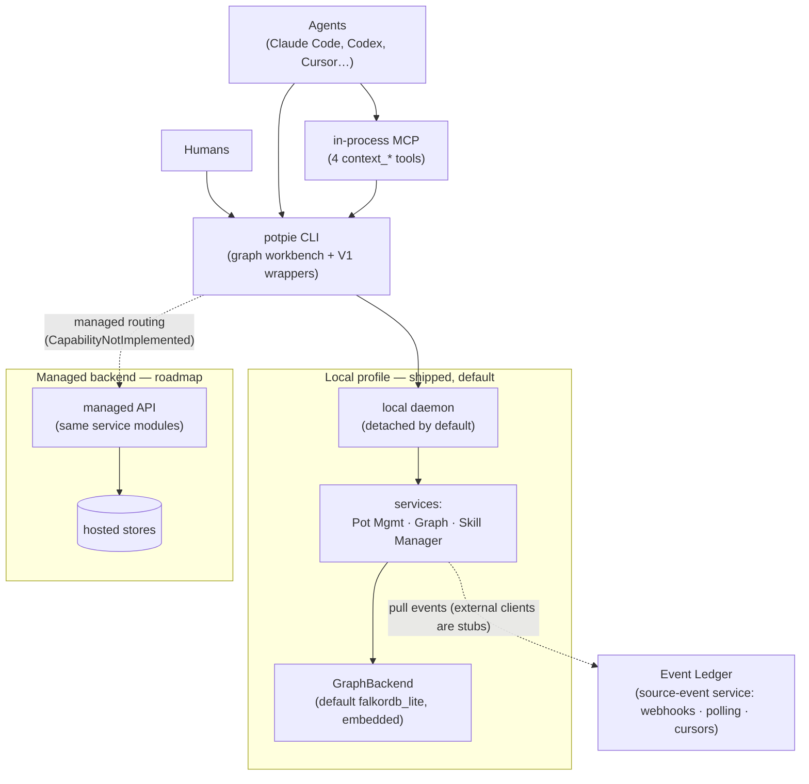

# Context Graph Docs

> Status: reflects code on `main` @ `8dd175bc`, last reviewed 2026-06-29.

The Context Graph is Potpie's durable, shared **project memory for AI agents** — a
compact store of sourced **claims** (decisions, ownership, infra topology, prior
bugs/fixes, conventions, features) so an agent doesn't rebuild context from raw
code, PRs, tickets, and chat on every task. Humans and agents talk to the **same
`potpie` CLI**; agents can also reach the same internals through four in-process
MCP `context_*` tools. The `potpie graph …` workbench is **shipped today**
(data-plane contract `v1.5`, ontology `2026-06-graph`) alongside the legacy
`resolve`/`search`/`record` compatibility wrappers — there is no separate "future
V2." The same Pot Management, Graph, and Skill Manager service modules run inside
either a local daemon or a managed backend API; **state stays local by default**.



## Target OSS default

**Published package** (PyPI):

```bash
uv tool install potpie   # recommended
# or: pip install potpie
potpie setup        # provisions config, local stores, the default pot, the daemon, and skills
potpie status
```

**Repo-local development** (this checkout): use `make cli-install` — it builds the
graph-explorer UI, stops any old daemon, and installs the editable CLI. Do not use
raw `uv tool install --editable ./potpie/context-engine` for day-to-day reinstalls.

```bash
make cli-install
make cli-status     # confirm PATH / uv-tool install
potpie setup
potpie status
```

`setup` also registers your repo as a source. A working-tree scan is **opt-in**
via `--scan` (default off). The OSS/CLI default backend is **`falkordb_lite`** —
an embedded FalkorDB over a local file, with **no Docker, server, Neo4j, or cloud
key required**; override it with `--backend` or `CONTEXT_ENGINE_BACKEND`
(precedence: `CONTEXT_ENGINE_BACKEND` > legacy `GRAPH_DB_BACKEND` >
`falkordb_lite`). Full flags live in [`cli-flow.md`](./cli-flow.md).

> **Roadmap (not yet wired):** Managed-backend routing is designed but not
> functional — `pot use --managed`, `pot list --managed`, and the whole `cloud`
> group raise `CapabilityNotImplemented`. The **external** Event Ledger clients
> (`ledger pull/query` against real providers) are TODO stubs. The live "ledger"
> today is the internal Postgres event store described in
> [`ingestion-nudge.md`](./ingestion-nudge.md).

## Start here

| Doc | What it answers |
|---|---|
| [`vision.md`](./vision.md) | What the Context Graph is and why; claims-not-payloads; harness-owned intelligence; the three product boundaries (local OSS / managed [roadmap] / Event Ledger [roadmap]); pots-as-tenancy; anti-goals. |
| [`architecture.md`](./architecture.md) | Hexagonal layers; the two composition roots (local agent spine vs ingestion server); the daemon model; the `GraphBackend` port + 6 capabilities + the backend coverage table; per-pot scoping and backend selection. |
| [`ontology.md`](./ontology.md) | The three declarative catalogs (24 entity types / 25 predicates + `RELATED_TO` / record types); contract constants (versions, 7 truth classes, 10 mutation ops, 6 source authorities); 8 subgraphs / 9 views; identity keys and the environment qualifier. |
| [`querying.md`](./querying.md) | Reading: the 4-tool MCP contract vs the CLI-only Graph Surface Lite; the single read trunk and 9 readers; the `AgentEnvelope` (ranked evidence, no server-side answers); ranking; the 3-axis model (Retrieve / Filter / Traverse — all shipped). |
| [`writing.md`](./writing.md) | Writing: the flat semantic-mutation DSL (10 ops); validation + runtime risk; the canonical write door `graph propose` → `graph commit --verify` (with `graph mutate` and `record` as the legacy wrappers); coarse `_global` concurrency; inbox; quality. |
| [`ingestion-nudge.md`](./ingestion-nudge.md) | How raw episodes/events enter; the internal Postgres event store vs the external Event Ledger seam; connectors (github/notion only); windowed reconciliation (off by default); the zero-token nudge trigger model. |
| [`skills.md`](./skills.md) | Harness-owned intelligence; the bundled CLI skills (potpie-graph teaches propose/commit); the Claude Code plugin + hooks; the separate server-side reconciliation skill surface (not the same thing). |
| [`cli-flow.md`](./cli-flow.md) | The full `potpie` command reference, grouped, with flags, exit-code contract, and the canonical journey. |
| [`observability.md`](./observability.md) | What logs, traces, metrics, and readiness report; span names. |
| [`bench-plan.md`](./bench-plan.md) | How graph quality is validated across backends (invariant judge, `run-light`). |

## Vocabulary

| Term | Meaning |
|---|---|
| **Pot** | Unit of isolation/tenancy. Every query, source, inbox item, claim, semantic mutation, and graph operation is scoped to one pot; the pot id **is** the storage `group_id`. A pot is local or managed; the active pot determines routing. Cross-pot federation is an anti-goal. |
| **Daemon** | Local background process (`host/daemon.py`) for lifecycle, IPC, health, and logs — **not** the business layer. Default host mode is detached (`daemon`); it also serves the read-only `potpie ui` explorer. |
| **Services** | Pot Management (control plane: pots, sources, readiness), Graph Service (data plane: reads, semantic mutations, workbench), and Skill Manager. The same modules run in the local daemon or a managed backend API. |
| **GraphBackend** | Swappable capability bundle of 6 ports — canonical `mutation` + `claim_query`, plus rebuildable projections `semantic`, `inspection`, `analytics`, `snapshot` — with `capabilities()`/`provision()`. Default profile `falkordb_lite`. |
| **Skill Manager** | CLI-managed skill catalog/installer for agent harnesses. Skills teach agents how to use the CLI; they are not graph facts or new tools. |
| **Event Ledger** | Separate managed-or-self-hostable source-event service (webhooks, polling, replay cursors). Graph consumers *pull* and track their own cursor/apply state; the ledger is **not** the graph source of truth. (External clients are stubs — roadmap.) |
| **Claim** | A compact, sourced fact — the graph stores claims + source refs, **never** full payloads (diffs, doc bodies, transcripts). Each claim carries a truth class that feeds the ranker. |
| **Retrieval card** | The single text a claim is embedded and searched as (agent-authored `description` leads). One builder is shared by the embed-on-write and read paths, so retrieval quality tracks the description the agent writes. |

The active package lives under
[`../../potpie/context-engine/`](../../potpie/context-engine/). Where any older
note disagrees with these docs, these docs (code-verified on `main`) win.
