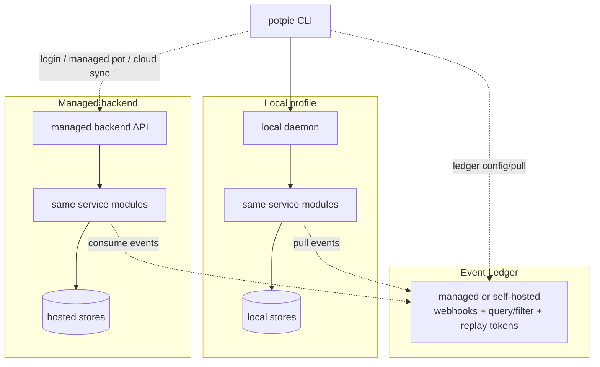

# Context Graph Docs

Last reviewed: 2026-05-29.

The Context Graph is Potpie's project-context layer for agents. Users and agents
talk to the `potpie` CLI. The same Pot Management, Graph Service, and Skill
Manager modules run inside either a local daemon or a managed backend API. Graph
state stays local by default unless the user logs in to a managed backend and
selects a managed pot, or explicitly runs cloud graph sync.



## Start Here

| Doc | What it answers |
|---|---|
| [`vision.md`](./vision.md) | What are we building, and what are the product constraints? |
| [`architecture.md`](./architecture.md) | What are the pieces, runtime flows, agent contract, extension points, and implementation rules? |
| [`cli-flow.md`](./cli-flow.md) | What should the shared CLI journey and command contract look like across local and managed profiles? |
| [`observability.md`](./observability.md) | What should logs, traces, metrics, and readiness report? |
| [`bench-plan.md`](./bench-plan.md) | How do we validate graph quality across backends? |

## Target OSS Default

```bash
pip install potpie
potpie setup --repo . --agent claude --scan
potpie status
```

`potpie setup` installs/starts the daemon service. The daemon-hosted setup flow
then provisions local config, local graph/storage dependencies, the active local
`default` pot, repo source registration, optional skills, and optional first
scan. Users only pass `--pot <name>` when the first local pot should have a
different name.

Managed backend access is opt-in and visibly scoped:

```bash
potpie login
potpie pot list --managed
potpie use <managed-pot-name> --managed
```

`potpie config set cloud.backend_url <url>` points login at Potpie managed or a
compatible self-hosted backend. A local pot and a managed pot use the same CLI
surface; `--local` and `--managed` flags filter or disambiguate when needed.

### FalkorDB (lightweight local backend) — wiring pending

`GRAPH_DB_BACKEND=falkordb` selects the embedded FalkorDBLite backend
(`pip install "context-engine[falkordb]"`). The reader/writer modules live at
`adapters/outbound/graph/falkordb_{reader,writer}.py`, but they are not yet
wrapped behind the `GraphBackend` port — selecting `falkordb` currently raises
`NotImplementedError` in the ingestion server. Use the default `neo4j` until a
`FalkorDBGraphBackend` adapter lands.

Managed or self-hosted integration events are also opt-in:

```bash
potpie login
potpie ledger use managed
potpie ledger pull --apply
```

This can feed a local graph from a managed Event Ledger without pushing graph
state to managed storage.

## Vocabulary

| Term | Meaning |
|---|---|
| **Pot** | Workspace/tenant boundary. Every query, source, record, claim, and graph operation is scoped to one pot. A pot can be local or managed; the active pot determines routing. |
| **Daemon shell** | Local background process for lifecycle, auth, IPC, health, logs, service hosting, and local dependency setup. It hosts setup services; it is not the business layer. |
| **Pot Management Service** | Control plane for pots, active pot, source registry, graph readiness, lifecycle, and export/import metadata. |
| **Graph Service** | Data plane for `resolve`, `search`, `record`, and `status`. Owns readers, ranking, record lowering, and envelopes. |
| **GraphBackend** | Swappable graph capability bundle: mutation, claim query, semantic search, inspection, analytics, snapshot. |
| **Skill Manager Service** | CLI-managed skill catalog and installation layer for agent harnesses. Skills teach agents how to use the CLI; they are not graph facts or new tools. |
| **Event Ledger** | Separate managed or self-hostable source-event service for webhooks, integration polling, event history, query/filter, provider-side cursors, and event-page replay tokens. Graph consumers store their own cursor, retry state, and applied position; graph state is not stored in the ledger. |

The code currently lives under
[`app/src/context-engine/`](../../app/src/context-engine/). If docs conflict,
prefer this order: `vision.md`, `architecture.md`, then the operational docs.
