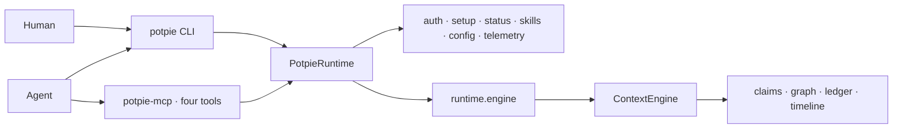

# Context Graph Documentation

> Package architecture verified at `f435fb4` on 2026-07-13.

The Context Graph is Potpie's durable, sourced project memory for AI agents.
Root `potpie` is the product/runtime distribution; `potpie-context-engine` is the
standalone graph/context library. The accepted boundary is
[SPEC-PACKAGE-BOUNDARY](../../spec/modules/package-boundary.md).



## Install targets

End users install the root product:

```bash
uv tool install potpie
potpie setup
potpie status
```

Library embedders install the engine:

```bash
python -m pip install potpie-context-engine==0.2.0
```

The engine has no product executable or user-home default. Persistent embedding
requires a caller-supplied path; `EngineConfig.in_memory()` is isolated and
temporary.

## Start here

| Document | Purpose |
|---|---|
| [vision.md](vision.md) | Product and graph goals, claims-not-payloads, anti-goals. |
| [architecture.md](architecture.md) | Product/library ownership, runtime modes, RPC, setup/status, packaging. |
| [cli-flow.md](cli-flow.md) | Exact workflow-first commands, JSON, exits, migration. |
| [ontology.md](ontology.md) | Entity, predicate, record, truth, and view contracts. |
| [querying.md](querying.md) | Context resolution, search, evidence, and graph reads. |
| [writing.md](writing.md) | Semantic mutations and propose/commit writes. |
| [ingestion-nudge.md](ingestion-nudge.md) | Event ingestion, reconciliation, and nudges. |
| [skills.md](skills.md) | Root-owned harness resources and installation. |
| [observability.md](observability.md) | Generic engine observability. |
| [package-boundary-migration-plan.md](package-boundary-migration-plan.md) | Commit-by-commit implementation evidence. |

## Stable surfaces

- Product interaction: `PotpieRuntime`.
- Engine interaction: asynchronous `runtime.engine.*` / `EngineClient`.
- Supported library imports: `potpie_context_engine` and
  `potpie_context_engine.contracts`.
- MCP: exactly `context_resolve`, `context_search`, `context_record`, and
  `context_status` from root `potpie-mcp`.
- Graph writes: `potpie graph propose` then `potpie graph commit`.
- Daemon transport: protocol-v1, typed, allowlisted `engine.*` RPC only.

## Vocabulary

| Term | Meaning |
|---|---|
| Pot | Unit of graph, source, claim, and operation isolation. |
| PotpieRuntime | Root product facade containing the engine client and product services. |
| ContextEngine | Standalone library facade over engine application services. |
| EngineClient | Async local/remote operation protocol used by the product runtime. |
| Claim | Compact sourced fact; raw payloads remain at their source. |
| Projection | Rebuildable semantic, inspection, analytics, or snapshot view. |

Where an older design note conflicts with the accepted spec or these verified
architecture/CLI documents, the accepted spec wins.
