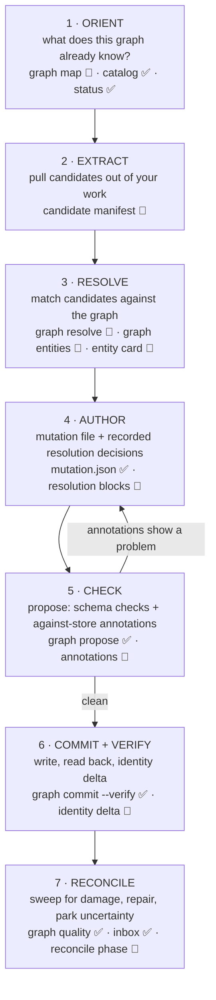
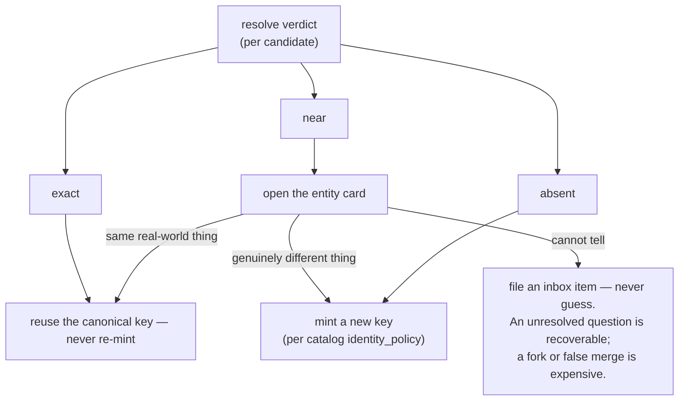
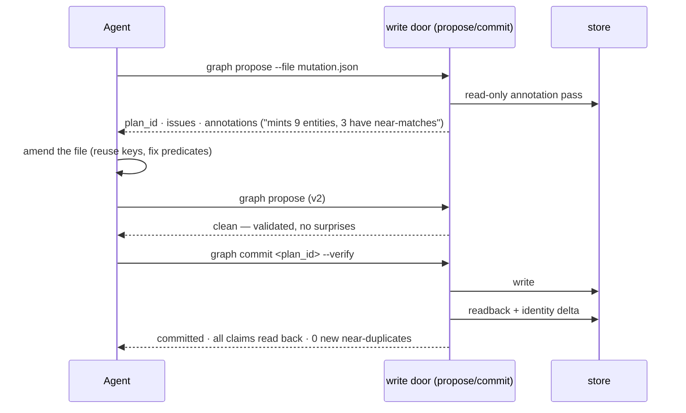
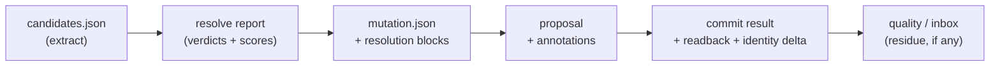

# The Agent Mutation Flow

> Status: **design target**, drafted 2026-07-09. This doc describes the *ideal* flow for an
> agent that wants to write to the graph — not the shipped surface. Tools marked ✅ exist
> today; tools marked 🔧 are proposed and map to the repair roadmap
> (`.tmp/context-graph-repair-roadmap-2026-07-08.md`). The shipped write path is documented
> in [writing.md](./writing.md); do not treat this doc as current-state reference.

## The idea in one paragraph

The agent is good at understanding work — reading documents, fixing bugs, noticing decisions.
It is bad at byte-perfect bookkeeping — minting the exact key an earlier agent minted, spelling
`prod` the same way twice. So the flow splits the job: **the agent describes what it learned;
the tools let it see what the graph already knows; the door checks the plan against reality
before anything is written; verification closes the loop after.** Every hand-off between steps
is a typed artifact (a JSON file with a contract), not prose discipline in a skill. Prose
discipline demonstrably did not survive contact with real agents (2026-07-02 e2e); artifact
contracts will, because each step can be checked.

## The loop at a glance



Two sizes of the same loop:

| Mode | When | What changes |
|---|---|---|
| **Micro** (in-session) | The agent fixed a bug, made a decision, learned something durable mid-task | Skip 1–2 (context is already in the agent's head). Resolve the handful of entities it touches, author, check, commit. Minutes, a few calls. |
| **Macro** (ingestion) | Baseline a repo, ingest documents/PRs/tickets | All seven stages, with the manifest as the backbone and stage 7 as a mandatory final phase. Deliberately thorough — we accept the token cost in exchange for a normalized graph. |

---

## Stage 1 — Orient: know the graph before touching it

**Question the agent needs answered:** *"What does this pot already contain, and what are its
naming habits?"*

- ✅ `graph catalog` / `graph describe` — the contract: types, predicates, views, what a
  legal write looks like.
- ✅ `graph status` — aggregate counts, backend readiness, freshness.
- 🔧 `graph map` — the missing piece: per-type entity counts, top-connected entities per
  subgraph, recent additions, and *live key examples per type* so the agent's first key guess
  is already in the pot's dialect. A few KB, one call.

An agent that knows "this pot has 14 Services and an empty knowledge subgraph" extracts and
resolves completely differently from one flying blind.

## Stage 2 — Extract: candidates, not conclusions

The agent reads its sources (or its own session) and produces a **candidate manifest** 🔧 —
a JSON artifact, not notes:

```json
{
  "candidates": [
    {
      "name": "payments settlement service",
      "type_guess": "Service",
      "external_ids": ["github:repo:acme/payments"],
      "evidence": ["github:pr:acme/payments:412"],
      "proposed_relations": [{"predicate": "DEPENDS_ON", "target_name": "postgres"}]
    }
  ]
}
```

Nothing here claims to be an identity. Names, guesses, and evidence — identity is decided in
the next stage, against the graph, not invented during extraction.

## Stage 3 — Resolve: the scan

**Question:** *"For each candidate — does the graph already know this thing?"*

- 🔧 `graph resolve --file candidates.json` — one call, N candidates, three verdicts each:
  - **exact** — the key (or external id) exists; here is its canonical key, labels, one-line summary
  - **near** — a normalized-key, lexical, or embedding match above threshold; here are the candidates with scores
  - **absent** — nothing plausible found
- 🔧 `graph entities --type <label>` — enumerate entities directly (today the graph is only
  visible through claims, so a claim-less entity is invisible to every search — the exact
  place duplicates are born).
- 🔧 `graph entity <key>` — the adjudication card: properties, claims grouped by predicate,
  degree, supersession state, last-observed. Everything needed to decide "same thing or not"
  in one call.
- 🔧 Near-matching runs on the **bundled local embedder** over entity retrieval cards — local
  compute, zero API tokens, so semantic matching is the default, not a luxury.

What the agent does with each verdict:



The one rule that matters most: **ambiguity goes to the inbox, not into the graph.**

## Stage 4 — Author: the mutation file carries its own reasoning

The agent writes the mutation file (✅ same flat DSL as today, see
[writing.md](./writing.md)), with two additions:

- 🔧 A **resolution block** per operation recording the stage-3 decision:
  `{"resolution": {"decision": "matched_existing", "candidate": "service:payments-api", "reason": "exact external_id match"}}`.
  Advisory, stateless — but it makes every identity decision auditable and lintable later.
- ✅ **Retrieval-grade descriptions** on every entity and claim — the symptoms, synonyms, and
  scope a future searcher would type. This is what stage-3 embedding matches run on for the
  *next* agent, so description quality is identity infrastructure, not polish.

Placement rules stay explicit: pick a real predicate (the catalog lists `allowed_pairs`);
an omitted predicate should never silently become `RELATED_TO` — see stage 5.

## Stage 5 — Check: propose is the against-reality gate

✅ `graph propose` already validates schema, persists a plan, returns per-op issues and a
diff. The ideal flow adds a **read-only annotation pass against the store** 🔧:

- per entity ref: `creates_new` vs `matches_existing`
- per claim: `new` / `idempotent` / `corroborates existing` / `possible_fork` (same
  subject+predicate, suspiciously similar object or key)
- every silent transform surfaced as a notice: defaulted predicate, inferred subgraph,
  inferred type, synthesized description

This is the structural backstop: `resolve` can be skipped by a lazy agent, but propose runs
on every write. The rule the flow mandates: **never commit a plan whose annotations you have
not read.** Amending and re-proposing is cheap — plans are persisted, iteration is the norm:



## Stage 6 — Commit + verify: find damage while the agent still has context

✅ `graph commit --verify` already reads back every committed claim key and snapshots quality
before/after. The ideal flow adds the **identity delta** 🔧: *"this commit created N new
entities; M of them have near-matches above threshold."* The agent that just forked something
finds out in the same session — when it can still fix it — instead of in a quality report
weeks later.

## Stage 7 — Reconcile: close the loop

- ✅ `graph quality` reports (duplicate-candidates, conflicting-claims, orphan-entities) —
  with duplicate detection upgraded 🔧 from display-name matching to the same embedding
  similarity resolve uses.
- ✅ `graph inbox` — the parking lot for everything stage 3 couldn't decide; adjudicated
  here, with entity cards, instead of guessed at write time.
- 🔧 For macro ingestion: a mandatory **reconciliation phase** — resolve everything just
  written against the pre-existing graph, file merges/aliases/inbox items. Deliberately
  token-heavy and worth it: this is what keeps the graph normalized as it grows.

## The artifact chain

Every arrow is a machine-checkable hand-off. No step depends on the agent remembering an
instruction from a skill:



## What exists vs what to build

| Piece | Status | Roadmap home |
|---|---|---|
| catalog / describe / read / search-entities / neighborhood / status / quality / inbox | ✅ shipped | — (M1 makes them truthful) |
| propose → commit --verify, persisted plans, readback | ✅ shipped | — |
| search sees claim-less entities | 🔧 | M1 · identity-1a |
| `graph resolve` (batch verdicts) · `graph entities` · `graph entity` card · `graph map` | 🔧 | new tooling item; supersedes identity-1a's shape |
| entity-card embedding index (local embedder) | 🔧 | new tooling item |
| propose annotations + silent-transform notices | 🔧 | M2 (the roadmap's "propose-time advisory warning") |
| identity delta in `--verify` · embedding duplicate-candidates | 🔧 | M2/M4 adjacent |
| candidate manifest + resolution blocks (artifact contracts) | 🔧 | skills rewrite, after tooling lands |
| key/env/source_ref grammars, one normalizer | 🔧 | M2/M3 — the match-quality ceiling for everything above |
| merge that actually merges | 🔧 | M4 · identity-3 |

## Design principles this flow encodes

1. **The agent describes; the engine and tools own bookkeeping.** Never require an agent to
   be byte-perfect about identity.
2. **Advisory tools, structural backstop.** `resolve` is the good path; propose annotations
   catch whoever skips it. Warn-don't-block — no enforcement state, no receipts.
3. **Ambiguity is parked, never guessed.** Inbox over fork; inbox over false merge.
4. **Nothing is silent.** Every default, inference, and rewrite the pipeline applies is
   surfaced to the agent that triggered it.
5. **Artifacts over prose.** Each stage hands the next a typed, checkable object.
6. **Thoroughness is the ingestion default.** Tokens spent normalizing at write time are
   repaid on every read forever; the expensive matching runs on a local embedder anyway.
