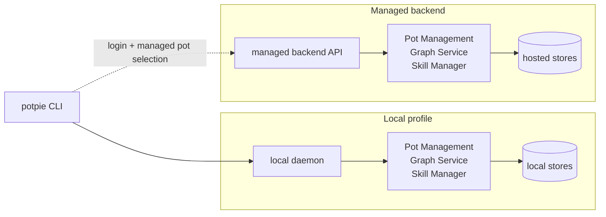
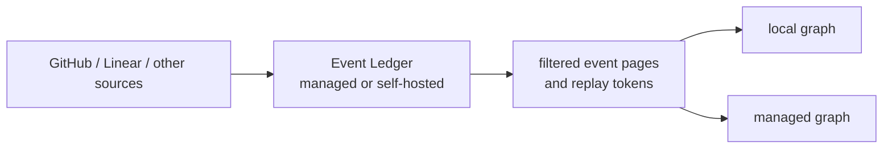
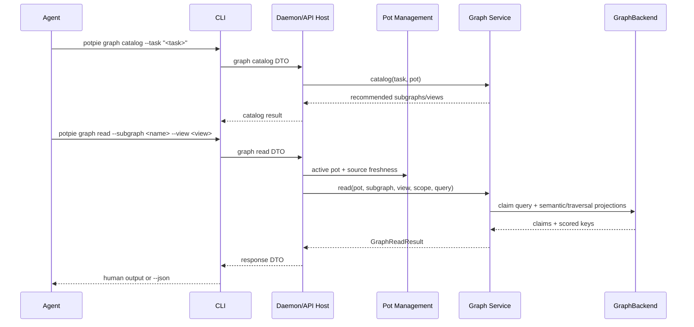
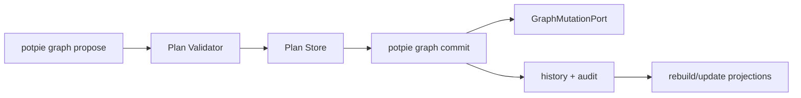
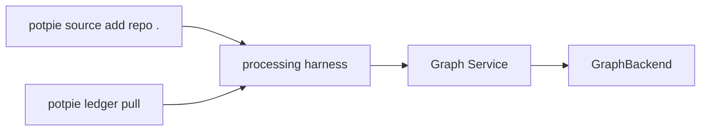
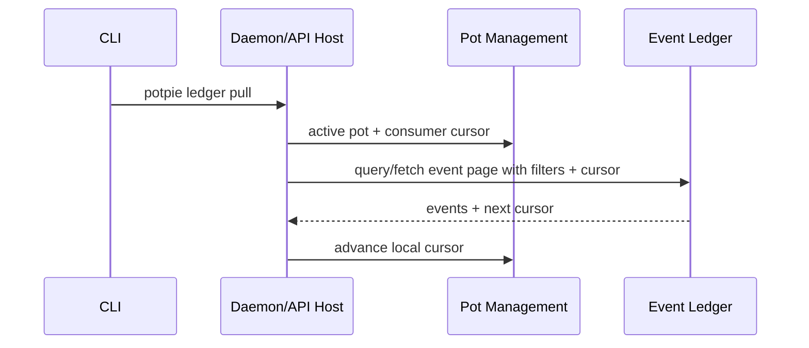
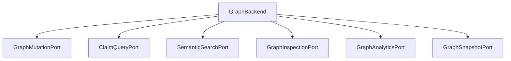
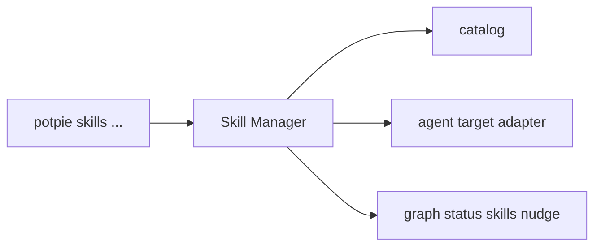
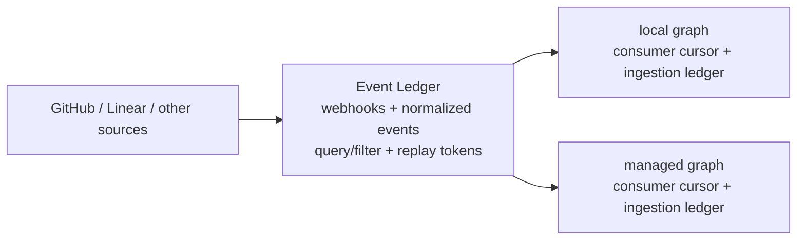
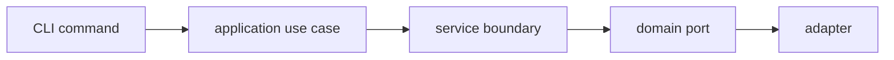

# Context Graph Architecture

Last reviewed: 2026-06-08.

This document is the implementation map for the Context Graph. It follows the
same shape as the product: CLI first, the same service modules hosted either by
a local daemon or managed backend API, swappable storage backends, explicit
managed-backend login, and explicit cloud sync or ledger commands.

## Anatomy


| Piece | Responsibility |
|---|---|
| CLI | User/agent surface, command UX, setup/login flags and output, JSON rendering, active-pot selection, local/managed filters. |
| Host shell | Local daemon or managed backend API. Owns process/API lifecycle, auth, IPC/HTTP, health, logs, and migrations/dependency setup trigger. |
| Pot Management | Active pot, pot CRUD, source registry, lifecycle, status aggregation, export/import metadata. |
| Graph Service | Graph data plane. Graph V1 exposes compatibility wrappers over V2-compatible ontology, views, semantic mutations, validation, and inbox handling; Graph V2 later exposes the explicit workbench surface. |
| GraphBackend | Store capability bundle: mutation, claim query, semantic search, inspection, analytics, snapshot. |
| Skill Manager | Skill catalog and install/update/remove into agent harnesses. |

The host shell hosts services; it does not contain their business logic. The
same Graph Service (and Skill Manager) modules run in the local daemon and in
the managed backend API. Pot Management is **not** shared: the managed backend
keeps its own pots behind the thin `PotResolutionPort` (scope decision
2026-05-29). Storage adapters and operational dependencies differ by deployment.

## Deployment Shapes



Both profiles run the same service modules. Only the host shell and storage
adapters change.



| Boundary | Local OSS | Managed backend |
|---|---|---|
| Entry | `potpie setup` creates local daemon; CLI defaults to local active pot | `potpie login` authenticates to configured backend URL; selecting a managed pot routes commands there |
| Host | Local daemon shell | Managed backend API |
| Service modules | Pot Management, Graph Service, Skill Manager | Same modules hosted in managed backend API |
| Auth | Local token/socket/OS user | Potpie auth and policy |
| Pot state | Local DB with active `default` pot after setup | Hosted operational DB |
| Graph backend | Embedded/local GraphBackend profile | Hosted graph/search GraphBackend profile |
| Skills | Local catalog/cache and agent target adapters | Hosted catalog/state plus managed target adapters |
| Event Ledger | Optional managed or self-hosted ledger, pulled explicitly | Managed or self-hosted ledger, consumed by hosted workers/services |
| Source integrations | Source metadata only; graph writes come from harness semantic mutations | Hosted connectors, webhook receivers, queues, and workers |
| Sync | Explicit `potpie cloud ...`; ledger pull does not move graph state to cloud | Native hosted pots; snapshot push/pull remains explicit |

## Component Lifecycle & Setup

`potpie setup` is the single local first-run flow. It is idempotent, makes
Potpie usable in one command, and users never run `daemon` or install commands
on the happy path. The CLI owns the setup UX: flags, validation, local bootstrap
output, and next-command hints. Its local bootstrap job is to install/start the
daemon service. Once the daemon is running, the daemon-hosted
`SetupOrchestrator` owns lifecycle ordering: the ordered sequence of component
setup calls. Each step it calls is a **bespoke per-component method** owned
independently, so the config, storage, auth, pot, skills, and source-event
processing pieces can be built and handed over separately.

Three rules make independent ownership work:

- **Daemon first, then dependencies.** The CLI ensures the local daemon service
  exists and is running. The daemon hosts `SetupOrchestrator`, which calls
  `config.ensure_home()`, `backend.provision(plan)`, `pot_service.init(...)`,
  `auth.init_local()`, and so on. Each is a different owner's slot; the
  orchestrator only sequences them.
- **Backends self-provision.** A `GraphBackend` stands up its own store —
  `embedded` writes a local file, `postgres` creates the DB, enables pgvector,
  and runs DDL, `neo4j` pulls its container. The `build_backend(profile)`
  registry already selects by profile; provisioning lives behind the same
  profile, not in setup.
- **Hard deps are profile-scoped.** Every method returns a `StepResult`
  (`done | skipped | not_implemented | failed`); an unbuilt body raises
  `CapabilityNotImplemented("<dotted.slot>")` (e.g. `host.auth.init_local`).
  `SetupOrchestrator` splits **hard deps** (must succeed) from **soft steps**
  (best-effort), but hardness depends on the selected setup host mode. Detached
  daemon service install/start is hard for the normal local daemon profile,
  skipped for in-process/dev profiles, and not part of managed login.

### Setup sequence

```mermaid
sequenceDiagram
  participant User
  participant CLI
  participant Daemon
  participant Setup as daemon-hosted setup
  participant Config
  participant Backend as GraphBackend
  participant Pot as Pot Management
  participant Auth
  participant Skills as Skill Manager

  User->>CLI: potpie setup --repo . --backend embedded --agent claude
  CLI->>Daemon: install/start service
  CLI->>Daemon: setup request with SetupPlan
  Daemon->>Setup: run(plan)
  Setup->>Config: ensure_home; write_defaults(plan)
  Setup->>Backend: provision(plan)
  Setup->>Pot: init(mode, backend)
  Setup->>Auth: init_local
  Setup->>Pot: add_source(repo)
  Setup->>Skills: install(agent)
  Setup-->>Daemon: SetupReport
  Daemon-->>CLI: SetupReport
  CLI-->>User: per-step state + next command
```

Ordered steps and their dependency class:

1. CLI bootstrap: install/start local daemon service — hard for local daemon
   profile, skipped if present, skipped for in-process/dev profiles
2. `config.ensure_home()` + `config.write_defaults(plan)` inside the daemon — hard
3. `backend.provision(plan)` — hard, graph/vector self-provision
4. `pot_service.init(mode, backend)` — hard, state store + migrate + default pot
5. `auth.init_local()` — soft, skipped for local no-auth
6. `pot_service.add_source(repo)` — soft
7. `skills.install(agent)` — soft

`--pot <name>` only overrides the initial pot name; without it setup creates and
uses `default`. `--dry-run` calls `orchestrator.preview(plan)` and returns a
`SetupPreview` without executing or returning run `StepResult`s. Re-running setup
is safe: each method is `ensure`-shaped.

### Seam → owner map

Dependency-ordered. Each row is independently ownable behind its method
signature; the orchestrator depends only on those signatures.

| # | Component | Bespoke method(s) | Dep | Code slot |
|---:|---|---|---|---|
| 1 | Daemon process | `ensure`, `install`, `start`, `stop`, `restart` | hard for local daemon profile; skipped for in-process/dev | `host/daemon.py` |
| 2 | Config / workspace | `ensure_home`, `write_defaults`, `get`/`set` | hard | `application/services/config_service.py` |
| 3 | Graph/vector backend | `provision`, `health`, `capabilities` | hard | `domain/ports/graph/backend.py` + backend adapters |
| 4 | Relational state store | `pot_service.init`, `state_store.provision`, `migrator.migrate` | hard | `application/services/pot_management.py` + `adapters/outbound/pots/` |
| 5 | Local auth | `init_local`, `whoami`, `logout` | soft | `application/services/auth_service.py` |
| 6 | Skills | `install(agent)` | soft | `application/services/skill_manager.py` |

### Setup skeletons

Lifecycle orchestration is an application use case (`SetupOrchestrator`) hosted
by the daemon, so dependency setup stays outside inbound adapters and outside the
daemon shell. `commands/bootstrap.py:setup` owns the CLI contract: build a
`SetupPlan` from flags → install/start the daemon service → send the plan to the
daemon-hosted orchestrator → render the `SetupReport`.

```python
# domain/lifecycle.py — shared value objects
@dataclass(frozen=True)
class SetupPlan:
    mode: str = "local"        # local setup; managed auth uses LoginPlan
    host_mode: str = "daemon"  # daemon | in_process
    backend: str = "embedded"  # embedded | postgres | neo4j | in_memory
    repo: str | None = "."
    pot: str = "default"
    agent: str = "claude"
    assume_yes: bool = False

@dataclass(frozen=True)
class StepResult:
    step: str
    state: str                 # done | skipped | not_implemented | failed
    detail: str | None = None

@dataclass(frozen=True)
class SetupReport:
    plan: SetupPlan
    steps: tuple[StepResult, ...]
    ok: bool

@dataclass(frozen=True)
class PlannedSetupStep:
    step: str
    hard: bool
    owner: str
    action: str
    skip_reason: str | None = None

@dataclass(frozen=True)
class SetupPreview:
    plan: SetupPlan
    steps: tuple[PlannedSetupStep, ...]
    ok_to_run: bool

class SetupOrchestrator(Protocol):
    def preview(self, plan: SetupPlan) -> SetupPreview: ...   # dry-run
    def run(self, plan: SetupPlan) -> SetupReport: ...        # ensure each, in order

@dataclass(frozen=True)
class LoginPlan:
    backend_url: str | None = None  # defaults to config cloud.backend_url
    org: str | None = None
```

Each named method is a stub raising `CapabilityNotImplemented("<dotted.slot>")`
until its owner ships the body — the same convention the rest of the skeleton
uses today (`host.daemon.install`). The per-component shapes setup calls:

```python
config.ensure_home() -> Path
config.write_defaults(plan: SetupPlan) -> Path

daemon.ensure() -> StepResult                  # install/start service when needed

backend.provision(plan: SetupPlan) -> StepResult           # create DB/index, DDL, docker
pot_service.init(*, mode: str, backend: str) -> StepResult # provision state store + migrate
pot_service.create_pot(name, use=True) -> PotInfo          # create + activate the default pot
auth.init_local() -> StepResult
```

### Managed backend login

Managed backend access is a separate lifecycle from local setup. `potpie login`
authenticates against `cloud.backend_url`, stores the managed session, and makes
managed pots visible to the same pot commands. The default URL points at Potpie
managed; users can point it at a compatible self-hosted backend:

```bash
potpie config set cloud.backend_url https://potpie.example.com
potpie login
potpie pot list --managed
potpie use <managed-pot-name> --managed
```

The CLI treats local and managed pots as the same product object. Internally, an
active pot selection includes an origin (`local` or `managed`) plus a pot id/name.
Commands route by the selected pot: local pots route to the local daemon, while
managed pots route to the authenticated managed backend. If a name exists in both
places, the user must disambiguate with `--local`, `--managed`, or an equivalent
qualified pot id.

## Runtime Flows

### Graph discover/read



Code slots: `commands/graph.py:catalog|describe|search_entities|read` →
`HostShell.graph` → `GraphService` → Ontology Catalog / Identity Resolver / Read
View Router over `GraphBackend.claim_query`, semantic search, and inspection
projections. Generic traversal is an inspection/admin capability, not the default
agent read path.

### Semantic proposal/commit



Code slots: `commands/graph.py:propose|commit` → `HostShell.graph` →
`GraphService.propose/commit`. `propose` validates schema, ontology, identity,
source authority, expected versions, risk, and conflicts without writing.
`commit` accepts only a server-created `plan_id` and applies the validated plan
atomically through `GraphBackend.mutation.apply`, then writes audit/history and
updates projections.

### Harness Writes And Ledger Reads



Registering a source records metadata. Pulling from an Event Ledger reads
normalized source events from a managed or self-hosted ledger and advances the
local cursor. It does not write graph claims. Harnesses inspect source evidence,
choose truth/risk, and submit semantic mutations; Graph Service owns the final
graph write path to the active GraphBackend.

### Event Ledger Pull



Code slots: `commands/ledger.py:pull` → `HostShell.ledger`
(`LedgerFacade` in `host/shell.py`) orchestrates query/fetch → cursor advance:
`EventLedgerClientPort.query/fetch` (`adapters/outbound/ledger/`) →
`LedgerCursorStorePort.set`. The ledger client never writes to the graph backend
directly.

The graph consumer owns processing state for pulled events:

| State | Meaning |
|---|---|
| `pending` | Event was durably enqueued from the ledger and awaits processing. |
| `processing` | A worker/harness has leased the event. |
| `applied` | Graph Service accepted the resulting semantic proposal or mutation. |
| `failed_retryable` | Processing failed but can be retried with backoff. |
| `failed_terminal` | Processing cannot proceed without data/code/operator action. |
| `timed_out` | A processing lease expired; the event can be retried or inspected. |

Because events are first written into the consumer ingestion ledger, the consumer
cursor can advance after durable enqueue, not after every event is fully applied.
Retries, timeouts, dead-letter decisions, and idempotency checks happen from the
consumer ingestion ledger. If that local/hosted consumer state is lost, the Event
Ledger replay tokens and query/filter API let the graph rehydrate from an earlier
position.

The local daemon does not need to be internet-facing. A local profile can log in
to Potpie managed, use the managed Event Ledger for GitHub/Linear/webhook
events, and still keep the graph store local. A self-hosted Event Ledger follows
the same pull contract.

## Agent Contract

Agents should see one graph model in every deployment. In Graph V1, agents may
still use the existing `context_*` tools and top-level CLI wrappers, but those
surfaces must be compatibility adapters over V2-compatible graph internals and
harness-owned skills. In Graph V2, the same internals are exposed through the
explicit `potpie graph ...` workbench.

Graph V1 compatibility surface:

| Command Family | Role |
|---|---|
| `context_status` / `potpie status` | Cheap readiness, active pot, backend/source/skill health, and suggested next action. |
| `context_resolve` / `potpie resolve` | Bounded context read through `intent`, `include`, `scope`, `mode`, and `source_policy`, internally mapped to named views. |
| `context_search` / `potpie search` | Narrow follow-up lookup over claim and semantic indexes. |
| `context_record` / `potpie record` | Convenience write/capture wrapper over semantic mutation validation, low-risk commit, or inbox. |

Graph V2 workbench surface:

| Command Family | Role |
|---|---|
| `potpie graph status` | Cheap health, readiness, capability, freshness, and skill check. |
| `potpie graph catalog` / `describe` | Discover relevant subgraphs, views, entity/relation contracts, source authority, mutation policies, and examples. |
| `potpie graph search-entities` | Resolve names, aliases, and external IDs before creating or linking entities. |
| `potpie graph read` / `history` | Return bounded named views and audit history with provenance, truth class, confidence, and version metadata. |
| `potpie graph propose` / `commit` | Validate semantic mutation plans, persist inspectable plans, and atomically apply committed plans by `plan_id`. |
| `potpie graph inbox` | Capture pending graph work when the harness cannot yet choose a safe ontology update. |

The V1 compatibility surface is not the long-term product contract. It must not
bypass semantic validation, evidence requirements, mutation provenance, or inbox
handling. New graph behavior should land in shared graph internals first, then
be reached from both V1 wrappers and V2 workbench commands.

Common request fields:

| Field | Meaning |
|---|---|
| `pot_id` | Pot scope. Callers may use `current`, `local/<name-or-id>`, or `managed/<name-or-id>`; the selected pot determines local-daemon vs managed-backend routing. |
| `subgraph` | Ontology partition such as `features`, `bugs`, `recent_changes`, `infra_topology`, or `decisions`. |
| `view` | Named bounded read contract within a subgraph. |
| `scope` | Repo, service, file, PR, ticket, feature, user, environment, or time window. |
| `query` | Optional natural-language or keyword filter within a bounded view. |
| `source_policy` | Evidence policy: `references_only`, `summary`, `verify`, or `snippets`. |
| `expected_subgraph_versions` | Stale-write guard carried from reads into proposals. |
| `evidence` | Source refs and authority metadata required for durable writes. |

Read responses include:

| Field | Meaning |
|---|---|
| `items[]` | Ranked entities, claims, events, or relations matching the named view. |
| `source_refs[]` / `evidence[]` | Pointers back to source material and authority classification. |
| `truth` / `confidence` | Truth class and confidence for facts or claims. |
| `subgraph_versions` | Versions the agent must carry into write proposals. |
| `coverage[]` | Per-subgraph or per-source availability and completeness. |
| `unsupported[]` | Requested views, scopes, or source policies that cannot be served yet. |

Proposal responses include:

| Field | Meaning |
|---|---|
| `plan_id` | Server-created plan identifier used for commit. |
| `status` | `validated`, `invalid`, `conflict`, `review_required`, or `expired`. |
| `risk` / `auto_applicable` | Risk classification and whether local auto-commit is acceptable. |
| `diff` | Inspectable summary of entities, relations, claims, and events that would change. |
| `warnings` / `rejected_operations` | Validation feedback and unsupported mutation operations. |
| `affected_subgraphs` | Current and expected new subgraph versions. |

`potpie graph status` is sectioned by owner so readiness remains debuggable:

| Section | Owner | Reports |
|---|---|---|
| `host` | Host shell / daemon / managed backend API | liveness, version, IPC/HTTP reachability, auth transport, logs path, managed backend URL host when safe |
| `pot` | Pot Management | active pot id/name/origin, migrations, source registry, source freshness, graph consumer cursor lag |
| `graph_service` | Graph Service | data-plane readiness, supported subgraphs/views, mutation operation support, validator readiness |
| `backend` | GraphBackend | profile/name, capabilities, canonical store health, semantic index readiness, projection repair status |
| `ledger` | Event Ledger consumer binding | binding kind, auth, source list reachability, consumer cursor, retry backlog, timed-out leases, dead-letter backlog |
| `skills` | Skill Manager | catalog readiness, installed-vs-recommended drift, optional install/update nudge |

A skill nudge may include an exact `potpie skills install ...` command. The
install still happens through the CLI.

## GraphBackend

A backend is a set of capability ports, not a database handle.



| Capability | Required | Notes |
|---|---:|---|
| Mutation | yes | Apply validated mutations, invalidations, resets, readiness. |
| Claim query | yes | Read canonical claims for readers and label lookup. |
| Semantic search | yes | Vector search over claim facts; local embedder by default. |
| Inspection | derivable | Neighborhoods, paths, labels, graph slices. |
| Analytics | derivable | Counts, freshness, quality checks, repair. |
| Snapshot | derivable | Portable pot export/import. |

The canonical claim store is the only source of truth. Vector indexes,
inspection views, and analytics rollups are projections that can be rebuilt.

Default profiles:

| Profile | Purpose |
|---|---|
| `embedded` | OSS default: local, no Docker, vector search included. |
| `in_memory` | Tests and conformance. |
| `neo4j`, `postgres/pgvector`, `chroma` | Optional profiles behind the same ports. |
| hosted profile | Managed API server storage/search adapter. |

## Skill Manager

Skills teach agent harnesses how to use the Graph V1 compatibility wrappers
today and the Graph V2 workbench workflow later. They are not graph facts and
do not define a second graph API.



`potpie graph status` may report missing/outdated skills and provide an install
command. The install still happens through the CLI.

## Managed Backend API

Managed Potpie hosts the same service modules behind a managed backend API:

- Potpie auth, teams, roles, billing, and collaboration policy.
- Hosted operational, graph/search, and skill/catalog stores.
- Workers and queues for async ingestion that call the same services.
- Hosted graph/search profile.
- Hosted observability and cost telemetry.
- Cloud skill sync.

It does not add a cloud-only graph model or a separate agent contract. The
managed backend API is another host for Pot Management, Graph Service, and Skill
Manager, backed by hosted databases. `potpie login` authenticates to the
configured backend URL; this can be Potpie managed or a compatible self-hosted
backend.

## Event Ledger

The Event Ledger is a separate managed or self-hostable service for source
events. It is not the Context Graph source of truth.



Responsibilities:

- receive webhooks and poll source APIs;
- normalize source events and keep replayable event history;
- expose ordered event pages, replay tokens, source listings, and query/filter
  APIs for pull consumers;
- keep third-party credentials and webhook receivers out of the local daemon by
  default;
- let local graphs use managed integrations without pushing graph state to
  managed storage.

The Graph Service remains responsible for turning source events into semantic
proposals or claims and applying validated graph mutations. The Event Ledger only
supplies ordered source events.
Consumer cursor state belongs to the graph deployment that pulled the events,
along with per-event processing state, retry counters, lease timeouts, and
dead-letter records. The ledger may separately keep provider ingestion cursors
for webhook/polling work, but it does not own a graph's last-applied or
last-enqueued position.

## Code Map

The active package is `potpie/context-engine/`; older `app/src/context-engine/`
paths may still appear in history or stale scaffolding. Graph V1 should first
run one forward-compatible graph model across two composition roots: the local
agent spine (`build_host_shell`, behind the CLI + MCP if enabled) and the
managed HTTP ingestion server (`build_ingestion_server`, consumed by the parent
app). Graph V2 then exposes the workbench over that same model. Rows marked
_(local POC)_ have a working body sufficient for the local profile with deeper
production work deferred; _(deferred)_ rows are the managed pipeline not yet
migrated onto `HostShell`.

| Area | Path |
|---|---|
| Graph V1 compatibility DTOs / Graph V2 command DTOs | Existing `AgentContextPort` DTOs now; `domain/ports/graph_workbench.py` _(planned)_ or equivalent Graph Service DTO module later |
| Services (interfaces) | `domain/ports/services/{graph_service,pot_management,skill_manager}.py` |
| Graph capability ports | `domain/ports/graph/{backend,mutation,claim_query,semantic,inspection,analytics,snapshot}.py` |
| Event Ledger consumer ports | `domain/ports/ledger/{client,cursor}.py` |
| Host shell + daemon | `host/{shell,daemon}.py` |
| Composition root | `bootstrap/host_wiring.py` (`build_host_shell`) |
| Graph workbench impl | `application/services/graph_workbench.py` _(planned)_ or Graph Service methods for status/catalog/describe/search-entities/read/propose/commit/history/inbox |
| Graph Service _(local POC)_ | `application/services/graph_service.py` over a `GraphBackend` + read view router; Semantic Mutation DSL operations lower into validated graph mutations |
| Pot Management _(local POC)_ | `application/services/pot_management.py` + `adapters/outbound/pots/local_pot_store.py` |
| Skill Manager _(local POC)_ | `application/services/skill_manager.py` + `adapters/outbound/skills/{bundle_catalog,claude_target}.py` |
| GraphBackend adapters | `adapters/outbound/graph/backends/{in_memory,embedded,neo4j}_backend.py` + `build_backend` registry; `claim_query_analytics.py` gives any claim-backed profile real analytics |
| Event Ledger adapters _(local POC)_ | `adapters/outbound/ledger/{managed_client,self_hosted_client,cursor_store}.py` |
| CLI (host-routed) | `adapters/inbound/cli/host_cli.py` + `adapters/inbound/cli/commands/` |
| Readers | `application/readers/`, `application/services/read_orchestrator.py` |
| Ontology + semantic mutations | `domain/ontology.py`, Semantic Mutation DSL schemas _(planned)_, existing reconciliation plan types where reused |
| Managed read/write facade | `domain/ports/context_graph.py`, `adapters/outbound/graph/context_graph_service.py` — should expose the same V2-compatible graph model without a separate data-plane model |
| MCP (optional host-routed) | `adapters/inbound/mcp/server.py` — Graph V1 may keep `context_*` compatibility wrappers; Graph V2 should mirror workbench command families or route wrappers through them |
| HTTP ingestion server _(deferred)_ | `adapters/inbound/http/`, `bootstrap/{ingestion_server,standalone_container}.py` — its own composition root; the async pipeline migrates onto `HostShell` over time |
| Reconciliation adapters _(parked)_ | `adapters/outbound/reconciliation/` — not the canonical intelligence layer; candidate implementation detail only for ingestion event processing or future deterministic extraction |
| Managed API adapter | `app/modules/context_graph/` |

### Interfaces

The stable contracts. Methods may be added; the interfaces and their package
boundaries are not expected to change.

| Interface | File | Role |
|---|---|---|
| Graph Workbench Port _(planned)_ | `domain/ports/graph_workbench.py` | Product graph surface: status, catalog, describe, search-entities, read, propose, commit, history, inbox. |
| `GraphService` | `domain/ports/services/graph_service.py` | Data plane: ontology-aware reads, identity resolution, semantic proposal validation, commit, history, and projections. |
| `PotManagementService` | `domain/ports/services/pot_management.py` | Control plane: pots, active pot, sources, readiness rollup. |
| `SkillManager` + `AgentTargetPort` | `domain/ports/services/skill_manager.py` | Catalog + per-harness install drift; advisory `SkillNudge`. |
| `GraphBackend` | `domain/ports/graph/backend.py` | Six-capability storage bundle + `profile` + `capabilities()`. |
| `GraphMutationPort` / `ClaimQueryPort` | `domain/ports/graph/{mutation,claim_query}.py` | Canonical source of truth (write / read). |
| `SemanticSearchPort` / `GraphInspectionPort` / `GraphAnalyticsPort` / `GraphSnapshotPort` | `domain/ports/graph/{semantic,inspection,analytics,snapshot}.py` | Rebuildable projections. |
| `EventLedgerClientPort` | `domain/ports/ledger/client.py` | Query/filter/pull normalized source events from the Event Ledger. |
| `LedgerCursorStorePort` | `domain/ports/ledger/cursor.py` | Graph-consumer cursor: last enqueued/applied position per (pot, source). |
| `LedgerEventRunStorePort` _(planned — HU4)_ | `domain/ports/ledger/run_store.py` | Per-event processing state: status, retries, leases, dead letters. |
| `HostShell` / `Daemon` | `host/{shell,daemon}.py` | In-process facade over the services + local lifecycle. |

An unbuilt capability raises `domain.errors.CapabilityNotImplemented` (a dotted
`graph.<profile>.<cap>.<method>` slot), which inbound adapters render as the
structured not-implemented contract — never a bare `NotImplementedError`.

## Extension Points

The rule of thumb: add behavior at the narrowest service boundary that owns it.
CLI adapts user intent, the daemon hosts services, Pot Management owns control
plane behavior, Graph Service owns data-plane behavior, and GraphBackend owns
physical storage.



| Change | Put it here | Rule |
|---|---|---|
| Read view | Ontology Catalog + Read View Router | Read through `ClaimQueryPort` and projections; do not query stores directly. |
| Ledger event processor | external harness | Pull events are read-only locally; harnesses decide what to record and submit semantic mutations through Graph Service. Do not let ledger clients write to GraphBackend directly. |
| Semantic mutation operation | Semantic Mutation DSL schemas + validator | Add deterministic lowering and validation policy before exposing it to agents. |
| Entity/predicate | `domain/ontology.py` | Add identity, endpoint rules, freshness, and source-of-truth metadata. |
| Graph backend | `domain/ports/graph/` + backend adapter | Implement mandatory ports, preserve pot isolation, pass conformance. |
| Skill | Skill catalog + `AgentTargetPort` adapter | Keep skill content harness-neutral; do not put it in the graph. |
| Pot behavior | Pot Management Service | Preserve first-setup active `default` pot. |
| Event Ledger connector | Event Ledger service adapter | Normalize provider events, own webhook/polling concerns, expose query/filter and replay-token-based pull. |
| Managed host behavior | Managed backend API + shared services | Reuse Pot Management, Graph Service, and Skill Manager; swap only host/storage adapters. |
| Setup/lifecycle step | Component's bespoke method + `SetupOrchestrator` sequence | Return a `StepResult`; raise `CapabilityNotImplemented` until built; declare hard vs soft for the selected host mode. |
| CLI command | CLI -> selected pot service/use case | Commands route by active/selected pot; selecting a managed pot after login is the explicit remote boundary. |

Do not extend by bypassing the Read View Router, querying physical stores from
CLI/readers, making projections a second source of truth, putting service
business logic in the daemon shell, exposing skill management as an agent tool,
or duplicating ontology enums in docs/CLI/cloud-only code.

## Implementation Order

The architectural skeleton must first converge on Graph V1 as described in
`graphv1.md`: existing wrappers remain usable, intelligence moves into harness
skills, and canonical graph state adopts the V2-compatible ontology,
truth/evidence model, semantic mutations, validation, and inbox handling. Graph
V2 then adds the explicit workbench surface over those internals. What remains is
replacing POC bodies with real implementations: a persistent embedded store with
real vectors, a detached daemon, ontology/read-view contracts, semantic proposal
validation, snapshots + cloud sync, and managed hosting — plus folding the
parked Neo4j and reconciliation modules in behind GraphBackend and ingestion
event-processing seams.

1. Create graph capability ports and `GraphBackend`.
2. Add conformance suite and in-memory backend.
3. Implement embedded backend with vector search.
4. Add setup-aware daemon with local auth, health, logs, and service-manager
   install/start.
5. Add local Pot Management with `default` active pot creation and source
   registry.
6. Make V1 wrappers use V2-compatible ontology, named views, semantic mutation
   validation, and inbox handling.
7. Add canonical `potpie graph status/catalog/describe/search-entities/read`.
8. Add `potpie graph propose/commit/history/inbox` over the same internals.
9. Finish `pot`, `source`, connector ingest/diff-sync, `backend`, and `skills`
   commands.
10. Add login to configurable managed backend URL, unified local/managed pot
   selection, snapshots, cloud push/pull, and managed skill sync.
11. Add Event Ledger client, consumer cursor/run storage, `ledger` CLI,
   query/filter commands, and ingestion event-processing path with retry and
   timeout handling.
12. Add managed backend API hosting the same services on hosted stores.

## Rules

- OSS graph use works without cloud auth.
- CLI is the primary user/agent surface.
- Setup creates the daemon; the daemon-hosted setup flow creates the active local
  `default` pot and provisions local dependencies.
- Setup hard dependencies are scoped to host mode: service-manager registration
  is hard for detached local daemon setup, skipped for in-process/dev setup, and
  outside `potpie login`.
- `potpie setup --dry-run` returns `SetupPreview`, not executed `StepResult`s.
- `potpie login` authenticates to a configured managed backend URL; it does not
  run local setup.
- Local and managed pots use the same CLI pot surface; `--local` and `--managed`
  filters disambiguate.
- `potpie graph status` is sectioned by owner: host, pot, graph service,
  backend, ledger, and skills.
- The same service modules run in the local daemon and managed backend API.
- Pot Management owns control plane; Graph Service owns data plane.
- CLI/readers never query physical stores directly.
- Skills are CLI-managed recipes, not graph data and not a second graph API.
- The Event Ledger is a source-event stream, not graph storage.
- Event Ledger consumers store their own cursor, per-event status, retries,
  leases, and dead letters.
- Local graphs may pull from managed or self-hosted ledgers only after explicit
  ledger configuration.
- Managed-only concerns stay outside the local daemon unless explicitly
  configured by the user.
