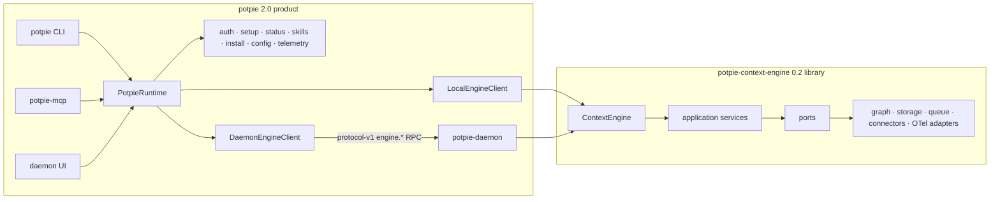

# Context Graph Architecture

> Verified against the package-boundary implementation at `f435fb4` on
> 2026-07-13. The normative ownership contract is
> [SPEC-PACKAGE-BOUNDARY](../../spec/modules/package-boundary.md).

Potpie is one product distribution backed by one independently installable
context-engine library. Root `potpie` owns every process and user workflow. The
`potpie-context-engine` wheel owns context and graph behavior, but no product
process, credentials, user-home defaults, or presentation.

## System shape



The important reviewable seam is `runtime.engine.*`. Product capabilities are
siblings on `PotpieRuntime`; they never cross daemon RPC.

## Ownership

| Concern | Root `potpie` | Context engine |
|---|---|---|
| Processes | CLI, daemon, MCP | None |
| Presentation | Typer, Rich, prompts, JSON, UI | None |
| Product state | settings, paths, runtime mode | explicit `EngineConfig` only |
| Authentication | account, integrations, keyring | typed request actor only |
| Setup/status | workflow, enrichment, recommendations | pure provision/status facts |
| Skills/install | resources, target adapters, lifecycle | None |
| Telemetry | Sentry, PostHog, build defaults | generic events/ports and optional OTel |
| Context/graph | command/tool exposure | domain, use cases, stores, backends |
| Daemon/RPC | lifecycle, transport, allowlist | operation handlers behind `EngineClient` |
| MCP | four tool declarations and process | context methods called by root |

## Root product structure

```text
potpie/
├── auth/                 account and provider authentication
├── cli/
│   ├── main.py           Typer registration and product callback
│   ├── commands/         argument binding and runtime calls
│   ├── output/           versioned JSON and error contracts
│   └── ui/               Rich output, prompts, setup UX, assets
├── config/               product configuration service
├── daemon/
│   ├── client.py         typed remote EngineClient
│   ├── rpc.py            protocol-v1 registry and encoding
│   ├── process/          launcher, PID, discovery, logs
│   └── http/             transport health and local UI
├── install/              harness target installation
├── mcp/                  four-tool public MCP server
├── runtime/
│   ├── composition.py    create_runtime/get_runtime
│   ├── contracts.py      root bridge to public engine DTOs
│   ├── settings.py       ProductSettings and product runtime settings
│   ├── paths.py          product filesystem locations
│   └── telemetry/        product telemetry settings and metrics
├── setup/                setup orchestration and flat product status
└── skills/
    ├── service.py        catalog/lifecycle service
    └── resources/        installed harness bundles and templates
```

CLI and MCP modules obtain `get_runtime()`; they do not construct an engine,
daemon client, credential store, or installer directly.

## Engine structure

```text
potpie/context-engine/
├── pyproject.toml
├── src/potpie_context_engine/
│   ├── __init__.py       supported facade exports
│   ├── engine.py         ContextEngine
│   ├── client.py         asynchronous EngineClient protocol
│   ├── config.py         explicit EngineConfig
│   ├── dependencies.py   injected EngineDependencies
│   ├── contracts/        supported cross-boundary DTOs
│   ├── domain/           graph/context concepts and ports
│   ├── application/      use cases and orchestration
│   ├── adapters/         optional inbound/outbound adapters
│   └── composition/      engine-only construction
├── tests/
└── benchmarks/           development tooling, absent from the wheel
```

Supported embedder imports are:

```python
from potpie_context_engine import (
    ContextEngine,
    EngineClient,
    EngineConfig,
    EngineDependencies,
    create_engine,
)
from potpie_context_engine.contracts import ...
```

Everything below `domain`, `application`, `adapters`, and `composition` is
internal implementation. Root code consumes public facade and contract exports.

## Runtime construction

`ProductSettings.load()` resolves:

1. explicit CLI `--runtime` override;
2. `POTPIE_RUNTIME_MODE`;
3. persisted product setting;
4. `daemon` default.

The only values are `daemon` and `in-process`.

- `daemon`: runtime creates `DaemonEngineClient` over root-owned transport.
- `in-process`: runtime maps the product data directory/backend into
  `EngineConfig.persistent()` and wraps `ContextEngine` in `LocalEngineClient`.

Daemon unavailability raises `RUNTIME_DAEMON_UNAVAILABLE` and recommends
`potpie daemon start`. It never creates a local engine implicitly. Setup,
doctor, and daemon lifecycle diagnostics can run without the daemon because
their first steps are product-owned.

## Typed daemon protocol

The root daemon accepts only declared `engine.*` methods on `/rpc`.

```json
{
  "protocol_version": "1",
  "request_id": "uuid",
  "method": "engine.graph.read",
  "params": {}
}
```

Every registry entry names its request DTO, result DTO, encoder/decoder, and
handler. Unknown methods, malformed parameters, and protocol mismatches fail
before dispatch. `/healthz` reports root transport health; auth, setup, skills,
config, install, and daemon lifecycle are not RPC methods.

An incompatible daemon returns `RPC_PROTOCOL_MISMATCH` with
`potpie daemon restart`. There is no legacy or dynamic protocol fallback.

## Setup and status

Product setup performs:

```text
settings/paths
  → account and integration checks
  → daemon reconciliation
  → runtime.engine.provision.inspect/apply
  → root skill installation
  → product setup report
```

Engine status contains engine facts only: schema, pot, backend, storage,
ingestion, source count, last ingestion time, and degraded reasons. Root status
adds runtime mode, daemon state, skills, setup state, issues, readiness, and a
recommended command. `potpie status --json` and MCP `context_status` expose the
same flat data object; only the surrounding protocol envelope differs.

## Persistence and isolation

- Root resolves the existing product data directory and passes it explicitly.
- `EngineConfig.persistent(data_dir=...)` requires a caller path.
- `EngineConfig.in_memory()` uses temporary state and does not read or create
  the user's home directory.
- Pot, graph, ledger, credential, and daemon discovery formats were preserved.
- Every graph operation remains pot-scoped.

## Distribution boundary

`potpie` 2.0 owns all three console scripts and depends by default on
`potpie-context-engine[embedded]==0.2.0`. Root mirrors optional engine
capabilities as extras.

The engine has a Pydantic-only core and these extras: `embedded`, `http`,
`postgres`, `neo4j`, `embeddings`, `github`, `reconciliation`, `hatchet`, and
`observability`. It exposes no executable and its wheel contains only the
`potpie_context_engine` namespace and engine resources.

## Extension rules

- Add a product workflow as a root service and a thin CLI/MCP/UI adapter.
- Add an engine operation as a typed request/result pair, capability method,
  local implementation, and RPC registry entry.
- Add a backend behind engine ports and an explicit capability extra.
- Do not add dynamic RPC, product service RPC, root imports in the engine,
  product defaults in `EngineConfig`, or direct engine construction in CLI/MCP.

Verification details are in
[package-boundary-1.0.0.md](../../spec/verification/package-boundary-1.0.0.md).
