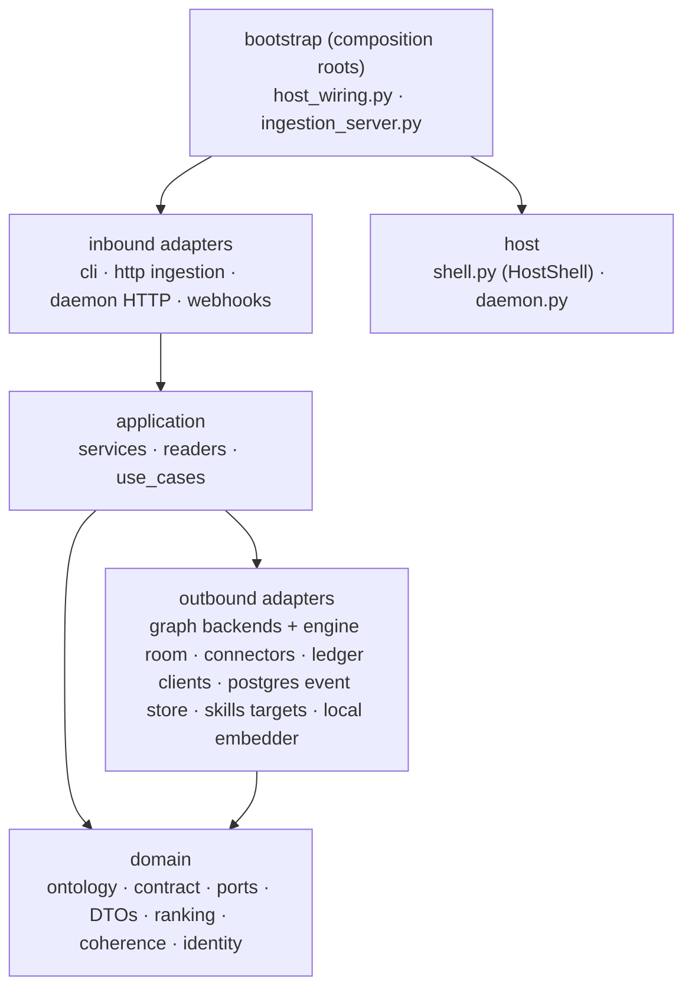
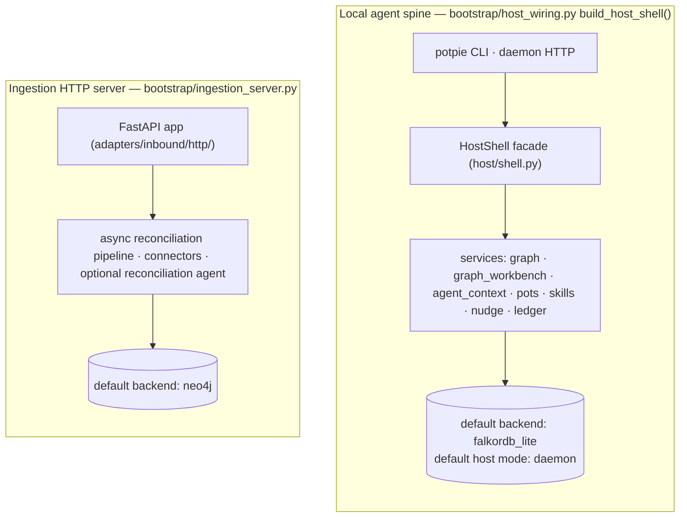
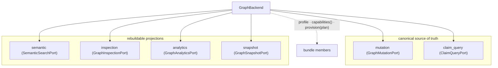
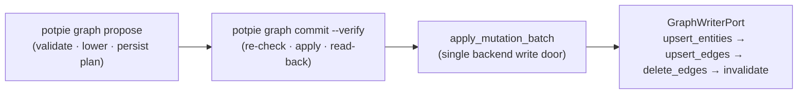
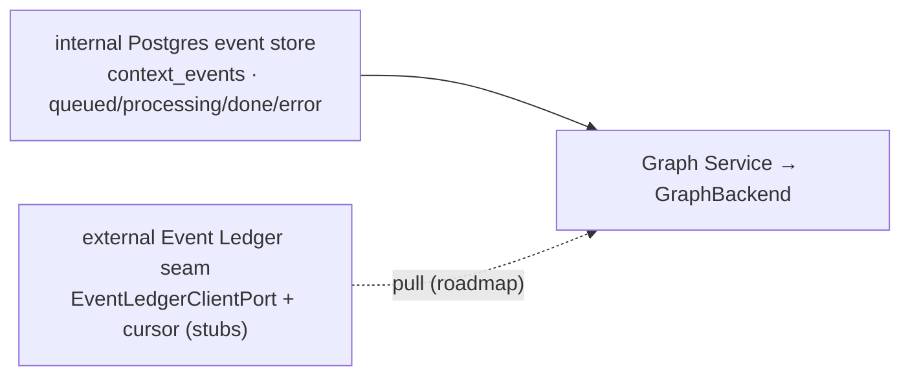

# Context Graph Architecture

> Status: reflects code on `main` @ `8dd175bc`, last reviewed 2026-06-29.

This is the implementation map for the Context Graph: the layered code, the
composition roots that wire it, the daemon that hosts it, the swappable
`GraphBackend`, and the shared storage engine room underneath. It orients you to
the moving parts and points at the docs that own each flow in full — the read
path lives in [querying.md](./querying.md), the write path in
[writing.md](./writing.md), the vocabulary in [ontology.md](./ontology.md), and
ingestion/nudge in [ingestion-nudge.md](./ingestion-nudge.md).

The single most important framing fact: the `potpie graph …` workbench is
**shipped today** as the V1.5 surface. The string `v2` survives only as the
workbench *envelope* version (`GRAPH_WORKBENCH_CONTRACT_VERSION="v2"`); the data
plane is `GRAPH_CONTRACT_VERSION="v1.5"` / `ONTOLOGY_VERSION="2026-06-graph"`.
Both the legacy `resolve`/`search`/`record` wrappers and the full workbench ship
now. The **canonical write door is `graph propose` → `graph commit --verify`**;
`graph mutate` is a legacy wrapper over it (see [Writing the graph, high
level](#the-write-door-high-level)).

## Hexagonal layers

The engine is ports-and-adapters. Pure model in the middle, I/O at the edges,
composition roots at the top.

| Layer | Path | Responsibility |
|---|---|---|
| **domain/** | `domain/` | Pure model and contracts: the three ontology catalogs, contract constants, ports (Protocols), DTOs, ranking, coherence invariants, identity. No I/O. Import-time coherence guards fail startup fast if vocabularies drift. |
| **application/** | `application/` | Services and use cases that orchestrate domain over ports: `services/` (graph_service, graph_workbench, agent_context, read_orchestrator, envelope_builder, nudge_service, skill_manager, semantic_mutation_validator/lowering, reconciliation_validation, ingestion_submission_service), `readers/` (the 9 readers), `use_cases/` (the ingestion pipeline). |
| **adapters/** | `adapters/inbound`, `adapters/outbound` | Concrete I/O. Inbound: HTTP ingestion server and webhooks. Outbound: graph backends + the shared engine room, skills targets, connectors, ledger clients, the Postgres event store, `intelligence/local_embedder`, the session injection ledger. Product CLI and daemon adapters live under `potpie/`. |
| **bootstrap/** | `bootstrap/` | The two composition roots (next section). |
| **host/** | `host/` | `shell.py` (the `HostShell` facade) and `daemon.py` (lifecycle). |

The architecture's single spine is `CLI → HostShell → service(s) → ports`
(`potpie/cli/main.py` docstring). Agents reach it through the CLI.

## Two composition roots / two HTTP roots

There are **two separate composition roots**, and conflating them is the most
common architecture error.

1. **The local agent spine** — `bootstrap/host_wiring.py build_host_shell()`
   builds `HostShell`, which the product adapters (CLI and daemon HTTP) bind
   to. The detached daemon serves an `OperationRegistry` over loopback UDS/TCP
   (`potpie/daemon/http/transport.py`) — that is the **first HTTP
   root**, a private IPC transport. Everything you reach with `potpie graph …`,
   `potpie resolve/search/record`, and `potpie graph nudge` routes through here.
   **Default backend: `falkordb_lite`. Default host mode: `daemon`.**
2. **The ingestion HTTP server** — `bootstrap/ingestion_server.py
   IngestionServerContainer` composes the FastAPI app under
   `adapters/inbound/http/` (the async reconciliation pipeline, connectors, the
   optional reconciliation agent). That public FastAPI app is the **second HTTP
   root**. **Default backend here: `neo4j`** (via `settings.graph_db_backend()`).
   It is a distinct root; migrating its async pipeline onto `HostShell` is
   deferred.

Both roots run the same domain/application code over a swappable `GraphBackend`;
they differ only in wiring and default storage.

> **Roadmap (not yet wired):** a managed Potpie backend that hosts the same
> service modules on hosted stores. `potpie use --managed`, `pot list --managed`,
> and the entire `cloud` command group raise `CapabilityNotImplemented` today.
> Local and managed are designed to share one graph model; only the host shell
> and storage adapters would change.

## The daemon model

`potpie/daemon/lifecycle.py Daemon` is the local background process for lifecycle, IPC,
health, and logs — explicitly **not** the business layer. Two modes:

- **in_process** — the host runs inside the CLI process and reports synthetic
  liveness. Built directly via `build_host_shell()`.
- **detached** — a separate process runs `potpie.daemon.main` and serves the
  `HostShell` RPC over loopback (UDS / TCP, with `base_url` discovery). The CLI
  talks to it through a daemon-backed `RemoteHostShell`.

Mode is chosen by `CONTEXT_ENGINE_HOST_MODE` (`daemon` | `in_process`);
`default_host_mode()` returns **`daemon`**, so the shipped CLI default is a
**detached daemon**. `get_host()` (`commands/_common.py`) returns the
daemon-backed `RemoteHostShell` by default and only builds an in-process shell
when `CONTEXT_ENGINE_HOST_MODE=in_process`.

**Liveness ≠ readiness.** The daemon can be live while a backend or semantic
index is not yet ready; the two are reported separately. `potpie doctor`
composes `backend.capabilities()` + `backend.mutation.readiness()` +
`daemon.status()` + `ledger.status()` so a half-ready system is debuggable.
`potpie ui` (the read-only graph explorer) is served by this daemon — it ensures
the daemon, discovers `base_url`, and opens `<base>/ui`.

## CLI surfaces onto one data plane

Reads and writes both reach `DefaultGraphService`
(`application/services/graph_service.py`) over the backend, but the CLI exposes
two shapes:

- **Compatibility commands** — `potpie resolve` / `search` / `record` /
  `status`, bound by `AgentContextService`.
- **Graph Surface Lite (V1.5)** — the richer `potpie graph …` workbench
  (`catalog`/`read`/`search-entities`/`neighborhood`/`propose`/`commit`/`bulk`/
  `history`/`inbox`/`quality` …).

Both are shipped. The read shapes and the 9-reader trunk are owned by
[querying.md](./querying.md); the write stack is owned by
[writing.md](./writing.md). No read returns a server-synthesized answer —
reads return ranked evidence (`AgentEnvelope`) and the agent reasons over it.

## The `GraphBackend` port

`domain/ports/graph/backend.py` defines `GraphBackend` as a `@runtime_checkable`
Protocol that **bundles six capability ports** in two tiers, plus three bundle
members.

- **Canonical:** `mutation` (`apply`/`apply_async`, `invalidate`, `reset_pot`,
  `readiness`) and `claim_query` (`find_claims`, `entity_labels`,
  `entity_properties`). Note `ClaimQueryPort` lives at
  `domain/ports/claim_query.py`, **not** under `graph/`.
- **Projections (rebuildable):** `semantic` (vector NN over claim embeddings,
  stamps `semantic_similarity`), `inspection` (`neighborhood`/`path`/`labels`/
  `slice` → backs `graph neighborhood`/`inspect` + the explorer UI), `analytics`
  (`counts`/`freshness`/`quality`/`repair`), `snapshot` (`export`/`import_`).
- **Bundle members:** `profile` (string), `capabilities() -> BackendCapabilities`
  (a frozen dataclass declaring which of the six are *really* implemented vs
  fail-closed — read by `backend status`/`doctor`), and `provision(plan:
  SetupPlan) -> StepResult` (the setup seam where a backend stands up its own
  store idempotently).

Two workbench stores also live under `domain/ports/graph/` but are **not** part
of the six-cap bundle: `inbox_store.py` and `plan_store.py`.

The registry (`adapters/outbound/graph/backends/__init__.py`) is
`build_backend(profile, *, settings, embedder)`. `KNOWN_PROFILES = (in_memory,
embedded, neo4j, falkordb, falkordb_lite, postgres, chroma, hosted)`. It
normalizes names (`falkordblite`→`falkordb_lite`, dashes→underscores) and, when
`embedder is None` for a real profile, default-builds the bundled local embedder
(disable via `CONTEXT_ENGINE_EMBEDDER=none`).

### Backend coverage — real capabilities per profile

This table is the corrected source of truth (the older doc overstated coverage).
A "real cap" is one whose port actually executes; everything else is fail-closed
and raises `CapabilityNotImplemented`.

| Profile | Backend class | Real caps | Notes |
|---|---|---:|---|
| `in_memory` | `InMemoryGraphBackend` | **6/6** | Conformance/reference; genuinely real (validates, MERGEs by identity, bitemporal invalidation, embeds on write); `dump_store`/`load_store`. |
| `embedded` | `EmbeddedGraphBackend` | **6/6** (delegated) | OSS JSON-persisted fallback wrapping `in_memory`; persists to `<home>/graph.json` after each mutation (atomic tmp-replace). |
| `falkordb_lite` | `FalkorDBLiteGraphBackend` | **5/6** (no snapshot) | **The OSS/CLI default.** Embedded FalkorDBLite via `redislite` over a local file — no server, no Docker. |
| `falkordb` | `FalkorDBGraphBackend` | **5/6** (no snapshot) | Full FalkorDB server over a redis URL; needs the optional `falkordb` client. |
| `neo4j` | `Neo4jGraphBackend` | **4/6** (no inspection, no snapshot) | "Shape-first production target"; native relationship vector index. |
| `postgres` / `chroma` / `hosted` | `StubGraphBackend` | **0/6** | Fail-closed seam: every port and `provision` raise `CapabilityNotImplemented("graph.<profile>.<cap>.<method>")`. Documented but unbuilt; `backend list` still shows them. |

**Cross-profile gaps to internalize:**

- Claim-key `mutation.invalidate` raises on **both** Neo4j and FalkorDB (that
  invalidation path is unbuilt there).
- `snapshot` (export/import) is real only on `in_memory`/`embedded`.
- `inspection` is real on `in_memory`/`embedded`/`falkordb` but **not** Neo4j.
- Net effect: **FalkorDB is more complete than Neo4j** (5 vs 4 ports), and the
  OSS default `falkordb_lite` is a first-class backend, not a stub.

> **Roadmap (not yet wired):** `snapshot` on falkordb/neo4j; `inspection` on
> neo4j; the `postgres`/`chroma`/`hosted` backends (all `StubGraphBackend`);
> claim-key `mutation.invalidate` on neo4j/falkordb.

## The shared engine room

The real storage logic is shared across backends, not duplicated per profile
(`adapters/outbound/graph/`). This is the implementation underneath the canonical
ports.

| Module | Role |
|---|---|
| `cypher.py` | The **Position-B canonical write engine shared by BOTH the Neo4j and FalkorDB writers.** Claims are stored as `(:Entity {group_id, entity_key})-[:RELATES_TO {group_id, name, subject_key, object_key, source_ref, valid_at, invalid_at, created_at, …}]->(:Entity)`. The MERGE key **includes `source_ref`** so corroborating writes from different sources don't collide; bitemporal stamps (`valid_at`/`invalid_at` = event time, `created_at` = system time); `_supersede_singleton_predecessors` stamps `invalid_at` on prior disagreeing live singleton claims. A Phase-0 spike proved this Cypher runs unchanged on FalkorDB. |
| `canonical_claim_query.py` | Shared `FIND_CLAIMS_CYPHER`, `ENTITY_LABELS_CYPHER`, `row_from_record`, the lexical `embedding_score` token-overlap scorer, `stamp_similarity`/`stamp_scored_rows`, `CONTRACT_EDGE_KEYS`. Both readers reuse these; the FalkorDB reader only swaps row normalization. |
| `claim_query_analytics.py` / `claim_query_semantic.py` | Give any claim-backed profile a real analytics projection and a `fact_query`-routed semantic search computed on read. |
| `apply_plan.py` | `apply_mutation_batch` (alias `apply_reconciliation_plan`) — the **single async write door** (high-level below; full flow in [writing.md](./writing.md)). |
| `writer_port.py` | `GraphWriterPort` — the narrow async mutation surface (`ensure_indexes`, 4 verbs, `reset_pot`), implemented by `Neo4jGraphWriter` and `FalkorDBGraphWriter`. Storage-internal; services depend on `GraphBackend`/`GraphMutationPort`, not this. |
| `in_memory_reader.py` | `InMemoryClaimQueryStore` — full filter semantics; `match_mode` = `vector` (embedder cosine over `fact_embedding`) or `lexical` (token overlap). |
| `context_graph_service.py` | Legacy `ContextGraphPort` DTO shim; `apply_plan`/`apply_plan_async` are **disabled** (raise `CapabilityNotImplemented`) — writes must go through `GraphService.mutate`. |
| `plan_stores/local_json.py`, `inbox_stores/local_json.py` | JSON workbench stores (plans, inbox) under the Potpie home. |

`FalkorDBGraphProvider` memoizes **one** graph handle so the Falkor reader and
writer share a single embedded instance.

## The write door (high level)

The canonical write door is two-phase: **`graph propose` → `graph commit
--verify`** (Spine A, `application/services/graph_workbench.py`). `propose`
validates, lowers accepted ops, and persists a plan record with no graph write;
`commit` re-checks the conflict guard, enforces approval for medium/high risk,
calls the single backend write door, and `--verify` reads the committed claims
back.

Two corrections to the previous version of this doc:

- **`graph mutate` is a legacy wrapper, not the canonical door.** It internally
  calls `propose` then `commit` and emits a legacy warning
  (`commands/graph.py`). The direct-apply `DefaultGraphService.mutate` (Spine B)
  is now reached **only** through `record` / `context_record`, never via `graph
  mutate`.
- There **is** a server-created `plan_id` and a real `propose|commit` contract —
  the prior claim that none existed was wrong.

Optimistic concurrency on this path is **coarse**: the only version tracked is
`{"_global": <total pot claim count>}` — there are no per-subgraph versions. A
conflict fires only if the pot's total claim count changed between propose and
commit. `GraphMutationDiff.to_dict()` emits `entity_upserts`, `edge_upserts`,
`edge_deletes`, `invalidations`, `claims_asserted`, `claims_retracted`,
`claim_keys`. The full tiered stack — semantic DSL (flat ops), validation/risk,
lowering, the 4-verb idempotent apply, inbox, and quality — is owned by
[writing.md](./writing.md).

## Persistence & per-pot scoping

Every fact is scoped by **`pot_id`, which IS the Cypher `group_id`** on every
`:Entity` node and `:RELATES_TO` edge. `reset_pot` is `MATCH (n {group_id:$gid})
DETACH DELETE n`. There is no cross-pot federation (an explicit anti-goal).

| Profile | Where it persists | Pot isolation |
|---|---|---|
| `in_memory` | Process-local, ephemeral | by `group_id` |
| `embedded` | One multi-pot `<home>/graph.json`, atomic rewrite per mutation | by `group_id` |
| `falkordb_lite` | `redislite` file at `falkordb_lite_path()` (default `.potpie/context_graph/falkordb.db`), single keyspace `context_graph` | by `group_id` |
| `neo4j` | External server, one DB | by `group_id` |

Relevant settings (`domain/ports/settings.py`): `graph_db_backend()='neo4j'`,
`falkordb_mode()='lite'`, `falkordb_graph_name()='context_graph'`,
`falkordb_lite_path()='.potpie/context_graph/falkordb.db'`, plus the Neo4j URI/
credentials.

## Backend selection precedence

- **Host / CLI:** `CONTEXT_ENGINE_BACKEND` (preferred) > legacy
  `GRAPH_DB_BACKEND` > `default_backend_profile()` = **`falkordb_lite`**.
- **Ingestion server:** `settings.graph_db_backend()` default **`neo4j`**, but it
  also routes through `build_backend`, so FalkorDB works there too.

There is **no `NotImplementedError` gate** on FalkorDB anywhere — the old
"selecting falkordb raises NotImplementedError, use neo4j" guidance is obsolete.
`backend use <profile>` is **advisory only** (it suggests
`CONTEXT_ENGINE_BACKEND`, it does not persist a selection).

## Setup & provisioning (orientation)

`potpie setup` is the idempotent first-run flow. The CLI builds a `SetupPlan`
(config, storage, daemon, default `default` pot, source registration, skills),
ensures the daemon first when in daemon mode (`host.daemon.ensure()`), and each
backend self-provisions its store through `provision(plan: SetupPlan) ->
StepResult`. Re-running is safe; each step is `ensure`-shaped and reports `done |
skipped | not_implemented | failed`.

Two corrections worth stating here:

- The default backend a fresh `setup` provisions is **`falkordb_lite`** (a local
  `redislite` file), not `embedded` or `neo4j`. `postgres`/`chroma`/`hosted`
  cannot be provisioned — `StubGraphBackend.provision()` raises (the prior
  "postgres creates the DB, enables pgvector, runs DDL" claim was aspirational).
- `--scan` is **opt-in** (default off): `setup` registers the repo as a source
  but does not scan or ingest the working tree.

The full `setup` flag set and the canonical local journey live in
[cli-flow.md](./cli-flow.md).

> **Roadmap (not yet wired):** a separate managed-backend login lifecycle
> (`potpie login` to a configured `cloud.backend_url`, then managed pot
> selection). The plumbing exists, but managed routing raises
> `CapabilityNotImplemented`.

## Two ledgers: the live event store vs the external seam

The older doc conflated two different things called a "ledger." Keep them
distinct.

1. **The internal event store (the real, live "ledger").** A Postgres-backed
   `context_events` table plus reconciliation-run/work-event/batch tables, where
   every inbound episode/event/record actually lands and gets a lifecycle
   (`adapters/outbound/postgres/…`). Its consumer-state vocabulary is
   **`queued` / `processing` / `done` / `error`** — **not** the six-state
   `pending/processing/applied/failed_retryable/failed_terminal/timed_out` list
   the old doc described. This is what ingestion really uses.
2. **The external Event Ledger seam.** `domain/ports/ledger/client.py
   EventLedgerClientPort` (cursor-advancing `fetch`, read-only `query`,
   `sources`, `health`) + `LedgerCursorStorePort`. The *cursor* concept belongs
   only to this external seam, never to the internal Postgres store.

> **Roadmap (not yet wired):** the external Event Ledger clients
> (`adapters/outbound/ledger/managed_client.py`, `self_hosted_client.py`) are
> **TODO stubs** — `fetch` returns an empty page, `query` raises, `health`
> reports unavailable. Only the in-process `FixtureEventLedgerClient` (tests)
> pages for real, and `LocalLedgerCursorStore` persists cursors. So `potpie
> ledger pull/query/status` exists but is non-functional against any real
> provider today.

The internal store, ingestion entry points, connectors (github/notion only —
scanners are deleted), windowed batching, and the nudge trigger model are owned
by [ingestion-nudge.md](./ingestion-nudge.md).

## Environment switches

| Variable | Effect | Default |
|---|---|---|
| `CONTEXT_ENGINE_BACKEND` / `GRAPH_DB_BACKEND` | Backend profile (first wins) | `falkordb_lite` (host) / `neo4j` (ingestion server) |
| `CONTEXT_ENGINE_HOST_MODE` | `daemon` \| `in_process` | `daemon` |
| `CONTEXT_ENGINE_EMBEDDER` | `none` disables the bundled local embedder | bundled local embedder |
| `CONTEXT_ENGINE_ONTOLOGY_SOFT_FAIL` | Downgrade instead of reject on ontology drift at apply time | off |
| `CONTEXT_ENGINE_AGENT_PLANNER_ENABLED` | Enable service-side LLM reconciliation | **off** |
| `CONTEXT_ENGINE_MAX_CHUNK_EVENTS` | Reconciliation chunk size | 20 |
| `CONTEXT_ENGINE_RECONCILIATION_ENABLED` / `_INFER_LABELS` / `_CONFLICT_DETECT` / `_AUTO_SUPERSEDE` | Reconciliation feature flags | on (planner off) |
| `CONTEXT_ENGINE_ALLOW_UNSIGNED_WEBHOOKS` / `GITHUB_WEBHOOK_SECRET` | GitHub webhook HMAC handling (fail-closed by default) | signed required |
| `POTPIE_HOOK_DEBUG` / `POTPIE_HOOK_TIMEOUT` / `POTPIE_BIN` / `POTPIE_POT` | Claude Code nudge-hook adapter env | — |

> **Roadmap (not yet wired):** `CONTEXT_ENGINE_AGENT_PLANNER_ENABLED` turns on
> service-side LLM reconciliation, which is parked/non-canonical — canonical
> writes come from harness-authored semantic mutations and the deterministic
> `context_record` path.

## Code map

The active package is `potpie/context-engine/`. Fictional read-path modules from
the old doc ("Ontology Catalog / Identity Resolver / Read View Router") have been
removed — those are **methods on `DefaultGraphService`** plus the declarative
`GRAPH_VIEWS` table and the `ReadOrchestrator`, not standalone components.

| Area | Path |
|---|---|
| Composition roots | `bootstrap/host_wiring.py` (`build_host_shell`); `bootstrap/ingestion_server.py` + `standalone_container.py` (ingestion HTTP root) |
| Host shell + daemon | `host/shell.py`; daemon lifecycle and IPC under `potpie/daemon/` |
| Service interfaces (ports) | `domain/ports/services/{graph_service,pot_management,skill_manager}.py` |
| Graph capability ports | `domain/ports/graph/{backend,mutation,semantic,inspection,analytics,snapshot}.py` + `domain/ports/claim_query.py` |
| Read trunk | `application/services/read_orchestrator.py`, `envelope_builder.py`, `application/readers/`, `domain/agent_envelope.py`, `domain/ranking.py`, `domain/agent_context_port.py` |
| Graph Service (catalog/read/search-entities/mutate/status) | `application/services/graph_service.py` (methods, not separate modules) |
| Named views | `domain/graph_views.py` (`GRAPH_VIEWS`) |
| Write stack | `application/services/{semantic_mutation_validator,semantic_mutation_lowering,graph_workbench,record_to_semantic,reconciliation_validation}.py`; `domain/{semantic_mutations,graph_plans,graph_inbox}.py` |
| GraphBackend adapters | `adapters/outbound/graph/backends/{in_memory,embedded,neo4j,falkordb,stub}_backend.py` + `__init__.py` (`build_backend`) |
| Shared engine room | `adapters/outbound/graph/{cypher,canonical_claim_query,claim_query_analytics,claim_query_semantic,apply_plan,writer_port,in_memory_reader,context_graph_service}.py` + `plan_stores/`, `inbox_stores/` |
| Internal event store | `adapters/outbound/postgres/{reconciliation_ledger,ingestion_event_store,batch_repository,ledger}.py` |
| External Event Ledger seam (stubs) | `domain/ports/ledger/{client,cursor}.py`; `adapters/outbound/ledger/{managed_client,self_hosted_client,cursor_store}.py` |
| CLI (host-routed) | `potpie/cli/main.py` + `potpie/cli/commands/` |
| Ingestion HTTP server | `adapters/inbound/http/` |
| Skills | `application/services/skill_manager.py` + `adapters/outbound/skills/{bundle_catalog,agent_installer,claude_target}.py` |

### Stable interfaces

| Interface | File | Role |
|---|---|---|
| `GraphService` | `domain/ports/services/graph_service.py` | Data plane: reads, identity resolution, semantic mutation validate/apply, status, projections. |
| `PotManagementService` | `domain/ports/services/pot_management.py` | Control plane: pots, active pot, sources, readiness rollup. |
| `SkillManager` + `AgentTargetPort` | `domain/ports/services/skill_manager.py` | Catalog + per-harness install drift; advisory `SkillNudge`. |
| `GraphBackend` | `domain/ports/graph/backend.py` | Six-capability storage bundle + `profile` + `capabilities()` + `provision()`. |
| `GraphMutationPort` / `ClaimQueryPort` | `domain/ports/graph/mutation.py`, `domain/ports/claim_query.py` | Canonical source of truth (write / read). |
| `SemanticSearchPort` / `GraphInspectionPort` / `GraphAnalyticsPort` / `GraphSnapshotPort` | `domain/ports/graph/{semantic,inspection,analytics,snapshot}.py` | Rebuildable projections. |
| `EventLedgerClientPort` / `LedgerCursorStorePort` | `domain/ports/ledger/{client,cursor}.py` | External Event Ledger pull + per-(pot,source) cursor (clients are stubs today). |
| `HostShell` / `Daemon` | `host/{shell,daemon}.py` | In-process facade over the services + local lifecycle. |

An unbuilt capability raises `domain.errors.CapabilityNotImplemented` with a
dotted `graph.<profile>.<cap>.<method>` slot, which inbound adapters render as
the structured not-implemented contract — never a bare `NotImplementedError`.

## Extension points

Add behavior at the narrowest service boundary that owns it. CLI adapts user
intent, the daemon hosts services, Pot Management owns the control plane, Graph
Service owns the data plane, and `GraphBackend` owns physical storage.

| Change | Put it here | Rule |
|---|---|---|
| Read view | `domain/graph_views.py` (`GRAPH_VIEWS`) + a reader in `application/readers/` | Route through `ReadOrchestrator` and `ClaimQueryPort`; never query stores directly. `READER_BACKED_INCLUDES` must mirror the reader registry (coherence-enforced). |
| Semantic mutation op | semantic DSL + validator + lowering | Add deterministic validation and lowering before exposing it to agents. |
| Entity / predicate | `domain/ontology.py` | One row in `ENTITY_TYPES` / `EDGE_TYPES`; add identity, endpoint rules, freshness, source-of-truth. Coherence guards fail import if it drifts. See [ontology.md](./ontology.md). |
| Graph backend | `domain/ports/graph/` + a backend adapter | Implement the canonical ports, preserve `group_id` pot isolation, pass conformance; declare real caps in `capabilities()`. |
| Skill | skill catalog + `AgentTargetPort` adapter | Keep skill content harness-neutral; it is not graph data. See [skills.md](./skills.md). |
| Pot behavior | Pot Management Service | Preserve the first-setup active `default` pot. |
| Setup / lifecycle step | the component's `provision`/bespoke method + `SetupOrchestrator` sequence | Return a `StepResult`; raise `CapabilityNotImplemented` until built. |

Do not bypass the read trunk, query physical stores from CLI/readers, make a
projection a second source of truth, put service logic in the daemon shell, or
duplicate ontology enums in docs/CLI.

## Invariants

- OSS graph use works with no cloud auth and no mandatory Docker/Neo4j/Postgres
  (the default `falkordb_lite` is embedded).
- The CLI is the user and agent surface.
- The canonical claim store is the only source of truth; semantic/inspection/
  analytics/snapshot are rebuildable projections.
- Every fact is scoped by `pot_id` = `group_id`; no cross-pot federation.
- The canonical write door is `propose` → `commit --verify`; `graph mutate` is a
  legacy wrapper; reads never synthesize answers.
- Pot Management owns the control plane; Graph Service owns the data plane; the
  daemon hosts services but holds no business logic.
- Unbuilt capabilities fail-closed with a dotted `CapabilityNotImplemented`
  slot, surfaced as the structured not-implemented contract.

## See also

- [vision.md](./vision.md) — what the Context Graph is and why.
- [ontology.md](./ontology.md) — entities, predicates, views, contract constants.
- [querying.md](./querying.md) — the read trunk, readers, ranking, envelopes.
- [writing.md](./writing.md) — the full write stack (DSL → validate → lower →
  apply), propose/commit, inbox, quality.
- [ingestion-nudge.md](./ingestion-nudge.md) — the internal event store,
  connectors, batching, and the nudge trigger model.
- [cli-flow.md](./cli-flow.md) — the full command surface and the canonical
  journey.
- [observability.md](./observability.md) — logs/traces/metrics/readiness (its
  `graph.propose`/`graph.commit` span names match the corrected write door here).
