# Context Graph Architecture

Last reviewed: 2026-05-29.

This document is the implementation map for the Context Graph. It follows the
same shape as the product: CLI first, the same service modules hosted either by
a local daemon or managed API server, swappable storage backends, and explicit
cloud or ledger commands.

## Anatomy

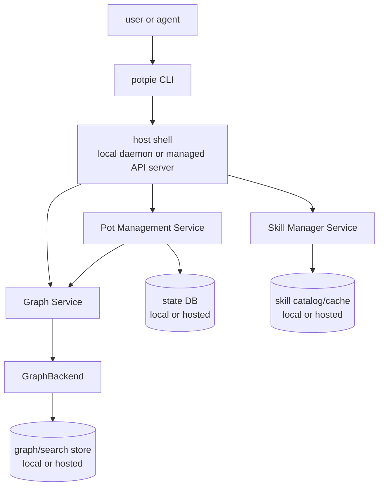

| Piece | Responsibility |
|---|---|
| CLI | User/agent surface, command UX, JSON output, setup orchestration, local/cloud profile selection. |
| Host shell | Local daemon or managed API server. Owns process/API lifecycle, auth, IPC/HTTP, health, logs, and migrations trigger. |
| Pot Management | Active pot, pot CRUD, source registry, lifecycle, status aggregation, export/import metadata. |
| Graph Service | `resolve`, `search`, `record`, `status`, read orchestration, ranking, record lowering. |
| GraphBackend | Store capability bundle: mutation, claim query, semantic search, inspection, analytics, snapshot. |
| Skill Manager | Skill catalog and install/update/remove into agent harnesses. |

The host shell hosts services; it does not contain their business logic. The
same Pot Management, Graph Service, and Skill Manager modules run in the local
daemon and in the managed API server. Storage adapters and operational
dependencies differ by deployment.

## Deployment Shapes

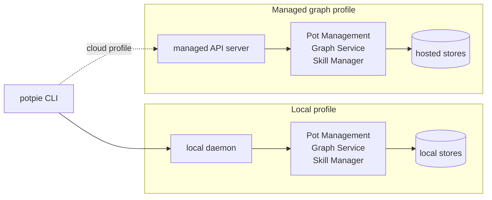

Both profiles run the same service modules. Only the host shell and storage
adapters change.

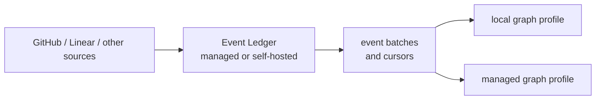

| Boundary | Local OSS | Managed graph service |
|---|---|---|
| Entry | CLI defaults to local | Hosted API/profile |
| Host | Local daemon shell | Managed API server |
| Service modules | Pot Management, Graph Service, Skill Manager | Same modules hosted in managed API server |
| Auth | Local token/socket/OS user | Potpie auth and policy |
| Pot state | Local DB with active `default` pot after setup | Hosted operational DB |
| Graph backend | Embedded/local GraphBackend profile | Hosted graph/search GraphBackend profile |
| Skills | Local catalog/cache and agent target adapters | Hosted catalog/state plus managed target adapters |
| Event Ledger | Optional managed or self-hosted ledger, pulled explicitly | Managed or self-hosted ledger, consumed by hosted workers/services |
| Source integrations | Local scanners by default; no source-provider credentials in the daemon unless configured | Hosted connectors, webhook receivers, queues, and workers |
| Sync | Explicit `potpie cloud ...`; ledger pull does not move graph state to cloud | Native hosted pots |

## First-run Setup

Setup makes Potpie usable. Users should not run daemon commands on the happy
path.

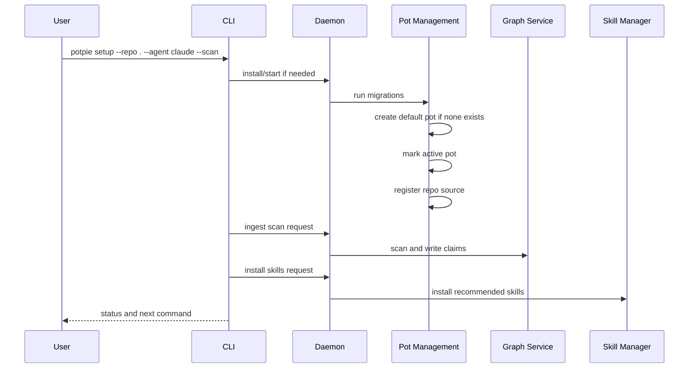

`--pot <name>` only overrides the initial pot name. Without it, setup creates
and uses `default`.

## Runtime Flows

### Resolve/search

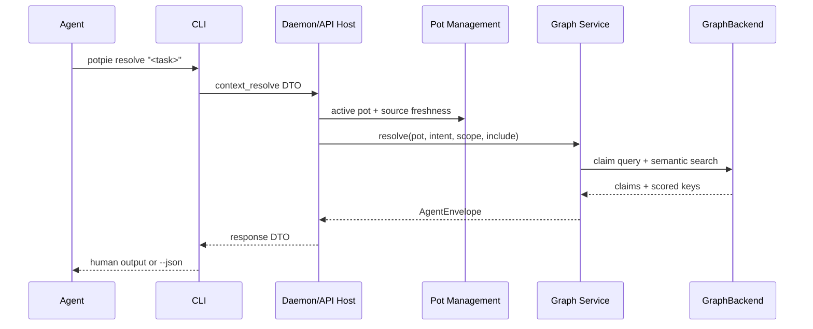

### Record

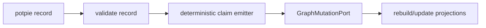

### Ingestion

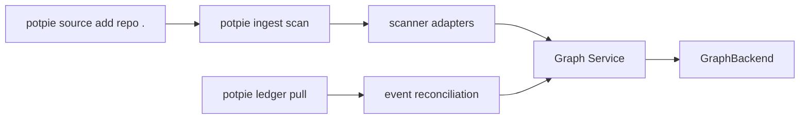

Registering a source records metadata. Scanning writes claims. Pulling from an
Event Ledger reads normalized source events from a managed or self-hosted ledger,
then reconciles them into claims through the same Graph Service.

### Event Ledger Pull

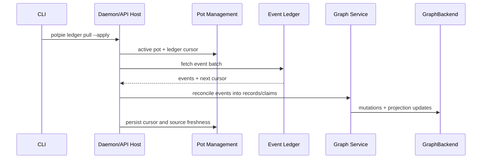

The local daemon does not need to be internet-facing. A local profile can log in
to Potpie managed, use the managed Event Ledger for GitHub/Linear/webhook
events, and still keep the graph store local. A self-hosted Event Ledger follows
the same pull contract.

## Agent Contract

Agents see one data-plane contract in every deployment. In OSS self-serve, the
agent uses the `potpie` CLI and the CLI calls the local daemon. In managed
Potpie, the hosted API implements the same contract.

| Tool | Role |
|---|---|
| `context_resolve` | Primary task-context read. Use before non-trivial work. |
| `context_search` | Targeted lookup when the agent already knows what to find. |
| `context_record` | Durable write for reusable project memory. |
| `context_status` | Cheap health, readiness, capability, freshness, and skill check. |

New use cases become parameters, include families, readers, record types, or
skills. They do not become new public tools.

Common request fields:

| Field | Meaning |
|---|---|
| `pot_id` | Pot scope. Local callers may use `local/current`. |
| `intent` | Task shape: `feature`, `debugging`, `review`, `operations`, `planning`, `docs`, `onboarding`, `refactor`, `test`, `security`, or `unknown`. |
| `include` | Evidence families to retrieve. |
| `scope` | Repo, service, file, PR, ticket, user, environment, or time window. |
| `mode` | Retrieval depth: `fast`, `balanced`, `verify`, or `deep`. |
| `source_policy` | Evidence policy: `references_only`, `summary`, `verify`, or `snippets`. |

Reader-backed includes today:

- `coding_preferences`
- `infra_topology`
- `timeline`
- `prior_bugs`
- `raw_graph`

Planned includes must appear in `unsupported_includes` with
`reason=not_implemented` until they are actually backed:

- `decisions`
- `docs`
- `owners`

The resolve/search response is an `AgentEnvelope`:

| Field | Meaning |
|---|---|
| `items[]` | Ranked evidence items with include, score, coverage status, payload, and source refs. |
| `coverage[]` | Per-include availability and completeness. |
| `unsupported_includes[]` | Requested includes that cannot be served yet. |
| `overall_confidence` | High-level confidence for the returned context. |
| `metadata` | Additive transport or implementation metadata. |

Public `context_record` types:

- `preference`
- `policy`
- `bug_pattern`
- `fix`
- `verification`
- `decision`
- `investigation`
- `diagnostic_signal`
- `workflow`
- `feature_note`
- `service_note`
- `runbook_note`
- `integration_note`
- `incident_summary`
- `doc_reference`

`context_status` reports daemon/API health, active pot, service readiness,
backend capabilities, semantic index readiness, source freshness, Event Ledger
connection/cursor state when configured, supported include families, and optional
skill nudges. A skill nudge may include an exact `potpie skills install ...`
command; the install still happens through the CLI.

## GraphBackend

A backend is a set of capability ports, not a database handle.

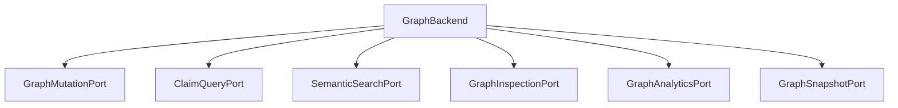

| Capability | Required | Notes |
|---|---:|---|
| Mutation | yes | Apply validated mutations, invalidations, resets, readiness. |
| Claim query | yes | Read canonical claims for readers and label lookup. |
| Semantic search | yes | Vector search over claim facts; local embedder by default. |
| Inspection | derivable | Neighborhoods, paths, labels, graph slices. |
| Analytics | derivable | Counts, freshness, quality checks, repair. |
| Snapshot | derivable | Portable pot export/import. |

The canonical claim store is the only source of truth. Vector indexes,
inspection views, and analytics rollups are projections that can be rebuilt.

Default profiles:

| Profile | Purpose |
|---|---|
| `embedded` | OSS default: local, no Docker, vector search included. |
| `in_memory` | Tests and conformance. |
| `neo4j`, `postgres/pgvector`, `chroma` | Optional profiles behind the same ports. |
| hosted profile | Managed API server storage/search adapter. |

## Skill Manager

Skills teach agent harnesses how to use the CLI and four-tool workflow. They are
not graph facts and not new agent tools.

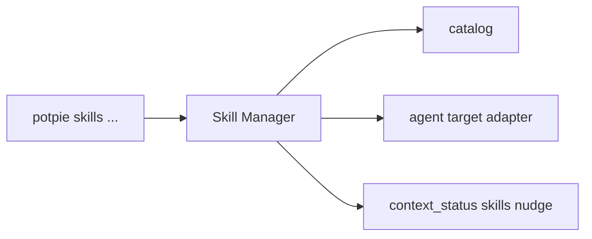

`context_status` may report missing/outdated skills and provide an install
command. The install still happens through the CLI.

## Managed API Server

Managed Potpie hosts the same service modules behind a hosted API:

- Potpie auth, teams, roles, billing, and collaboration policy.
- Hosted operational, graph/search, and skill/catalog stores.
- Workers and queues for async ingestion that call the same services.
- Hosted graph/search profile.
- Hosted observability and cost telemetry.
- Cloud skill sync.

It does not add a cloud-only graph model or a separate agent contract. The
managed API server is another host for Pot Management, Graph Service, and Skill
Manager, backed by hosted databases.

## Event Ledger

The Event Ledger is a separate managed or self-hostable service for source
events. It is not the Context Graph source of truth.

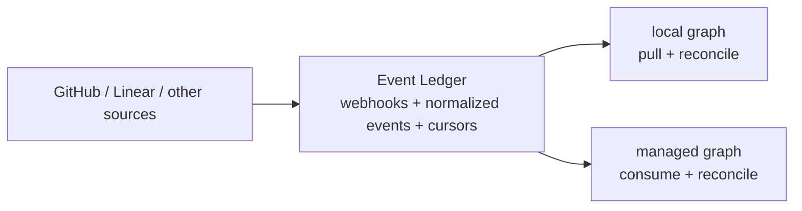

Responsibilities:

- receive webhooks and poll source APIs;
- normalize source events and keep replayable event history;
- expose per-pot/per-source cursors for pull consumers;
- keep third-party credentials and webhook receivers out of the local daemon by
  default;
- let local graphs use managed integrations without pushing graph state to
  managed storage.

The Graph Service remains responsible for turning records/events into claims.
The Event Ledger only supplies ordered source events and cursor state.

## Code Map

| Area | Current / target path |
|---|---|
| Domain model | `app/src/context-engine/domain/` |
| Graph facade | `domain/ports/context_graph.py` |
| Graph capability ports | `domain/ports/graph/` |
| Graph Service | `adapters/outbound/graph/context_graph_service.py` |
| Readers | `application/readers/`, `application/services/read_orchestrator.py` |
| Scanners | `domain/ports/config_scanner.py`, `application/use_cases/scan_working_tree.py`, `adapters/outbound/scanners/` |
| Structured records | `domain/context_records.py`, `domain/ontology.py` |
| Skill manager | `domain/ports/skills/`, `adapters/inbound/cli/agent_installer.py`, `adapters/inbound/cli/templates/` |
| CLI / HTTP | `adapters/inbound/{cli,http}/`, `bootstrap/standalone_container.py` |
| Managed API adapter | `app/modules/context_graph/` |
| Event Ledger adapters | target: ledger client, connector, webhook, and cursor ports |

## Extension Points

The rule of thumb: add behavior at the narrowest service boundary that owns it.
CLI adapts user intent, the daemon hosts services, Pot Management owns control
plane behavior, Graph Service owns data-plane behavior, and GraphBackend owns
physical storage.

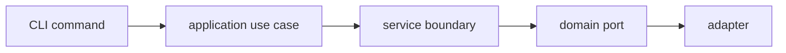

| Change | Put it here | Rule |
|---|---|---|
| Reader/include | `application/readers/` + read orchestrator | Read through `ClaimQueryPort`; do not query stores directly. |
| Scanner | `adapters/outbound/scanners/` + scanner use case | Emit validated graph mutations or structured records. |
| Record type | `domain/ontology.py`, `domain/context_records.py` | Add deterministic claim emission when possible. |
| Entity/predicate | `domain/ontology.py` | Add identity, endpoint rules, freshness, and source-of-truth metadata. |
| Graph backend | `domain/ports/graph/` + backend adapter | Implement mandatory ports, preserve pot isolation, pass conformance. |
| Skill | Skill catalog + `AgentTargetPort` adapter | Keep skill content harness-neutral; do not put it in the graph. |
| Pot behavior | Pot Management Service | Preserve first-setup active `default` pot. |
| Event Ledger connector | Event Ledger service adapter | Normalize provider events, own webhook/polling concerns, expose cursor-based pull. |
| Managed host behavior | Managed API server + shared services | Reuse Pot Management, Graph Service, and Skill Manager; swap only host/storage adapters. |
| CLI command | CLI -> selected profile service/use case | Local commands stay local unless the user selects explicit cloud or ledger commands. |

Do not extend by bypassing the read orchestrator, querying physical stores from
CLI/readers, making projections a second source of truth, putting service
business logic in the daemon shell, exposing skill management as an agent tool,
or duplicating ontology enums in docs/CLI/cloud-only code.

## Implementation Order

1. Create graph capability ports and `GraphBackend`.
2. Add conformance suite and in-memory backend.
3. Implement embedded backend with vector search.
4. Add setup-aware daemon with local auth, health, logs, and service-manager
   install/start.
5. Add local Pot Management with `default` active pot creation and source
   registry.
6. Route CLI `resolve/search/record/status` through the daemon.
7. Finish `pot`, `source`, `ingest`, `graph`, `backend`, and `skills` commands.
8. Add snapshots, cloud push/pull, and managed skill sync.
9. Add Event Ledger client, cursor storage, `ledger` CLI, and reconciliation
   path.
10. Add managed API server hosting the same services on hosted stores.

## Rules

- OSS graph use works without cloud auth.
- CLI is the primary user/agent surface.
- Setup creates the daemon and active `default` pot.
- The same service modules run in the local daemon and managed API server.
- Pot Management owns control plane; Graph Service owns data plane.
- CLI/readers never query physical stores directly.
- Skills are CLI-managed recipes, not graph data and not a fifth tool.
- The Event Ledger is a source-event stream, not graph storage.
- Local graphs may pull from managed or self-hosted ledgers only after explicit
  ledger configuration.
- Managed-only concerns stay outside the local daemon unless explicitly
  configured by the user.
