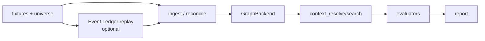
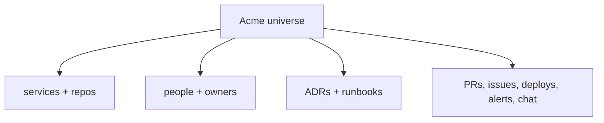

# Context Graph Benchmarks

Last reviewed: 2026-05-29.

The benchmark validates graph quality. It is not the OSS packaging roadmap. The
same scenarios should run against in-memory, embedded, Neo4j, and managed
backends through the `GraphBackend` contract. Source events can enter through
direct scanner fixtures or an Event Ledger replay path.

## Pipeline



The benchmark measures whether the engine stores the right facts, retrieves the
right evidence, and gives an agent enough context to answer well.

## Goals

- Score by knowledge dimension, not one vague aggregate.
- Stress multi-source ingestion with distractors and conflicting facts.
- Keep a stable synthetic universe so ontology improvements compound.
- Run the same seed/read scenarios through every backend.
- Run the same event fixtures through direct ingestion and Event Ledger replay
  when the scenario needs integration semantics.
- Produce clear score deltas when readers, ontology, reconciliation, or storage
  changes.

Non-goals:

- Latency/throughput benchmarking.
- LLM model benchmarking.
- Replacing unit tests.
- Production real-data parity.

## Use Cases

| Code | Dimension | What it tests |
|---|---|---|
| `PREF` | Project preferences | Normative rules: logging, errors, file layout, security, testing. |
| `INFRA` | Architecture/topology | Services, environments, dependencies, deploy path, owners. |
| `TIME` | Timeline | What changed when, by whom, and in what order. |
| `BUG` | Debug memory | Prior failures, root causes, fixes, recurrence patterns. |
| `COMBO` | Composite | A scenario spanning two or more dimensions. |

## Scoring

Each scenario has three primary axes:

| Axis | Meaning |
|---|---|
| Ingestion | Did the graph contain the expected entities/claims and avoid bad ones? |
| Retrieval | Did the engine surface the expected evidence and avoid distractors? |
| Synthesis | Did the agent answer satisfy the rubric using surfaced context? |

Coverage and precision are reported alongside ingestion and retrieval.

Default weights:

| Use case | Ingestion | Retrieval | Synthesis |
|---|---:|---:|---:|
| `PREF` | 20 | 40 | 40 |
| `INFRA` | 30 | 40 | 30 |
| `TIME` | 40 | 30 | 30 |
| `BUG` | 25 | 35 | 40 |
| `COMBO` | 30 | 35 | 35 |

Pass criteria:

- axis score meets its threshold;
- weighted scenario score meets `pass_score`;
- at least 80% of scenarios in a use-case bucket pass;
- each declared dimension in a composite scenario scores at least 60.

## Scenario Shape

```yaml
id: bug_redis_connection_flap
use_case: BUG
dimensions: [BUG, TIME]
difficulty: medium
source_mix: dual
event_path: ledger_replay
universe: acme

seed:
  - { event: universe/acme/services.yaml, at: "-365d" }

ingest:
  - { event: linear/issue_create__OPS-218.json, at: "-90d", tags: [signal] }
  - { event: github/pr_merge__1234.json, at: "-89d", tags: [signal] }

distractor_events:
  - { event: github/pr_merge__noise_*.json, at: "-90d..0d", count: 10 }

query:
  intent: debugging
  include: [prior_bugs, timeline]
  scope: { services: [inventory-svc] }

retrieval_assertions:
  must_cite_event_id: [linear/issue_create__OPS-218.json]
  must_not_cite_event_id: [github/pr_merge__noise_001.json]

judge:
  pass_score: 70
  criteria:
    - name: surfaces_prior_incident
      weight: 30
      dimensions: [BUG]
      prompt: "..."
```

## Synthetic Universe

The default universe is `acme`: a small fictitious company with stable services,
repos, people, environments, ADRs, runbooks, and incidents.



Source types:

- GitHub
- Linear
- Slack
- Notion
- repo docs
- alerting
- deploy events
- Event Ledger replay

Difficulty controls source mix and distractor ratio:

| Difficulty | Shape |
|---|---|
| `easy` | Single source, low noise, recent. |
| `medium` | Two sources, moderate distractors, historical context. |
| `hard` | Three+ sources, heavy near-miss distractors. |
| `adversarial` | Conflicting facts, out-of-order arrival, near-duplicates. |

## Report

The report should show:

- per-use-case score table;
- per-difficulty curve;
- per-source-mix curve;
- composite dimension rollups;
- baseline diff against a prior report.

Example panel:

```text
| Use case | N | Aggregate | Ing | Ret | Syn | Cov | Prec | Pass |
|----------|--:|----------:|----:|----:|----:|----:|-----:|-----:|
| PREF     | 6 |      72.4 | 60  | 78  | 76  | 84  |  91  | 4/6  |
```

## Current Status

The benchmark currently has:

- a schema for dimensions, difficulty, source mix, seed events, distractors, and
  per-dimension judge criteria;
- an `acme` synthetic universe;
- quick-tier scenarios across `PREF`, `INFRA`, `TIME`, `BUG`, and `COMBO`;
- invariant judging for a light schema-independent subset;
- smoke and fixture-validation paths.

Operational notes and historical implementation logs should live in run reports,
PRs, or git history, not in this architecture doc.

## Next Work

1. Keep the quick tier small enough for PR checks.
2. Keep the extended tier for nightly/backend comparison.
3. Add conformance runs for every `GraphBackend`.
4. Add Event Ledger replay scenarios for GitHub/Linear-style event ordering,
   cursor replay, and out-of-order arrival.
5. Use baseline diffs as the main regression signal.
6. Add real-data/redacted corpus only after the synthetic bench is stable.
