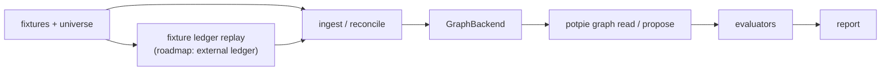
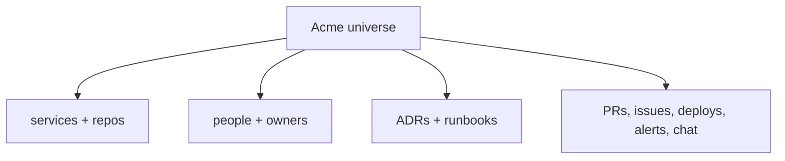

# Context Graph Benchmarks

> Status: reflects code on `main` @ `8dd175bc`, last reviewed 2026-06-29.

> **Planning / reference artifact.** This is the design intent for the benchmark,
> not a per-run log. The harness itself lives in code at
> `potpie/context-engine/benchmarks/` (`cli.py`/`__main__.py` entrypoint,
> `core/`, `evaluators/`, `use_cases/`, `fixtures/`). Operational notes and
> historical run logs belong in run reports, PRs, or git history — not here.

The benchmark validates **graph quality**, not OSS packaging or latency. The same
scenarios run against the real backends behind the `GraphBackend` contract
(`in_memory`, `embedded`, `falkordb_lite`, `falkordb`, `neo4j`), so an ontology,
reader, or storage change produces a comparable score delta. Source events enter
through explicit harness-style mutation fixtures or a ledger-replay path.

> **Roadmap (not yet wired):** the *managed* backend profile and the *external*
> Event Ledger replay are bench targets but not functional today — managed backend
> routing raises `CapabilityNotImplemented`, and the external Event Ledger clients
> (`adapters/outbound/ledger/{managed,self_hosted}_client.py`) are TODO stubs. The
> bench exercises ledger semantics through the in-process `FixtureEventLedgerClient`
> (see [ingestion-nudge.md](./ingestion-nudge.md)).

## Pipeline



Reads use the shipped V1.5 workbench (`potpie graph read` over named views; see
[querying.md](./querying.md)); writes use `graph propose` → `graph commit`
(see [writing.md](./writing.md)). The benchmark measures whether the engine
stores the right facts, retrieves the right evidence, and gives an agent enough
context to answer well.

> The legacy `ContextGraphQuery`/`ContextGraphStrategy` model (`domain/graph_query.py`)
> is vestigial in the live read trunk and now survives **only** to back this
> harness (`benchmarks/core/local_engine.py`). Treat it as bench plumbing, not a
> production read DTO.

## Goals

- Score by knowledge dimension, not one vague aggregate.
- Stress multi-source ingestion with distractors and conflicting facts.
- Keep a stable synthetic universe so ontology improvements compound.
- Run the same seed/read scenarios through every `GraphBackend` profile.
- Run the same event fixtures through direct ingestion and (roadmap) external
  ledger replay when a scenario needs integration semantics.
- Produce clear score deltas when readers, ontology, reconciliation, or storage
  change.

Non-goals:

- Latency/throughput benchmarking.
- LLM model benchmarking.
- Replacing unit tests.
- Production real-data parity.

## Use Cases

| Code | Dimension | What it tests |
|---|---|---|
| `PREF` | Project preferences | Normative rules: logging, errors, file layout, security, testing. |
| `INFRA` | Architecture/topology | Services, environments, dependencies, deploy path, owners. |
| `TIME` | Timeline | What changed when, by whom, and in what order. |
| `BUG` | Debug memory | Prior failures, root causes, fixes, recurrence patterns. |
| `COMBO` | Composite | A scenario spanning two or more dimensions. |

## Scoring

Each scenario has three primary axes:

| Axis | Meaning |
|---|---|
| Ingestion | Did the graph contain the expected entities/claims and avoid bad ones? |
| Retrieval | Did named read views surface the expected evidence and avoid distractors? |
| Agent use | Did the agent answer (or proposed update) satisfy the rubric using surfaced context? |

Coverage and precision are reported alongside ingestion and retrieval.

Default weights:

| Use case | Ingestion | Retrieval | Agent use |
|---|---:|---:|---:|
| `PREF` | 20 | 40 | 40 |
| `INFRA` | 30 | 40 | 30 |
| `TIME` | 40 | 30 | 30 |
| `BUG` | 25 | 35 | 40 |
| `COMBO` | 30 | 35 | 35 |

Pass criteria:

- axis score meets its threshold;
- weighted scenario score meets `pass_score`;
- at least 80% of scenarios in a use-case bucket pass;
- each declared dimension in a composite scenario scores at least 60.

### The invariant (schema-independent) judge

Because reads return a **pure evidence envelope with no server-side answer
synthesis** (the agent reasons over the `AgentEnvelope` — see
[querying.md](./querying.md)), agent-use grading defaults to a
**schema-independent invariant judge** (`benchmarks/evaluators/llm_judge_invariant.py`).
A single LLM call is given the scenario's raw input events plus the agent's full
answer and grades on four engine-agnostic dimensions:

| Dimension | Asks |
|---|---|
| `faithfulness` | Every claim in the answer is supported by the events — no fabricated ids/people/facts. |
| `coverage` | The answer surfaces the events/facts essential to the user's question. |
| `clarity` | Structured so a human quickly understands what happened. |
| `usefulness` | Concretely helps the user diagnose/debug/follow a convention/plan a change. |

Aggregate is the weighted mean (default 30/30/20/20 — faithfulness + coverage
dominate so cosmetic clarity/usefulness can't compensate for hallucination or
omission). This decouples the agent-use axis from fixture ids and the engine's
current include vocabulary, so the score doesn't move just because the ontology
or query layer changed. The invariant judge is **on by default** for `run`; opt
back into the legacy per-rubric synthesis judge with `--rubric` (deprecated, and
it requires a server-synthesised answer). Ingestion and retrieval axes stay in
the report as diagnostics but no longer gate.

## Scenario Shape

```yaml
id: bug_redis_connection_flap
use_case: BUG
dimensions: [BUG, TIME]
difficulty: medium
source_mix: dual
event_path: ledger_replay
universe: acme

seed:
  - { event: universe/acme/services.yaml, at: "-365d" }

ingest:
  - { event: linear/issue_create__OPS-218.json, at: "-90d", tags: [signal] }
  - { event: github/pr_merge__1234.json, at: "-89d", tags: [signal] }

distractor_events:
  - { event: github/pr_merge__noise_*.json, at: "-90d..0d", count: 10 }

query:
  subgraph: debugging          # the prior-occurrences view lives under `debugging`
  view: prior_occurrences
  scope: { services: [inventory-svc] }

retrieval_assertions:
  must_cite_event_id: [linear/issue_create__OPS-218.json]
  must_not_cite_event_id: [github/pr_merge__noise_001.json]

judge:
  pass_score: 70
  criteria:
    - name: surfaces_prior_incident
      weight: 30
      dimensions: [BUG]
      prompt: "..."
```

The `signal`-tagged events are the ones the invariant judge sees as ground truth.
A single easy/medium scenario per dimension carries `light: true`, marking it for
the curated quick subset (`core/scenario.py`).

## Synthetic Universe

The default universe is `acme`: a small fictitious company with stable services,
repos, people, environments, ADRs, runbooks, and incidents.



Source types: GitHub, Linear, Slack, Notion, repo docs, alerting, deploy events,
and (roadmap) external Event Ledger replay.

Difficulty controls source mix and distractor ratio:

| Difficulty | Shape |
|---|---|
| `easy` | Single source, low noise, recent. |
| `medium` | Two sources, moderate distractors, historical context. |
| `hard` | Three+ sources, heavy near-miss distractors. |
| `adversarial` | Conflicting facts, out-of-order arrival, near-duplicates. |

## Running

The harness is a small CLI (`python -m benchmarks ...` / `benchmarks/cli.py`):

| Command | What it does |
|---|---|
| `run` | Full/tiered run; invariant judge on by default (`--rubric` to opt out). |
| `run-light` | Curated 5-scenario subset (one per dimension), concurrency 5, invariant judge — the PR-check tier. |
| `list [--grid]` | List discovered scenarios (or a `use_case × difficulty` matrix). |

`--local` (or `POTPIE_BENCH_INPROCESS=1`) runs the engine in-process — no
`:8001` HTTP server and no Celery worker, reconciling inline — and is the
recommended mode for light runs. `--skip-judge` does cheap dry runs without the
LLM axis.

## Report

The report should show:

- per-use-case score table;
- per-difficulty curve;
- per-source-mix curve;
- composite dimension rollups;
- baseline diff against a prior report.

Example panel:

```text
| Use case | N | Aggregate | Ing | Ret | Agent | Cov | Prec | Pass |
|----------|--:|----------:|----:|----:|------:|----:|-----:|-----:|
| PREF     | 6 |      72.4 | 60  | 78  |    76 | 84  |  91  | 4/6  |
```

## Current Status

The benchmark currently has:

- a scenario schema for dimensions, difficulty, source mix, seed events,
  distractors, the `light` quick-tier flag, and per-dimension judge criteria;
- an `acme` synthetic universe;
- quick-tier scenarios across `PREF`, `INFRA`, `TIME`, `BUG`, and `COMBO`;
- the schema-independent **invariant judge** (default for `run`) plus the
  **`run-light`** 5-scenario PR-check subset;
- smoke and fixture-validation paths.

## Next Work

1. Keep the quick tier (`run-light`) small enough for PR checks.
2. Keep the extended tier for nightly/backend comparison.
3. Add conformance runs for every `GraphBackend` profile.
4. Add external Event Ledger replay scenarios (GitHub/Linear-style event
   ordering, consumer-cursor replay, query/filter behaviour, retryable failures,
   timed-out leases, out-of-order arrival) once the ledger clients land.
5. Use baseline diffs as the main regression signal.
6. Add a real-data/redacted corpus only after the synthetic bench is stable.

## See also

- [README.md](./README.md) — docs index and the two-profile overview.
- [querying.md](./querying.md) — the read trunk, `AgentEnvelope`, named views, ranking.
- [writing.md](./writing.md) — the propose → commit write door the bench drives.
- [ingestion-nudge.md](./ingestion-nudge.md) — the internal event store vs the external Event Ledger seam.
- [ontology.md](./ontology.md) — subgraphs, views, truth classes the scenarios assert against.
