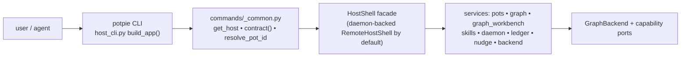
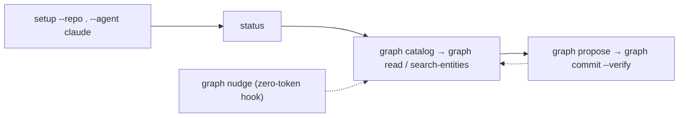

# Potpie CLI Flow & Command Reference

> Status: reflects code on `main` @ `49e12528`, last reviewed 2026-07-02.

This is the **command reference** for the `potpie` CLI — the full, grouped surface
with flags, the shared plumbing every command goes through, and the canonical
journey. It is the one doc that may restate flags in full; conceptual depth lives
in the sibling docs linked under each group and in [See also](#see-also).

This file lives at repo-root `docs/context-graph/cli-flow.md`. The code it
describes lives under repo-root `potpie/context-engine/` (paths below are
relative to that root).

## One CLI for humans and agents

There is no separate human-vs-agent API. Both people and coding harnesses drive
the same `potpie` CLI; agents may also reach the same internals through the
in-process MCP `context_*` tools (exactly four — see [querying.md](./querying.md)).
`adapters/inbound/cli/host_cli.py build_app()` is the single console entrypoint
(`[project.scripts]`): one Typer root whose `@app.callback` exposes three global
options, with the rest of the surface assembled from top-level registrars and
`add_typer` sub-apps. Every command routes `CLI → HostShell → service(s) → ports`.



### Global options (root `@app.callback`)

| Option | Effect |
|---|---|
| `--json` | machine-readable output for scripts/agents (stable, additive fields) |
| `--verbose` / `-v` | verbose diagnostics |
| `--version` | print version and exit |

## Shared plumbing (`commands/_common.py`)

Every command is wrapped by the same three helpers, so the contract below holds
uniformly across the surface.

- **`get_host()`** — returns a daemon-backed `RemoteHostShell` by **default**
  (the shipped CLI default host mode is a detached `daemon`). Only
  `CONTEXT_ENGINE_HOST_MODE=in_process` builds an in-process shell via
  `bootstrap/host_wiring.py build_host_shell()`. A handful of commands bypass the
  HostShell entirely (see notes on `login` and `cloud`).
- **`contract()`** — the error boundary that maps outcomes to exit codes and emits
  structured JSON errors (`code`, `message`, `detail`, `recommended_next_action`):

  | Exit | Meaning |
  |---|---|
  | `0` | success |
  | `1` | command / validation failure |
  | `2` | daemon / API / dependency unavailable (incl. `CapabilityNotImplemented`, `ContextEngineDisabled`) |
  | `3` | partial / degraded result |
  | `4` | auth / permission failure |

- **`resolve_pot_id(...)`** — pot-scope resolver, precedence:
  explicit `--pot` **>** repo-default binding **>** registered-repo match (active
  pot wins ties, else `ambiguous_pot`) **>** active pot, else `no_active_pot`.
  `source add` passes `infer_from_repo=False` (registration never infers a pot).

`emit()`/`fail()` render the human and `--json` shapes. All commands support
human output by default and `--json` for scripts/agents.

## Command groups & code slots

Surface assembled via top-level registrars (`query`, `bootstrap`, `auth`, `ui`)
and `add_typer` sub-apps. Note the corrections vs older docs: there is **no
`commands/backend.py`** — the `backend` and `timeline` apps are defined in
`commands/graph.py`; and there is **no `graph admin`** command group.

| Group / commands | Code slot | Routes to |
|---|---|---|
| `resolve` `search` `record` `status` | `commands/query.py` | `HostShell.agent_context` (V1 4-tool wrappers; `status` = host/pot readiness) |
| `setup` `doctor` `whoami` `use` `config` | `commands/bootstrap.py` | `HostShell` (setup bootstraps daemon → `SetupOrchestrator`) |
| `login` `logout` + provider groups (`github`/`git`/`linear`/`jira`/`confluence`/`auth`) | `commands/auth.py` | local Firebase/API-key auth + integration read clients (**not** via HostShell) |
| `ui` | `commands/ui.py` | ensures daemon, opens read-only graph explorer |
| `pot` `source` | `commands/pots.py` | `HostShell.pots` (`PotManagementService`) |
| `daemon` | `commands/daemon.py` | `HostShell.daemon` (`Daemon`) |
| `service` | `commands/service.py` | daemon `/admin/services` IPC |
| `ledger` | `commands/ledger.py` | `HostShell.ledger` (clients are stubs — roadmap) |
| `graph` (+ nested `inbox`, `quality`, `bulk`) | `commands/graph.py` | `HostShell.graph` / `graph_workbench` / `backend` / `nudge` |
| `timeline` | `commands/graph.py` | `HostShell.graph` (alias of a recent-changes read) |
| `backend` | `commands/graph.py` | `HostShell.backend` (`GraphBackend`) |
| `skills` | `commands/skills.py` | `HostShell.skills` (`SkillManager`) |
| `cloud` | `commands/cloud.py` | managed sync — **all raise `CapabilityNotImplemented`** (roadmap) |

The MCP server (`adapters/inbound/mcp/server.py`) binds to the same in-process
`HostShell`. The async ingestion pipeline behind the HTTP API keeps a **separate**
composition root (`bootstrap/ingestion_server.py`, default backend `neo4j`) — see
[architecture.md](./architecture.md) and [ingestion-nudge.md](./ingestion-nudge.md).

---

## Top-level commands

The V1 agent wrappers (`resolve`/`search`/`record`) and `status` ride the same
graph internals as the workbench; they are not a "legacy V1 surface waiting on V2."

```bash
potpie resolve <task> [--intent feature] [--include <csv>] [--mode fast|balanced|verify|deep] [--pot <ref>]
potpie search  <query> [--include <csv>] [--pot <ref>]
potpie record  --type <kind> --summary <text> [--scope <k:v>] [--pot <ref>]
potpie status  [--intent <name>] [--harness claude] [--pot <ref>]

potpie setup   [--repo .] [--pot default] [--agent claude] [--backend <profile>] \
               [--scan] [--dry-run] [--yes/-y] [--daemon | --in-process]
potpie doctor
potpie whoami
potpie use     <ref> [--local | --managed]
potpie config  get <key>
potpie config  set <key> <value>
potpie login   [--api-key/-k <key>] [--url/-u <url>]
potpie logout
potpie ui      [--open/--no-open] [--pot <ref>]
```

- **`resolve` / `search` / `record`** → `host.agent_context.{resolve,search,record}`.
  `record --type` accepts the structured record types (preference/policy/bug_pattern/
  fix/verification/decision) plus free-form; it goes through semantic validation and
  the record→semantic bridge ([writing.md](./writing.md)). `--mode`/`--include` ride
  in metadata only — they do not change the read path in V1.5 ([querying.md](./querying.md)).
- **`status`** — host/pot **readiness** (`agent_context.status`): daemon, backend,
  pot, and skill state. `--host` is a deprecated no-op (readiness is the default).
  `--verify` is rejected here — it moved to `potpie auth status --verify`, the
  explicit integration-auth report.
- **`setup`** — idempotent first-run that builds a `SetupPlan`
  (config/storage/daemon/active `default` pot/source registration/skills). `--backend`
  picks the GraphBackend profile (default `falkordb_lite`); `--scan` is an **opt-in**
  working-tree scan (**default off**); `--daemon`/`--in-process` selects host mode
  (daemon mode calls `host.daemon.ensure()` first); `--dry-run` returns a preview
  without executing. `--pot` only overrides the initial pot name.
- **`doctor`** — local diagnostics composed from `backend.capabilities()` +
  `backend.mutation.readiness()` + `daemon.status()` + `ledger.status()`; also
  reports `effective_current_repo_pot` and `repo_default_pot` (the repo→pot
  routing resolution for the current directory).
- **`whoami`** — local OSS reports a `none` identity.
- **`use <ref>`** — alias for `pot use`. `--managed` raises `CapabilityNotImplemented`
  (see Roadmap below).
- **`login` / `logout`** — Firebase browser session or API-key store; **not** routed
  through HostShell. Flags are `--api-key/-k` and `--url/-u`.
- **`ui`** — ensures the daemon, discovers its `base_url`, opens `<base>/ui`, the
  read-only graph explorer.

> **Roadmap (not yet wired):** `use --managed` raises `CapabilityNotImplemented`.
> Managed-backend routing is designed and wired-for but not functional today.

### Provider auth groups (root, `commands/auth.py`)

These manage credentials for the agent's own integration reads (jira/linear are a
CLI + agent flow, **not** Potpie connectors — see [ingestion-nudge.md](./ingestion-nudge.md)).

```bash
potpie github  login | logout | repos
potpie linear  login | logout | ls | select
potpie jira     login | logout | ls | select
potpie confluence login | logout | ls | select
potpie auth     status [--verify] | logout # integration auth report + logout
```

`git` is a hidden alias group. `auth status [--verify]` is the explicit local
integration-auth report (`--verify` runs a lightweight API check); the rest of
the `auth` group is deprecated (logout + hidden `revoke` + provider mirrors).

---

## Pots & sources (`commands/pots.py` → `host.pots`)

A Pot is the unit of tenancy/isolation; the pot id **is** the storage `group_id`.
Local setup creates and activates a `default` pot.

```bash
potpie pot list [--local | --managed | --all]
potpie pot info
potpie pot create <name> [--repo .] [--use] [--also-default-for-current-repo]
potpie pot use    <ref> [--also-default-for-current-repo]
potpie pot rename <ref> <new-name>
potpie pot reset  [<ref>] [--confirm]
potpie pot archive <ref>

potpie pot linked  [--repo .] [--summary]
potpie pot default show | set | clear [--repo .]

potpie source add    <kind> <location> [--name <n>] [--pot <ref>] [--default/--no-default]
potpie source list   [--pot <ref>]
potpie source status [<id>] [--pot <ref>]
potpie source remove <id> [--pot <ref>]
```

- **`pot reset`** is the destructive per-pot wipe — note there is **no
  `graph reset`** command.
- **`pot linked` / `pot default`** manage the repo→pot binding consumed by
  `resolve_pot_id`. `pot linked --summary` skips per-pot graph counts for a faster
  repo-routing summary. `pot create`/`pot use --also-default-for-current-repo` set
  the repo's default binding in the same step (otherwise the CLI warns when the
  repo default and the selected pot diverge).
- **`source status`** with no ID prints a per-pot summary of all sources; with an
  ID it reports that single source.
- **`source add <kind> <location>`** is generic registration only (no scan/ingest);
  registering a repo also sets the repo default. Repo-baseline ingestion is
  harness-led via skills ([skills.md](./skills.md)), not a scanner.

---

## Daemon & service (local infra)

```bash
potpie daemon start | status | logs [--follow] | restart | stop

potpie service up   <name>
potpie service down <name>
potpie service status
potpie service logs <name> [-f/--follow]
```

- **`daemon`** (`commands/daemon.py` → `host.daemon`) — local recovery tooling, not
  onboarding steps. `DaemonStartError` → exit 2.
- **`service`** (`commands/service.py`) — drives the daemon's `/admin/services` IPC
  via `ipc_client.client_for(home)`; exit 2 when no daemon is running.

---

## Event Ledger (`commands/ledger.py` → `host.ledger`)

```bash
potpie ledger status
potpie ledger sources list [--pot <ref>]
potpie ledger query  [--source <id>] [--type <kind>] [--since <time>] [--until <time>] [--limit 100] [--pot <ref>]
potpie ledger use    managed [--org <id>] | self-hosted <url> [--org <id>]
potpie ledger pull   --source <id> [--filter <expr>] [--pot <ref>]
potpie ledger disconnect
```

The **external** Event Ledger is a separate managed-or-self-hostable source-event
service that the graph *pulls from* (it is never the graph's source of truth).
`ledger query` is read-only history (no cursor advance); `ledger pull` advances the
per-`(pot,source)` cursor. `--filter` is reserved/unused; `ledger use` writes config
(runtime rebinding is roadmap).

> **Roadmap (not yet wired):** the external ledger clients
> (`adapters/outbound/ledger/managed_client.py`, `self_hosted_client.py`) are TODO
> stubs — `ledger pull/query/status` exist but are **non-functional against any real
> provider today**. Do not confuse this with the **internal** Postgres event store
> (the live "ledger", lifecycle `queued/processing/done/error`) described in
> [ingestion-nudge.md](./ingestion-nudge.md).

---

## Cloud (`commands/cloud.py`)

```bash
potpie cloud login | status | push [--pot <ref>] | pull [--pot <ref>]
potpie cloud skills sync [--agent <id>]
```

> **Roadmap (not yet wired):** every `cloud` command (and `pot list --managed`,
> `use --managed`) raises `CapabilityNotImplemented`. The managed profile shares the
> same service modules and command language; only the routing is unbuilt.

---

## Skills (`commands/skills.py` → `host.skills`)

```bash
potpie skills list
potpie skills install [<id>]   [--agent claude|codex|cursor|opencode] [--scope global|project] [--path .]
potpie skills update  [--all]  [--agent ...] [--scope global|project] [--path .]
potpie skills remove  [<id> | --all] [--agent ...] [--scope global|project] [--path .]
potpie skills status           [--agent ...] [--scope global|project] [--path .]
potpie skills add     <source>            # TODO stub
```

Skills are CLI-managed instruction bundles that teach the harness how to drive the
workbench. There is **no top-level `potpie install`** — skills install via
`potpie skills install`. Scope flips to `project` automatically when `--path` is
given with `global`. Agents only ever see an advisory install nudge in
`context_status`. The full catalog, per-harness install paths, the correctness gate,
and the (separate) server-side reconciliation skill surface are documented in
[skills.md](./skills.md).

---

## Graph workbench (`commands/graph.py`) — the core surface

The `potpie graph …` workbench is **shipped today as V1.5** (it is CLI-only; the
MCP/agent surface stays at exactly four tools). Three Typer apps are defined here and
mounted at root: `graph` (with nested `inbox`, `quality`, `bulk`), plus top-level
`timeline` and `backend`. Each graph command runs inside `_graph_command(name)`,
wrapping `contract()` with the richer **workbench envelope**
(`graph_success/error/not_implemented_envelope` carrying `request_id`,
`subgraph_versions`, `warnings`, `unsupported`) and emitting OTLP spans + metrics +
usage events.

`doctor` is local-profile diagnostics: daemon/backend readiness, CLI install
facts (uv tool env, PATH, python shebang), and recommended follow-up commands.
Do not use `python -m pip show potpie-context-engine` for local dev installs —
the package lives in the uv tool environment. Prefer `uv tool list`,
`which -a potpie`, and `make cli-status`.

```bash
uv tool list
which -a potpie
head -n 1 "$(command -v potpie)"
make cli-status
potpie doctor
potpie --json doctor
```

### Read / contract (route `host.graph`)

```bash
potpie graph status [--pot <ref>]

potpie graph catalog [--task <text>] [--subgraph <s>] [--profile full|read] [--format auto|table] [--pot <ref>]

potpie graph describe [<subgraph>] [--view <v>] [--examples] [--pot <ref>]

potpie graph read --subgraph <s> --view <v> \
  [--query <text>] [--query-threshold 0.70] [--scope <k:v,...>] [--repo <r>] \
  [--since <t>] [--until <t>] [--time-window/--window <dur>] \
  [--environment <env>] [--source-ref <ref> ...] \
  [--depth <n>] [--direction out|in|both] [--limit 12] \
  [--sort auto|score|occurred_at] [--dedupe auto|none|source_ref|activity] \
  [--format auto|raw|events|table|jsonl] [--detail compact|full] [--relations summary|full] \
  [--current] [--pot <ref>]

potpie timeline recent \
  [--query <text>] [--query-threshold 0.70] [--since <t>] [--until <t>] [--time-window/--window <dur>] \
  [--service <svc>] [--limit 12] [--format ...] [--detail ...] [--relations ...] [--pot <ref>]

potpie graph search-entities [<query> | --query <text>] \
  [--type <label>] [--predicate <p>] [--subgraph <s>] [--scope <k:v>] [--truth <class>] \
  [--source-system <sys>] [--source-family <fam>] [--since <t>] [--until <t>] \
  [--environment <env>] [--external-id <id>] [--source-ref <ref> ...] \
  [--limit 10] [--supporting-claims 0] [--pot <ref>]
```

- **`graph catalog`** returns the live contract (versions, commands, 7 truth classes,
  the 10 mutation ops — all `APPLICABLE`, 6 source authorities, the 9 views, the
  public 24 entity types and 25 predicates). **`--task <text>`** reorders views by
  task relevance (`ranked_catalog_views`) and adds `task_ranking` metadata to the
  output (including `--profile read`); `--subgraph` filters, `--profile full|read`
  and `--format auto|table` shape output. See [ontology.md](./ontology.md) for the
  catalog itself.
- **`graph describe`** routes through `GraphService.describe` like every other
  workbench command, so the ontology it reports is the serving host's build (the
  daemon's, in the default host mode), not the CLI binary's.
- **`graph read`** is the **Retrieve** axis — resolves a named `<subgraph>.<view>`
  (one of the 9 views), validates required scope/filters, then routes through the one
  read trunk to an `AgentEnvelope` of ranked evidence. There is **no server-side
  answer synthesis**. `timeline recent` is the same path as
  `graph read --subgraph recent_changes --view timeline`. Reader/ranking/view detail
  lives in [querying.md](./querying.md).

  **Text-mode presentation** (default human output, no `--json`): `--format`,
  `--detail`, and `--relations` shape the layout and depth independently.

  | Flag | Text effect |
  |------|-------------|
  | `--format events` (timeline default) | Bullet list of deduped timeline events |
  | `--format table` | Markdown pipe table (`occurred_at \| source_ref \| …`) |
  | `--format raw` (non-timeline default) | Bullet list of ranked items |
  | `--detail compact` | Core fields only (fact, score, summary) |
  | `--detail full` | Adds truth, coverage, claim/breakdown metadata |
  | `--relations summary` | Inline relation counts and predicate names |
  | `--relations full` | Indented relation sub-lines (or secondary table with `--format table`) |

  ```bash
  # Human markdown table for recent changes
  potpie graph read --subgraph recent_changes --view timeline --format table --limit 10

  # Deeper relation detail in text mode
  potpie graph read --subgraph recent_changes --view timeline \
    --format events --detail full --relations full --limit 5

  # Non-timeline entity table
  potpie graph read --subgraph decisions --view preferences_for_scope \
    --scope language:python --format table --limit 5
  ```

  `--json` uses the same item shaping (`detail` / `relations`) but emits structured
  JSON instead of human tables/bullets.
- **`graph search-entities`** is the **Filter** axis (identity resolution before a
  write) — structured per-entity lookup, **not** through the read trunk.

### Write (route `host.graph_workbench`)

The **canonical write door is `graph propose` → `graph commit --verify`** (Spine A;
`application/services/graph_workbench.py`). `graph mutate` is a **legacy wrapper**
that internally calls propose+commit.

```bash
potpie graph propose [--file <path> | (stdin)] [--ttl 1h] [--pot <ref>]
potpie graph commit  <plan_id> [--approved-by <who>] [--verify] [--pot <ref>]

potpie graph mutate  [--file <path> | (stdin)] [--dry-run] [--allow-review-required] [--approved-by <who>] [--pot <ref>]

potpie graph bulk apply [--file <path> | (stdin: NDJSON/JSON)] \
  [--chunk-size 100] [--start-chunk 1] [--dry-run] [--continue-on-error] \
  [--verify] [--manifest <path>] [--idempotency-key <k>] [--ttl 1h] [--approved-by <who>] [--pot <ref>]

potpie graph mutation-template \
  [--kind repo-baseline|feature|preference|preference-policy|infra-snapshot|bug-fix|decision|timeline-event|timeline-change]

potpie graph history [--entity <key>] [--claim <key>] [--subgraph <s>] [--plan <id>] [--mutation <id>] \
  [--since <t>] [--until <t>] [--limit 50] [--pot <ref>]

potpie graph nudge --event <e> --session <id> [--path <p>] [--scope <k:v>] [--query <text>] [--limit 5] [--pot <ref>]
```

- **`graph propose`** validates + lowers a semantic-DSL batch and persists a plan
  record (**no graph write**). The batch payload uses **flat** op fields
  (`op/subject/predicate/object/value/truth/confidence/evidence[]/description/…`;
  `append_event` uses `verb/occurred_at/actor/targets[]/mentions[]`); nested
  `{"event":{…}}`/`{"claim":{…}}` shapes will not parse. The DSL, validation/risk, and
  the diff shape are owned by [writing.md](./writing.md).
- **`graph commit <plan_id>`** applies a stored plan by id; the agent does **not**
  resend mutations. `--verify` reads the committed claims back and downgrades on
  missing readback / quality regressions. Medium/high-risk plans need `--approved-by`.
- **`graph mutate`** — legacy wrapper (emits a warning steering to propose/commit).
  `--dry-run` previews; `--allow-review-required` + `--approved-by` auto-applies
  medium/high-risk ops.
- **`graph bulk apply`** — chunked NDJSON/JSON application with resumability
  (`--start-chunk`, `--manifest`), `--continue-on-error`, and idempotency.
- **`graph mutation-template`** — emits a static schema-only skeleton (no host call).
- **`graph nudge`** — the zero-token in-session trigger (`host.nudge.nudge`); the
  trigger model and the Claude Code hook are in [ingestion-nudge.md](./ingestion-nudge.md).
  `NudgeEvent` values: `session_start, pre_edit, pre_deploy, test_failed, test_passed, stop`.

### Inbox (`graph inbox …`) — capture uncertain work

Inbox items are pending graph work that never become facts until a harness processes
them through propose/commit.

```bash
potpie graph inbox add
potpie graph inbox list
potpie graph inbox show          <id>
potpie graph inbox claim         <id>
potpie graph inbox mark-applied  <id> [--plan <id>] [--mutation <id>]
potpie graph inbox mark-rejected <id> [--reason <text>]
potpie graph inbox close         <id>
```

`mark-applied` requires a linked `--plan` or `--mutation`. States:
pending → claimed → applied/rejected/closed.

### Quality (`graph quality …`) — read-only diagnostics

```bash
potpie graph quality summary             [--subgraph <s>] [--limit 50] [--pot <ref>]
potpie graph quality duplicate-candidates [--subgraph <s>] [--limit 50] [--pot <ref>]
potpie graph quality stale-facts         [--subgraph <s>] [--limit 50] [--pot <ref>]
potpie graph quality conflicting-claims  [--subgraph <s>] [--limit 50] [--pot <ref>]
potpie graph quality orphan-entities     [--subgraph <s>] [--limit 50] [--pot <ref>]
potpie graph quality low-confidence      [--threshold 0.5] [--subgraph <s>] [--limit 50] [--pot <ref>]
potpie graph quality projection-drift    [--subgraph <s>] [--limit 50] [--pot <ref>]
```

Quality never writes — it recommends repairs through propose/commit or the inbox
([writing.md](./writing.md)).

### Backend-capability commands (route `host.backend`)

```bash
potpie graph neighborhood --entity <key> [--predicate <p>] [--depth 2] [--direction out|in|both] \
                          [--limit 50] [--detail summary|full] [--pot <ref>]
potpie graph inspect <entity_key> [--depth 2] [--pot <ref>]      # legacy alias of neighborhood

potpie graph export <file> [--pot <ref>]
potpie graph import <file> [--pot <ref>]
potpie graph repair [--semantic-index] [--entity-summaries] [--all] [--pot <ref>]
```

- **`graph neighborhood`** is the **Traverse** axis (first-class), backed by
  `backend.inspection.neighborhood`. `graph inspect` is a legacy alias that warns
  toward `neighborhood`.
- Unbuilt capabilities surface as the structured not-implemented contract via
  `_require_backend_capability`. Per-profile coverage is in
  [architecture.md](./architecture.md).

> **Roadmap (not yet wired):** `snapshot` (`graph export/import`) is real only on the
> `in_memory`/`embedded` backends; `graph inspect`/`neighborhood` is unavailable on
> `neo4j`. On the OSS default `falkordb_lite`, export/import are unavailable.

---

## Backend group (`backend` → `host.backend`)

```bash
potpie backend list                 # KNOWN_PROFILES + active marker
potpie backend status               # capability report
potpie backend use <profile>        # advisory only — NOT persisted
potpie backend doctor               # backend.mutation.readiness()
```

`KNOWN_PROFILES` = `in_memory, embedded, neo4j, falkordb, falkordb_lite, postgres,
chroma, hosted`. **`backend use` is advisory only** (`persisted: False`) — it
suggests setting `CONTEXT_ENGINE_BACKEND`; it does not switch the live backend.
CLI code never queries SQLite/Neo4j/vector indexes/state tables directly — it routes
through services and capability ports.

---

## Environment switches (consolidated)

| Variable | Purpose / default |
|---|---|
| `CONTEXT_ENGINE_BACKEND` | preferred backend selector (host default `falkordb_lite`) |
| `GRAPH_DB_BACKEND` | legacy fallback selector (ingestion server default `neo4j`) |
| `CONTEXT_ENGINE_HOST_MODE` | `daemon` (default) \| `in_process` |
| `CONTEXT_ENGINE_EMBEDDER` | `none` disables the bundled local embedder |
| `CONTEXT_ENGINE_ONTOLOGY_SOFT_FAIL` | downgrade-instead-of-fail validation |
| `CONTEXT_ENGINE_AGENT_PLANNER_ENABLED` | service-side LLM reconciliation (**default off**) |
| `CONTEXT_ENGINE_MAX_CHUNK_EVENTS` | batch chunk size (default 20) |
| `CONTEXT_ENGINE_RECONCILIATION_ENABLED` / `_INFER_LABELS` / `_CONFLICT_DETECT` / `_AUTO_SUPERSEDE` | reconciliation feature flags |
| `CONTEXT_ENGINE_ALLOW_UNSIGNED_WEBHOOKS`, `GITHUB_WEBHOOK_SECRET`, `CONTEXT_ENGINE_INGEST_422` | webhook/ingest controls |
| `POTPIE_HOOK_DEBUG`, `POTPIE_HOOK_TIMEOUT`, `POTPIE_BIN`, `POTPIE_POT` | nudge-hook env |

Backend precedence: `CONTEXT_ENGINE_BACKEND` > `GRAPH_DB_BACKEND` >
`falkordb_lite`. There is **no `NotImplementedError` gate** on falkordb anywhere.

---

## Canonical journey



Local first run (OSS default — `falkordb_lite`, detached daemon, skills installed
during setup):

```bash
pip install potpie
potpie setup --repo . --agent claude
potpie status

# read the contract, then the graph
potpie graph catalog --profile read
potpie graph read --subgraph debugging --view prior_occurrences --scope service:refunds-api

# resolve identity, then write through the canonical door
potpie graph search-entities "refund timeout" --type BugPattern
potpie graph propose --file mutation.json
potpie graph commit <plan_id> --verify
```

> **Roadmap (not yet wired):** the managed-backend journey
> (`potpie login` → `potpie use <pot> --managed` → the same `potpie graph …`
> commands) is documented but raises `CapabilityNotImplemented` today.

## Output contract

- Human output: an action-oriented summary plus a suggested next command.
- `--json`: stable fields for agents/scripts (additive changes are OK); errors carry
  `code`, `message`, `detail`, `recommended_next_action`.
- `setup --dry-run`: returns a preview document; no mutation, dependency setup,
  source registration, or skill install occurs.
- Destructive commands (`pot reset`, `pot archive`) require `--confirm` or interactive
  confirmation.
- Exit codes follow the `contract()` table above (`0/1/2/3/4`).

## See also

- [README.md](./README.md) — front door and the Start Here index.
- [vision.md](./vision.md) — what the Context Graph is and the product boundaries.
- [architecture.md](./architecture.md) — composition roots, daemon model, GraphBackend ports & coverage.
- [ontology.md](./ontology.md) — the catalogs the `catalog`/`describe` commands return.
- [querying.md](./querying.md) — the read trunk, views, ranking, and the 4-tool MCP contract.
- [writing.md](./writing.md) — the semantic DSL, propose→commit, risk/validation, inbox, quality.
- [ingestion-nudge.md](./ingestion-nudge.md) — event stores, connectors, and the nudge trigger model.
- [skills.md](./skills.md) — the skill catalog, install/drift, and the harness loop.
- [observability.md](./observability.md) — span names, logs, metrics, readiness.
