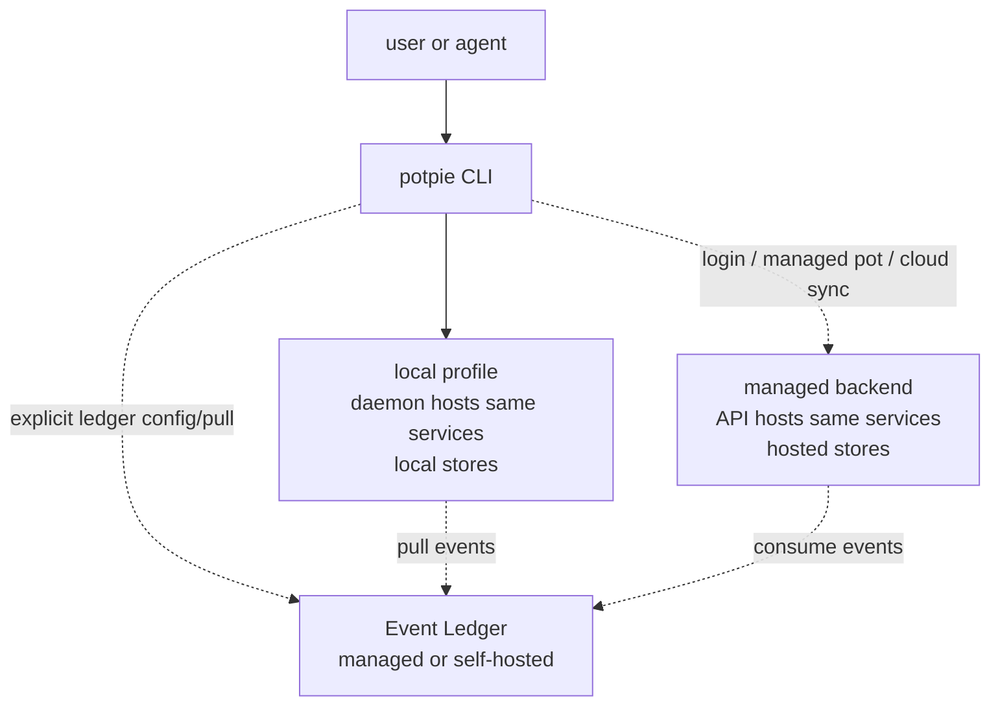
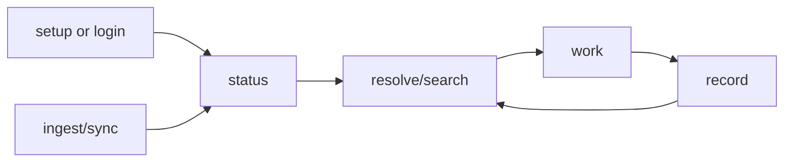

# Potpie CLI Flow And Command Contract

Last reviewed: 2026-05-29.

This is the target product contract for the `potpie` CLI. The same command
language should work across local OSS and managed backends. The active pot
decides where the CLI routes the request: local pots route to the local daemon,
and managed pots route to the authenticated managed backend.



The CLI is the user/agent command surface for setup, login, pots, sources,
ingestion, graph reads/writes, graph/backend admin, skills, and explicit cloud
sync. For setup, the CLI owns flags, validation, output, and daemon bootstrap;
the daemon-hosted `SetupOrchestrator` owns local dependency setup. Commands route
by the active or selected pot. Selecting a managed pot after `potpie login` is
the explicit remote boundary. Explicit ledger commands may call a managed or
self-hosted Event Ledger without changing where graph state is stored.

## Journey



Local first run:

```bash
pip install potpie
potpie setup --repo . --agent claude --scan
potpie status
```

Managed backend use is explicit:

```bash
potpie login
potpie pot list --managed
potpie use <managed-pot-name> --managed
potpie status
```

Managed ledger use from a local graph is also explicit:

```bash
potpie login
potpie ledger use managed
potpie ledger pull --apply
```

## Profiles

| Profile | Routes to | Storage | Lifecycle behavior |
|---|---|---|---|
| Local | Local daemon hosting Pot Management, Graph Service, and Skill Manager | Local state DB, embedded GraphBackend, local skill cache | `potpie setup` installs/starts daemon; the daemon provisions dependencies, creates active `default` pot, registers repo, optionally scans and installs skills. |
| Managed | Managed backend API hosting the same services | Hosted operational DB, hosted graph/search, hosted skill/catalog stores | `potpie login` authenticates to `cloud.backend_url`; managed pots become available through the same pot commands. Cloud push/pull/sync remain explicit. |

Commands default to the active pot. Before login, that is normally the local
`default` pot. After login, `potpie use <name>` may select either a local or
managed pot. `--local` and `--managed` filter lists and disambiguate names;
`--pot <id-or-name>` scopes commands without changing the active pot.

Managed backend URL is configuration, not a graph backend profile:

```bash
potpie config get cloud.backend_url
potpie config set cloud.backend_url https://potpie.example.com
potpie login [--backend-url <url>]
```

An Event Ledger binding is separate from the active pot and backend:

| Ledger binding | Routes to | Effect |
|---|---|---|
| Managed | Potpie managed Event Ledger | Pulls GitHub/Linear/etc. events into the selected local or managed graph. |
| Self-hosted | Configured ledger URL | Uses the same pull/replay-token contract against a user-run ledger. |

Using a managed ledger does not imply `cloud push`, `cloud pull`, or managed
graph storage. It only gives the selected graph a source-event feed.

## Local Setup Contract

`potpie setup` is idempotent. On first local run, the CLI installs/starts the
daemon service, then asks the daemon to run setup. Service-manager registration
and detached daemon start are hard only for the normal local daemon profile; they
are skipped for in-process/dev profiles and are not part of `potpie login`. The
daemon-hosted setup flow:

1. creates local config/data directories;
2. initializes local auth;
3. provisions the selected local GraphBackend and related stores;
4. runs migrations;
5. creates a local `default` pot and marks it active;
6. registers the repo source;
7. optionally scans;
8. optionally installs skills for the requested agent harness.

`--pot <name>` only overrides the initial pot name. If an active pot already
exists, setup reuses it unless `--pot` names another pot to create/use.

The CLI command builds a setup plan from flags, ensures the daemon is available
when the selected host mode needs it, and renders the report. The daemon-hosted
application `SetupOrchestrator` owns the ordered lifecycle calls that make the
plan real. `potpie setup --dry-run` returns a `SetupPreview` with planned actions,
owners, hard/soft classification, and skip reasons; it does not execute setup and
does not return executed `StepResult`s.

## Command Groups

All commands support human output by default and `--json` for scripts/agents.

The host-routed CLI lives at `adapters/inbound/cli/host_cli.py` (assembles the
groups) + `adapters/inbound/cli/commands/`. Every command routes
`CLI -> HostShell -> service(s) -> ports`; `commands/_common.py` owns the
`--json`/exit-code/error contract and active-pot resolution. Code slots per
group:

| Group | Code slot | Routes to |
|---|---|---|
| `setup` `status` `doctor` `config` `login` `logout` `whoami` | `commands/bootstrap.py` | `HostShell`; setup bootstraps daemon then routes to `SetupOrchestrator`; login routes to managed auth |
| `resolve` `search` `record` | `commands/query.py` | `HostShell.agent_context` (`AgentContextPort`) |
| `pot` `source` | `commands/pots.py` | `HostShell.pots` (`PotManagementService`) |
| `daemon` | `commands/daemon.py` | `HostShell.daemon` (`Daemon`) |
| `ingest` | `commands/ingest.py` | scanner use cases _(not yet wired — returns not-implemented)_ |
| `ledger` | `commands/ledger.py` | `HostShell.ledger` (`LedgerFacade`) |
| `graph` `backend` | `commands/graph.py` | `HostShell.graph` + `HostShell.backend` (`GraphBackend`) |
| `skills` | `commands/skills.py` | `HostShell.skills` (`SkillManager`) |
| `cloud` | `commands/cloud.py` | explicit snapshot sync and managed skill sync |

`adapters/inbound/cli/host_cli.py` is the `potpie` console entrypoint (see
`[project.scripts]`). The MCP server (`adapters/inbound/mcp/server.py`) binds to
the same in-process `HostShell`. The async ingestion pipeline behind the HTTP
API keeps its own composition root (`bootstrap/ingestion_server.py`) until it is
migrated onto `HostShell`.

### Bootstrap And Profile

```bash
potpie setup [--repo .] [--pot <name>] [--agent claude] [--scan] [--yes] [--dry-run]
potpie login [--backend-url <url>] [--org <id>]
potpie logout
potpie whoami
potpie status [--intent feature] [--harness claude] [--json]
potpie doctor
potpie config get <key>
potpie config set <key> <value>
```

`status` is the cheap aggregate grouped by owner: host liveness, Pot Management
control plane, Graph Service data plane, GraphBackend capabilities/projections,
Event Ledger binding and consumer backlog, Skill Manager drift, login state when
relevant, and next action.

`doctor` is local-profile diagnostics: paths, logs, auth/socket state,
migrations, scanner registry, and skill drift.

### Local Daemon Admin

```bash
potpie daemon status [--json]
potpie daemon logs [--follow]
potpie daemon restart
potpie daemon stop
```

Daemon commands are local recovery tools, not onboarding steps.

### Pots And Sources

```bash
potpie pot list
potpie pot list [--local] [--managed] [--all]
potpie pot info [--json]
potpie pot create <name> [--repo .] [--use]
potpie pot use <name-or-id>
potpie use <name-or-id> [--local | --managed]
potpie pot rename <name-or-id> <new-name>
potpie pot reset [--confirm]
potpie pot archive <name-or-id>

potpie source add repo <path> [--name platform]
potpie source list [--json]
potpie source status [--json]
potpie source remove <source-id>
```

Local setup creates and uses `default`. `pot create` is for additional workspace
boundaries. After login, managed pots appear in the same list/use surface. If a
local pot and managed pot share a name, `potpie use` must be disambiguated with
`--local`, `--managed`, or a qualified id. Source commands route to the active
pot's Pot Management service.

### Ingestion And Sync

```bash
potpie ingest scan [--source <id>] [--changed] [--watch]
potpie ingest status [--json]
potpie ingest runs
potpie ingest show <run-id> [--json]
potpie ingest replay <run-id>
potpie ingest retry <run-id> [--failed] [--timed-out]
potpie ingest dead-letter list [--json]
potpie ingest dead-letter retry <event-id>

potpie cloud push [--pot <name>]
potpie cloud pull [--pot <name>]
```

Registering a source records metadata. Ingestion writes claims through scanner
use cases, ledger event-processing runs, and the Graph Service. Cloud push/pull
moves a pot snapshot between local and managed backends; it must remain explicit.

Good first scanners: CODEOWNERS, dependency manifests, Kubernetes/Helm, OpenAPI,
CI workflow files, service manifests, ADR indexes, and runbook indexes.

### Event Ledger

```bash
potpie ledger status [--json]
potpie ledger use managed [--org <id>]
potpie ledger use self-hosted <url>
potpie ledger sources list [--json]
potpie ledger query [--source <id>] [--type <kind>] [--since <time>] [--until <time>] [--limit <n>] [--json]
potpie ledger pull [--source <id>] [--filter <expr>] [--apply] [--json]
potpie ledger disconnect
```

The Event Ledger is a managed or self-hostable source-event service. It owns
source-provider credentials, webhook receivers, normalized event history, and
provider-side ingestion cursors. It also exposes query/filter over the event
history and returns ordered pages with opaque replay tokens.

`ledger query` inspects ledger history without touching graph consumer state.
`ledger pull` fetches a page using the selected graph consumer cursor and any
filters. With `--apply`, the CLI/host first writes the pulled events into the
selected graph's consumer ingestion ledger, then advances that graph's consumer
cursor after durable enqueue. Processing, retries, timeouts, and dead-letter
state are owned by the graph consumer's ingestion ledger. Without `--apply`, the
command is a preview/dry-run and does not enqueue events or advance the graph
consumer cursor.

### Query And Memory

```bash
potpie resolve "<task>" [--intent feature] [--include infra_topology,prior_bugs] [--json]
potpie search "<lookup>" [--include prior_bugs] [--json]
potpie record --type fix --summary "..." [--details details.json] [--source-ref ...]
potpie record --type preference --summary "..." [--scope service:inventory-svc]
```

| CLI command | Service path |
|---|---|
| `potpie resolve` | `context_resolve` -> Graph Service -> readers -> `AgentEnvelope` |
| `potpie search` | `context_search` -> same envelope path |
| `potpie record` | `context_record` -> record emitter -> graph mutation |
| `potpie status` | `context_status` + Pot Management + Skill Manager nudge |

These commands are shared across local and managed pots. The active or selected
pot decides whether they route to the local daemon or managed backend API.

### Graph And Backend

```bash
potpie graph status [--json]
potpie graph inspect <entity-key> [--depth 2] [--json]
potpie graph export <file>
potpie graph import <file> [--pot <name>]
potpie graph repair [--semantic-index] [--all]

potpie backend list
potpie backend status [--json]
potpie backend use embedded
potpie backend doctor
```

Graph/backend commands call services and capability ports. CLI code must not
query SQLite, Neo4j, vector indexes, hosted stores, or state tables directly.

### Skills

```bash
potpie skills list
potpie skills install [<id>] --agent claude [--scope global|project] [--path .]
potpie skills update [--all] [--agent claude] [--scope global|project] [--path .]
potpie skills remove <id> --agent claude [--scope global|project] [--path .]
potpie skills status --agent claude [--scope global|project] [--path .] [--json]
potpie skills add <path-or-url>
potpie cloud skills sync [--agent <id>]
```

Skills are CLI-managed recipes. Agents only see an advisory `skills` block in
`context_status` with missing/outdated skills and an exact install command.
Cloud skill sync is explicit.

Skill install defaults to `--scope global`, writing to the harness's user-level
skills directory:

| Harness | Global path |
| --- | --- |
| Cursor | `~/.cursor/skills/<skill>/SKILL.md` |
| Claude Code | `~/.claude/skills/<skill>/SKILL.md` |
| OpenCode | `~/.config/opencode/skills/<skill>/SKILL.md` |
| Codex | `$HOME/.agents/skills/<skill>/SKILL.md` |

Use `--scope project --path .` when a repo-local install should be committed or
shared with the repository.

## Output Contract

- Human output: action-oriented summary and next command.
- `--json`: stable fields for agents/scripts; additive changes are OK.
- `setup --dry-run`: returns a preview document with planned steps; no mutation,
  daemon dependency setup, scan, or skill install occurs.
- Mutations should be idempotent when possible.
- Destructive commands require `--confirm` or interactive confirmation.
- Exit codes:
  - `0`: success
  - `1`: command or validation failure
  - `2`: daemon/API/dependency unavailable
  - `3`: partial/degraded result
  - `4`: auth/permission failure
- JSON errors include `code`, `message`, `detail`, and
  `recommended_next_action`.

## First Use Cases

- New repo onboarding: setup, scan, ask how services fit together.
- Feature work: resolve preferences, topology, owners, and decisions.
- Debugging: resolve prior bugs, recent timeline, dependencies, and runbooks.
- Review prep: search recent decisions and project conventions for a PR.
- Incident memory: record root cause, fix, verification, and follow-up.
- Managed work: log in to a managed backend, list managed pots, `potpie use` a
  managed pot, then run the same resolve/search/record/status commands.
- Managed migration: push a local pot to cloud, or pull a hosted pot for local
  work.
- Integration-backed local graph: log in to managed Potpie, bind the managed
  ledger, pull GitHub/Linear events, and apply them through local ingestion into
  the local graph.
- Offline work: query and record against the embedded backend without cloud auth.

## Build Order

1. Local setup + daemon lifecycle + health/logs.
2. Local Pot Management with active `default` pot and source registry.
3. Embedded GraphBackend and conformance suite.
4. Shared `resolve/search/status/record` through daemon services.
5. Scanner ingestion and run history.
6. `graph`, `backend`, and `skills` commands.
7. `potpie login` against configurable `cloud.backend_url`, unified
   local/managed pot listing and `potpie use`, and explicit cloud push/pull/skills
   sync.
8. Event Ledger binding, consumer cursor storage, status, and pull/apply commands
   that route applied events through ingestion.
9. Managed profile routing for shared command groups.
