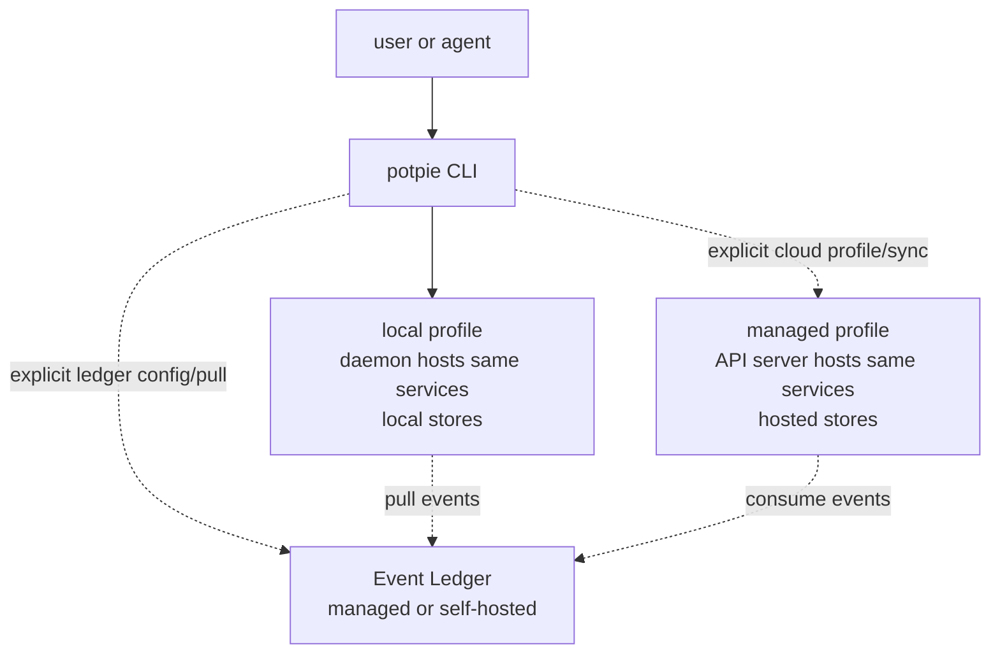
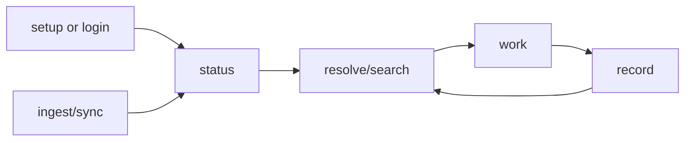

# Potpie CLI Flow And Command Contract

Last reviewed: 2026-05-29.

This is the target product contract for the `potpie` CLI. The same command
language should work across local OSS and managed graph profiles; the difference
is where the CLI routes the request and which storage profile backs the shared
services.



The CLI owns setup, profiles, pots, sources, ingestion, graph reads/writes,
graph/backend admin, skills, and explicit cloud sync. Local commands must not
silently call managed APIs. Explicit ledger commands may call a managed or
self-hosted Event Ledger without changing where graph state is stored.

## Journey



Local first run:

```bash
pip install potpie
potpie setup --repo . --agent claude --scan
potpie status
```

Managed graph use is explicit:

```bash
potpie cloud login
potpie cloud status
potpie cloud push
potpie cloud pull
```

Managed ledger use from a local graph is also explicit:

```bash
potpie cloud login
potpie ledger use managed
potpie ledger pull --apply
```

## Profiles

| Profile | Routes to | Storage | Setup behavior |
|---|---|---|---|
| Local | Local daemon hosting Pot Management, Graph Service, and Skill Manager | Local state DB, embedded GraphBackend, local skill cache | `potpie setup` installs/starts daemon, creates active `default` pot, registers repo, optionally scans and installs skills. |
| Managed | Managed API server hosting the same services | Hosted operational DB, hosted graph/search, hosted skill/catalog stores | `potpie cloud login` establishes auth; cloud push/pull/sync are explicit. |

Commands default to the local profile unless the user selects a cloud command or
an explicit cloud profile. `--pot <id-or-name>` scopes commands in either
profile; omitting it uses the active pot for that profile.

An Event Ledger binding is separate from the graph profile:

| Ledger binding | Routes to | Effect |
|---|---|---|
| Managed | Potpie managed Event Ledger | Pulls GitHub/Linear/etc. events into the selected local or managed graph. |
| Self-hosted | Configured ledger URL | Uses the same pull/cursor contract against a user-run ledger. |

Using a managed ledger does not imply `cloud push`, `cloud pull`, or managed
graph storage. It only gives the selected graph a source-event feed.

## Local Setup Contract

`potpie setup` is idempotent. On first local run it:

1. creates local config/data directories;
2. initializes local auth;
3. installs and starts the daemon when needed;
4. runs migrations;
5. creates a local `default` pot and marks it active;
6. registers the repo source;
7. optionally scans;
8. optionally installs skills for the requested agent harness.

`--pot <name>` only overrides the initial pot name. If an active pot already
exists, setup reuses it unless `--pot` names another pot to create/use.

## Command Groups

All commands support human output by default and `--json` for scripts/agents.

### Bootstrap And Profile

```bash
potpie setup [--repo .] [--pot <name>] [--agent claude] [--scan] [--yes]
potpie status [--intent feature] [--harness claude] [--json]
potpie doctor
potpie config get <key>
potpie config set <key> <value>

potpie cloud login
potpie cloud status
```

`status` is the cheap aggregate: profile, daemon/API health, active pot, source
freshness, backend readiness, semantic index readiness, installed skills, and
next action.

`doctor` is local-profile diagnostics: paths, logs, auth/socket state,
migrations, scanner registry, and skill drift.

### Local Daemon Admin

```bash
potpie daemon status [--json]
potpie daemon logs [--follow]
potpie daemon restart
potpie daemon stop
```

Daemon commands are local recovery tools, not onboarding steps.

### Pots And Sources

```bash
potpie pot list
potpie pot info [--json]
potpie pot create <name> [--repo .] [--use]
potpie pot use <name-or-id>
potpie pot rename <name-or-id> <new-name>
potpie pot reset [--confirm]
potpie pot archive <name-or-id>

potpie source add repo <path> [--name platform]
potpie source list [--json]
potpie source status [--json]
potpie source remove <source-id>
```

Local setup creates and uses `default`. `pot create` is for additional workspace
boundaries. In managed mode, pot and source commands should map to hosted Pot
Management APIs under the selected cloud profile.

### Ingestion And Sync

```bash
potpie ingest scan [--source <id>] [--changed] [--watch]
potpie ingest status [--json]
potpie ingest runs
potpie ingest show <run-id> [--json]
potpie ingest replay <run-id>

potpie cloud push [--pot <name>]
potpie cloud pull [--pot <name>]
```

Registering a source records metadata. Ingestion writes claims through scanner
use cases and the Graph Service. Cloud push/pull moves a pot snapshot between
local and managed graph profiles; it must remain explicit.

Good first scanners: CODEOWNERS, dependency manifests, Kubernetes/Helm, OpenAPI,
CI workflow files, service manifests, ADR indexes, and runbook indexes.

### Event Ledger

```bash
potpie ledger status [--json]
potpie ledger use managed [--org <id>]
potpie ledger use self-hosted <url>
potpie ledger sources list [--json]
potpie ledger pull [--source <id>] [--apply] [--json]
potpie ledger disconnect
```

The Event Ledger is a managed or self-hostable source-event service. It owns
source-provider credentials, webhook receivers, normalized event history, and
cursors. `ledger pull --apply` fetches event batches and reconciles them into
the active graph through the Graph Service. Without `--apply`, the command can
be used as a preview/dry-run.

### Query And Memory

```bash
potpie resolve "<task>" [--intent feature] [--include infra_topology,prior_bugs] [--json]
potpie search "<lookup>" [--include prior_bugs] [--json]
potpie record --type fix --summary "..." [--details details.json] [--source-ref ...]
potpie record --type preference --summary "..." [--scope service:inventory-svc]
```

| CLI command | Service path |
|---|---|
| `potpie resolve` | `context_resolve` -> Graph Service -> readers -> `AgentEnvelope` |
| `potpie search` | `context_search` -> same envelope path |
| `potpie record` | `context_record` -> record emitter -> graph mutation |
| `potpie status` | `context_status` + Pot Management + Skill Manager nudge |

These commands are shared across local and managed profiles. The profile decides
whether they route to the local daemon or hosted API.

### Graph And Backend

```bash
potpie graph status [--json]
potpie graph inspect <entity-key> [--depth 2] [--json]
potpie graph export <file>
potpie graph import <file> [--pot <name>]
potpie graph repair [--semantic-index] [--all]

potpie backend list
potpie backend status [--json]
potpie backend use embedded
potpie backend doctor
```

Graph/backend commands call services and capability ports. CLI code must not
query SQLite, Neo4j, vector indexes, hosted stores, or state tables directly.

### Skills

```bash
potpie skills list
potpie skills install [<id>] --agent claude [--path .]
potpie skills update [--all] [--agent claude]
potpie skills remove <id> --agent claude
potpie skills status --agent claude [--json]
potpie skills add <path-or-url>
potpie cloud skills sync [--agent <id>]
```

Skills are CLI-managed recipes. Agents only see an advisory `skills` block in
`context_status` with missing/outdated skills and an exact install command.
Cloud skill sync is explicit.

## Output Contract

- Human output: action-oriented summary and next command.
- `--json`: stable fields for agents/scripts; additive changes are OK.
- Mutations should be idempotent when possible.
- Destructive commands require `--confirm` or interactive confirmation.
- Exit codes:
  - `0`: success
  - `1`: command or validation failure
  - `2`: daemon/API/dependency unavailable
  - `3`: partial/degraded result
  - `4`: auth/permission failure
- JSON errors include `code`, `message`, `detail`, and
  `recommended_next_action`.

## First Use Cases

- New repo onboarding: setup, scan, ask how services fit together.
- Feature work: resolve preferences, topology, owners, and decisions.
- Debugging: resolve prior bugs, recent timeline, dependencies, and runbooks.
- Review prep: search recent decisions and project conventions for a PR.
- Incident memory: record root cause, fix, verification, and follow-up.
- Managed migration: push a local pot to cloud, or pull a hosted pot for local
  work.
- Integration-backed local graph: log in to managed Potpie, bind the managed
  ledger, and pull GitHub/Linear events into the local graph.
- Offline work: query and record against the embedded backend without cloud auth.

## Build Order

1. Local setup + daemon lifecycle + health/logs.
2. Local Pot Management with active `default` pot and source registry.
3. Embedded GraphBackend and conformance suite.
4. Shared `resolve/search/status/record` through daemon services.
5. Scanner ingestion and run history.
6. `graph`, `backend`, and `skills` commands.
7. Explicit `cloud login/status/push/pull/skills sync`.
8. Event Ledger binding, cursor storage, status, and pull/reconcile commands.
9. Managed profile routing for shared command groups.
