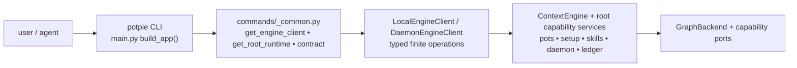
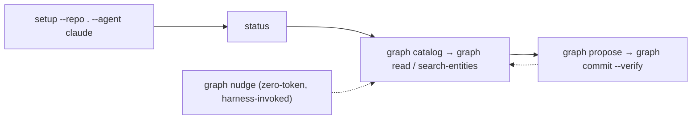

## Overview

> Status: reflects the canonical Context Runtime boundary, last reviewed 2026-08-21.

This is the **command reference** for the `potpie` CLI — the full, grouped surface
with flags, the shared plumbing every command goes through, and the canonical
journey. It is the one doc that may restate flags in full; conceptual depth lives
in the sibling docs linked under each group and in [See also](#see-also).

This file lives at repo-root `docs/context-graph/cli-flow.md`. Product CLI,
runtime, daemon, and root capability code lives under repo-root `potpie/`; engine
domain code lives under `potpie/context-engine/`.

## One CLI for humans and agents

There is no separate human-vs-agent API. Both people and coding harnesses drive
the same `potpie` CLI.
`potpie/cli/main.py build_app()` is the single console entrypoint
(`[project.scripts]`): one Typer root whose `@app.callback` exposes three global
options, with the rest of the surface assembled from top-level registrars and
`add_typer` sub-apps. Engine operations route through an `EngineClient`; root
capability commands use finite root-owned services.


```mermaid
flowchart LR
  cf_user["user / agent"]
  cf_cli["potpie CLI<br/>main.py build_app()"]
  cf_common["commands/_common.py<br/>get_engine_client • get_root_runtime • contract"]
  cf_shell["LocalEngineClient / DaemonEngineClient<br/>typed finite operations"]
  cf_svc["ContextEngine + root capability services<br/>pots • setup • skills • daemon • ledger"]
  cf_ports["GraphBackend + capability ports"]

  cf_user --> cf_cli --> cf_common --> cf_shell --> cf_svc --> cf_ports
```

### Global options (root `@app.callback`)

| Option | Effect |
|---|---|
| `--json` | machine-readable output for scripts/agents (stable, additive fields) |
| `--verbose` / `-v` | verbose diagnostics |
| `--version` | print `potpie <version> (<short rev>[, dirty])`, the engine version and the interpreter, then exit; with `--json`: `{name, version, build: {rev, dirty, built_at}, engine: {name, version}, python, executable}` |

## Shared plumbing (`commands/_common.py`)

Every command is wrapped by the same three helpers, so the contract below holds
uniformly across the surface.

- **`get_engine_client()`** — returns `DaemonEngineClient` by default after
  canonical discovery and an authenticated handshake. With
  `CONTEXT_ENGINE_HOST_MODE=in_process`, it returns `LocalEngineClient` over the
  same typed operation handlers and Resource Manager.
- **`get_root_runtime()` and finite service accessors** — provide Potpie-owned
  setup, auth, configuration, pot/source, skills, ledger, and lifecycle services
  without adding them to `ContextEngine`.
- **`contract()`** — the error boundary that maps outcomes to exit codes and emits
  structured JSON errors (`code`, `message`, `detail`, `recommended_next_action`):

  | Exit | Meaning |
  |---|---|
  | `0` | success |
  | `1` | command / validation failure |
  | `2` | daemon / API / dependency unavailable (incl. `CapabilityNotImplemented`, `ContextEngineDisabled`) |
  | `3` | partial / degraded result |
  | `4` | auth / permission failure |

- **`resolve_pot_id(...)`** — pot-scope resolver, precedence:
  explicit `--pot` **>** repo-default binding **>** registered-repo match (active
  pot wins ties, else `ambiguous_pot`) **>** active pot, else `no_active_pot`.
  `source add` passes `infer_from_repo=False` (registration never infers a pot).
  Archived pots never answer: an explicit ref that names only an archived pot
  fails with `pot_archived`, and a repo default pointing at one reads as unset.
  The registered-repo match reads the pot service's repo→pot index
  (`list_repo_sources`) in one call and matches the working tree client-side;
  the typed engine's repository selector uses the same index.

`emit()`/`fail()` render the human and `--json` shapes. All commands support
human output by default and `--json` for scripts/agents.

## Command groups & code slots

Surface assembled via top-level registrars (`query`, `bootstrap`, `auth`, `ui`)
and `add_typer` sub-apps. Note the corrections vs older docs: there is **no
`commands/backend.py`** — the `backend` and `timeline` apps are defined in
`commands/graph.py`; and there is **no `graph admin`** command group.

| Group / commands | Code slot | Routes to |
|---|---|---|
| `resolve` `search` `record` `status` | `commands/query.py` | `EngineClient` typed operations |
| `setup` `doctor` `whoami` `use` `config` | `commands/bootstrap.py` | finite root services plus `EngineClient` readiness where needed |
| `login` `logout` + provider groups (`github`/`git`/`linear`/`jira`/`confluence`/`auth`) | `commands/auth.py` | root-owned Firebase/API-key auth + integration read clients |
| `ui` | `commands/ui.py` | ensures daemon, opens read-only graph explorer |
| `pot` `source` | `commands/pots.py` | root `PotResourceService` |
| `daemon` | `commands/daemon.py` | root lifecycle service and `DaemonController` |
| `ledger` | `commands/ledger.py` | root `LedgerService` (clients are stubs — roadmap) |
| `graph` (+ nested `inbox`, `quality`, `bulk`) | `commands/graph.py` | finite `EngineClient` operations; root backend administration where required |
| `graph` commit history (`journal-status`, `commits`, `commit-show`, `revert`, `rollback`, `apply-preview`, …) | `commands/graph_commits.py` | finite `EngineClient` commit operations |
| `timeline` | `commands/graph.py` | typed graph read operation |
| `backend` | `commands/graph.py` | root backend administration service |
| `skills` | `commands/skills.py` | root `SkillManager` |
| `resource` (+ nested `index`) | `commands/resource.py` | finite `EngineClient` resource operations |
| `cloud` | `commands/cloud.py` | managed sync — **all raise `CapabilityNotImplemented`** (roadmap) |

The async ingestion pipeline behind the HTTP API keeps a **separate**
composition root (`bootstrap/ingestion_server.py`, default backend `neo4j`) — see
[architecture.md](./architecture.md) and [ingestion-nudge.md](./ingestion-nudge.md).

---

## Top-level commands

The V1 agent wrappers (`resolve`/`search`/`record`) and `status` ride the same
graph internals as the workbench; they are not a "legacy V1 surface waiting on V2."

```bash
potpie resolve <task> [--intent <name>] [--include <csv>] [--mode fast|balanced|verify|deep] [--limit 12] [--pot <ref>]
potpie search  <query> [--intent <name>] [--include <csv>] [--limit 12] [--pot <ref>]
potpie record  --type <kind> --summary <text> [--detail <k=v> ...] [--scope <k:v>] [--pot <ref>]
potpie status  [--intent <name>] [--harness claude] [--pot <ref>]

potpie setup   [--repo .] [--pot default] [--agent claude] [--backend <profile>] \
               [--embeddings auto|sentence-transformers|local|none] [--embedding-model <name>] \
               [--dry-run] [--yes/-y] [--daemon | --in-process]
potpie doctor
potpie whoami
potpie use     <ref> [--local | --managed]
potpie config  get <key>
potpie config  set <key> <value>
potpie config  unset <key>
potpie login   [--api-key/-k <key>] [--url/-u <url>]
potpie logout
potpie ui      [--open/--no-open] [--pot <ref>]
```

- **`resolve` / `search` / `record`** → the corresponding typed `EngineClient`
  operations.
  Read `--limit` caps the final ranked envelope across all searched families;
  metadata reports returned and omitted counts per family. Readers still use
  the same limit as their candidate budget, so no exact global count is implied.
  Agent evidence has a 32 KiB serialized response budget; omitted item and field
  counts explain trimming. Narrow the family or follow a returned entity or
  resource ID to fetch the relevant detail.
  `--include` replaces the intent's default families; `--mode` rides in metadata
  only — it does not change the read path in V1.5 ([querying.md](./querying.md)).
  `--mode`, `--include` and `--intent` are checked against their closed
  vocabularies: an unrecognised value is refused rather than normalised, because
  normalising it changes the depth of the read or which reader families answer,
  silently.
  `record --type` accepts the structured record types (preference/policy/bug_pattern/
  fix/verification/decision) plus a closed set of free-form note types (`--type`
  help lists them); it goes through semantic validation and
  the record→semantic bridge ([writing.md](./writing.md)). Those schemas validate
  fields that `--summary` cannot carry — `decision` needs `rationale`, `preference`
  needs `policy_kind` — so `--detail <key>=<value>` supplies them; repeat the flag,
  and repeat a key to build a list field (`alternatives_rejected`, `affects_refs`).
  A record the graph service **refuses** exits `1` and reports `accepted: false`
  with the store's reason in `detail`.
- **`status`** — context data-plane readiness combined with root runtime state: daemon, backend,
  pot, quality, and skill state. `--host` is a deprecated no-op (readiness is the default).
  `--verify` is rejected here — it moved to `potpie auth status --verify`, the
  explicit integration-auth report.
- **`setup`** — idempotent first-run that builds a `SetupPlan`
  (config/storage/daemon/active `default` pot/source registration/skills). `--backend`
  picks the GraphBackend profile (default `falkordb_lite`) and refuses an unknown
  profile with `validation_error`; `--embeddings` picks the local embedder (default
  `auto`: sentence-transformers when the `embeddings` extra is installed, otherwise
  the bundled hashing embedder) and `--embedding-model` the model setup prepares;
  `--daemon`/`--in-process` selects host mode
  (daemon mode calls the root lifecycle service first); `--dry-run` returns a preview
  without executing. `--pot` only overrides the initial pot name.
  Setup never scans the working tree: repository knowledge is written by
  harness-led ingestion (`potpie graph propose`/`commit`, the
  `potpie-repo-baseline` skill). `--scan` is still accepted, but no step reads it.
- **`doctor`** — local diagnostics composed from `backend.capabilities()` +
  `backend.mutation.readiness()` + `daemon.status()` + `ledger.status()` + the
  resource store and retrieval index status (`resources`, `resource_index`); also
  reports `effective_current_repo_pot` and `repo_default_pot` (the repo→pot
  routing resolution for the current directory).
- **`config get|set|unset`** — reads and writes `<home>/config.json`. `set`
  accepts only the known keys (`config --help` and `config list` name them) and
  checks the value of a key that takes a closed set: `resource_index` takes an
  index profile, `graph.protocols` takes `on` or `off`. `unset` accepts any key,
  so a value stored before the catalog was enforced can still be removed.
  `graph.protocols` switches on the optional protocol ontology
  ([ontology.md](./ontology.md), *Optional protocol extension*). It is **off
  by default**: an absent, blank or unrecognised value reads as off. The local
  runtime reads it once, when it composes, so `config set`/`unset` of that key
  reports `restart_required: true` and a running daemon keeps its old setting
  until `potpie daemon restart`. Turning it off hides the protocol types and view
  and keeps the data. There is no environment switch for it.
- **`whoami`** — local OSS reports a `none` identity.
- **`use <ref>`** — alias for `pot use`. `--managed` raises `CapabilityNotImplemented`
  (see Roadmap below).
- **`login` / `logout`** — root-owned Firebase browser session or API-key store.
  Flags are `--api-key/-k` and `--url/-u`.
- **`ui`** — ensures the daemon, discovers its `base_url`, opens `<base>/ui`, the
  read-only graph explorer.

> **Roadmap (not yet wired):** `use --managed` raises `CapabilityNotImplemented`.
> Managed-backend routing is designed and wired-for but not functional today.

### Provider auth groups (root, `commands/auth.py`)

These manage credentials for the agent's own integration reads (jira/linear are a
CLI + agent flow, **not** Potpie connectors — see [ingestion-nudge.md](./ingestion-nudge.md)).

```bash
potpie github  login | logout | repos
potpie linear  login | logout | ls | select
potpie jira     login | logout | ls | select
potpie confluence login | logout | ls | select
potpie auth     status [--verify] | logout # integration auth report + logout
```

`git` is a hidden alias group. `auth status [--verify]` is the explicit local
integration-auth report (`--verify` runs a lightweight API check); the rest of
the `auth` group is deprecated (logout + hidden `revoke` + provider mirrors).

---

## Pots & sources (`commands/pots.py` → `host.pots`)

A Pot is the unit of tenancy/isolation; the pot id **is** the storage `group_id`.
Local setup creates and activates a `default` pot.

```bash
potpie pot list [--local | --managed | --all] [--archived]
potpie pot info
potpie pot create <name> [--repo .] [--use] [--no-default]
potpie pot use    <ref> [--also-default-for-current-repo]
potpie pot rename <ref> <new-name>
potpie pot reset  [<ref>] [--confirm]
potpie pot archive <ref> [--confirm]

potpie pot linked  [--repo .] [--summary]
potpie pot default show | set | clear [--repo .]

potpie source add    <kind> <location> [--name <n>] [--pot <ref>] [--default/--no-default]
                     # kind: repo | linear | jira | confluence | notion | url
potpie source list   [--pot <ref>]
potpie source status [<id>] [--pot <ref>]
potpie source remove <id> [--pot <ref>]
```

- **`pot reset`** is the destructive per-pot wipe — note there is **no
  `graph reset`** command. The CLI resolves the exact pot once, binds
  confirmation to that context, and dispatches `ResetContextRequest` through
  the selected daemon or in-process Context Engine. Pot metadata services do
  not open or reset graph backends. Once the graph reset succeeds, the pot's
  stored documents are purged too, and `resources_purged` reports the resource
  store's answer (`null` when no store is composed); see
  [resources.md](./resources.md).
- **`pot archive`** clears the pot's graph state with the same confirmed
  `ResetContextRequest` as `pot reset`, then retires the pot. The reset comes
  first, so a failed reset leaves the pot live rather than hiding data nothing
  can clear. It is idempotent: on an already-archived pot it clears the graph
  state again, leaves the pot archived, and reports `already_archived: true`
  (still behind `--confirm`). A live pot wins a name it shares with archived
  pots; an archived pot is always reachable by its id, and a name shared by
  several archived pots is refused as `ambiguous_pot`.
- **`archived` is a terminal lifecycle state, enforced.** Archived pots are
  hidden from `pot list` (a footer names the count; `--archived` shows them
  marked `~`, and every JSON row carries `archived`), and `pot use` / `rename` /
  `reset` / `default set`, `source add` and any `--pot` refuse them with
  `pot_archived` (exit `1`). Their repo sources drop out of repo→pot matching,
  the explorer UI neither lists nor selects them, and
  `pot create <archived-name>` starts a fresh pot. At the typed engine
  boundary a name never selects an archived pot, and an archived pot's id is
  authorized for `reset_context` only.
- **One name, one pot.** Pot names are unique among live pots and may not
  equal any pot id (refs resolve against both): `rename` refuses either
  collision, and `create` refuses an id-shaped name, with `pot_name_conflict`.
  A blank name is a `validation_error`. `create` stays idempotent (reusing a
  live pot by name is what makes `setup` re-runnable) and reports
  `created: false` when it reused one.
- **`pot linked` / `pot default`** manage the repo→pot binding consumed by
  `resolve_pot_id`. `pot linked --summary` skips per-pot graph counts for a faster
  repo-routing summary. `pot create --repo <r>` registers the repo and makes the
  new pot its default (`--no-default` opts out), and
  `pot use --also-default-for-current-repo` sets the current repo's default in
  the same step (otherwise the CLI warns when the repo default and the selected
  pot diverge).
- **`source status`** with no ID prints a per-pot summary of all sources; with an
  ID it reports that single source.
- **`source add <kind> <location>`** is registration only (no scan/ingest);
  registering a repo also sets the repo default. Repo-baseline ingestion is
  harness-led via skills ([skills.md](./skills.md)), not a scanner. `kind` is a
  closed set (`cli/source_kinds.py`), because a kind with no handler used to
  exit 0 and write a row nothing reads: git hosts (`github`/`gitlab`/`gitbucket`)
  canonicalize to `repo` — the kind repo-default matching and `source status`
  key on — and the canonicalization is reported as `requested_kind`; document
  kinds (`pdf`/`spreadsheet`/`markdown`/…) exit 1 with
  `source_kind_is_a_document` pointing at `resource import`
  ([resources.md](./resources.md)); anything else exits 1 with
  `unknown_source_kind`. `--default` is repo-only: passing it with another kind
  fails with `repo_default_not_applicable`.
- **`source remove`** drops the registration only — it does not purge documents or
  graph claims (a source row is not a key into the resource store).

---

## Daemon (local infra)

```bash
potpie daemon start | status | logs [--tail N] [--since 15m|ISO-8601] [--follow] | restart | stop
```

- **`daemon`** (`commands/daemon.py` → `host.daemon`) — local recovery tooling, not
  onboarding steps. `DaemonStartError` → exit 2.
- **`daemon status`** names the build the running daemon serves (`version`,
  `build: {rev, dirty, built_at}`) and sets `stale` when that rev differs from this
  CLI's (`null` when either side has no rev). A daemon outlives the install that
  started it, so after an upgrade `stale: true` means `potpie daemon restart`.
  A daemon from before build reporting has neither key.
  It exits `0` only when the daemon answers its authenticated handshake. A
  daemon that is down, or whose process exists but does not answer, is
  `daemon_unavailable` (exit 2); the JSON payload keeps the status fields
  alongside the error keys. A daemon whose operation catalog differs from this
  CLI's (an older build left running after an upgrade) reports
  `compatible: false` and `stale: true` and exits 2 with `daemon_incompatible`
  and a `potpie daemon restart` hint; `daemon stop` and `daemon restart` replace
  it through a control-only handshake. That handshake works only when both
  builds have it: a daemon from a build without it, such as potpie 2.0.1,
  still needs a manual stop.
- **`daemon logs`** prints the last 200 lines by default (`--tail 0` for the whole
  file). `--since` takes an ISO-8601 time or an age such as `15m`; `--follow`
  streams new lines until interrupted (one JSON object per line with `--json`).
- Supporting-service admin CLI (`potpie service …`) is not part of the OSS surface;
  the detached daemon does not expose a compatible `/admin/services` discovery
  contract for those commands.

---

## Event Ledger (`commands/ledger.py` → `host.ledger`)

```bash
potpie ledger status
potpie ledger sources list [--pot <ref>]
potpie ledger query  [--source <id>] [--type <kind>] [--since <time>] [--until <time>] [--limit 100] [--pot <ref>]
potpie ledger use    managed [--org <id>] | self-hosted <url> [--org <id>]
potpie ledger pull   --source <id> [--filter <expr>] [--pot <ref>]
potpie ledger disconnect
```

The **external** Event Ledger is a separate managed-or-self-hostable source-event
service that the graph *pulls from* (it is never the graph's source of truth).
`ledger query` is read-only history (no cursor advance); `ledger pull` advances the
per-`(pot,source)` cursor. `--filter` is reserved/unused; `ledger use` writes config
(runtime rebinding is roadmap).

> **Roadmap (not yet wired):** the external ledger clients
> (`adapters/outbound/ledger/managed_client.py`, `self_hosted_client.py`) are TODO
> stubs — `ledger pull/query/status` exist but are **non-functional against any real
> provider today**. Do not confuse this with the **internal** Postgres event store
> (the live "ledger", lifecycle `queued/processing/done/error`) described in
> [ingestion-nudge.md](./ingestion-nudge.md).

---

## Cloud (`commands/cloud.py`)

```bash
potpie cloud login | status | push [--pot <ref>] | pull [--pot <ref>]
potpie cloud skills sync [--agent <id>]
```

> **Roadmap (not yet wired):** every `cloud` command (and `pot list --managed`,
> `use --managed`) raises `CapabilityNotImplemented`. The managed profile shares the
> same service modules and command language; only the routing is unbuilt.

---

## Resources (`commands/resource.py`)

```bash
potpie resource import <dir> --doc <slug> [--source-ref <uri>] [--source-kind <fmt>] [--pot <ref>]
potpie resource get    <id> [<id>...] [--with-neighbors] [--full] [--pot <ref>]
potpie resource list   --doc <slug> [--section <slug>] [--limit 10] [--full] [--pot <ref>]
potpie resource rm     <slug> [--confirm] [--pot <ref>]
potpie resource index  status [--pot <ref>]
potpie resource index  build [--doc <slug>] [--wait] [--pot <ref>]
potpie resource index  rebuild [--doc <slug>] [--confirm] [--pot <ref>]
```

Document payloads: the bytes the graph only points at. Each command is one typed
engine operation, so the in-process runtime and the local daemon answer
identically; [resources.md](./resources.md) owns the data model, the retrieval
index and the lifecycle.

- **`import`** reads the chunk directory an extraction script produced
  (`<section>/<seq>.txt` plus `meta.json`) on the caller's side and ships its
  contents, never a path. Bytes land first, then the `Document`/`DocumentSection`
  structure goes to the graph through the semantic-mutation door. A re-import
  publishes a new revision and keeps the prior ones.
- **`get`** resolves up to 128 `potpie://res/<doc>/<section>/<seq>[@rev<N>]` ids
  straight to file reads: no graph query, no embedding. `--with-neighbors` adds
  the chunks either side within the same section.
- **`list`** returns up to ten sections in manifest order with the total and
  omitted section counts; `--section` narrows to one. `get` and `list` have
  32 KiB response budgets and name what they omitted; `--full` bypasses the
  budget for an explicitly chosen chunk or section, and credential-like metadata
  stays redacted in both modes.
- **`rm`** is destructive and needs `--confirm`; without it, a `--json` or
  non-interactive call fails with `destructive_confirmation_required`.
  `index rebuild` also needs `--confirm`, because re-embedding is slow, not
  because anything can be lost.
- Store failures keep their own stable `code` (`resource_chunk_too_large`,
  `resource_not_found`, `resource_slug_invalid`, `resource_revision_ambiguous`,
  …) rather than a flat `validation_error`; they all exit `1`.

---

## Skills (`commands/skills.py` → `host.skills`)

```bash
potpie skills list             [--agent ...] [--scope global|project] [--path .]
potpie skills install [<id>]   [--agent claude|claude-plugin|codex|cursor|opencode] [--scope global|project] [--path .]
potpie skills update  [<id> | --all] [--agent ...] [--scope global|project] [--path .]
potpie skills remove  [<id> | --all] [--agent ...] [--scope global|project] [--path .]
potpie skills status           [--agent ...] [--scope global|project] [--path .]
potpie skills add     <source>            # TODO stub
```

Skills are CLI-managed instruction bundles that teach the harness how to drive the
workbench. There is **no top-level `potpie install`** — skills install via
`potpie skills install`. Scope flips to `project` automatically when `--path` is
given with `global`. Agents only ever see an advisory install nudge in
`context_status`. The full catalog, per-harness install paths, the correctness gate,
and the (separate) server-side reconciliation skill surface are documented in
[skills.md](./skills.md).

---

## Graph workbench (`commands/graph.py`) — the core surface

The `potpie graph …` workbench is **shipped today as V1.5**. Three Typer apps are defined here and
mounted at root: `graph` (with nested `inbox`, `quality`, `bulk`), plus top-level
`timeline` and `backend`. Each graph command runs inside `_graph_command(name)`,
wrapping `contract()` with the richer **workbench envelope**
(`graph_success/error/not_implemented_envelope` carrying `request_id`,
`subgraph_versions`, `warnings`, `unsupported`) and emitting OTLP spans + metrics +
usage events.

`doctor` is local-profile diagnostics: daemon/backend readiness, CLI install
facts (uv tool env, PATH, python shebang), and recommended follow-up commands.
Do not use `python -m pip show potpie-context-engine` for local dev installs —
the package lives in the uv tool environment. Prefer `uv tool list`,
`which -a potpie`, `make cli-status`, and `make cli-install` for repo-local
reinstalls (UI build + daemon stop + editable install).

```bash
uv tool list
which -a potpie
head -n 1 "$(command -v potpie)"
make cli-status
make cli-install   # repo-local reinstall only
potpie doctor
potpie --json doctor
```

### Read / contract (route `host.graph`)

```bash
potpie graph status [--pot <ref>]

potpie graph catalog [--task <text>] [--subgraph <s>] [--profile full|read] [--format auto|table|json] [--pot <ref>]

potpie graph describe [<subgraph>] [--view <v>] [--examples] [--pot <ref>]

potpie graph read --subgraph <s> --view <v> \
  [--query <text>] [--query-threshold <0..1>] [--scope <k:v,...>] [--repo <r>] \
  [--since <t>] [--until <t>] [--time-window/--window <dur>] \
  [--environment <env>] [--source-ref <ref> ...] \
  [--depth <n>] [--direction out|in|both] [--limit 12] \
  [--sort auto|score|occurred_at] [--dedupe auto|none|source_ref|activity] \
  [--format auto|raw|events|table|jsonl|json] [--detail compact|full] [--relations summary|full] \
  [--current] [--pot <ref>]

potpie timeline recent \
  [--query <text>] [--query-threshold 0.70] [--since <t>] [--until <t>] [--time-window/--window <dur>] \
  [--service <svc>] [--limit 12] [--format ...] [--detail ...] [--relations ...] [--pot <ref>]

potpie graph search-entities [<query> | --query <text>] \
  [--type <label>] [--predicate <p>] [--subgraph <s>] [--scope <k:v>] [--truth <class>] \
  [--source-system <sys>] [--source-family <fam>] [--since <t>] [--until <t>] \
  [--environment <env>] [--external-id <id>] [--source-ref <ref> ...] \
  [--limit 10] [--supporting-claims 0] [--pot <ref>]
```

- **`graph catalog`** returns the live contract (versions, commands, 7 truth classes,
  the 10 mutation ops — all `APPLICABLE`, 6 source authorities, the 10 views, the
  23 public entity types and 27 public predicates). **`--task <text>`** reorders views by
  task relevance (`ranked_catalog_views`) and adds `task_ranking` metadata to the
  output (including `--profile read`); `--subgraph` filters, `--profile full|read`
  and `--format auto|table|json` shape output. See [ontology.md](./ontology.md) for the
  catalog itself.
- **`graph describe`** routes through `GraphService.describe` like every other
  workbench command, so the ontology it reports is the serving host's build (the
  daemon's, in the default host mode), not the CLI binary's. It is a
  context-free typed metadata operation: no selected pot, engine construction,
  or Resource Manager lease is required.
- **`graph read`** is the **Retrieve** axis — resolves a named `<subgraph>.<view>`
  (one of the 10 views), validates required scope/filters, then routes through the one
  read trunk to an `AgentEnvelope` of ranked evidence. There is **no server-side
  answer synthesis**. `timeline recent` is the same path as
  `graph read --subgraph recent_changes --view timeline`. Reader/ranking/view detail
  lives in [querying.md](./querying.md).

  **Text-mode presentation** (default human output, no `--json`): `--format`,
  `--detail`, and `--relations` shape the layout and depth independently.

  | Flag | Text effect |
  |------|-------------|
  | `--format events` (timeline default) | Bullet list of deduped timeline events |
  | `--format table` | Markdown pipe table (`occurred_at \| source_ref \| …`) |
  | `--format raw` (non-timeline default) | Bullet list of ranked items |
  | `--detail compact` | Core fields only (fact, score, summary) |
  | `--detail full` | Adds truth, coverage, claim/breakdown metadata |
  | `--relations summary` | Inline relation counts and predicate names |
  | `--relations full` | Indented relation sub-lines (or secondary table with `--format table`) |

  ```bash
  # Human markdown table for recent changes
  potpie graph read --subgraph recent_changes --view timeline --format table --limit 10

  # Deeper relation detail in text mode
  potpie graph read --subgraph recent_changes --view timeline \
    --format events --detail full --relations full --limit 5

  # Non-timeline entity table
  potpie graph read --subgraph decisions --view preferences_for_scope \
    --scope language:python --format table --limit 5
  ```

  `--json` uses the same item shaping (`detail` / `relations`) but emits structured
  JSON instead of human tables/bullets. `--format json` is an accepted spelling of
  the same request.

  **Adjusted reads.** A read that can run with a bounded or canonical version of
  what was asked for runs *once* and says so, instead of refusing and costing a
  retry. The contract is shared by every read command (`potpie_context_engine.core.adjustments`):

  | Request | Effective behaviour | Disclosed as |
  |---|---|---|
  | `--depth 100` on `service_neighborhood` (max 4) | depth-4 context, same anchor and direction | `depth requested=100 effective=4 reason=maximum_supported` |
  | `--subgraph Decisions --view Preferences_For_Scope`, `--view debugging.prior_occurrences`, `--subgraph knowledge --view docs` | the canonical view, one execution | `reason=canonical_case` / `canonical_alias` |
  | `--detail summary` (read), `--detail compact` (neighborhood), `--format json` | the equivalent supported mode | `canonical_alias` / `machine_json` |
  | `--since <t> --time-window 1h` | the explicit `--since` (documented precedence) | `time_window … reason=explicit_since` |
  | `--time-window 7days` | `7d` | `reason=unit_alias`, with the effective UTC start |
  | `search-entities --type repository --predicate policy-applies-to` | `Repository` / `POLICY_APPLIES_TO` | `reason=canonical_case` |

  JSON carries `status: "adjusted"` plus an `adjustments` list (`field`,
  `requested`, `effective`, `reason`, `message`, optional `max_supported`) on the
  envelope; envelopes that adjusted nothing are unchanged. Text prints one `~ …`
  line per adjustment. Nothing is ever *guessed*: a near-miss view is refused
  with the known views listed, an unknown `--time-window` unit
  (`--time-window 2fortnights`) is refused before any host call, a conflicting
  qualified view
  (`--subgraph decisions --view debugging.prior_occurrences`) names both targets,
  reversed `--since/--until` bounds are refused rather than swapped, and
  `--depth`/`--limit` below 1 are not reads. Unknown `--format`/`--detail`
  values also fail before the host is asked, never downgraded to prose.

  Every follow-up command a read hands back — the `fetch:` line on a passage hit,
  the compact catalog's `next_read`, `describe --examples` commands — carries the
  resolved `--pot`, is `shlex`-quoted, and marks any input it could not invent as a
  `'<placeholder>'` (`next_read_is_template: true`) rather than looking runnable.
- **`graph search-entities`** is the **Filter** axis (identity resolution before a
  write) — structured per-entity lookup, **not** through the read trunk. `--type`,
  `--predicate` and `--subgraph` are checked against the serving host's advertised
  vocabulary (local registry first, the catalog only for a value it does not know)
  and refused as `unsupported_filter` with candidates when unknown
  (`--type Repositry`), so a filter that could never match is never reported as a
  confident empty result.

#### Useful reads and partial results

`features.feature_context` supports a bounded overview with no selector. It reads
only the selected pot; `--repo current` narrows the request explicitly. The
`effective_request` names the pot, scope, filters and limit that ran.

Coverage distinguishes page fullness (legacy `status` and explicit `page_status`),
measured relevance (`best_relevance`), and exhaustive coverage (`completeness`). A
bounded backend pool has unknown completeness unless exhaustion is established.
Known ranking and entity-projection cuts are disclosed separately; a claim
candidate count is not a distinct-feature count. Increasing a limit can add
context, but is not a cursor or a promise to continue an earlier page.

A view's `extra.query_threshold` declares its metric and runtime requirements. An
explicit semantic threshold requires a query. Preferences require a vector
backend; passages require a calibrated similarity index. Other views do one
bounded read with the unsupported threshold removed and return `ok: false`,
`status: partial`, an empty requested `items` answer, and a separately labelled
`fallback_context`. Scope, pot and other supported filters remain unchanged. The
CLI exits nonzero while retaining that supplemental evidence in text/JSON.
Thresholds are not probabilities.

Debugging windows mean **bug occurrence time**. Claim validity, observation time,
and fix time are separate clocks; current records do not reliably establish
occurrence time. `prior_occurrences` therefore discloses unapplied bounds and
separates any unwindowed symptom/fix context. `recent_changes.timeline` filters
activity event time; it is a different question, not a substitute occurrence
query.

Identity search reports exact matches, possible matches and misses in both
formats. An empty neighborhood distinguishes a missing key from a stored isolated
entity, and an explicit filter can report `no_matching_relations`. A missing key
is never replaced by a fuzzy candidate.

### Write (route `host.graph_workbench`)

The **canonical write door is `graph propose` → `graph commit --verify`** (Spine A;
`application/services/graph_workbench.py`). `graph mutate` is a **legacy wrapper**
that internally calls propose+commit.

```bash
potpie graph propose [--file <path> | (stdin)] [--ttl 1h] [--approved-by <who>] [--pot <ref>]
potpie graph commit  <plan_id> [--approved-by <who>] [--verify] [--pot <ref>]

potpie graph mutate  [--file <path> | (stdin)] [--dry-run] [--allow-review-required] [--approved-by <who>] [--pot <ref>]

potpie graph bulk apply [--file <path> | (stdin: NDJSON/JSON)] \
  [--chunk-size 100] [--start-chunk 1] [--dry-run] [--continue-on-error] \
  [--verify] [--manifest <path>] [--idempotency-key <k>] [--ttl 1h] [--approved-by <who>] [--pot <ref>]

potpie graph mutation-template \
  [--kind repo-baseline|feature|preference|preference-policy|infra-snapshot|bug-fix|decision|timeline-event|timeline-change]

potpie graph history [--entity <key>] [--claim <key>] [--subgraph <s>] [--plan <id>] [--mutation <id>] \
  [--since <t>] [--until <t>] [--limit 50] [--pot <ref>]

potpie graph nudge --event <e> --session <id> [--path <p>] [--scope <k:v>] [--query <text>] [--limit 5] [--pot <ref>]
```

- **`graph propose`** validates + lowers a semantic-DSL batch and persists a plan
  record (**no graph write**). The batch payload uses **flat** op fields
  (`op/subject/predicate/object/value/truth/confidence/evidence[]/description/…`;
  `append_event` uses `verb/occurred_at/actor/targets[]/mentions[]`); nested
  `{"event":{…}}`/`{"claim":{…}}` shapes will not parse. The DSL, validation/risk, and
  the diff shape are owned by [writing.md](./writing.md).
- **`graph commit <plan_id>`** applies a stored plan by id; the agent does **not**
  resend mutations. `--verify` reads the committed claims back; it exits 1 when
  a claim or its content does not read back or verification did not complete,
  and reports a quality regression alone as a warning. Medium/high-risk plans
  need `--approved-by`, either on the commit or on `propose`, which stores the
  approval with the plan.
- **`graph mutate`** — legacy wrapper (emits a warning steering to propose/commit).
  `--dry-run` previews; `--allow-review-required` + `--approved-by` auto-applies
  medium/high-risk ops.
- **`graph bulk apply`** — chunked NDJSON/JSON application with resumability
  (`--start-chunk`, `--manifest`), `--continue-on-error`, and idempotency.
- **`graph mutation-template`** — emits a static schema-only skeleton (no host call).
- **`graph nudge`** — the zero-token in-session trigger (`host.nudge.nudge`) a
  harness calls from its own lifecycle hooks; the trigger model and the event
  mapping are in [ingestion-nudge.md](./ingestion-nudge.md).
  `NudgeEvent` values: `session_start, pre_edit, pre_deploy, test_failed, test_passed, stop`.

### Inbox (`graph inbox …`) — capture uncertain work

Inbox items are pending graph work that never become facts until a harness processes
them through propose/commit.

```bash
potpie graph inbox add
potpie graph inbox list
potpie graph inbox show          <id>
potpie graph inbox claim         <id>
potpie graph inbox mark-applied  <id> [--plan <id>] [--mutation <id>]
potpie graph inbox mark-rejected <id> [--reason <text>]
potpie graph inbox close         <id>
```

`mark-applied` requires a linked `--plan` or `--mutation`. States:
pending → claimed → applied/rejected/closed.

### Quality (`graph quality …`) — read-only diagnostics

```bash
potpie graph quality summary             [--pot <ref>]
potpie graph quality duplicate-candidates [--subgraph <s>] [--limit 50] [--pot <ref>]
potpie graph quality stale-facts         [--subgraph <s>] [--limit 50] [--pot <ref>]
potpie graph quality conflicting-claims  [--subgraph <s>] [--limit 50] [--pot <ref>]
potpie graph quality orphan-entities     [--subgraph <s>] [--limit 50] [--pot <ref>]
potpie graph quality low-confidence      [--threshold 0.5] [--subgraph <s>] [--limit 50] [--pot <ref>]
potpie graph quality projection-drift    [--subgraph <s>] [--limit 50] [--pot <ref>]
potpie graph quality entity-label-drift  [--subgraph <s>] [--limit 50] [--pot <ref>]
```

Quality never writes — it recommends repairs through propose/commit or the inbox
([writing.md](./writing.md)).

### Commit history and rollback (`commands/graph_commits.py`)

```bash
potpie graph journal-status [--pot <ref>]
potpie graph commits        [--cursor <c>] [--limit 50] [--actor <a>] [--origin <o>] [--entity <key>] [--pot <ref>]
potpie graph commit-show    <commit_id> [--offset 0] [--limit 100] [--pot <ref>]
potpie graph revert         <commit_id> --expected-head <head> --preview [--pot <ref>]
potpie graph rollback       --to <commit_id> --expected-head <head> --preview [--pot <ref>]
potpie graph apply-preview  <preview_id> [--yes/-y] [--pot <ref>]
potpie graph disable-rollback [--pot <ref>]    # admin
potpie graph rebuild-commits  [--pot <ref>]    # admin
```

Each command is one typed operation over the pot's native graph journal.

- **Reads.** `journal-status` reports journal capability and coverage;
  `commits` lists recorded commits with keyset pagination (`--cursor` takes the
  previous page's `next_cursor`; `--limit` 1–200); `commit-show` returns one
  commit's recorded changes with partial historical context.
- **Preview, then apply.** `revert` (one commit) and `rollback` (every commit
  after `--to`) only build a server-held preview, and refuse to run without
  `--preview`; `--expected-head` names the HEAD you expect (`coverage.head` in
  the `commits` output). Nothing in the graph
  changes until `apply-preview` names that preview. The preview reports the
  affected records, the access it requires and its expiry, and
  `recommended_next_action` carries the exact `apply-preview` command.
- **`apply-preview` is the only destructive command here.** It needs `--yes`
  (or an interactive confirmation), and the server re-checks permission, HEAD,
  the resource generation and the inverse before writing. The graph explorer
  shows history, recorded diffs and previews, but applying stays on the CLI.
- Locally, commits are attributed to actor `local:owner`, and the runtime
  authorizes these operations only for the selected pot.
- No `potpie` command turns journal capture on yet, so on a local install
  `commits` returns no headers and reports `coverage.legacy_only: true`.
  `graph history` (plans and mutation receipts) is separate and unaffected.

### Backend-capability commands (route `host.backend`)

```bash
potpie graph neighborhood --entity <key> [--predicate <p>] [--depth 2] [--direction out|in|both] \
                          [--limit 50] [--detail summary|full] [--unbounded] [--pot <ref>]
potpie graph inspect <entity_key> [--depth 2] [--pot <ref>]      # legacy alias of neighborhood

potpie graph export <file> [--pot <ref>]
potpie graph import <file> [--yes/-y] [--pot <ref>]
potpie graph repair [--semantic-index] [--entity-summaries] [--entity-labels] [--all] [--yes/-y] [--pot <ref>]
```

- **`graph neighborhood`** is the **Traverse** axis (first-class), backed by
  `backend.inspection.neighborhood`. `graph inspect` is a legacy alias that warns
  toward `neighborhood`. The normal JSON slice has a 32 KiB byte budget with
  omitted node, relation and field counts and an exact `--unbounded` follow-up.
- Unbuilt capabilities surface as the structured not-implemented contract from
  the backend that executes the operation. The CLI does not preflight snapshot
  support against its own local backend profile. Per-profile coverage is in
  [architecture.md](./architecture.md).

Snapshots (`graph export`/`import`) are supported on `in_memory`, `embedded`,
`falkordb_lite`, `falkordb`, and `neo4j`. `graph inspect`/`neighborhood` remains
unavailable on `neo4j`.

---

## Backend group (`backend` → `host.backend`)

```bash
potpie backend list                 # KNOWN_PROFILES + active marker
potpie backend status               # capability report
potpie backend use <profile>        # advisory only — NOT persisted
potpie backend doctor               # backend.mutation.readiness()
```

`KNOWN_PROFILES` = `in_memory, embedded, neo4j, falkordb, falkordb_lite, postgres,
chroma, hosted`. **`backend use` is advisory only** (`persisted: False`) — it
suggests setting `CONTEXT_ENGINE_BACKEND`; it does not switch the live backend.
CLI code never queries SQLite/Neo4j/vector indexes/state tables directly — it routes
through services and capability ports.

---

## Environment switches (consolidated)

| Variable | Purpose / default |
|---|---|
| `CONTEXT_ENGINE_BACKEND` | preferred backend selector (host default `falkordb_lite`) |
| `GRAPH_DB_BACKEND` | legacy fallback selector (ingestion server default `neo4j`) |
| `CONTEXT_ENGINE_HOST_MODE` | `daemon` (default) \| `in_process` |
| `CONTEXT_ENGINE_EMBEDDER` | `none` disables the bundled local embedder |
| `CONTEXT_ENGINE_RESOURCE_INDEX` | resource retrieval index profile: `sqlite_hybrid` (default) \| `sqlite_fts` \| `none`; overrides the `resource_index` config key |
| `CONTEXT_ENGINE_ONTOLOGY_SOFT_FAIL` | downgrade-instead-of-fail validation |
| `CONTEXT_ENGINE_AGENT_PLANNER_ENABLED` | service-side LLM reconciliation (**default off**) |
| `CONTEXT_ENGINE_MAX_CHUNK_EVENTS` | batch chunk size (default 20) |
| `CONTEXT_ENGINE_RECONCILIATION_ENABLED` / `_INFER_LABELS` / `_CONFLICT_DETECT` / `_AUTO_SUPERSEDE` | reconciliation feature flags |
| `CONTEXT_ENGINE_ALLOW_UNSIGNED_WEBHOOKS`, `GITHUB_WEBHOOK_SECRET`, `CONTEXT_ENGINE_INGEST_422` | webhook/ingest controls |

The protocol ontology has no environment switch; it is the `graph.protocols`
config key (see `config` under *Top-level commands*).

Backend precedence: `CONTEXT_ENGINE_BACKEND` > `GRAPH_DB_BACKEND` >
`falkordb_lite`. There is **no `NotImplementedError` gate** on falkordb anywhere.

---

## Canonical journey


```mermaid
flowchart LR
  cf_setup["setup --repo . --agent claude"]
  cf_status["status"]
  cf_read["graph catalog → graph read / search-entities"]
  cf_write["graph propose → graph commit --verify"]
  cf_nudge["graph nudge (zero-token, harness-invoked)"]

  cf_setup --> cf_status --> cf_read --> cf_write
  cf_nudge -.-> cf_read
  cf_write -.-> cf_read
```

Local first run (OSS default — `falkordb_lite`, detached daemon, skills installed
during setup):

**Published package:**

```bash
uv tool install potpie   # or: pip install potpie
potpie setup --repo . --agent claude
potpie status
```

The base package is the complete local product. Add the `embeddings` extra
(`uv tool install 'potpie[embeddings]'`) for sentence-transformers semantic
search; without it, setup uses the bundled hashing embedder.

**This repo (local development):** prefer `make cli-install` so the graph-explorer
UI is built and any old daemon is stopped before the editable install.

```bash
make cli-install
potpie setup --repo . --agent claude
potpie status

# read the contract, then the graph
potpie graph catalog --profile read
potpie graph read --subgraph debugging --view prior_occurrences --scope service:refunds-api

# resolve identity, then write through the canonical door
potpie graph search-entities "refund timeout" --type BugPattern
potpie graph propose --file mutation.json
potpie graph commit <plan_id> --verify
```

> **Roadmap (not yet wired):** the managed-backend journey
> (`potpie login` → `potpie use <pot> --managed` → the same `potpie graph …`
> commands) is documented but raises `CapabilityNotImplemented` today.

## Output contract

- Human output: an action-oriented summary plus a suggested next command.
- `--json`: stable fields for agents/scripts (additive changes are OK); errors carry
  `code`, `message`, `detail`, `recommended_next_action`. A read that ran with a
  disclosed change to the request adds `status: "adjusted"` and `adjustments`
  (see *Adjusted reads* above); text shows the same facts as `~ …` lines.
- `setup --dry-run`: returns a preview document; no mutation, dependency setup,
  source registration, or skill install occurs.
- Destructive commands require explicit confirmation. `pot reset`,
  `pot archive` and `resource rm` use `--confirm`; graph import, repair and
  `apply-preview` use `--yes`. Without the flag, an
  interactive TTY may prompt, while JSON or non-TTY execution fails before
  reading stdin or dispatching the operation.
- Exit codes follow the `contract()` table above (`0/1/2/3/4`). A group may report a
  narrower `code` than `validation_error` where the domain has stable ones (see
  `resource`); the exit code is unchanged.

## See also

- [Context Graph](./index.md) — front door and the Start Here index.
- [vision.md](./vision.md) — what the Context Graph is and the product boundaries.
- [architecture.md](./architecture.md) — composition roots, daemon model, GraphBackend ports & coverage.
- [ontology.md](./ontology.md) — the catalogs the `catalog`/`describe` commands return.
- [querying.md](./querying.md) — the read trunk, views, ranking, and compatibility commands.
- [writing.md](./writing.md) — the semantic DSL, propose→commit, risk/validation, inbox, quality.
- [ingestion-nudge.md](./ingestion-nudge.md) — event stores, connectors, and the nudge trigger model.
- [skills.md](./skills.md) — the skill catalog, install/drift, and the harness loop.
- [resources.md](./resources.md) — where document payloads live and how `resource` ingests them.
- [graph-workbench.md](./graph-workbench.md) — source evidence → durable memory → agent context, end to end.
- [observability.md](./observability.md) — span names, logs, metrics, readiness.
