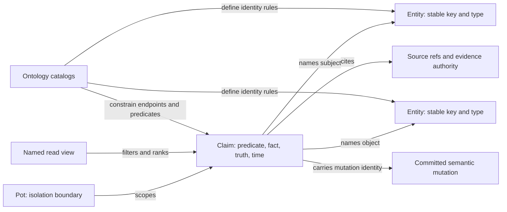
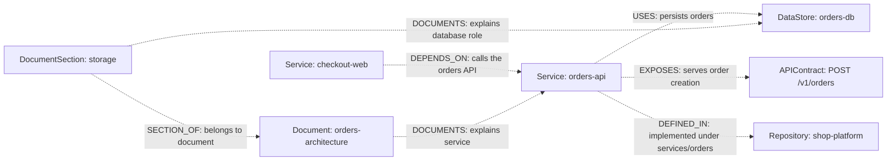

## Overview

> Status: reflects the typed-operation CLI, last reviewed 2026-10-06.

Code: [ontology](https://github.com/potpie-ai/potpie/blob/main/potpie/context-engine/src/potpie_context_engine/core/ontology.py),
[graph contract](https://github.com/potpie-ai/potpie/blob/main/potpie/context-engine/src/potpie_context_engine/core/graph_contract.py).
The full catalog reference is [ontology.md](./ontology.md); this page is the
one-page tour.

## Problem and solution

An agent needs to tell a service dependency from a preference, a past incident
from an active fact, and document structure from document text. Potpie
represents project memory as typed entities connected by sourced claims within a
pot. The ontology declares legal entity identities, relation endpoints, truth
classes and views, so ingestion and retrieval use the same vocabulary.

## Logical model



This is a logical model, not a promise of separate database tables. In the
Cypher adapters, canonical claims are `:RELATES_TO` edges between `:Entity`
nodes; the semantic predicate, such as `DEPENDS_ON`, is carried in claim
properties.
[ClaimQueryPort](https://github.com/potpie-ai/potpie/blob/main/potpie/context-engine/src/potpie_context_engine/core/ports/claim_query.py)
exposes typed claim rows so readers need not depend on that storage
representation.

Every graph operation is scoped by `pot_id`; graph adapters isolate pots through
`group_id`. A repository is an entity or source within a pot, not the pot
itself. A pot can contain several repositories, services and documents.

## Entity and relation vocabulary

The catalog contains **25 entity types, 28 predicates including `RELATED_TO`,
and 15 record types**. Counts are for this build; `potpie graph catalog`
reports the serving host's vocabulary, so run it before authoring against
another build.

| Entity family | Types |
|---|---|
| Architecture | `Repository`, `Service`, `Environment`, `DataStore`, `Cluster`, `Dependency`, `APIContract`, `Adapter`, `ConfigVariable`, `DeploymentTarget`, `CodeAsset`, `Feature` |
| People and activity | `Team`, `Person`, `Activity`, `Period` |
| Durable memory | `Preference`, `Policy`, `BugPattern`, `Fix`, `Decision` |
| Knowledge and diagnostics | `Document`, `DocumentSection`, `Observation`, `QualityIssue` |

| Predicate | Meaning and allowed endpoints |
|---|---|
| `DEPENDS_ON` | Service → Service: one service depends on or calls another |
| `USES` | Service → DataStore or Dependency |
| `EXPOSES` | Service → APIContract |
| `DEFINED_IN` | Service → Repository; the `path` edge property carries the subtree |
| `DEPLOYED_TO` | Service → Environment |
| `DECIDED` | Decision → a scope entity |
| `POLICY_APPLIES_TO` | Preference or Policy → its permitted scope (a scope entity or a code asset) |
| `SECTION_OF` | DocumentSection → Document; a section has one current parent |
| `DOCUMENTS` | Document or DocumentSection → an entity it documents |
| `RELATED_TO` | Generic fallback; use a declared typed predicate when its meaning fits |

A **possible modeling example** for a small, invented web shop is below. It
illustrates ontology usage only; nothing here is inserted into a live pot.



Diagrams elsewhere in these docs use plain verbs such as "calls" or "streams" to
explain transport. Those arrows are not ontology edges.

## Identity, truth and lifecycle

Entity identity comes from an external identifier, a canonical slug or alias, or
a content hash, according to its entity specification. Examples of exact
prefixes are `service:`, `repo:`, `api_contract:`, `config:`, `document:` and
`docsection:`. `APIContract` uses external identity; `Service` and `Document`
use slug/alias identity. Do not replace underscores with hyphens or mint new
keys before checking existing identities (`potpie graph search-entities`).

A claim carries subject and object keys, predicate, fact or description,
confidence, truth, evidence, source references, validity and observation times,
mutation identity and contract versions. Environment contributes to relation
identity when supplied: a staging claim does not supersede its production
counterpart. Retraction or ending validity changes which claims are current
while retaining history.

| Truth class | How the claim is asserted |
|---|---|
| `authoritative_fact` | A fact grounded in an authoritative source |
| `source_observation` | An observation grounded in source evidence |
| `agent_claim` | An attributed agent assertion |
| `user_decision` | A user's decision |
| `preference` | An attributed preference |
| `timeline_event` | A historical occurrence |
| `quality_finding` | A diagnostic finding about graph quality |

`authoritative_fact` and `source_observation` require evidence. Supported
authorities are `authoritative_code`, `repository_metadata`, `external_system`,
`ci_run`, `user_statement` and `agent_observation`. The validator checks how
authority and truth fit; a truth label alone does not turn an inference into a
sourced fact. Truth also maps to evidence strength for ranking.

## Subgraphs, views and payloads

Subgraphs are semantic groupings of memory, not additional database services.
Ten named views span eight subgraphs:

| Subgraph | Views | Reader/include family |
|---|---|---|
| `decisions` | `preferences_for_scope`, `active_decisions` | `coding_preferences`, `decisions` |
| `debugging` | `prior_occurrences` | `prior_bugs` |
| `recent_changes` | `timeline` | `timeline` |
| `infra_topology` | `service_neighborhood` | `infra_topology` |
| `features` | `feature_context` | `features` |
| `admin` | `inspection_slice` | `raw_graph` |
| `code_topology` | `ownership_by_path` | `owners` |
| `knowledge` | `document_context`, `document_passages` | `docs`, `resources` |

All ten are reader-backed. Actual results still depend on backend capabilities,
indexed data, required scope and query support. `Document`/`DocumentSection` and
their claims describe reference material; chunk text lives in the resource
store ([resources.md](./resources.md)). The `docs` view retrieves graph context,
while `resources` searches passages through the resource index.

## Contracts and verification

The data-plane contract is `v1.5`, the workbench envelope is `v2`, and the
ontology version is `2026-06-graph`. These are different layers: the parser
normalizes an inbound mutation `v2` to `v1.5`, and the outer workbench version
is not a second graph database.

```bash
potpie --json graph catalog
potpie --json graph describe infra_topology --view service_neighborhood --examples
potpie --json graph describe knowledge --view document_passages --examples
```

| Source | Responsibility |
|---|---|
| [Ontology](https://github.com/potpie-ai/potpie/blob/main/potpie/context-engine/src/potpie_context_engine/core/ontology.py) | Entity, edge and record catalogs; identities and endpoint rules |
| [Graph views](https://github.com/potpie-ai/potpie/blob/main/potpie/context-engine/src/potpie_context_engine/core/graph_views.py) | Named views, inputs, relation expansion and reader mappings |
| [Workbench ontology](https://github.com/potpie-ai/potpie/blob/main/potpie/context-engine/src/potpie_context_engine/core/graph_workbench_ontology.py) | Executable catalog and describe contracts |
| [Graph contract](https://github.com/potpie-ai/potpie/blob/main/potpie/context-engine/src/potpie_context_engine/core/graph_contract.py) | Truth, operations, authority, versions and identity helpers |
