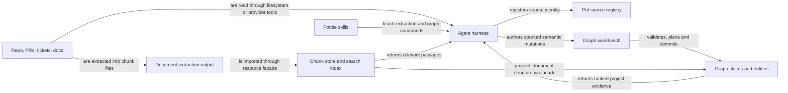
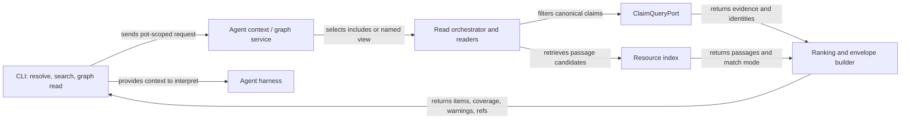
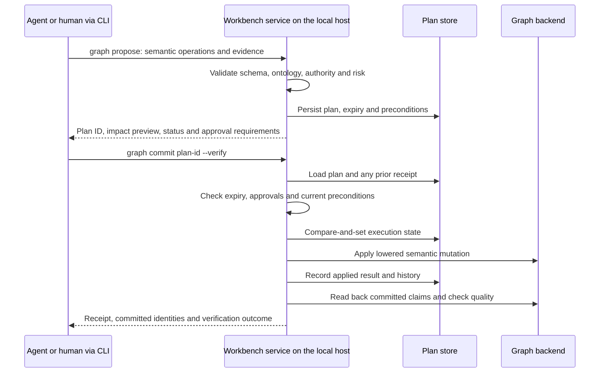

## Overview

> Status: reflects the typed-operation CLI, last reviewed 2026-10-06.

Code: [CLI workbench](https://github.com/potpie-ai/potpie/blob/main/potpie/cli/commands/graph.py),
[workbench service](https://github.com/potpie-ai/potpie/blob/main/potpie/context-engine/src/potpie_context_engine/core/workbench_service.py).
The full flag reference is [cli-flow.md](./cli-flow.md).

## Problem and solution

The graph must keep useful knowledge without treating every agent guess as
source truth. An agent reads source material and proposes semantic changes; the
host validates those changes and persists a plan before commit. Retrieval then
selects and ranks the resulting evidence for later tasks. The workbench is the
`potpie graph …` command family and its host service, not a separate deployed
process.

## How sources enter



`potpie source add repo .` registers provenance and scope; it does not scan the
files or build the baseline graph. Harness skills guide the agent to inspect
source evidence and write useful memory. Source integrations supply credentials
and source access; registering a source does not start a connector polling it.

Document import is a separate pipeline: an extractor produces a chunk directory,
`potpie resource import` stores those chunks, the resource facade writes the
document structure into the graph, and the search index makes passages
retrievable. Lexical indexing happens before deferred vector work finishes.
Extraction, chunk storage, graph projection and index readiness are separate
outcomes; inspect the import receipt and `potpie resource index status`. See
[resources.md](./resources.md).

The engine also has ingestion and reconciliation infrastructure; see
[ingestion-nudge.md](./ingestion-nudge.md) for that separate path. Those are not
automatic steps in this diagram.

## Read flow



There are three independent read controls: **retrieve** candidates by query,
**filter** them by scope, provenance, time or environment, and **traverse**
bounded relationships. A read envelope reports evidence and coverage rather than
a generated answer. Sparse coverage, unsupported filters and degraded match
modes are actionable output; an empty result does not prove the source contains
no relevant fact.

`resolve` provides task-oriented context; `search` supports targeted lookup;
`graph read` selects a named view; `graph search-entities` resolves stable
identities; `graph neighborhood` explores relationships. These share graph
internals. Use `--detail full` and `--relations full` on graph reads when
validating exact relationships. `--current` selects the pot associated with the
current repo; `--repo current` also requests repo scope where the view supports
it. What a read answer carries is described in
[graph answer reliability](./graph-answer-reliability.md).

## Write flow



Proposal validates and persists a plan; it does not apply the proposed graph
changes. Commit checks the plan's validity and policy before mutation.
Review-required operations need the required approval identity, either on
`graph propose --approved-by` or on `graph commit --approved-by`. A timeout can
occur after the write landed, and issuing a new mutation blindly can duplicate
intent. The CLI's
[commit recovery](https://github.com/potpie-ai/potpie/blob/main/potpie/cli/commit_recovery.py)
handles this uncertain-result case: it never resubmits a mutation, and instead
reads the plan's durable receipt (`commit_status`) until the outcome settles.

`--verify` reads back committed claim keys and runs quality checks as its own
read after the receipt is durable. A missing committed claim is a failure (exit
1); a quality regression is reported in `verification.status` and warnings and
can still leave the command successful. Read both the exit code and the receipt.
Plan compare-and-set coordinates claims on execution; it is not a distributed
transaction spanning graph, relational state and resource files. Backend-level
guarantees are in [graph write guarantees](./graph-write-guarantees.md).

## Operations and supporting tools

| Surface | Purpose |
|---|---|
| `catalog`, `describe` | Discover the serving host's legal schema, views and examples |
| `propose`, `commit`, `history` | Reviewable, durable write workflow and receipts |
| `upsert_entity`, `link_entities`, `assert_claim`, `append_event` | Create or enrich identities, relationships, assertions and timeline facts |
| `patch_entity`, `transition_state` | Change allowed properties or lifecycle state |
| `end_relation_validity`, `retract_claim`, `supersede_claim`, `merge_duplicate_entities` | Correct or retire knowledge under write policy |
| `graph inbox …` | Queue and track candidate work; adding an item is not committing a fact |
| `graph quality …` | Diagnose duplicates, stale or conflicting facts, orphans, projection drift and entity-label drift |
| `graph commits`, `graph commit-show`, `graph revert`/`rollback` + `graph apply-preview` | Journaled commit history and preview-then-apply rollback ([cli-flow.md](./cli-flow.md)) |
| `record` | Convenience path for durable learnings using the shared semantic graph machinery |
| `graph mutate` | Legacy wrapper around propose and commit |
| `graph bulk apply` | Batch semantic writes; consult help and each receipt before retrying |

## Verification commands

Use an existing pot for the reads below. The final two commands are an
intentional write recipe: first author and inspect `mutation.json` from actual
source evidence, then replace `PLAN_ID` with the proposal's result. Add an
explicit `--pot <ref>` to both calls when routing must be fixed.

```bash
potpie --json graph catalog
potpie --json graph read --subgraph infra_topology --view service_neighborhood --repo current
potpie --json graph search-entities --query "orders api" --type Service
potpie --json graph quality summary
potpie --json graph history
potpie --json graph propose --file mutation.json
potpie --json graph commit PLAN_ID --verify
```

The complete mutation contract is discoverable through `graph catalog`;
`graph mutation-template --kind repo-baseline` provides a placeholder skeleton
that must be filled and reviewed. A template is not evidence.

| Source | Responsibility |
|---|---|
| [Workbench service](https://github.com/potpie-ai/potpie/blob/main/potpie/context-engine/src/potpie_context_engine/core/workbench_service.py) | Plans, commit, history, inbox and verification |
| [Semantic validator](https://github.com/potpie-ai/potpie/blob/main/potpie/context-engine/src/potpie_context_engine/core/semantic_mutation_validator.py), [lowering](https://github.com/potpie-ai/potpie/blob/main/potpie/context-engine/src/potpie_context_engine/core/semantic_mutation_lowering.py) | Validate meaning and convert to backend mutations |
| [Read orchestrator](https://github.com/potpie-ai/potpie/blob/main/potpie/context-engine/src/potpie_context_engine/application/services/read_orchestrator.py), [envelope builder](https://github.com/potpie-ai/potpie/blob/main/potpie/context-engine/src/potpie_context_engine/application/services/envelope_builder.py) | Reader selection, ranking and response shaping |
| [Resource facade](https://github.com/potpie-ai/potpie/blob/main/potpie/context-engine/src/potpie_context_engine/application/services/resource_facade.py) | Chunk storage, index maintenance and document graph projection |
