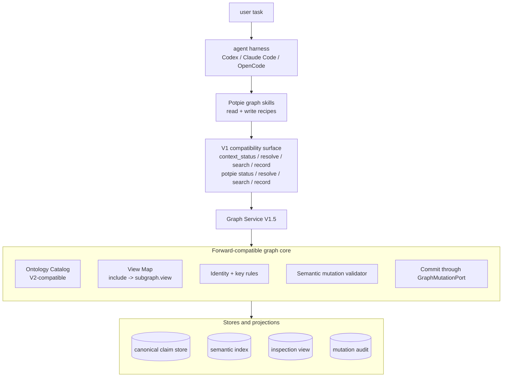

# Graph V1 Architecture

Last reviewed: 2026-06-08.

This document defines the desired architecture for the current Context Graph
implementation. It is intentionally a V1.5 target: keep the existing v1 command
surface usable while changing the internals so Graph V2 can add the workbench
surface later without ontology, identity-key, or claim-store migrations.

Graph V1 is not the old agentic reconciliation design. Intelligence belongs in
the user's harness through skills. Potpie provides deterministic graph contracts,
validation, storage, provenance, and audit. The harness decides what context to
read and which structured graph update to request.

Graph V2 is described separately in [`graphv2.md`](./graphv2.md). V2 changes the
agent-facing surface to `potpie graph catalog/read/propose/commit/...`. V1 should
adopt the same ontology, truth model, evidence model, and semantic mutation
model now, while exposing them through the current `context_*` and top-level CLI
wrappers.

## Goals

- Keep the current implementation shippable without forcing the full workbench
  surface into this iteration.
- Remove Potpie-owned LLM/reconciliation-agent intelligence from the canonical
  graph path.
- Make harness skills responsible for deciding what to read and what semantic
  update to request.
- Store canonical graph state with V2-compatible ontology, identity keys, truth
  classes, evidence, validity windows, and mutation provenance.
- Keep all graph writes behind deterministic validation and one mutation door.
- Preserve the existing v1 surface as compatibility wrappers over
  forward-compatible internals.
- Make Graph V2 a surface and workflow expansion, not a data migration.

## Non-Goals

- No requirement to expose the full `potpie graph catalog/describe/read/propose`
  workbench in V1.
- No daemon-side or service-side LLM that infers rich ontology updates from
  prose and writes canonical graph state.
- No raw Cypher, SQL, or graph-store query as an agent operation.
- No generic free-text memory write that becomes authoritative graph fact.
- No new ontology that differs from Graph V2.
- No direct write path that skips validation, evidence, provenance, or audit.

## Product Shape



The important split is:

- **Harness + skills own intelligence.** They choose relevant views, inspect
  evidence, resolve identities, and prepare semantic mutations.
- **Potpie owns determinism.** It validates structure, authority, evidence,
  identity, idempotency, and commit behavior before writing canonical graph
  state.

## Relationship To Graph V2

| Concern | Graph V1 Target | Graph V2 Target |
|---|---|---|
| Agent surface | Existing `context_*` MCP tools and top-level CLI wrappers. | Canonical `potpie graph ...` workbench. |
| Read model | `intent/include` compatibility API mapped internally to named views. | Explicit `subgraph + view + scope + query`. |
| Write model | `context_record` and ingestion wrappers lower to semantic mutations and may auto-commit low-risk plans. | Explicit `propose -> inspect -> commit`. |
| Intelligence | Harness skills. No service-side reconciliation agent for canonical facts. | Same. Harness skills use workbench commands directly. |
| Ontology | V2-compatible now. | Same ontology, expanded contracts and view discovery. |
| Storage | Canonical claims plus projections behind `GraphBackend`. | Same storage contracts plus plan/history/index maturity. |

V1 must not create facts that V2 later has to reinterpret. When V1 cannot safely
choose a canonical semantic mutation, it should return a review-required result
the harness retains, or write a low-authority `agent_claim`, not a broad generic
fact. A Potpie-side inbox is a V2 feature; V1.5 persists nothing un-committed.

## Current Surface Contract

V1 keeps the current minimal surface while making it forward-compatible:

| Surface | V1 Role | Internal Target |
|---|---|---|
| `context_status` / `potpie status` | Readiness, active pot, source/skill/backend status, suggested next action. | Future `graph status`. |
| `context_resolve` / `potpie resolve` | Compatibility read request using `intent`, `include`, `scope`, `mode`, and `source_policy`. | Named read views via the view map. |
| `context_search` / `potpie search` | Narrow follow-up lookup. | Entity/read-view search over claim and semantic indexes. |
| `context_record` / `potpie record` | Convenience write/capture API for durable learnings. | Semantic mutation proposal, validation, and low-risk commit or inbox. |

These surfaces are not the long-term product contract. They are compatibility
wrappers that should not contain private graph logic. New durable behavior should
land in the graph core first, then be reached from both V1 wrappers and V2
workbench commands.

## V1 Read Model

The current `intent/include` API should be treated as a routing convenience over
V2-style read views.

| V1 Include | V1 Reader | V2-Compatible View |
|---|---|---|
| `prior_bugs` | `PriorBugsReader` | `bugs.prior_occurrences` |
| `timeline` | `TimelineReader` | `recent_changes.timeline` |
| `infra_topology` | `InfraTopologyReader` | `infra_topology.service_neighborhood` |
| `coding_preferences` | `CodingPreferencesReader` | `preferences.active_preferences` |
| `raw_graph` | `RawGraphReader` | `admin.inspection_slice` |
| `decisions` | planned | `decisions.active_decisions` |
| `owners` | planned | `ownership.owner_context` |
| `docs` | planned | `docs.reference_context` |

Rules:

- Add new read behavior as named view contracts even if V1 callers still request
  them by `include`.
- Return honest unsupported coverage when a view is advertised but unbacked.
- Keep result payloads compact and source-reference-first.
- Include enough provenance for the harness to verify when risk or freshness
  requires it.

Read *relevance* is a V1 concern, not just a V2 projection detail: three of the
four target use cases (preferences surfacing on new code, prior-bug recall by
symptom, timeline correlation) depend on real semantic retrieval, not token
overlap. The retrieval-hardening track in the V1.5 implementation plan
(embed-on-write, ANN, hierarchical scope, one ranked pass) is what makes these
views useful; the named-view contract above is necessary but not sufficient.

## Query Surface

How an agent *asks* the graph is as load-bearing as how it writes. The read side
is three query axes, not one command. The four target use cases reduce to three
distinct query shapes, so the surface must expose all three — but through typed,
pot-scoped, backend-portable operations, never the raw store or its query
language.

| Axis | V1 delivery | Shape | Carries |
|---|---|---|---|
| **Retrieve** | Named read views, ranked | Semantic match + scope filter + ranking; returns entities with immediate relations inline. | Preferences-on-intent, bug-symptom recall, timeline-by-relevance |
| **Filter** | Entity/claim search | Structured lookup by entity type, predicate, scope, time, truth, strength, **and edge qualifiers** (`environment`, config-context). | Infra "which adapter in which env", enumerations, identity resolution |
| **Traverse** | `infra_topology.service_neighborhood` view (`depth`, `direction`) | Bounded, depth-limited, predicate-typed neighborhood walk. | Dependency blast-radius, bug→fix→PR chains |

Three things follow:

- **Retrieve carries half the use cases, and its quality is retrieval quality,
  not query expressiveness.** Preference-surfacing and bug recall are semantic
  matches — token overlap will not connect "build a payments feature" to a
  "wrap external calls in retry" preference. The filter is only the `WHERE`
  clause; the ranking (embed-on-write, ANN, hierarchical scope) is the product.
- **Traverse is a first-class axis.** A flat `(subject, predicate, object)`
  filter is 1-hop; dependency blast-radius is transitive closure and bug→fix→PR
  is a multi-hop join. V1 delivers it *through* traversal-backed views (a `depth`
  param on `service_neighborhood`, inline relations on `prior_occurrences`); V2
  promotes it to a composable `graph neighborhood` op. Backends implement the
  walk natively (variable-length path / recursive CTE / BFS); agents never see
  Cypher.
- **Edge qualifiers are part of identity, not just a filter.** Relations carry an
  `environment` qualifier so the infra subgraph can distinguish prod from staging,
  and when present it joins the edge identity key (see *Edge Qualifiers*) so the
  two topologies coexist instead of superseding each other. Filtering on
  `environment=prod` is then a read over distinct claims, not a disambiguation
  guess.

**Boundary.** These three axes cover the four use cases and stop there.
Open-ended graph analytics (arbitrary shortest path, centrality, cycle
detection, unbounded recursive aggregation) is deliberately out of scope on the
agent surface — this is a project-*memory* graph for retrieval-into-context, not
a graph-analytics engine. Operators who need that shape use a raw-query escape
hatch that is off the agent tool surface.

## V1 Write Model

`context_record` should no longer be understood as "write this prose into the
graph." It is a convenience wrapper around semantic mutation handling.

Recommended flow:

1. Normalize request into a semantic mutation draft.
2. Validate record type, entity keys, predicates, source refs, truth class, and
   evidence requirements.
3. Classify risk.
4. Commit automatically only when validation passes, risk is low, evidence is
   present, and policy marks the operation auto-applicable.
5. Otherwise return a review-required result for the harness to retain and
   re-submit. Server-side inbox/plan persistence is deferred to V2.

The v1 response can stay `RecordReceipt`-shaped, but should include migration
metadata such as `plan_id`, `mutation_id`, `subgraph`, `truth`, `risk`, and
`auto_committed` when available.

## Semantic Mutation Operations

V1 should introduce the V2 mutation vocabulary now, even if some operations lower
to the existing `ReconciliationPlan` internally.

| Operation | V1 Use |
|---|---|
| `append_event` | Harness-supplied timeline/activity observations. |
| `upsert_entity` | Stable entity metadata with identity rules. |
| `patch_entity` | Small property updates with authority checks. |
| `transition_state` | Lifecycle/status updates. |
| `link_entities` | Evidence-backed relationships. |
| `end_relation_validity` | Soft-ending old relations; no ordinary delete. |
| `assert_claim` | Harness inference grounded in evidence. |
| `retract_claim` | Invalidating a claim with reason/evidence. |
| `supersede_claim` | Replacing older facts or decisions. |
| `merge_duplicate_entities` | Identity cleanup; review-required by default. |

`patch_entity` and `transition_state` are part of the vocabulary but deferred in
the V1.5 implementation: state changes are modelled as new claims or events
(e.g. a `VERIFIED` claim, an `append_event`), not in-place edits. `supersede_claim`
and `merge_duplicate_entities` are advertised but review-required, since V1.5 has
no plan store to complete them. The catalog reports these honestly rather than
implying full support.

The existing `ReconciliationPlan` (renamed `MutationBatch` in the V1.5 plan) can
remain the backend-lowering format for now. The public/domain-level write
contract should be semantic mutations, not raw entity/edge upserts.

## Ontology Invariants

Graph V1 and Graph V2 must share one ontology. V1 must not ship keys or fact
shapes that V2 will need to migrate.

### Entity Keys

Use deterministic, readable keys:

| Type | Key Pattern |
|---|---|
| Repository | `repo:<provider-host>:<owner>/<name>` |
| Service | `service:<pot-or-system>:<slug>` |
| Environment | `environment:<slug>` |
| Component | `component:<repo-or-service>:<slug>` |
| Code asset | `code:<repo>:<path>#<symbol>` or `code:<repo>:<path>` |
| Feature | `feature:<system-or-repo>:<slug>` |
| Decision | `decision:<source-or-pot>:<slug>` |
| Pull request | `pr:<provider>:<owner>/<repo>:<number>` |
| Commit | `commit:<provider>:<owner>/<repo>:<sha>` |
| Issue | `issue:<provider>:<project-or-repo>:<id>` |
| Incident | `incident:<source>:<id-or-slug>` |
| Bug pattern | `bug-pattern:<scope>:<symptom-slug>` |
| Document | `doc:<source>:<id-or-url-hash>` |
| Source reference | `source-ref:<source-system>:<external-id>` |
| Activity | `activity:<source-system>:<source-event-id>` |

Rules:

- Prefer authoritative external IDs.
- Otherwise derive scoped slugs from canonical names.
- Never use display names alone when provider IDs exist.
- Search existing entities before creating non-authoritative entities.
- Merge by recording alias/merge history, not by hard-deleting graph state.

### Claim Fields

Every canonical claim or relationship should support:

```json
{
  "claim_key": "claim:<stable-id>",
  "pot_id": "local/default",
  "subgraph": "bugs",
  "subject": "bug-pattern:payments:partial-capture-refund-failure",
  "predicate": "RESOLVED_BY",
  "object": "pr:github:acme/payments:812",
  "truth": "agent_claim",
  "confidence": 0.81,
  "source_refs": ["github:pr:acme/payments:812"],
  "evidence": [
    {
      "source_ref": "github:pr:acme/payments:812",
      "quote_ref": "body:lines:12-18",
      "authority": "repository_metadata"
    }
  ],
  "valid_from": "2026-06-08T00:00:00+05:30",
  "valid_until": null,
  "observed_at": "2026-06-08T00:00:00+05:30",
  "created_by": {
    "surface": "cli",
    "harness": "codex"
  },
  "mutation_id": "mutation:01J...",
  "graph_contract_version": "v1.5",
  "ontology_version": "2026-06-graph"
}
```

### Edge Qualifiers

Some relationships are environment-specific. A service can use a different
datastore/adapter per environment, and a dependency can exist in one environment
but not another (e.g. staging mocks a service that prod calls live). Relations
therefore carry an optional `environment` qualifier in their property bag, on
both **bindings** (`USES`, datastore/adapter/config edges) and **service
dependencies** (`DEPENDS_ON`).

The qualifier is part of identity, not just a filter. When an `environment`
qualifier is present, the edge identity / singleton / supersession key extends
from `(subject, predicate, object)` to `(subject, predicate, object,
environment)`. Without this, adding a staging edge would supersede the prod edge
under the same `(subject, predicate)`. With it, prod and staging topologies
coexist, and "what depends on X in prod" is a single qualified traversal rather
than a topology-∩-deployment composition.

Rules:

- A qualified edge and its unqualified counterpart are distinct claims: an
  env-agnostic `DEPENDS_ON` and a `{environment: prod}` `DEPENDS_ON` do not
  collide or supersede each other.
- Only relations that genuinely vary by environment carry the qualifier;
  structural facts (a service belongs to a repo) stay unqualified.
- The qualifier set is intentionally small (`environment` first). Other context
  qualifiers (region, tenant) are additive later under the same identity rule.

### Truth Classes

| Truth Class | Meaning | V1 Write Policy |
|---|---|---|
| `authoritative_fact` | Direct source-of-truth field for that fact family. | Auto-commit when low risk. |
| `source_observation` | Observed data point from explicit harness evidence. | Auto-commit append-only observations. |
| `agent_claim` | Harness inference grounded in evidence. | Auto-commit only low-impact claims. |
| `user_decision` | Explicit user/team/source-of-record decision. | Review unless narrow append-only. |
| `preference` | Durable user/team/project preference. | Review for broad scope. |
| `timeline_event` | Append-only historical activity. | Auto-commit when deterministic. |
| `quality_finding` | System-generated graph quality issue. | No repair without proposal. |

Truth class is a *trust* axis, not only a write-policy axis: it feeds retrieval
ranking alongside evidence strength. The two are orthogonal — evidence strength
answers "how well-grounded is this claim" (`deterministic` → `speculative`),
truth class answers "what kind of fact is it." A reader that surfaces
preferences on intent (UC1) must let an explicit `user_decision` outrank an
inferred `agent_claim` of the *same* evidence strength, so the ranker takes
truth class as an input, not just the write path. The ranking factor for truth
class is fixed and documented; it is not a free-floating weight.

## Ingestion In V1

Ingestion should not be an intelligence engine or a deterministic graph writer.
Local code/config ingestion is out of scope. Durable graph updates should come
from the harness-facing semantic mutation path (`graph mutate` /
`context_record`) with explicit evidence and truth-class selection.

Not allowed as automatic canonical writes:

- inferred feature implementation links without evidence;
- inferred root causes or fixes from prose;
- broad decisions or preferences from ambiguous text;
- entity merges;
- state transitions that require source authority the event does not carry.

When ingestion sees useful but ambiguous information, it should write a
low-authority observation for the harness maintainer skill to process. A
pending-work inbox is a V2 feature; V1.5 does not hold ungrounded findings
server-side.

## Skills Layer

V1 should invest in skills before expanding the public surface. Skills are the
intelligence layer that makes the current API useful and prepares the harness
for V2 workbench commands.

Recommended V1 skills:

| Skill | Purpose |
|---|---|
| `potpie-graph-basics` | Pot scope, evidence rules, truth classes, safe write policy, status checks. |
| `potpie-graph-debugging` | Read prior bugs/recent changes/topology and propose fix or bug-pattern updates. |
| `potpie-graph-feature-work` | Read feature/service/decision context and propose implementation links or notes. |
| `potpie-graph-decisions` | Record decisions, preferences, supersession, and review-required policy. |
| `potpie-graph-maintainer` | End-of-task graph cleanup, inbox processing, duplicate/stale/unsupported findings. |

Skill rules:

- Skills should read before writing.
- Skills should search/resolve identity before creating or linking entities.
- Skills should choose truth class explicitly.
- Skills should include evidence for every durable write.
- Skills should hold uncertain ontology updates and re-submit them (or write
  low-authority observations) rather than forcing a canonical fact. Inbox-based
  handoff is a V2 workflow.
- Skills should avoid promising that Potpie will infer rich ontology updates
  from prose.

## Implementation Priorities

1. Add V2-compatible ontology, entity key, truth, evidence, and claim metadata
   fields to the current canonical write path.
2. Introduce semantic mutation DTOs and a validator in front of
   `GraphMutationPort`.
3. Rework `context_record` to lower into semantic mutations, validate, then
   auto-commit only low-risk plans.
4. Remove or disable canonical writes from service-side reconciliation agents.
5. Defer the graph inbox and maintainer-skill handoff to V2; in V1.5 the harness
   retains review-required work and ambiguous findings become low-authority
   observations.
6. Add a view map from v1 includes to V2 subgraph/view names.
7. Update installed agent templates and skills to describe harness-owned graph
   update workflows.
8. Later, expose the Graph V2 workbench commands over the same internals.

## Acceptance Criteria

V1 is ready when:

- existing v1 commands still work for local users and agents;
- canonical graph writes carry V2-compatible ontology/truth/evidence/provenance;
- no Potpie-owned LLM/reconciliation agent is required for canonical graph
  updates;
- ambiguous ingestion creates observations or inbox items instead of invented
  canonical facts;
- `context_record` is a validated semantic-mutation wrapper, not a direct write;
- backed v1 includes are documented as named views;
- Graph V2 can add workbench commands without changing entity keys or migrating
  claim shape.
