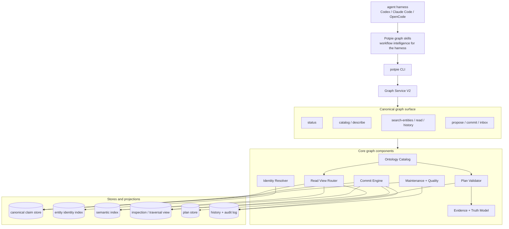
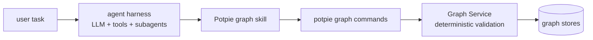
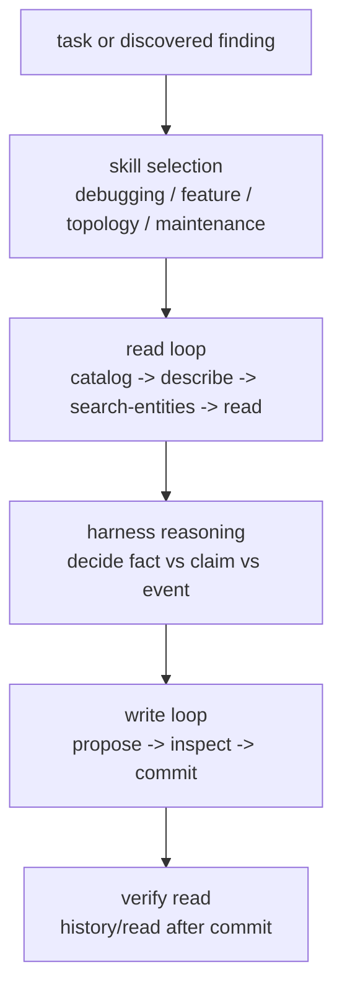
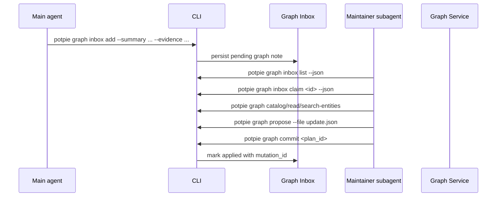
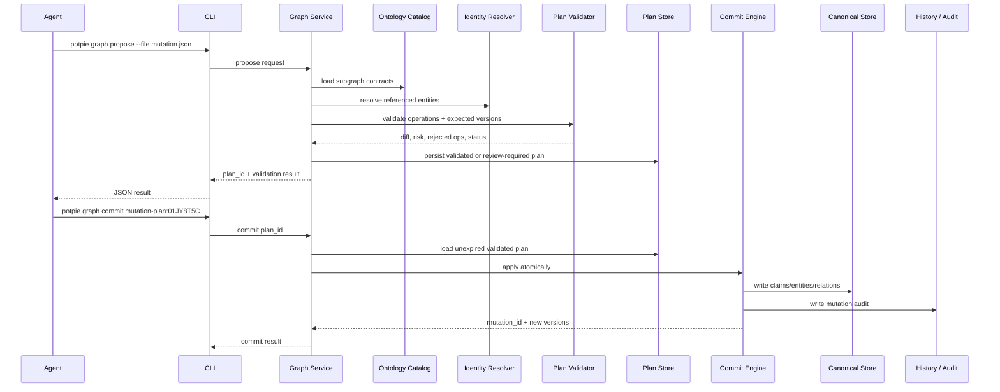
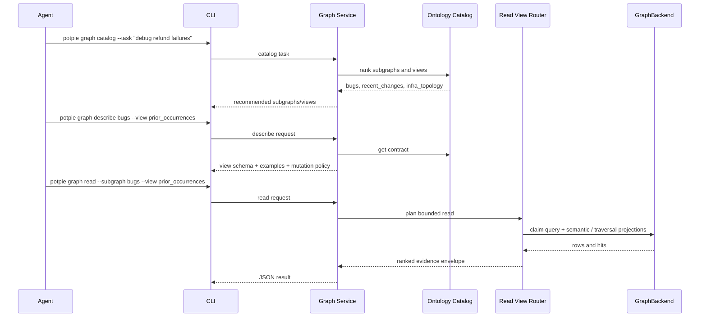
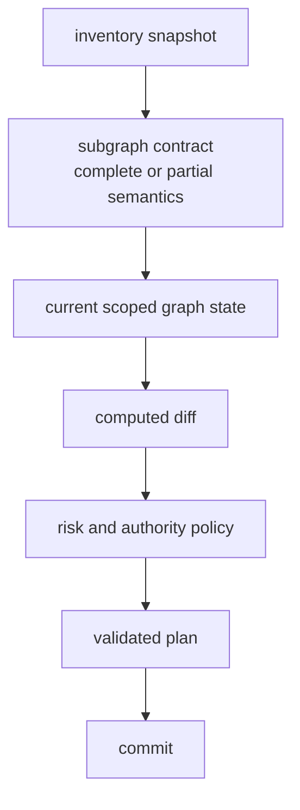
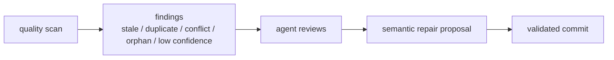

# Graph V2 Workbench Architecture

Last reviewed: 2026-06-08.

This document scopes a local-first graph surface for agent harnesses such as
Codex, Claude Code, OpenCode, and similar tools. The intelligence lives in the
user harness. Potpie provides the CLI, skills, graph contracts, validation, and
storage so the agent can query and update project memory directly without
learning the whole ontology at once.

This is the design document for the future graph workbench surface. It should be
built after Graph V1 has adopted the V2-aligned ontology, evidence,
truth, and semantic mutation internals described in
[`graphv1.md`](./graphv1.md). V2 should then be a surface and workflow expansion,
not a data migration.

V2 supersedes shortcut-oriented commands such as `resolve`, `search`, `record`,
or a four-tool agent contract as the long-term product surface. During Graph V1,
those commands may remain as legacy wrappers over the same internals, but V2
must not add compatibility aliases for renamed views, subgraphs, or key
prefixes.

The detailed command contract, seed ontology, subgraph/view map, mutation DSL,
and ontology evolution process live in
[`workbench-ontology.md`](./workbench-ontology.md).

## Goals

- Let agents discover which subgraph and view fit the task before querying.
- Keep reads efficient as the graph grows by using `subgraph + view + scope`,
  not generic traversal as the default interface.
- Let agents update the graph through semantic mutations, not raw node/edge
  CRUD or storage queries.
- Keep graph facts grounded in evidence, source authority, confidence, and
  time.
- Make proposed writes inspectable before commit, with deterministic validation,
  risk classification, and conflict detection.
- Keep physical storage behind adapters. The graph contract is the invariant.

## Non-Goals

- No raw Cypher, SQL, or graph-store query as an ordinary agent operation.
- No requirement that an agent loads the full ontology into context.
- No write that lacks pot scope, evidence, and mutation provenance.
- No treating LLM inference as authoritative fact by default.
- No coupling to one backend profile.
- No top-level `resolve`, `search`, `record`, or `context_*` graph commands as
  product primitives.

## Product Shape



The CLI is still the agent's runtime interface. Skills teach the harness how to
reason over the graph surface, but the CLI and Graph Service enforce schema,
policy, validation, commit behavior, and audit. Potpie does not run an LLM in
the CLI or daemon.

## Canonical Graph Surface

V2 should make `potpie graph ...` the only canonical graph read/write surface.
Top-level commands such as `potpie resolve`, `potpie search`, `potpie record`,
and MCP tools such as `context_resolve`, `context_search`, `context_record`, or
`context_status` are Graph V1 legacy wrappers, not Graph V2 product primitives.
Once the workbench exists, they should either call the same internals with
canonical names or return migration guidance. They must not mutate canonical
graph state through a private path, and they must not accept obsolete view names
or non-canonical key prefixes.

| Layer | Commands | Role |
|---|---|---|
| Graph workbench | `potpie graph status`, `catalog`, `describe`, `search-entities`, `read`, `neighborhood`, `propose`, `commit`, `history`, `inbox` | The only canonical graph surface for harness agents. |
| Admin | `potpie graph repair`, `export`, `import`, `reset`, `admin ...` | Operator-only graph maintenance and destructive actions. |
| V1 legacy wrappers | `potpie resolve`, `search`, `record`, `context_*` | Not part of the V2 product contract. Keep only as calls into the same internals or return migration guidance; no direct graph writes; no private query path; no obsolete view/key aliases. |

Recommended graph workbench commands:

```bash
potpie graph status --json
potpie graph catalog --task "debug refund failures" --json
potpie graph describe bugs --view prior_occurrences --examples --json
potpie graph search-entities --query "bulk refunds" --subgraph features --json
potpie graph read --subgraph bugs --view prior_occurrences --scope service:refunds-api --json
potpie graph neighborhood --entity service:payments-api --predicate DEPENDS_ON --depth 2 --direction out --json
potpie graph propose --file mutation.json --json
potpie graph commit mutation-plan:01JY8T5C --json
potpie graph history --entity service:payments-api --json
potpie graph inbox add --summary "..." --evidence github:pr:acme/payments:955 --json
```

The harness owns intelligence:



Potpie should not infer rich ontology updates from prose. The harness should
use skills to decide which subgraphs to read, which entities to update, and
which semantic mutation to propose. Potpie validates and commits the structured
proposal.

If a user or harness needs quick capture without deciding the ontology update,
use `potpie graph inbox add`. Inbox items are pending graph work. They are not
canonical graph facts until a harness or subagent processes them through
`catalog` / `describe` / `read` / `propose` / `commit`.

## Core Components

| Component | Responsibility | Can Be Built Independently By Defining |
|---|---|---|
| Ontology Catalog | Publish subgraphs, views, entity types, relation types, mutation policies, identity rules, and examples. | Static contracts and `catalog` / `describe` output. |
| Identity Resolver | Resolve names, alternate display names, external IDs, and fuzzy matches to canonical entity keys. | Entity key rules, alternate-name records, search/ranking. |
| Read View Router | Route `subgraph + view + scope + query` into bounded retrieval plans, and back the bounded `neighborhood` traversal op (see Query Surface Model). | View contracts, result shapes, ranking, token budgets, traversal depth/direction limits. |
| Evidence + Truth Model | Define what a fact means and how grounded it is. | Claim classes, evidence refs, authority, confidence, validity time. |
| Semantic Mutation DSL | Define allowed agent write operations. | Pydantic/JSON schemas for mutation operations. |
| Plan Validator | Validate proposals without writing. | Schema checks, ontology checks, identity checks, risk, diff, conflicts. |
| Plan Store | Persist validated plans until commit or expiry. | `plan_id`, plan payload, status, expiry, expected versions, approval state. |
| Commit Engine | Atomically apply validated plans. | Idempotency, mutation IDs, version bumps, audit, projection updates. |
| Stores + Projections | Persist canonical claims and derived indexes. | Claim store adapter, entity index, semantic index, traversal view. |
| Maintenance + Quality | Find stale, duplicate, conflicting, unsupported, or low-confidence graph state. | Quality reports, repair suggestions, maintenance worklists. |
| CLI + Skills | Make the canonical graph surface usable by harness agents. | Command contracts, JSON shape, workflow skills, subagent handoff prompts, examples. |

## Skills Layer

Skills are the intelligence guide for the harness, not a Potpie execution
engine. They should teach an agent how to use `potpie graph ...` commands and
how to decide when a graph update is warranted. They must not define a second
graph API and must not promise that Potpie will infer ontology updates from
free text.



Skill files should contain:

| Section | Contents |
|---|---|
| Trigger | When the harness should load the skill. |
| Goal | What the workflow is trying to update or retrieve. |
| Required commands | Exact `potpie graph ... --json` commands the agent may call. |
| Read recipe | Which subgraphs/views to inspect first and which scopes to pass. |
| Identity discipline | When to call `search-entities`, how to avoid duplicates, and how to handle alternate names and external IDs. |
| Truth discipline | How to choose `authoritative_fact`, `source_observation`, `agent_claim`, `user_decision`, `preference`, or `timeline_event`. |
| Mutation recipe | Which semantic operations are allowed for this workflow. |
| Evidence rules | Which source refs must be present before proposing a write. |
| Commit policy | When auto-commit is acceptable and when to stop for user review. |
| Output checks | How to inspect proposal diff, warnings, rejected operations, and history after commit. |
| Failure handling | What to do for unsupported views, stale versions, missing evidence, conflicts, or low confidence. |

Recommended skill set:

| Skill | Purpose |
|---|---|
| `potpie-graph-basics` | General command contract, JSON parsing, pot scope, status, catalog, describe, and safety rules. |
| `potpie-graph-debugging` | Bug investigation workflow over `bugs`, `recent_changes`, `infra_topology`, and relevant feature views. |
| `potpie-graph-feature-work` | Feature discovery, implementation mapping, ownership, decisions, and feature update proposals. |
| `potpie-graph-topology` | Service/environment/dependency reads and `reconcile_snapshot` proposals. |
| `potpie-graph-decisions` | User decisions, ADRs, supersession, preferences, and review-required policy. |
| `potpie-graph-mutation-plan` | Detailed cookbook for semantic mutations, evidence, confidence, expected versions, and proposal review. |
| `potpie-graph-maintainer` | Async graph update flow for end-of-task cleanup, inbox processing, duplicate review, stale facts, and repair proposals. |

Example `potpie-graph-debugging` skill outline:

```markdown
---
name: potpie-graph-debugging
description: Use when investigating a bug, regression, alert, flaky behavior, or incident.
---

# Potpie Graph Debugging

## Trigger

Use for debugging tasks before editing code or after discovering a durable fix.

## Read Loop

1. Run `potpie graph status --json`.
2. Run `potpie graph catalog --task "<bug task>" --json`.
3. Describe the relevant views:
   - `potpie graph describe bugs --view prior_occurrences --examples --json`
   - `potpie graph describe recent_changes --view changes_near_scope --examples --json`
   - `potpie graph describe infra_topology --view service_neighborhood --examples --json`
4. Read with explicit scope:
   - `potpie graph read --subgraph bugs --view prior_occurrences --scope service:<service> --query "<symptom>" --json`
   - `potpie graph read --subgraph recent_changes --view changes_near_scope --scope service:<service> --json`

## Write Loop

Only propose graph updates after the fix or finding is grounded in evidence.
Use `assert_claim` for inferred links. Use `upsert_entity` for explicit fixes,
bug patterns, and timeline events. Do not link to a feature or prior bug until
`search-entities` finds the target.

## Commit Policy

Auto-commit low-risk fix notes and timeline events with evidence. Stop for user
review before superseding decisions, merging entities, or retiring facts.
```

### Async Graph Maintenance

Harnesses may use subagents for asynchronous graph hygiene. Potpie should
support this with stable JSON output and an inbox, not by embedding LLM logic in
the daemon.

Typical end-of-task handoff:

```text
Spawn a graph-maintainer subagent with:
- user task
- final answer / implementation summary
- files changed
- commits or PR refs
- tests run
- durable decisions or preferences observed
- possible bugs, fixes, features, topology, or docs updates

The subagent must use only `potpie graph ... --json` commands.
It should read before writing, propose semantic mutations, inspect the diff,
commit low-risk plans, and report any review-required plans to the user.
```

Graph inbox flow:



Inbox item shape:

```json
{
  "inbox_id": "graph-inbox:01JY9001",
  "pot_id": "local/default",
  "status": "pending",
  "summary": "The refund retry fix may need to be linked to a prior partial-capture bug pattern.",
  "evidence": ["github:pr:acme/payments:955"],
  "suggested_subgraphs": ["bugs", "features"],
  "created_by": {
    "harness": "codex",
    "surface": "cli"
  },
  "created_at": "2026-06-05T12:10:00+05:30"
}
```

## Data Ownership

| Component | Persistent Data | Derived Data | Example |
|---|---|---|---|
| Ontology Catalog | Subgraph contracts, view contracts, mutation policies. | Task-to-subgraph recommendations. | `features`, `debugging`, `infra_topology`, `recent_changes`. |
| Identity Resolver | Entity keys, alternate names, external IDs, merge history. | Fuzzy match scores and duplicate candidates. | `feature:bulk-refunds` with alternate names `Batch refunds`, `bulk refund`. |
| Read View Router | View definitions and result schemas. | Ranked retrieval results. | `debugging.prior_occurrences` for a symptom query. |
| Evidence + Truth Model | Claim records and evidence refs. | Confidence and authority rollups. | `agent_claim` inferred from a PR body. |
| Plan Store | Proposed mutation plans and validation output. | Risk score, diff summary, approval requirement. | `mutation-plan:01JY8T5C`. |
| Commit Engine | Mutation audit records and subgraph versions. | New projection tasks. | `mutation:01JY8T6A`. |
| Projections | Semantic vectors, traversal indexes, analytics. | Search hits, neighborhoods, freshness metrics. | Service dependency neighborhood. |
| Maintenance | Quality issues and repair recommendations. | Duplicate/stale/conflict queues. | `duplicate_candidate(feature:bulk-refund, feature:bulk-refunds)`. |

## Ontology Catalog

The ontology catalog is how the agent learns the graph in small pieces. It
should answer:

- Which subgraphs exist?
- When should each subgraph be used?
- Which views are available?
- Which entities and relations are valid?
- Which mutation operations are allowed?
- Which sources are authoritative?
- How is identity determined?

Example `graph.catalog` request:

```json
{
  "task": "debug refund failures after a recent PR",
  "limit": 5
}
```

Example output:

```json
{
  "matches": [
    {
      "subgraph": "debugging",
      "reason": "Prior symptoms, fixes, and open regressions.",
      "recommended_views": ["prior_occurrences", "active_bug_context"]
    },
    {
      "subgraph": "recent_changes",
      "reason": "Recent PRs, commits, deployments, and timeline events.",
      "recommended_views": ["timeline", "changes_near_scope"]
    },
    {
      "subgraph": "infra_topology",
      "reason": "Service and environment dependencies may explain runtime failures.",
      "recommended_views": ["service_neighborhood"]
    }
  ]
}
```

Example `graph.describe` output:

```json
{
  "subgraph": "features",
  "description": "Features, capabilities, implementation links, status, and ownership.",
  "version": 12,
  "when_to_use": [
    "planning a feature",
    "finding implementation ownership",
    "linking code, PRs, issues, and decisions to user-facing functionality"
  ],
  "views": {
    "feature_context": {
      "description": "Feature summary, status, owners, decisions, bugs, and implementation links.",
      "required_scope": [],
      "optional_scope": ["repo", "service", "feature", "ticket_id"]
    },
    "implementation_map": {
      "description": "Feature to modules, services, PRs, commits, and source refs.",
      "required_scope": ["feature"],
      "optional_scope": ["repo", "service"]
    }
  },
  "identity_rules": {
    "Feature": {
      "preferred_key": "feature:<repo-or-pot>:<slug>",
      "authoritative_external_ids": ["linear_project_id", "product_feature_id"],
      "alternate_names_allowed": true
    }
  },
  "entity_types": {
    "Feature": {
      "required_properties": ["name"],
      "state_fields": {
        "status": ["proposed", "planned", "in_progress", "released", "paused", "retired"]
      }
    }
  },
  "relation_types": {
    "IMPLEMENTS": {"from": ["PullRequest", "Component"], "to": ["Feature"]},
    "AFFECTED_BY": {"from": ["Feature"], "to": ["BugPattern", "Incident", "Issue"]},
    "OWNED_BY": {"from": ["Feature"], "to": ["Team", "Person"]}
  },
  "allowed_mutations": [
    "upsert_entity",
    "patch_entity",
    "transition_state",
    "link_entities",
    "assert_claim",
    "supersede_claim",
    "merge_duplicate_entities"
  ],
  "source_authority": {
    "feature_status": ["product_tracker", "user_decision"],
    "implementation_links": ["repository_metadata", "agent_claim"]
  }
}
```

## Identity Resolution

Identity resolution is the first write-safety layer. Before creating an entity,
the agent should search for existing entities unless it has an authoritative
external ID.

Example request:

```json
{
  "query": "bulk refund feature",
  "entity_types": ["Feature"],
  "subgraphs": ["features"],
  "scope": {"repo": "payments"},
  "limit": 5
}
```

Example output:

```json
{
  "matches": [
    {
      "entity_key": "feature:payments:bulk-refunds",
      "entity_type": "Feature",
      "name": "Bulk refunds",
      "alternate_names": ["Batch refunds", "bulk refund processing"],
      "match_score": 0.94,
      "source_refs": ["linear:project:bulk-refunds", "github:pr:acme/payments:812"]
    }
  ],
  "create_guidance": {
    "should_create_new": false,
    "reason": "High-confidence existing feature match."
  }
}
```

Entity identity record:

```json
{
  "entity_key": "feature:payments:bulk-refunds",
  "entity_type": "Feature",
  "canonical_name": "Bulk refunds",
  "alternate_names": ["Batch refunds", "bulk refund processing"],
  "external_ids": {
    "linear_project_id": "lin_proj_123",
    "product_feature_id": "PF-29"
  },
  "merge_history": [
    {
      "from": "feature:payments:bulk-refund",
      "mutation_id": "mutation:01JY8T6A",
      "reason": "Duplicate alternate name with same Linear project."
    }
  ]
}
```

## Query Surface Model

A graph is only as good as what an agent can ask it. The V2 read surface is
three composable query axes. Every agent question reduces to one or a
combination of them, and each is a typed, pot-scoped, backend-portable
operation — never the raw store or its query language.

| Axis | V2 command | Shape | Answers |
|---|---|---|---|
| **Retrieve** | `graph read --subgraph --view` | Ranked semantic read over a named view; returns entities with immediate relations inline. | "What preferences apply to this task?" "Has this symptom been seen before?" "What changed recently and why?" |
| **Filter** | `graph search-entities` | Structured lookup by entity type, predicate, scope, time, truth, strength, **and edge qualifiers** (`environment`, config-context). | "Which adapter is wired in prod?" "List active decisions for this repo." Identity resolution before a write. |
| **Traverse** | `graph neighborhood` | Bounded, depth-limited, predicate-typed, direction-aware walk. | "What depends on `payments-api`, two hops out?" "Walk this bug to its fix and the PR that shipped it." |

In V1.5 these three axes are delivered through named views only (Retrieve and
Filter as `read`/`search-entities`; Traverse buried inside the
`infra_topology.service_neighborhood` view's `depth` param). V2 promotes
**Traverse to a first-class composable op** (`graph neighborhood`) so traversal
is no longer bespoke per view — but the promotion is purely additive: the
`service_neighborhood` view keeps working and is reimplemented on top of the
generic op.

Design rules for the axes:

- **Retrieve quality is retrieval quality.** Preference-surfacing and bug recall
  are semantic matches; their value is in embedding the right retrieval card and
  ranking it, not in query-language expressiveness. The Read View Router owns
  this.
- **Edge qualifiers are part of identity.** Relations carry an `environment`
  qualifier so the infra subgraph distinguishes environments, and — set in V1.5
  and inherited here — it joins the edge identity key
  `(subject, predicate, object, environment)` so prod and staging coexist rather
  than supersede each other. Filter and Traverse both depend on it.
- **Traverse is always bounded.** `depth ≤ K`, a typed predicate set, and an
  explicit direction. Backends implement the walk natively (variable-length path
  on Neo4j, recursive CTE on Postgres, BFS on embedded); the agent never authors
  the traversal in a store query language.
- **Boundary — no graph analytics on the agent surface.** Arbitrary shortest
  path across mixed predicates, centrality/PageRank, cycle detection, and
  unbounded recursive aggregation are deliberately out of scope. This is a
  project-memory graph for retrieval-into-context. The operator admin surface
  (`graph admin ...`) is where a raw-query escape hatch lives, off the agent
  tool surface.

## Read Views

Read Views are the **Retrieve axis**. The default read unit is a named view, not
arbitrary graph traversal. A view is a bounded contract that says what data it
returns and how to rank it.

Read request shape:

```json
{
  "subgraph": "debugging",
  "view": "prior_occurrences",
  "scope": {
    "repo": "payments",
    "service": "refunds-api"
  },
  "query": "partial capture refund failure",
  "limit": 10,
  "source_policy": "references_only"
}
```

Read response shape:

```json
{
  "subgraph": "debugging",
  "view": "prior_occurrences",
  "subgraph_versions": {
    "debugging": 401,
    "recent_changes": 8813
  },
  "items": [
    {
      "entity_key": "bug_pattern:refunds-api:partial-capture-refund-failure",
      "entity_type": "BugPattern",
      "score": 0.91,
      "summary": "Refund processing fails for partial captures.",
      "status": "resolved",
      "relations": [
        {
          "type": "FIXES",
          "from": "pr:github:acme/payments:812",
          "to": "bug_pattern:refunds-api:partial-capture-refund-failure",
          "valid_from": "2026-06-01T10:00:00+05:30",
          "valid_until": null
        }
      ],
      "source_refs": ["linear:ENG-241", "github:pr:acme/payments:812"],
      "truth": "authoritative_fact"
    }
  ],
  "coverage": [
    {"view": "bugs.prior_occurrences", "status": "complete"}
  ],
  "unsupported": []
}
```

Example view catalog:

| Subgraph | View | Use When | Scope |
|---|---|---|---|
| `features` | `feature_context` | Planning or modifying a feature. | `feature`, `repo`, `service`, `ticket_id`. |
| `features` | `implementation_map` | Finding code and PRs tied to a feature. | `feature` required. |
| `bugs` | `prior_occurrences` | Debugging recurring symptoms. | `query`, optional `service`, `repo`, `time_window`. |
| `recent_changes` | `timeline` | Checking what changed recently. | `repo`, `file_path`, `service`, `pr_number`, `time_window`. |
| `infra_topology` | `service_neighborhood` | Understanding runtime dependencies. | `service`, optional `environment`, `depth`. |
| `decisions` | `active_decisions` | Checking architectural/user decisions. | `repo`, `service`, `feature`, `topic`. |

## Evidence And Truth Model

The graph should store compact claims with provenance. Facts need a truth class
so readers and agents know how much to trust them.

| Truth Class | Meaning | Typical Source |
|---|---|---|
| `authoritative_fact` | Directly stated by a source of truth for that field. | Linear issue status, GitHub PR metadata, Kubernetes inventory. |
| `source_observation` | Observed data point, not necessarily a lasting fact. | Deployment event, log/alert summary, repository evidence. |
| `agent_claim` | Agent inference grounded in evidence. | "PR appears to implement this feature." |
| `user_decision` | Explicit user or team decision. | User message, ADR, approved decision record. |
| `preference` | Durable preference or policy. | User/project memory. |
| `timeline_event` | Append-only historical activity. | PR merged, deploy started, incident opened. |

Canonical claim shape:

```json
{
  "claim_key": "claim:pr-812-implements-bulk-refunds",
  "pot_id": "local/default",
  "subgraph": "features",
  "subject": "pr:github:acme/payments:812",
  "predicate": "IMPLEMENTS",
  "object": "feature:payments:bulk-refunds",
  "truth": "agent_claim",
  "confidence": 0.81,
  "source_refs": ["github:pr:acme/payments:812"],
  "evidence": [
    {
      "source_ref": "github:pr:acme/payments:812",
      "quote_ref": "body:lines:12-18",
      "authority": "repository_metadata"
    }
  ],
  "valid_from": "2026-06-05T01:35:00+05:30",
  "valid_until": null,
  "observed_at": "2026-06-05T01:35:00+05:30",
  "created_by": {
    "surface": "cli",
    "harness": "codex",
    "command": "potpie graph commit"
  },
  "mutation_id": "mutation:01JY8T6A"
}
```

Principles:

- Authoritative source data can create authoritative facts.
- LLM inference should create `agent_claim` unless a source or user explicitly
  authorizes the fact.
- User decisions and preferences should be easy to find and hard to overwrite
  accidentally.
- Historical data should be ended or superseded, not silently deleted.

## Semantic Mutation DSL

Agent writes should be semantic operations. The commit engine lowers them to
backend mutations.

| Operation | Use For | Notes |
|---|---|---|
| `append_event` | Timeline activity. | Append-only and idempotent on stable event key. |
| `upsert_entity` | Authoritative or stable entity metadata. | Requires identity rules. |
| `patch_entity` | Small property update. | Should respect source authority. |
| `transition_state` | Lifecycle fields. | Validates state machine and expected `from`. |
| `link_entities` | Authoritative relationships. | Validates endpoint types. |
| `end_relation_validity` | Historical end of a relation. | Soft-end with `valid_until`; no ordinary delete. |
| `reconcile_snapshot` | Complete or partial current-state snapshots. | Complete snapshots may end disappeared facts. |
| `assert_claim` | Evidence-backed inference. | Default for LLM-derived facts. |
| `retract_claim` | Remove or invalidate a claim. | Requires reason and evidence. |
| `supersede_claim` | Decisions or facts replaced by newer facts. | Preserves history. |
| `merge_duplicate_entities` | Identity cleanup. | Usually review-required. |

Example proposal:

```json
{
  "request_id": "graph-update:obs:github:pr-812:merged",
  "caused_by": ["obs:github:pr-812:merged"],
  "expected_subgraph_versions": {
    "features": 192,
    "bugs": 401,
    "recent_changes": 8813
  },
  "operations": [
    {
      "op": "append_event",
      "subgraph": "recent_changes",
      "event": {
        "entity_key": "event:github:acme/payments:pr-812:merged",
        "entity_type": "PullRequestMerged",
        "occurred_at": "2026-06-05T01:35:00+05:30",
        "subject_ids": ["pr:github:acme/payments:812"]
      },
      "evidence": [{"source_ref": "github:pr:acme/payments:812"}]
    },
    {
      "op": "transition_state",
      "subgraph": "debugging",
      "entity_key": "bug:linear:ENG-241",
      "field": "status",
      "from": "in_progress",
      "to": "resolved",
      "reason": "PR #812 was merged and closes the issue.",
      "evidence": [{"source_ref": "github:pr:acme/payments:812"}]
    },
    {
      "op": "assert_claim",
      "subgraph": "features",
      "claim": {
        "claim_key": "claim:pr-812-implements-bulk-refunds",
        "subject": "pr:github:acme/payments:812",
        "predicate": "IMPLEMENTS",
        "object": "feature:payments:bulk-refunds",
        "confidence": 0.81,
        "reasoning_summary": "The PR body and linked issue describe bulk refund processing."
      },
      "evidence": [{"source_ref": "github:pr:acme/payments:812"}]
    }
  ]
}
```

## Plan Validation And Commit

`graph.propose` validates without writing. `graph.commit` writes a server-created
plan by ID. The agent does not resend mutations during commit.



Example `graph.propose` output:

```json
{
  "plan_id": "mutation-plan:01JY8T5C",
  "status": "validated",
  "risk": "low",
  "auto_applicable": true,
  "expires_at": "2026-06-05T02:10:00+05:30",
  "affected_subgraphs": {
    "features": {"current_version": 192, "expected_new_version": 193},
    "bugs": {"current_version": 401, "expected_new_version": 402},
    "recent_changes": {"current_version": 8813, "expected_new_version": 8814}
  },
  "diff": {
    "entities_created": 0,
    "entities_updated": 1,
    "relations_created": 0,
    "relations_ended": 0,
    "events_appended": 1,
    "claims_asserted": 1,
    "claims_retracted": 0
  },
  "warnings": [],
  "rejected_operations": []
}
```

Conflict output:

```json
{
  "status": "conflict",
  "reason": "The features subgraph changed after the agent read it.",
  "expected_version": 192,
  "actual_version": 193,
  "recommended_action": "Reread features.feature_context and propose a new plan."
}
```

Commit output:

```json
{
  "status": "applied",
  "mutation_id": "mutation:01JY8T6A",
  "applied_at": "2026-06-05T01:45:10+05:30",
  "new_subgraph_versions": {
    "features": 193,
    "bugs": 402,
    "recent_changes": 8814
  },
  "audit_ref": "audit:mutation:01JY8T6A"
}
```

Validation status values:

| Status | Meaning |
|---|---|
| `validated` | Plan can be committed. |
| `invalid` | Plan violates schema, ontology, identity, or authority rules. |
| `conflict` | Expected subgraph version is stale. |
| `review_required` | Plan may be valid, but risk or policy requires approval. |
| `expired` | Plan was not committed before expiry. |

## Flow: Discover And Read



Read rules:

- Start from `catalog` when the relevant subgraph is unclear.
- Use `describe` when the agent needs the contract or examples.
- Use `search-entities` before creating or linking entities.
- Use `read` with a named view and scope.
- Return subgraph versions with reads so proposals can detect stale context.

## Flow: Reconcile A Snapshot

Snapshot reconciliation is useful for topology and other current-state
subgraphs.



Example:

```json
{
  "op": "reconcile_snapshot",
  "subgraph": "infra_topology",
  "scope": {"environment": "production"},
  "snapshot": {
    "source_type": "kubernetes_inventory",
    "source_revision": "cluster-prod:rv-981221",
    "completeness": "complete",
    "entities": [
      {
        "entity_key": "environment:production",
        "entity_type": "Environment",
        "properties": {"name": "production"}
      },
      {
        "entity_key": "service:payments-api",
        "entity_type": "Service",
        "properties": {"name": "payments-api"}
      }
    ],
    "relations": [
      {
        "relation_key": "relation:payments-api-deployed-in-production",
        "type": "DEPLOYED_IN",
        "from": "service:payments-api",
        "to": "environment:production"
      }
    ]
  },
  "evidence": [
    {
      "source_ref": "obs:k8s:prod:981221",
      "authority": "infrastructure_inventory"
    }
  ]
}
```

Rules:

- A complete trusted snapshot may end validity of facts that disappeared.
- A partial snapshot may add or update facts, but must not remove absent facts.
- Large production removals should be `review_required`.
- The diff should explain every ended relation or retired entity.

## Flow: Maintain Graph Quality

Long-lived graphs need maintenance. Quality checks should produce graph work,
not hidden automatic rewrites.



Example quality finding:

```json
{
  "finding_id": "quality:duplicate:feature:bulk-refunds",
  "kind": "duplicate_candidate",
  "severity": "medium",
  "entities": [
    "feature:payments:bulk-refunds",
    "feature:payments:bulk-refund"
  ],
  "evidence": [
    "Both entities share Linear project lin_proj_123.",
    "Aliases overlap with score 0.93."
  ],
  "recommended_operation": "merge_duplicate_entities"
}
```

## Component Interaction Rules

| Rule | Reason |
|---|---|
| Every request is pot-scoped. | Prevents cross-project leakage and keeps local/managed routing explicit. |
| `catalog` and `describe` are read-only. | The agent can safely learn ontology contracts. |
| `read` returns provenance and subgraph versions. | Agents need source refs and stale-write protection. |
| `propose` never writes. | Validation and review must be possible without side effects. |
| `commit` accepts only `plan_id`. | Prevents mutation payload drift between validation and commit. |
| Ordinary writes use semantic operations. | Keeps storage mechanics out of the agent prompt. |
| `potpie graph ...` is the canonical graph surface. | Skills and agents should not choose between two graph APIs. |
| Legacy wrappers do not write directly. | `resolve`, `search`, `record`, or `context_*` cannot bypass ontology validation and commit. |
| Inbox items are not graph facts. | Quick capture stays pending until a harness processes it through `propose` and `commit`. |
| Potpie does not infer rich updates from prose. | Subgraph choice, entity linking, and claim semantics come from the harness. |
| Administrative actions are separate. | Hard deletes, raw queries, schema edits, and projection rebuilds need stronger policy. |
| Projections are rebuildable. | The canonical claim store remains the source of truth. |

## Implementation Strategy

Graph V2 should not start by hardcoding a huge ontology or building every
subgraph. The practical path is progressive hardening:

```text
skills-only guidance
        |
        v
small executable ontology contracts
        |
        v
validated read views and semantic proposals
        |
        v
plan store, commit engine, history, quality loops
```

The target balance:

| Concern | Lives In Code | Lives In Skills |
|---|---|---|
| Graph integrity | Entity identity, allowed relations, evidence requirements, state transitions, mutation validation. | None. Skills can explain the rules, but cannot be the only enforcement. |
| Agent workflow | Minimal command semantics and stable JSON shapes. | When to inspect each subgraph, how to debug, how to update after work, when to spawn subagents. |
| Ontology evolution | Versioned contracts and validation checks. | Examples and evolution playbooks. |
| Rich reasoning | Validation hooks and proposal result shape. | Choosing subgraphs, linking findings, deciding fact vs claim, deciding what to propose. |

### Stage 0. Lock The Surface

Define the canonical command contract before building deep behavior:

```bash
potpie graph status --json
potpie graph catalog --task "<task>" --json
potpie graph describe <subgraph> [--view <view>] --json
potpie graph search-entities --query "<query>" [--subgraph <name>] --json
potpie graph read --subgraph <name> --view <view> [--scope k:v] --json
potpie graph propose --file mutation.json --json
potpie graph commit <plan-id> --json
potpie graph history [--entity <key>] [--subgraph <name>] --json
potpie graph inbox ...
```

At this stage, commands can return `not_implemented` for unbuilt bodies, but the
JSON shape and error contract should be stable. This lets skills and harnesses
target one surface early.

### Stage 1. Build A Tiny Executable Ontology

Start with a few subgraphs and keep contracts small:

- `recent_changes`
- `bugs`
- `features`
- `infra_topology`
- `decisions`

For each subgraph, define only:

- purpose and when-to-use guidance;
- one or two read views;
- core entity types;
- identity rules;
- allowed relation types;
- allowed mutation operations;
- source authority rules;
- examples.

Avoid trying to model every project concept up front. Unknown facts can land as
`agent_claim` or pending inbox items until a contract exists.

### Stage 2. Implement Read Views Before Rich Writes

Agents need to understand existing graph state before they can maintain it.
Build read views first:

| Subgraph | First View | Why |
|---|---|---|
| `recent_changes` | `timeline` | Agents need recent activity and source refs. |
| `bugs` | `prior_occurrences` | Debugging is a high-value memory use case. |
| `features` | `feature_context` | Feature work needs ownership, status, and implementation links. |
| `infra_topology` | `service_neighborhood` | Runtime reasoning needs service/environment/dependency context. |
| `decisions` | `active_decisions` | Prevents agents from violating durable user/team decisions. |

Each read should return provenance, confidence/truth class, and subgraph
versions. Do not expose generic traversal as the default agent read.

### Stage 3. Add Conservative Mutation Operations

Start with operations that are safe and easy to validate:

- `append_event`
- `upsert_entity`
- `patch_entity`
- `link_entities`
- `assert_claim`

Delay high-risk operations:

- `transition_state`
- `end_relation_validity`
- `reconcile_snapshot`
- `supersede_claim`
- `merge_duplicate_entities`
- hard delete or raw admin operations

The first proposal validator can be strict. It is better to reject an update and
return a useful `recommended_action` than to accept ambiguous graph state.

### Stage 4. Add Plan Store And Commit

Do not let `propose` directly mutate. Persist plans:

```json
{
  "plan_id": "mutation-plan:01JY8T5C",
  "status": "validated",
  "expires_at": "2026-06-05T02:10:00+05:30",
  "request_id": "graph-update:...",
  "expected_subgraph_versions": {"bugs": 401},
  "operations": [],
  "diff": {},
  "risk": "low",
  "approval": null
}
```

Commit by `plan_id` only. This protects against the agent changing the payload
between validation and apply.

### Stage 5. Add Inbox For Ambiguous Capture

Use the inbox to avoid brittle shortcut writes. If an agent has a useful note
but is not ready to update the ontology, it should create pending graph work:

```bash
potpie graph inbox add --summary "..." --evidence github:pr:acme/payments:955 --json
```

Inbox items are not facts. A graph-maintainer skill or subagent later processes
them through `catalog`, `read`, `propose`, and `commit`.

### Stage 6. Add Quality Loops

Once agents write regularly, add quality checks:

- duplicate candidates;
- stale facts;
- conflicting claims;
- unsupported subgraph concepts;
- low-confidence claims;
- orphan entities;
- source freshness gaps;
- projection drift.

Quality checks should produce findings and suggested mutation operations, not
hidden rewrites.

## Tackling The Cons

Executable ontology contracts add structure, but they can also create rigidity
and implementation drag. Treat these as known risks.

| Risk | Mitigation |
|---|---|
| Too much upfront ontology design. | Start with five small subgraphs and one or two views each. Keep unknown concepts as `agent_claim` or inbox items. |
| Contracts become rigid. | Version subgraph contracts. Allow additive fields. Use `unsupported` responses instead of silent failure. |
| Agents lose flexibility. | Keep skills rich and let harnesses craft proposals. Code enforces integrity, not task reasoning. |
| Backend work dominates. | Build against a simple canonical claim store first. Semantic/traversal/analytics are projections. |
| Proposal flow feels heavy. | Support `--auto-commit` for low-risk validated plans, but still run propose/validate internally. |
| Too many commands for agents. | Skills should hide workflow complexity with clear loops and examples. The command surface stays stable. |
| Ontology drift between code and skills. | Generate skill reference snippets from ontology contracts where possible. Add tests that skill examples validate. |
| Large graph reads become noisy. | Require named views, scopes, limits, ranking, and source policies. Return coverage and unsupported sections explicitly. |
| Weak evidence pollutes graph. | Make evidence required for durable writes. Default inferred relations to `agent_claim` with confidence. |
| Duplicate entities accumulate. | Make `search-entities` part of write skills and validator checks. Add duplicate quality scans. |
| Review flow blocks local-first use. | Default low-risk local plans to auto-commit. Use review only for high-impact operations like merge, supersede, retire, or large topology removals. |

The core rule:

```text
If it protects graph integrity, enforce it in code.
If it guides the agent's workflow, put it in skills.
```

## Independent Work Packets

1. **Ontology Catalog**
   - Define subgraph contract schema.
   - Implement static `catalog` and `describe`.
   - Add examples per subgraph and view.

2. **Identity Resolver**
   - Define canonical entity key rules.
   - Add alternate-name and external ID records.
   - Implement `search-entities`.

3. **Read Views**
   - Define view contracts and result schemas.
   - Implement one view each for `features`, `debugging`, `recent_changes`, and
     `infra_topology`.
   - Add ranking and token budgets.

4. **Evidence + Truth Model**
   - Define claim fields and truth classes.
   - Enforce evidence refs on durable writes.
   - Separate authoritative facts from agent claims.

5. **Semantic Mutation DSL**
   - Define JSON schemas for operations.
   - Implement operation-to-internal-mutation lowering.
   - Keep raw graph mechanics internal.

6. **Plan Validator**
   - Validate schema, ontology, identity, source authority, and expected
     versions.
   - Return diff, warnings, rejected operations, risk, and recommended action.

7. **Plan Store + Commit Engine**
   - Persist plans with expiry.
   - Commit by `plan_id` only.
   - Stamp mutation IDs, audit records, and subgraph versions.

8. **Storage + Projections**
   - Implement canonical claim store adapter.
   - Build entity index, semantic search, traversal view, analytics, and
     snapshot support as projections.

9. **CLI + Skills**
   - Add canonical `potpie graph ...` commands with stable JSON output.
   - Keep top-level `resolve` / `search` / `record` and `context_*` as Graph V1
     legacy wrappers until users can move to the workbench. After that, keep
     them only as calls into the same internals or migration guidance.
   - Write skills that teach task loops: discover, read, propose, commit,
     history, inbox processing, and repair.
   - Include subagent handoff prompts and failure-handling guidance.

10. **Maintenance + Quality**
   - Add quality scans for duplicate, stale, conflicting, orphaned, and
     low-confidence facts.
   - Return repair proposals as semantic mutation suggestions.

## Design Checkpoints

Before building storage-heavy features, answer these questions for each
subgraph:

- What problem does this subgraph solve for the agent?
- What views should the agent call?
- What entities and relations are allowed?
- What makes two entities the same?
- Which sources are authoritative for which fields?
- Which changes are append-only, current-state, or state-machine transitions?
- Which mutations can auto-commit?
- Which mutations require review?
- What does a useful read response look like?
- What history does the agent need to debug or reconcile future changes?
