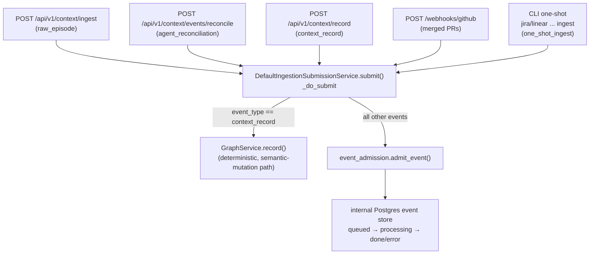

# Ingestion, the Event Ledger(s) & the Nudge Trigger Model

> Status: reflects code on `main` @ `8dd175bc`, last reviewed 2026-06-29.

This doc covers how source events get *into* the Context Graph, and how the
zero-token **nudge** model gets the *right slice back out* to an in-session agent
at the right moment. Both subsystems have drifted hard from their original
designs, so read the orientation first.

The two things this doc most wants you to internalise:

1. **There are two completely different "ledgers."** One is real and live (an
   internal Postgres event store); the other is a mostly-stubbed external seam
   (the *Event Ledger* product). The old docs conflate them.
2. **Scanners and most connectors are gone.** Repo/PR/ticket ingestion is now
   either harness-led (skills authoring semantic mutations) or a CLI one-shot
   flow — not an in-process scanner library. The canonical write door for
   everything that lands as a *fact* is still `graph propose` → `graph commit
   --verify` (see [writing.md](./writing.md)).

---

## 1. Two "ledgers" — do not conflate them

| | Internal event store (REAL) | External Event Ledger (SEAM) |
|---|---|---|
| What it is | Postgres tables where every inbound episode/event/record lands and gets a lifecycle | A separate managed/self-hosted service that owns provider creds, webhooks, and normalized source history |
| Code | `adapters/outbound/postgres/{reconciliation_ledger,ingestion_event_store,batch_repository,ledger}.py` | `domain/ports/ledger/{client,cursor}.py` + `adapters/outbound/ledger/{managed,self_hosted}_client.py` |
| Lifecycle vocabulary | **`queued / processing / done / error`** | n/a (clients are stubs) |
| "Cursor" concept | none — it is a work queue, not a pull source | per-`(pot, source)` cursor that `fetch` advances |
| State today | live, used by the HTTP ingestion server | **mostly TODO stubs** — `ledger pull/query/status` is non-functional against any real provider (see §6) |

The lifecycle vocabulary correction matters: the live store uses
`queued/processing/done/error`, **not** the old docs' six-state
`pending/processing/applied/failed_retryable/failed_terminal/timed_out`. That
six-state list described the *external* ledger consumer, which does not exist
yet. The **"cursor" concept belongs only to the external Event Ledger** — the
internal Postgres store has no cursor.

---

## 2. How raw episodes/events enter

Ingestion is a property of the **second composition root** — the HTTP ingestion
server (`bootstrap/ingestion_server.py`, default backend `neo4j`), which is
distinct from the local agent spine (`build_host_shell()`, default
`falkordb_lite`). The local OSS CLI/daemon path does **not** run this server;
local repo baseline is harness-led via skills. See
[architecture.md](./architecture.md) for the two-root split.

All inbound surfaces normalize to a single `IngestionSubmissionRequest`
(`domain/ingestion_event_models.py`) and call
`DefaultIngestionSubmissionService.submit()`
(`application/services/ingestion_submission_service.py`).



### Entry points

| Surface | Kind / route | Notes |
|---|---|---|
| `POST /api/v1/context/ingest` | `raw_episode` (`submit_raw_episode.py`) | The old synchronous direct-write path is **gone** — raw episodes always go through the async DB pipeline (`202`/`queued`, or `200`/`applied` with `sync=true`). Requires `DATABASE_URL`. |
| `POST /api/v1/context/events/reconcile` | `agent_reconciliation` | The canonical event-submission path; deduped by scope + `source_system` + `source_id`. |
| `POST /api/v1/context/record` | `context_record` (`record_durable_context.py`) | **The deterministic exception** — see §3. |
| `POST /webhooks/github` | `agent_reconciliation` | `GitHubConnector.normalize_webhook()` verifies HMAC (fail-closed unless `CONTEXT_ENGINE_ALLOW_UNSIGNED_WEBHOOKS=1`), emits a `ContextEvent` for merged PRs, maps repo→pot, stamps a server-trusted `webhook` Actor. |
| CLI one-shot ingest | `one_shot_ingest` (`commands/pots.py`) | `potpie jira project <KEY> ingest` / `potpie linear team <KEY> ingest` POST a single event through the API client into the same agent pipeline. |

For non-record events, `_do_submit` resolves pot/repo/source_id and calls
`event_admission.admit_event(...)`: persist the event (idempotent on
`scope + source_id` → `duplicate`), upsert it into the pot's open batch, and
either enqueue immediately or leave it for the flusher (windowed mode, §5). It
also persists the ingress W3C `traceparent` onto the row's `correlation_id` so
the later fan-in span can link back (see [observability.md](./observability.md)).

---

## 3. The deterministic `context_record` exception

`event_type == "context_record"` is detected inside `_do_submit` and routed to
`GraphService.record(...)` — the **semantic-mutation path**, *not* the
reconciliation agent. This is the one ingestion entry that produces a fact
deterministically, with no LLM in the loop. P6 structured payloads
(`domain/context_records.py`: `fix` / `bug_pattern` / `preference` / `decision` /
`verification`) are validated here and embedded into
`payload["record"]["structured"]`.

`record` is the same write that backs the local CLI `potpie record` and the MCP
`context_record` tool (the only MCP write). It is **Spine B** — the immediate
`DefaultGraphService.mutate` path via the record→semantic bridge. Full mechanics
live in [writing.md](./writing.md); the point here is only that
`context_record` short-circuits the async reconciliation pipeline entirely.

---

## 4. Scanners gone; connectors trimmed to github + notion

This is the biggest ingestion correction versus the old docs.

- **Scanners are DELETED.** `adapters/outbound/scanners/` holds only stale
  `__pycache__` (codeowners / openapi / kubernetes / dependency-manifest /
  default_registry) — no `.py` source remains (removed in commit `5af8ea5f`,
  "mega-removal of dead CE surface"). Repo-baseline ingestion is now
  **harness-led**: the `potpie-repo-baseline` and `potpie-source-ingestion`
  skills author semantic mutations through `graph propose` → `graph commit --verify`
  (see [skills.md](./skills.md)).
- **Only `github` + `notion` remain as outbound `SourceConnectorPort`
  connectors** (`adapters/outbound/connectors/{github,notion}/` + `_bench_stubs.py`).
  `connectors/jira/` and `connectors/linear/` are stale `.pyc` only.
  Connectors implement `kind / capabilities / list_artifacts / normalize_webhook
  / fetch`; `propose_plan` was removed, so **connectors no longer write claims**.
- **jira/linear are a CLI + agent flow, not connectors.** The `one_shot_ingest`
  events are processed by the reconciliation agent using event playbooks
  (`domain/event_playbooks.py`) + the `backfill-enumerate-drain` skill; the
  actual jira/linear *reads* live in
  `adapters/outbound/cli_auth/{atlassian_read_client,linear_read_client}.py`.

---

## 5. Windowed batching + reconciliation

> **Roadmap (not yet wired) for OSS:** service-side LLM reconciliation is
> **parked / non-canonical** and **off by default**.
> `domain/reconciliation_flags.py agent_planner_enabled()` defaults to `False`
> (opt-in via `CONTEXT_ENGINE_AGENT_PLANNER_ENABLED=1`, or per-batch via
> playbooks). The `factory.py` docstring's "default: on" is wrong. Canonical
> writes come from harness-authored semantic mutations + the deterministic
> `context_record` path — not from this agent. (Other reconciliation flags
> *do* default on: infer-labels, conflict-detect, auto-supersede, causal-expand,
> strict-extraction, ontology-soft-fail.)

When events do flow through the async pipeline, the shape is:

1. **Batching** — `admit_event` coalesces events into a pot's single open
   `pending` batch (`domain/reconciliation_batch.py` states:
   `pending/claimed/running/done/failed`). Per-pot config (`immediate` vs
   `windowed`, `window_minutes` default **5**, `min_batch_size`) is set at
   `PUT /pots/{id}/ingestion-config`.
2. **Flush** — `flush_windowed_batches.flush_ready_windowed_pots` (periodic)
   enqueues every windowed pot whose batch aged past the window or exceeded min
   size; `force_flush_pot` backs `POST /pots/{id}/ingest/flush`.
3. **Worker** — `context_graph_jobs.handle_process_batch` rebuilds the
   container, claims the batch, opens the fan-in **`batch.process`** span linked
   to each event's ingress trace, and calls `process_batch.process_batch`.
4. **process_batch** authorizes `apply.write` **once** (a single policy
   boundary), splits events into chunks of `CONTEXT_ENGINE_MAX_CHUNK_EVENTS`
   (default **20**), runs `ReconciliationAgentPort.run_batch` per chunk with a
   fresh pydantic-ai message history (cross-chunk state lives in the graph, not
   the prompt), and is crash-resumable via the durable agent execution log. It
   marks events `reconciled`/`failed`, opens a per-event **`reconciliation_run`**
   ledger row (`context_reconciliation_runs`), and streams liveness as NDJSON.
5. **The agent** (`adapters/outbound/reconciliation/{factory,pydantic_deep_agent,
   noop_agent,context_graph_tools}.py`) writes `:RELATES_TO` edges through the
   one backend write door (`apply_plan`, [writing.md](./writing.md)) — using a
   **separate** server-side skill surface (`backfill-enumerate-drain`,
   `graph-mutation-plan`) that must never be conflated with the user-installed
   bundle skills ([skills.md](./skills.md)).

The spans on this path are the fan-in **`batch.process`** and the per-chunk
**`agent.run_batch`** (the per-event `reconciliation_run` is a durable ledger
row, not a span); all are catalogued in [observability.md](./observability.md).

---

## 6. The external Event Ledger + cursors

> **Roadmap (not yet wired):** the external Event Ledger clients are TODO stubs.
> `adapters/outbound/ledger/managed_client.py` and `self_hosted_client.py`:
> `fetch` returns an empty `LedgerPage`, `query` raises
> `CapabilityNotImplemented`, `health` reports `available=False`. So
> `potpie ledger pull/query/status` exists as a command surface but is
> **non-functional against any real provider today**.

The **design** (ports `domain/ports/ledger/client.py EventLedgerClientPort` +
`domain/ports/ledger/cursor.py LedgerCursorStorePort`):

- A managed/self-hosted service owns provider credentials, webhooks, and
  normalized source history.
- The local daemon only *pulls* normalized `LedgerEvent`s and advances a
  per-`(pot, source)` cursor; it never owns provider creds.
- A harness turns pulled events into semantic mutations — the ledger is **not**
  the graph source of truth.

`EventLedgerClientPort` surface: `fetch` (cursor-advancing pull), `query`
(read-only history that never moves the cursor), `sources`, `health`. Only
`FixtureEventLedgerClient` (in-process, tests) does real paging today, and
`LocalLedgerCursorStore` persists cursors to `~/.potpie/ledger_cursors.json`
keyed `pot:source`. CLI flags for `ledger pull/query/use/disconnect` are listed
in [cli-flow.md](./cli-flow.md).

---

## 7. The zero-token "nudge" trigger model

Nudges are how durable graph memory reaches an in-session agent **without
spending tokens to ask for it** — a mechanical hook reads the graph at lifecycle
moments and injects the relevant slice (or a directive) into the agent's
context. The whole trigger brain is **deterministic — no model on this path**;
similarity uses the bundled local embedder only.

Three model-free layers:

### 7.1 Policy (`domain/nudge.py`)

`NudgeEvent` is a 6-value enum, each mapped to exactly one `NudgePolicy` by
`NUDGE_POLICIES` (an import-time `_check_nudge_policies_coherent()` enforces
one-policy-per-event). A policy's `direction` is either **data** (read named
graph views and inject evidence) or **instruction** (return a fixed write-prompt
for the agent to act on — never an auto-write):

| Event | Direction | What it does |
|---|---|---|
| `session_start` | data | read scoped baseline views |
| `pre_edit` | data | read views relevant to the file/scope being edited |
| `pre_deploy` | data | read deploy-relevant views |
| `test_failed` | data | reads `debugging.prior_occurrences` + `recent_changes.timeline` |
| `test_passed` | instruction | prompt the agent to record a `REPRODUCES`/`RESOLVED` claim |
| `stop` | instruction | prompt the agent to record durable learnings |

Data policies name `NudgeViewSpec`s (which `domain.graph_views` view to read);
the views themselves are owned by [querying.md](./querying.md).

> `NudgePolicy.triggers_ingest` is **dead** — `NudgeService` never reads it, the
> hook never runs ingest, and the top-level `potpie ingest` command was removed
> in `5af8ea5f`. A nudge never ingests; it only reads or instructs.

### 7.2 Executor (`application/services/nudge_service.py NudgeService`)

Composes the single read trunk (`GraphReadPort.read` over a named view,
similarity via the **local embedder only**) plus a per-session
`InjectionLedgerPort`:

- **Data events** — read each view, globally rank by score, drop
  already-injected/duplicated keys, budget to top-K, and return a compact
  source-ref-first block (`description` > `summary` > `fact`, plus scope bits and
  `src=`).
- **Instruction events** — return the directive string verbatim.
- Returns `silent=True` when nothing is fresh/relevant.

`NudgeService` is wired in `host_wiring.py` as `NudgeService(graph=graph,
ledger=LocalInjectionLedger())` and exposed on `HostShell.nudge`; it runs
**in-process**.

### 7.3 Dedup ledger (`adapters/outbound/session/injection_ledger.py`)

`LocalInjectionLedger` persists injected keys per session to
`~/.potpie/nudge_sessions.json` (atomic write, bounded to 500 sessions) so dedup
**survives across the short-lived hook processes within one session**.
`InMemoryInjectionLedger` is the test double.

### 7.4 The CLI surface

```
potpie graph nudge --event <e> --session <id> [--path --query --scope --pot --limit]
```

routes to `host.nudge.nudge(GraphNudgeRequest)`. Full flags are in
[cli-flow.md](./cli-flow.md).

### 7.5 The fail-safe Claude Code hook

`adapters/inbound/cli/templates/claude_plugin/hooks/potpie_nudge.py` is the thin
adapter that turns harness lifecycle events into nudge events and shells
`potpie --json graph nudge`. Event mapping:

- `SessionStart` → `session_start`
- `PreToolUse(Write|Edit|MultiEdit|NotebookEdit)` → `pre_edit`
- `PreToolUse(Bash)` → `pre_deploy` (only on deploy markers)
- `PostToolUse(Bash)` → `test_failed` / `test_passed` (only on test markers; exit
  code → `N failed` count → anchored markers)
- ambiguous → silent

It renders results as Claude `hookSpecificOutput.additionalContext` (or
`systemMessage` at `Stop`). **Fail-safe by construction**: any error, missing
binary, or unparseable payload → exit 0 with no output, so the hook can never
break the user's session. It tolerates both the V1.5 flat and the V2
`result`-wrapped envelope shapes. Hook env knobs:
`POTPIE_HOOK_DEBUG` / `POTPIE_HOOK_TIMEOUT` / `POTPIE_BIN` / `POTPIE_POT`.

The agent's half of the loop (how to act on an injected slice vs a directive) is
taught in the `potpie-graph` skill's "Responding To Nudges" — see
[skills.md](./skills.md).

---

## See also

- [writing.md](./writing.md) — the `record`→semantic bridge, the semantic DSL,
  and the canonical `propose` → `commit --verify` write door.
- [skills.md](./skills.md) — harness-led repo/source ingestion skills, the
  separate server-side reconciliation skill surface, and "Responding To Nudges."
- [architecture.md](./architecture.md) — the two composition roots / two HTTP
  roots that this doc's ingestion server vs local spine split rests on.
- [querying.md](./querying.md) — the named views a nudge reads.
- [cli-flow.md](./cli-flow.md) — full flags for `ledger ...`, `graph nudge`, and
  the jira/linear one-shot ingest commands.
- [observability.md](./observability.md) — `batch.process` / `agent.run_batch`
  spans (and the `reconciliation_run` ledger row) and ingestion metrics.
