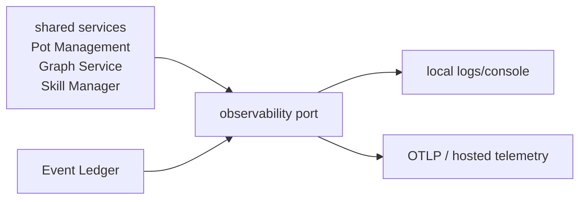

# Observability

Last reviewed: 2026-05-29.

Observability must work locally without making OSS installs heavy, and it must
scale up to hosted tracing, metrics, logs, readiness, and cost telemetry in
managed graph and Event Ledger deployments.

## Shape



Default behavior:

- Local OSS ships with local logs only.
- No remote telemetry is enabled unless explicitly configured.
- Managed graph and managed ledger deployments enable hosted telemetry through
  deployment config.
- Core code emits through observability ports, not vendor SDKs.

## Configuration

```bash
CONTEXT_ENGINE_OBSERVABILITY=console          # off | console | 1
CONTEXT_ENGINE_LOG_FORMAT=json                # plain | json
CONTEXT_ENGINE_LOG_LEVEL=INFO
OTEL_EXPORTER_OTLP_ENDPOINT=http://otel-collector:4317
OTEL_SERVICE_NAME=context-engine
```

OTLP export belongs behind optional dependencies and explicit config.

## Trace Map

The `Code boundary` column names the module/port a span instruments, so spans
attach to the same seams the Code Map (architecture.md) defines.

| Span | Meaning | Code boundary |
|---|---|---|
| `daemon.request` | Local daemon request. | `host/shell.py`, `host/daemon.py` |
| `pot.status`, `pot.create`, `pot.reset`, `pot.export` | Pot Management operations. | `PotManagementService` (`application/services/pot_management.py`) |
| `context.resolve`, `context.search`, `context.record`, `context.status` | Four-tool operations. | `AgentContextPort` (`application/services/agent_context.py`) + `GraphService` |
| `reader.{include}` | Reader execution. | `application/readers/`, `read_orchestrator.py` |
| `scanner.{name}` | Scanner execution. | `adapters/outbound/scanners/` |
| `ledger.query`, `ledger.pull`, `ledger.cursor.update` | Graph consuming an Event Ledger. | `LedgerFacade` (`host/shell.py`), `EventLedgerClientPort`, `LedgerCursorStorePort` |
| `graph.write`, `graph.query`, `graph.inspect` | Backend capability calls. | `GraphBackend` ports (`domain/ports/graph/`) |
| `semantic.search` | Vector semantic retrieval. | `SemanticSearchPort` (`domain/ports/graph/semantic.py`) |
| `snapshot.export`, `snapshot.import` | Portable pot snapshot operations. | `GraphSnapshotPort` (`domain/ports/graph/snapshot.py`) |
| `skill.catalog.fetch`, `skill.install`, `skill.update`, `skill.remove` | Skill Manager operations. | `SkillManager` + `AgentTargetPort` (`domain/ports/services/skill_manager.py`) |
| `event_ledger.receive`, `event_ledger.normalize`, `event_ledger.append` | Event Ledger connector/webhook work. | Event Ledger service (external) |
| `ingestion.ledger_events` | Pulled Event Ledger batch processed into graph records/claims. | consumer ingestion ledger + processing harness + `GraphService` |
| `ingestion.retry`, `ingestion.dead_letter` | Consumer-side event retry/dead-letter handling. | consumer ingestion ledger |

Batch ingestion traces should link source events to ingestion processing runs
instead of pretending delayed fan-in is one synchronous request.

## Metrics

Minimum counters:

- `ce.resolve.total{result}`
- `ce.record.total{result,record_type}`
- `ce.pot.operation_total{operation,result}`
- `ce.scanner.total{result,scanner}`
- `ce.graph.write_total{result}`
- `ce.graph.query_total{result}`
- `ce.semantic.search_total{result,adapter}`
- `ce.skill.operation_total{operation,result,agent}`
- `ce.daemon.restart_total`
- `ce.ledger.pull_total{result,source,binding}`
- `ce.ledger.query_total{result,source,binding}`
- `ce.ingestion.ledger_event_total{state,source,binding}`
- `ce.ingestion.retry_total{result,source,binding}`
- `ce.ingestion.dead_letter_total{source,binding}`
- `ce.event_ledger.events_total{result,source}` for ledger deployments

Useful latency histograms:

- `ce.resolve.latency_ms`
- `ce.reader.latency_ms{include}`
- `ce.graph.write_ms`
- `ce.graph.query_ms`
- `ce.semantic.search_ms`
- `ce.scanner.latency_ms{scanner}`
- `ce.ledger.pull_ms{source,binding}`
- `ce.ledger.query_ms{source,binding}`
- `ce.ingestion.ledger_event_ms{source,binding}`
- `ce.event_ledger.receive_ms{source}`

Readiness gauges:

- `ce.daemon_up`
- `ce.dependency_up{dependency}`
- `ce.graph_backend_up`
- `ce.ledger_cursor_lag{source,binding}`
- `ce.ingestion_retry_backlog{source,binding}`
- `ce.ingestion_dead_letter_backlog{source,binding}`
- `ce.event_ledger_up`

## Logging

Every request, daemon action, or ledger action should carry:

- request id;
- active pot id and origin (`local` or `managed`);
- profile (`local` or `managed`) and configured managed backend URL host when safe;
- ledger binding (`none`, `managed`, or `self_hosted`) when relevant;
- service boundary (`daemon`, `pot_management`, `graph_service`,
  `graph_backend`, `skill_manager`, `scanner`, `managed_api`,
  `event_ledger`);
- backend name when safe.

Local logs must be discoverable from:

```bash
potpie daemon logs
potpie doctor
```

## Readiness

Readiness is reported by the same owner sections used by `context_status`.
`potpie doctor` may include deeper diagnostics, but it should preserve these
boundaries instead of flattening every dependency into one status bit.

Local readiness checks:

- daemon process and version;
- local auth/IPC;
- local state DB and migrations;
- active pot;
- registered sources;
- Graph Service;
- active GraphBackend name/capabilities;
- semantic index and embedder;
- scanner registry;
- Skill Manager catalog and installed-vs-recommended skills.
- optional Event Ledger binding, auth, graph consumer cursors, cursor lag,
  retry backlog, timed-out leases, and dead-letter backlog.

Managed readiness adds:

- managed backend API hosting Pot Management, Graph Service, and Skill Manager;
- auth/policy dependencies;
- hosted graph/search profile;
- operational DB;
- queue/worker dependencies;
- cloud skill-sync readiness.

Event Ledger readiness is separate:

- ledger API;
- ledger store;
- event query/filter API;
- connector/webhook health;
- configured source connectors;
- per-source provider cursor/write lag;
- auth to third-party providers.

Liveness and readiness are separate. A daemon can be live while graph storage or
semantic search is not ready.
