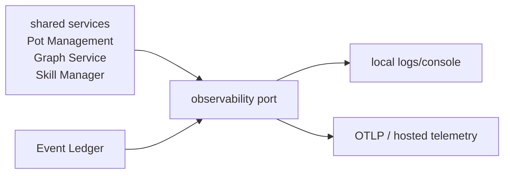

# Observability

Last reviewed: 2026-05-29.

Observability must work locally without making OSS installs heavy, and it must
scale up to hosted tracing, metrics, logs, readiness, and cost telemetry in
managed graph and Event Ledger deployments.

## Shape



Default behavior:

- Local OSS ships with local logs only.
- No remote telemetry is enabled unless explicitly configured.
- Managed graph and managed ledger deployments enable hosted telemetry through
  deployment config.
- Core code emits through observability ports, not vendor SDKs.

## Configuration

```bash
CONTEXT_ENGINE_OBSERVABILITY=console          # off | console | 1
CONTEXT_ENGINE_LOG_FORMAT=json                # plain | json
CONTEXT_ENGINE_LOG_LEVEL=INFO
OTEL_EXPORTER_OTLP_ENDPOINT=http://otel-collector:4317
OTEL_SERVICE_NAME=context-engine
```

OTLP export belongs behind optional dependencies and explicit config.

## Trace Map

| Span | Meaning |
|---|---|
| `daemon.request` | Local daemon request. |
| `pot.status`, `pot.create`, `pot.reset`, `pot.export` | Pot Management operations. |
| `context.resolve`, `context.search`, `context.record`, `context.status` | Four-tool Graph Service operations. |
| `reader.{include}` | Reader execution. |
| `scanner.{name}` | Scanner execution. |
| `ledger.pull`, `ledger.cursor.update` | Local or managed graph consuming an Event Ledger. |
| `graph.write`, `graph.query`, `graph.inspect` | Backend capability calls. |
| `semantic.search` | Vector semantic retrieval. |
| `snapshot.export`, `snapshot.import` | Portable pot snapshot operations. |
| `skill.catalog.fetch`, `skill.install`, `skill.update`, `skill.remove` | Skill Manager operations. |
| `event_ledger.receive`, `event_ledger.normalize`, `event_ledger.append` | Event Ledger connector/webhook work. |
| `reconciliation.run` | Event batch to graph records/claims. |

Batch ingestion traces should link source events to reconciliation runs instead
of pretending delayed fan-in is one synchronous request.

## Metrics

Minimum counters:

- `ce.resolve.total{result}`
- `ce.record.total{result,record_type}`
- `ce.pot.operation_total{operation,result}`
- `ce.scanner.total{result,scanner}`
- `ce.graph.write_total{result}`
- `ce.graph.query_total{result}`
- `ce.semantic.search_total{result,adapter}`
- `ce.skill.operation_total{operation,result,agent}`
- `ce.daemon.restart_total`
- `ce.ledger.pull_total{result,source,binding}`
- `ce.event_ledger.events_total{result,source}` for ledger deployments

Useful latency histograms:

- `ce.resolve.latency_ms`
- `ce.reader.latency_ms{include}`
- `ce.graph.write_ms`
- `ce.graph.query_ms`
- `ce.semantic.search_ms`
- `ce.scanner.latency_ms{scanner}`
- `ce.ledger.pull_ms{source,binding}`
- `ce.event_ledger.receive_ms{source}`

Readiness gauges:

- `ce.daemon_up`
- `ce.dependency_up{dependency}`
- `ce.graph_backend_up`
- `ce.ledger_cursor_lag{source,binding}`
- `ce.event_ledger_up`

## Logging

Every request, daemon action, or ledger action should carry:

- request id;
- active pot id;
- profile (`local` or `managed`);
- ledger binding (`none`, `managed`, or `self_hosted`) when relevant;
- service boundary (`daemon`, `pot_management`, `graph_service`,
  `graph_backend`, `skill_manager`, `scanner`, `managed_api`,
  `event_ledger`);
- backend name when safe.

Local logs must be discoverable from:

```bash
potpie daemon logs
potpie doctor
```

## Readiness

Local readiness checks:

- daemon process and version;
- local auth/IPC;
- local state DB and migrations;
- active pot;
- registered sources;
- Graph Service;
- active GraphBackend name/capabilities;
- semantic index and embedder;
- scanner registry;
- Skill Manager catalog and installed-vs-recommended skills.
- optional Event Ledger binding, auth, source cursors, and cursor lag.

Managed readiness adds:

- managed API server hosting Pot Management, Graph Service, and Skill Manager;
- auth/policy dependencies;
- hosted graph/search profile;
- operational DB;
- queue/worker dependencies;
- cloud skill-sync readiness.

Event Ledger readiness is separate:

- ledger API;
- ledger store;
- connector/webhook health;
- configured source connectors;
- per-source cursor/write lag;
- auth to third-party providers.

Liveness and readiness are separate. A daemon can be live while graph storage or
semantic search is not ready.
