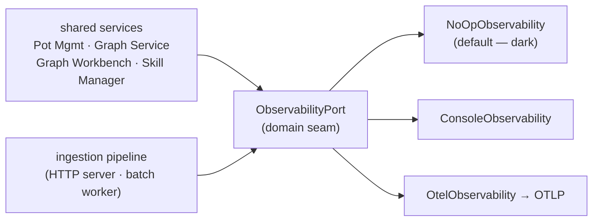

# Observability

> Status: reflects code on `main` @ `8dd175bc`, last reviewed 2026-06-29.

Observability is a thin, backend-neutral **port** (`domain/ports/observability.py
ObservabilityPort`) that the domain and application layers emit spans and metrics
through. They never import `opentelemetry` directly — that import lives only inside
the OTel adapter, which is what keeps the backend swappable (OTLP → Tempo/Prometheus
today, anything else tomorrow). The default sink is `NoOpObservability`: every call
site is safe to invoke unconditionally, and a local CLI/daemon stays completely dark
unless an operator opts in. Observability never raises into a caller — it can never
fail a request.

Both composition roots wire the same port: the local agent spine
(`bootstrap/host_wiring.py`) and the ingestion HTTP server
(`bootstrap/ingestion_server.py`) — see [architecture.md](./architecture.md).

## Shape



Default behavior:

- Local OSS is **dark by default** (`NoOpObservability`); no spans, metrics, or remote
  telemetry leave the process unless explicitly configured.
- Logs always work (stdlib logging), but structured/JSON output and trace correlation
  are opt-in.
- Core code emits through the observability port, not vendor SDKs. The OTel adapter
  (`adapters/outbound/observability/otel.py`) is the *only* `opentelemetry` import.

## Configuration

```bash
# Sink selection (unset / 0 / false / off => NoOp, the default)
CONTEXT_ENGINE_OBSERVABILITY=console     # off | console | <any-truthy => OTLP>

# OTLP export only activates when an endpoint is present (else falls back to NoOp)
OTEL_EXPORTER_OTLP_ENDPOINT=http://otel-collector:4317
OTEL_EXPORTER_OTLP_TRACES_ENDPOINT=...   # alternative to the line above
OTEL_SERVICE_NAME=context-engine         # default: context-engine

# Logging (independent of the trace/metric sink)
CONTEXT_ENGINE_LOG_FORMAT=json           # plain (default) | json
CONTEXT_ENGINE_LOG_LEVEL=INFO            # default: INFO
```

`bootstrap/observability_wiring.py default_observability()` resolves the sink:
`console` builds `ConsoleObservability` (dependency-free trace skeleton); any other
truthy value builds `OtelObservability` **only if** an OTLP endpoint is set, otherwise
it stays NoOp. A missing OTel extra or any setup failure also degrades silently to
NoOp. OTLP export therefore lives behind optional dependencies and explicit config.

## The port

`ObservabilityPort` (`domain/ports/observability.py`) exposes:

- `span(name, *, kind, attributes, links)` — context manager yielding a `Span`
  (`set_attribute(s)` / `add_event` / `record_exception` / `set_error`). `kind` is a
  small string set mapped to the OTel enum inside the adapter: `internal` (default),
  `server`, `client`, `producer`, `consumer`. `links` is a sequence of W3C
  `traceparent` strings — how the batch trace links back to each event's ingress trace.
- `current_traceparent()` — W3C traceparent of the active span (persisted into
  `context_events.correlation_id` at admission so the async batch can correlate across
  the windowed delay).
- `baggage(**items)` — attaches OTel baggage around the reconciliation agent run so the
  child spans pydantic-ai emits inherit pot/batch/run/event ids.
- `counter` / `histogram` / `gauge` — metric primitives.

### Correlation spine

`bootstrap/observability_context.py` carries a fixed, documented correlation key set
in a single `contextvars` var: **`trace_id, pot_id, event_id, batch_id, run_id, seq,
chunk, source`**. Anything outside this set is dropped so log/trace cardinality stays
bounded. Keys are bound at ingress and re-bound inside the batch worker, and injected
into every log record (see Logging) so any line or span ties back to its event.

## Trace Map

The `Code boundary` column names the module each span instruments, so spans attach to
the same seams the Code Map in [architecture.md](./architecture.md) defines. These are
the spans actually emitted today.

| Span | Kind | Meaning | Code boundary |
|---|---|---|---|
| `daemon.health`, `daemon.rpc`, `daemon.attr` | server | Local daemon health probe + RPC dispatch. | `host/daemon_main.py` |
| `graph.<command>` | internal | One workbench command: `graph.status`, `graph.catalog`, `graph.describe`, `graph.search_entities`, `graph.read`, `graph.neighborhood`, **`graph.propose`**, **`graph.commit`**, `graph.bulk`, `graph.history`, `graph.inbox` (carries `operation`), `graph.quality` (carries `report`), plus the legacy `graph.mutate` / `graph.mutation_template` / `graph.nudge`. | `potpie/cli/commands/graph.py` (`_graph_command`) |
| `ingest.submit` | server | Inbound episode/event/record normalized and submitted. | `application/services/ingestion_submission_service.py` |
| `HTTP <method> <route>`, `http.ready` | server | Ingestion HTTP server request + readiness. | `adapters/inbound/http/_hardening.py`, `adapters/inbound/http/api/router.py` |
| `batch.process` | consumer | Windowed batch fan-in (N events → 1 run → M mutations); **links back** to each event's ingress traceparent. | `application/use_cases/context_graph_jobs.py` |
| `agent.run_batch` | internal | One reconciliation-agent chunk run. Emitted only when the agent planner is enabled (off by default). | `application/use_cases/process_batch.py` |
| `<prefix>.<op>` | client | Public methods of an instrumented infra adapter (e.g. `neo4j.<op>`), wrapped at the composition root. | `bootstrap/observability_proxy.py` (`instrument_adapter`) |

`graph.propose` and `graph.commit` are the canonical write-door spans (propose →
commit `--verify`); `graph.mutate` is the legacy wrapper that internally proposes then
commits. See [writing.md](./writing.md).

Notes:

- **Reads do not emit per-reader spans.** The `subgraph`/`view`/`match_mode` ride as
  attributes on `graph.read`; the read trunk (`ReadOrchestrator` → 9 readers →
  `EnvelopeBuilder`) is described in [querying.md](./querying.md).
- The per-event **`reconciliation_run`** is a durable ledger row
  (`context_reconciliation_runs`), *not* a span. It is linked to `batch.process` by
  `run_id` and surfaced through `graph status` / the explorer UI.
- Batch ingestion uses **span links**, not a single synchronous parent, so delayed
  fan-in is represented honestly rather than as one long request. See
  [ingestion-nudge.md](./ingestion-nudge.md).

> **Roadmap (not yet wired):** external Event Ledger spans (`ledger.pull`,
> `ledger.query`, `ledger.cursor.update`). The managed/self-hosted ledger clients are
> TODO stubs, so these paths are non-functional against real providers today (see
> [ingestion-nudge.md](./ingestion-nudge.md)). Do not confuse the external Event Ledger
> with the live internal Postgres event store, which *is* instrumented above.

## Metrics

All metric names are `ce.*`. Graph-workbench and batch metrics are mirrored to both the
`ObservabilityPort` and a Sentry metrics runtime.

Workbench commands (`potpie/cli/commands/graph.py`) — one counter +
histogram per command root:

- `ce.graph.<root>_total` and `ce.graph.<root>_ms` for each root (`read`, `propose`,
  `commit`, `catalog`, `status`, `describe`, `search_entities`, `neighborhood`,
  `history`, `inbox`, `quality`, `bulk`, `mutate`, …). Bounded label set:
  `{result, error_code, pot_id, subgraph, view, risk, status, operation, report,
  backend_profile, match_mode}`.

CLI envelope:

- `ce.cli.invocations_total`, `ce.cli.duration_ms`.

Ingestion pipeline (the live internal event store + batch worker):

- `ce.ingest.events_total`, `ce.ingest.dedup_total` (admission);
- `ce.batch.started_total`, `ce.batch.finished_total`, `ce.batch.reaped_total`;
- `ce.batch.time_in_pending_ms` — the windowed-5min canary: if the flusher wedges,
  this screams first;
- `ce.events.reconciled_total`, `ce.events.failed_total`.

Reconciliation agent + cost telemetry (only when the planner is enabled):

- `ce.agent.tool_calls`, `ce.agent.timeout_total`;
- `ce.llm.calls_total`, `ce.llm.input_tokens_total`, `ce.llm.output_tokens_total`,
  `ce.llm.tokens_total`, `ce.llm.latency_ms`.

Instrumented infra adapters (`instrument_adapter`):

- `ce.<prefix>.query_ms{op}`, `ce.<prefix>.errors_total{op}` (e.g. `ce.neo4j.*`).

Setup + quality/drift:

- `ce.setup.runs_total`, `ce.setup.step_total`;
- gauges `ce.drift.missing_coverage`, `ce.drift.open_conflicts`,
  `ce.drift.source_access_gaps`, `ce.drift.stale_refs`,
  `ce.drift.verification_failed_refs`.

Readiness:

- gauge `ce.dependency_up{dependency}`.

> **Roadmap (not yet wired):** external Event Ledger metric families (`ce.ledger.*`,
> `ce.event_ledger.*`) are not emitted — the ledger clients are stubs.

## Logging

Logging is configured in one place (`bootstrap/logging_setup.py configure_logging()`,
idempotent, stdlib-only). A `CorrelationFilter` attaches the active correlation keys
(above) to every record, so any log line can be tied back to its trace / event / pot /
batch / run. Two formats:

- **`plain`** (default) — human format that still surfaces the trace:
  `… [trace=… event=… pot=…] message`.
- **`json`** — one JSON object per line: `ts/level/logger/msg` + the present
  correlation keys + any structured `extra=` fields (including the `audit` channel,
  which was previously dropped on the floor).

Every request, daemon action, or pipeline step should therefore carry: the active
`trace_id`/`request id`, `pot_id`, the `event/batch/run` ids when in the async pipeline,
and the service-boundary logger name (`daemon`, `pot_management`, `graph_service`,
`graph_backend`, `skill_manager`, `ingestion`, …). Backend name is included where safe.

Local logs are discoverable from:

```bash
potpie daemon logs
potpie doctor
```

> **Roadmap (not yet wired):** managed-profile log fields (`origin`/`profile`
> `managed`, managed backend URL host, `ledger binding` `managed`/`self_hosted`) apply
> only once managed routing and the external ledger ship — both currently raise
> `CapabilityNotImplemented` / are stubs.

## Readiness

Liveness and readiness are separate: a daemon can be **live** while graph storage or
semantic search is **not ready**. Readiness is composed, not flattened — `potpie
doctor` assembles `backend.capabilities()` + `backend.mutation.readiness()`
(`BackendReadiness`) + `daemon.status()` + `ledger.status()`, and `potpie graph status`
returns `data_plane_status`. Deeper `doctor` diagnostics should preserve these owner
boundaries rather than collapsing every dependency into one status bit. (Full command
flags in [cli-flow.md](./cli-flow.md).)

Local readiness checks:

- daemon process and version;
- active pot;
- registered sources;
- Graph Service, plus the active `GraphBackend` name and its capability set (which of
  the six ports are real vs fail-closed — see [architecture.md](./architecture.md));
- semantic index and embedder (bundled local embedder by default);
- Skill Manager catalog and installed-vs-recommended skills.

> **Roadmap (not yet wired):** managed-backend readiness (hosted Pot Management / Graph
> Service / Skill Manager, auth/policy, hosted graph/search profile, queue/worker
> dependencies, cloud skill-sync) and external Event Ledger readiness (ledger API,
> store, connector/webhook health, per-source cursor/lag, third-party provider auth).
> `ledger.status()` exists, but its managed/self-hosted clients are stubs, so the
> ledger surface reports unavailable rather than real provider state.

## See also

- [architecture.md](./architecture.md) — composition roots, the Code Map, the
  `GraphBackend` port + capability coverage table.
- [ingestion-nudge.md](./ingestion-nudge.md) — the internal Postgres event store vs the
  external Event Ledger seam; windowed batching and the batch worker.
- [cli-flow.md](./cli-flow.md) — `doctor`, `daemon logs`, `graph status` command flags.
- [writing.md](./writing.md) — the propose → commit write door behind `graph.propose` /
  `graph.commit`.
