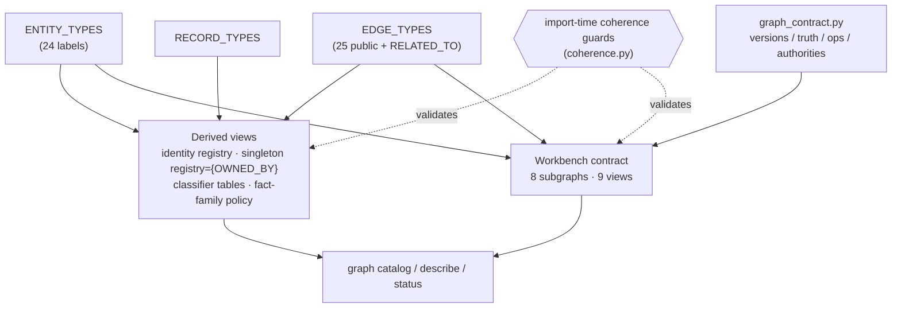

# Ontology & Graph Contract

> Status: reflects code on `main` @ `8dd175bc`, last reviewed 2026-06-29.

This document is the canonical reference for Potpie's **ontology and graph
contract** — the static, spec-driven layer that the shipped `potpie graph
catalog` / `describe` / `status` commands return, sitting above the V1.5 data
plane. It replaces the older `workbench-ontology.md`, whose entity and relation
catalogs were aspirational; the catalogs below are enumerated from code.

The contract is **declarative**. It is built from three catalogs plus a
contract-constants module; everything else (identity registry, singleton
registry, classifier tables, ranker inputs, the agent-facing surface) is a
**view** over those catalogs, and import-time coherence checks fail startup loud
if the views and catalogs ever drift apart. Nothing here is "future Graph V2":
the `potpie graph …` workbench is shipped today as **V1.5**. The string `"v2"`
survives only as the workbench *envelope* version (§9).

For how reads execute over this contract see [`querying.md`](./querying.md); for
how writes are validated, lowered, and committed see [`writing.md`](./writing.md);
for the full command surface see [`cli-flow.md`](./cli-flow.md).

## Where the contract lives

| Concern | Module |
|---|---|
| The three catalogs (entities / predicates / record types) + derived views | `domain/ontology.py` |
| Contract constants (versions, truth classes, ops, source authorities, evidence rules) | `domain/graph_contract.py` |
| Identity minting, prefix rules, the environment qualifier | `domain/identity.py` (+ `graph_contract.py`) |
| Singleton predicate registry | `domain/singleton_predicates.py` |
| Executable workbench contract (subgraphs / views, describe, rank) | `domain/graph_workbench_ontology.py` |
| Named view specs | `domain/graph_views.py` |
| Workbench command envelope + command sets | `domain/graph_workbench.py` |
| Import-time ontology coherence guards | `domain/coherence.py` |



Module rule (from `domain/ontology.py`): **add an entity = one row in
`ENTITY_TYPES`; add a predicate = one row in `EDGE_TYPES`; add a record type =
one row in `RECORD_TYPES`.** The registries and the workbench contract recompute
from those rows at import.

## 1. The three catalogs

### 1.1 `ENTITY_TYPES` — 24 labels

Each `EntityTypeSpec` row carries category, description, identity
(`identity_class`, `key_prefix`, `identity_policy`, `authoritative_source`),
structural traits (`scope`, `is_activity`), agent-family mappings,
source-of-truth/freshness (`fact_family`, `source_of_truth`,
`freshness_ttl_hours`), and classifier cues (`text_patterns`,
`property_signatures`). Design pillar: **an entity exists only if an edge needs
it as an endpoint.**

| Category | Labels | Notes |
|---|---|---|
| Topology scope endpoints (`scope=True`) | `Repository`, `Service`, `Environment`, `DataStore`, `Cluster`, `DeploymentTarget` | match the `@Scope` endpoint sentinel |
| Code-anchored topology | `Dependency`, `APIContract`, `Adapter`, `ConfigVariable`, `CodeAsset` | `CodeAsset` also matches legacy `FILE`/`FUNCTION`/`CLASS`/`NODE` labels |
| Product | `Feature` | |
| People | `Team`, `Person` | |
| Timeline | `Activity` (`is_activity=True`), `Period` | |
| Memory tier | `Preference`, `Policy`, `BugPattern`, `Fix`, `Decision` | |
| Generic fail-open fallbacks (`public=False`) | `Document`, `Observation`, `QualityIssue` | not advertised to agents; downgrade targets |

**`Activity` is the single timeline collapse point.** PRs, commits, issues,
incidents, and deployments do **not** get distinct entity types — they all mint
as one `Activity` entity (key prefix `activity`). There is no `PullRequest`,
`Commit`, `Issue`, `Incident`, `Deployment`, `Component`, `SourceReference`,
`Capability`, `Runbook`, or `Investigation` label; any doc or skill that names
those is stale.

### 1.2 `EDGE_TYPES` — 25 public predicates + `RELATED_TO`

Each `EdgeTypeSpec` declares `allowed_pairs`, `category`,
`required_properties`, `singleton`, `predicate_family`, `exclusive_family`, and
`source/target_inferred_labels`. Endpoint sentinels resolved in
`_endpoint_matches`: `WILDCARD_ENDPOINT="*"`, `SCOPE_ENDPOINT="@Scope"` (any
`scope=True` label), `ACTIVITY_ENDPOINT="@Activity"`, plus `CodeAsset` for the
legacy code-graph labels.

| Category | Count | Predicates |
|---|---:|---|
| topology | 11 | `DEFINED_IN`, `DEPLOYED_TO`, `DEPENDS_ON`, `USES`, `USES_ADAPTER`, `CONFIGURES`, `DEPLOYED_WITH`, `EXPOSES`, `HOSTED_ON`, `PROVIDES`, `IMPLEMENTED_IN` |
| ownership | 1 | `OWNED_BY` — the **only** `singleton=True` edge |
| people | 1 | `MEMBER_OF` |
| timeline | 5 | `TOUCHED`, `PERFORMED`, `AUTHORED`, `IN_PERIOD`, `MENTIONS` |
| memory | 7 | `POLICY_APPLIES_TO`, `REPRODUCES`, `RESOLVED`, `ATTEMPTED_FIX_FAILED`, `VERIFIED`, `DECIDED`, `AFFECTS` |
| generic | 1 | `RELATED_TO` (`public=False` catch-all) |

That is 25 agent-facing predicates plus the `RELATED_TO` fallback = **26 keys**
total. `RELATED_TO` is the universal downgrade target and rides the same
canonical `:RELATES_TO` storage edge as every other predicate (the storage edge
is a single relationship type; the predicate name lives in its `name` property —
see [`architecture.md`](./architecture.md)).

**`SUPERSEDES` is a system edge** (`SYSTEM_EDGE_TYPES`): emitted by the writer
during supersession, deliberately kept out of agent-facing `EDGE_TYPES`.
`ALL_EDGE_TYPES = CANONICAL_EDGE_TYPES | SYSTEM_EDGE_TYPES`.

**The timeline is read-time, not stored.** There are deliberately **no**
`TRIGGERED_BY` / `PRECEDED_BY` / `HOTSPOT` edges; ordering, windowing, and
correlation are queries over `valid_at` (= `occurred_at`), not stored temporal
edges. Predicate names like `FIXES`, `CAUSED`, `IMPLEMENTS`, `CALLS`,
`AFFECTED_BY`, `MATCHES_PATTERN`, or `HAS_ROOT_CAUSE` that appear in older docs
**do not exist** — use the memory predicates above (`REPRODUCES`, `RESOLVED`,
`ATTEMPTED_FIX_FAILED`, `VERIFIED`) for the bug/fix lifecycle.

### 1.3 `RECORD_TYPES`

`RecordTypeSpec` joins the agent `context_record` / `potpie record` surface to
the ontology: `record_type → anchor_label → emits_predicate → payload_schema →
reader_include`.

| `record_type` | anchor label | emits predicate | reader include |
|---|---|---|---|
| `preference`, `policy` | `Preference` / `Policy` | `POLICY_APPLIES_TO` | `coding_preferences` |
| `bug_pattern` | `BugPattern` | `REPRODUCES` | `prior_bugs` |
| `fix` | `Fix` | `RESOLVED` | `prior_bugs` |
| `verification` | (fix) | `VERIFIED` | `prior_bugs` |
| `decision` | `Decision` | `DECIDED` (+ `AFFECTS`) | `decisions` |
| *(any other)* | `Document` / `Observation` | — | — (free-form, no schema/reader) |

`STRUCTURAL_INCLUDES = {features, infra_topology, timeline, owners, raw_graph}`
are reader-backed includes that have **no** record-type anchor — they are
populated by structural mutations, not by `record`. The structured-to-semantic
mapping (which exact op each record type lowers to) is owned by
[`writing.md`](./writing.md).

## 2. Derived views over the catalogs

At import, `ontology.py` recomputes a set of read-only registries so nothing has
a second hand-maintained list:

- `CANONICAL_LABELS`, `SCOPE_LABELS`, `ACTIVITY_LABELS`, `SINGLETON_EDGE_TYPES`.
- **Identity registry** (`domain/identity.py _sync_identity_registry()`) — a lazy
  view over `ENTITY_TYPES`, not a standalone "Identity Resolver" module.
- **Singleton registry** (`domain/singleton_predicates.py`) — synced to
  `replace_singletons(SINGLETON_EDGE_TYPES)`; the live set is **exactly
  `{OWNED_BY}`**. `_DEFAULT_SINGLETONS` lists legacy names but they are
  overwritten at import.
- **Classifier tables** — `ENTITY_TEXT_CLASSIFIERS`,
  `ENTITY_PROPERTY_SIGNATURES`, `EDGE_ENDPOINT_INFERRED_LABELS`, consumed by
  `domain/ontology_classifier.py` (deterministic, idempotent label inference;
  returns nothing when ambiguous).
- **Fact-family policy** — `FACT_FAMILY_FRESHNESS_TTL_HOURS`,
  `SOURCE_OF_TRUTH_POLICIES`.
- **Predicate families** — `PREDICATE_FAMILY_EDGE_NAMES`,
  `EXCLUSIVE_PREDICATE_FAMILY_EDGE_NAMES` (used for conflict detection and
  supersession).

## 3. Contract constants (`domain/graph_contract.py`)

This module is the single contract home.

### 3.1 Versions

| Constant | Value |
|---|---|
| `GRAPH_CONTRACT_VERSION` | `"v1.5"` |
| `ONTOLOGY_VERSION` | `"2026-06-graph"` |
| `SUPPORTED_GRAPH_CONTRACT_VERSIONS` | `{"v1.5"}` |
| workbench envelope `graph_contract_version` | `"v2"` (mirrors the same `ontology_version`) |

The ontology version is `2026-06-graph` — **not** `2026-06-graph-v2`. The `"v2"`
in the workbench envelope is purely the envelope's contract-version string; the
data plane is v1.5.

### 3.2 Truth classes — 7 (per claim)

`TruthClass` is a **per-claim** assertion (distinct from the per-entity
`source_of_truth`). It feeds the ranker (§5).

| Truth class | Use |
|---|---|
| `authoritative_fact` | direct source-of-truth field from an authoritative source |
| `source_observation` | observed output/event, not necessarily durable truth |
| `agent_claim` | **default**; inference grounded in evidence |
| `user_decision` | explicit decision from user/team/record |
| `preference` | durable user/team/project preference |
| `timeline_event` | append-only historical activity |
| `quality_finding` | system-generated graph-quality diagnosis |

### 3.3 Mutation ops — 10, all `APPLICABLE`

`SemanticMutationOp` has exactly ten members:

`upsert_entity`, `link_entities`, `assert_claim`, `append_event`,
`end_relation_validity`, `retract_claim`, `supersede_claim`,
`merge_duplicate_entities`, `patch_entity`, `transition_state`.

**`APPLICABLE_MUTATION_OPS` = all 10. `REVIEW_REQUIRED_OPS = ()` and
`DEFERRED_OPS = ()` are both empty tuples.** Every op is advertised as directly
applicable; review/blocking is **not** an op partition — it is decided at runtime
by a `MutationRisk` (`low` / `medium` / `high`) per operation (owned by
[`writing.md`](./writing.md)). So `merge_duplicate_entities`, `supersede_claim`,
and `retract_claim` are **not** "always review-required"; they auto-apply with
`--allow-review-required --approved-by`, else return `review_required` by risk.

There is no `reconcile_snapshot` op — it survives only as a stale comment in
`domain/reconciliation.py`. Any op outside the ten above is fictional.

### 3.4 Source authorities — 6

`SourceAuthority`: `repository_metadata`, `authoritative_code`,
`external_system`, `ci_run`, `user_statement`, `agent_observation`.
`STRONG_AUTHORITIES` = all except `agent_observation`. (The older
`product_tracker` / `infrastructure_inventory` / `observability_signal` /
`documentation` / `conversation` / `agent_inference` / `manual_user_input` list,
and the per-field `{field, authoritative, allowed_claims, review_required}` JSON,
are not in code; `describe` returns flat `{authority, strength, description}`.)

## 4. Evidence model

Two coupled vocabularies map truth class onto rank strength and onto an
evidence-gating rule.

**Truth class → evidence strength** (`TRUTH_TO_EVIDENCE_STRENGTH`):

| Truth class | Evidence strength |
|---|---|
| `authoritative_fact`, `source_observation` | `deterministic` |
| `user_decision`, `preference`, `timeline_event` | `attested` |
| `agent_claim` | `stated` |
| `quality_finding` | `inferred` |

`evidence_strength_for_truth()` defaults to `stated`.

**Evidence gating:**
- `EVIDENCE_REQUIRED_TRUTH_CLASSES = {authoritative_fact, source_observation}` —
  objective facts must cite a strong authority.
- `LOW_AUTHORITY_TRUTH_CLASSES = {agent_claim, quality_finding}` — explicitly
  soft; need no evidence.

A missing agent-authored `description` is a **warning, never a reject** (recall
depends on the description being written as a retrieval card — see §5 and
[`querying.md`](./querying.md)).

> **Caveat — two evidence-strength vocabularies exist in code.**
> `ontology.EVIDENCE_STRENGTHS = (deterministic, attested, inferred,
> hypothesized)` with `DEFAULT_EVIDENCE_STRENGTH="inferred"`, whereas the ranker
> (`domain/ranking.py _STRENGTH_TO_SCORE`) uses `(deterministic, attested,
> stated, inferred, speculative)`. The truth-class map above targets the
> **ranker** vocabulary; `ontology.EVIDENCE_STRENGTHS` is the older set (has
> `hypothesized`, lacks `stated`/`speculative`) and is not what the ranker
> consumes.

## 5. Truth class feeds the ranker

A claim's truth tier drives its rank weight without the ranker learning a second
vocabulary: `strength` in the ranker comes from `_STRENGTH_TO_SCORE`
(`deterministic` 1.0 → `speculative` 0.2), which is exactly the vocabulary
`TRUTH_TO_EVIDENCE_STRENGTH` maps onto. The ranker combines six factors as a
weighted **arithmetic** mean (`semantic_similarity` 1.3, `strength` 1.2,
`scope_overlap` 1.1, `recency` 1.0, `corroboration` 0.8, `coverage_quality`
0.5), each kept in a per-factor `breakdown`. Full ranking detail lives in
[`querying.md`](./querying.md). The single read-result shape carries only an
envelope-level `overall_confidence` (a coverage rollup) — there is **no**
per-claim "confidence" trust score on reads.

## 6. Identity keys, minting & the environment qualifier

**The LLM proposes a *name*; Potpie computes the *key*** (`identity.py
mint_entity_key`). There are three identity classes:

| Identity class | Key derivation |
|---|---|
| `SLUG_ALIAS` | `_slugify(name)` — lowercase, hyphenate, underscores → hyphens |
| `EXTERNAL_ID` | `_normalize_external_id` — preserves `. _ / -` |
| `CONTENT_HASH` | 12-hex sha256 of canonical content |

**Canonical prefix rule** (`graph_contract.py` +
`IdentityPolicy.canonical_prefix_rule`): prefixes are **exact** and
**underscore-canonical** (`bug_pattern:`, `api_contract:`). Hyphenated prefixes
are **not** accepted as aliases; hyphens stay valid in the *body*
(`service:payments-api`). Notable specifics:

- `Document`'s prefix is **`document`** (not `doc`).
- `Decision` is `CONTENT_HASH` → `decision:<hash>`.
- `Activity` (PRs/commits/issues/incidents/deployments) mints as
  `activity:<source>:<id>`.
- There is no `component:` or `source-ref:` key family (those entities do not
  exist).

The exact `key_prefix` for every type is declared on its `ENTITY_TYPES` row —
treat that as the source of truth rather than memorizing a per-type table.
Cross-source slug convergence is handled by `ALIAS_OF` claims (an alias is itself
a canonical edge); merges create merge-record edges and never hard-delete.

**Environment qualifier** (`edge_identity_key`): an edge's identity is normally
`(subject, predicate, object)`; when an `environment` qualifier is present it
becomes `(subject, predicate, object, environment)`. Singleton and supersession
keys derive from this tuple, so an env-qualified edge **never supersedes its
counterpart in another environment**. `make_claim_key()` similarly folds `@<env>`
into the object component. The `infra_topology.service_neighborhood` view
enforces `environment_filter` (default `qualified_only`; opt out with
`include_unqualified_environment`).

## 7. The executable workbench contract

`domain/graph_workbench_ontology.py _build_contract()` composes a
`WorkbenchOntologyContract` at import (then `assert_ontology_contract_coherent`).
It is what `graph catalog`/`describe` return.

### 7.1 Subgraphs — 8

`_SUBGRAPH_DEFINITIONS` are eight hand-authored slices:

| Subgraph | Covers |
|---|---|
| `debugging` | bug patterns, fixes, reproductions, verifications |
| `recent_changes` | the activity timeline |
| `infra_topology` | runtime topology, dependencies, environments, config |
| `decisions` | decisions, preferences, policies |
| `features` | product capabilities and their implementations |
| `code_topology` | code assets and ownership-by-path |
| `knowledge` | documents and observations |
| `admin` | exposes the full `tuple(ENTITY_TYPES)` / `tuple(EDGE_TYPES)` |

There is **no** `project_map`, `operations`, `quality`, or `bugs` subgraph
(`bugs` is the common mistake — the prior-occurrences view lives under
**`debugging`**).

### 7.2 Views — 9

`GRAPH_VIEWS` (`domain/graph_views.py`) defines nine `<subgraph>.<view>`
contracts:

| View | Result shape |
|---|---|
| `decisions.preferences_for_scope` | flat claims |
| `decisions.active_decisions` | flat claims |
| `debugging.prior_occurrences` | entity + relations (`REPRODUCES`/`RESOLVED`/`ATTEMPTED_FIX_FAILED`/`VERIFIED`) |
| `recent_changes.timeline` | events |
| `infra_topology.service_neighborhood` | entity relations (Traverse) |
| `features.feature_context` | entity relations |
| `code_topology.ownership_by_path` | flat claims |
| `knowledge.document_context` | flat claims |
| `admin.inspection_slice` | raw graph |

There is no `features.implementation_map`, `changes_near_scope`, or
`constraints_for_scope` view. Each `GraphViewSpec` carries `v1_include` (the
reader family), `backed` (**derived** from `READER_BACKED_INCLUDES`, not
hand-set), `inputs`, `inline_relations`, `ranking_inputs`, and a `traversal`
flag. `_VIEW_OVERRIDES` enrich each with purpose, `required_any_scope`,
`optional_scope`, `supported_filters`, `result_shape` (∈
`flat_claims`/`entity_relations`/`events`/`raw_graph`), and keywords; backed
views auto-add `source_ref`. How a view actually executes through the read trunk
is owned by [`querying.md`](./querying.md).

### 7.3 describe & rank

- `describe_contract()` returns a subgraph (optionally a single view).
- `rank_views_for_task()` / `ranked_catalog_views()` deterministically rank views
  for a task string: view-keyword hit = 6, subgraph-keyword = 3, description = 1;
  +1 if backed; `admin` −2; ties broken by `_SUBGRAPH_TIE_BREAKER`. The ranking
  function exists, but **`graph catalog --task` is accepted and ignored in
  V1.5** — catalog returns the full ranked set.

## 8. Source-of-truth, freshness & quality cues

Each entity row declares a `fact_family`, `source_of_truth`, and
`freshness_ttl_hours`; `SOURCE_OF_TRUTH_POLICIES` and
`FACT_FAMILY_FRESHNESS_TTL_HOURS` are the derived policy tables. At read time the
quality layer derives a source-ref TTL from the fact family
(`fact_family_for_source_type`) to flag stale facts. Quality findings are purely
diagnostic and never write directly — they propose `propose`/`commit` corrections
or inbox items (full quality flow in [`writing.md`](./writing.md)).

## 9. Workbench envelope & command sets

`domain/graph_workbench.py GraphCommandEnvelope` is the uniform shell every
`potpie graph …` command returns:

```json
{
  "ok": true,
  "command": "graph.read",
  "request_id": "req:01JY...",
  "pot_id": "local/default",
  "graph_contract_version": "v2",
  "ontology_version": "2026-06-graph",
  "subgraph_versions": { "_global": 137 },
  "result": {},
  "warnings": [],
  "unsupported": [],
  "recommended_next_action": null,
  "error": null
}
```

Note `ontology_version` is `2026-06-graph` and `subgraph_versions` is the coarse
`{"_global": <total pot claim count>}` token — there are **no** real
per-subgraph versions (the concurrency model is owned by
[`writing.md`](./writing.md)).

Command sets:

| Set | Commands |
|---|---|
| `GRAPH_WORKBENCH_COMMANDS` | `status`, `catalog`, `describe`, `search-entities`, `read`, `neighborhood`, `propose`, `commit`, `bulk`, `history`, `inbox`, `quality` |
| `GRAPH_WORKBENCH_ADMIN_COMMANDS` | `repair`, `export`, `import` |
| `GRAPH_WORKBENCH_LEGACY_COMMANDS` | `mutate`, `inspect`, `mutation-template`, `nudge` |

The **canonical write door is `graph propose` → `graph commit --verify`.**
`graph mutate` is a **legacy wrapper** that internally calls propose+commit and
emits a steering warning; `graph inspect` is a legacy alias of `neighborhood`.
There is no `graph admin` command and no `graph reset` (reset is `pot reset`).

## 10. Coherence guards

The contract layer fails loud rather than drifting silently. `domain/coherence.py
_run_import_time_checks()` runs at module load and asserts: identity labels ⊆
`ENTITY_TYPES`; `RECORD_TYPES` anchor labels ⊆ `ENTITY_TYPES` and emit predicates
⊆ `EDGE_TYPES`; every reader-include is advertised; `STRUCTURAL_INCLUDES` is
disjoint from record includes; every `payload_schema` has a builder.
`_check_views_coherent` asserts every view's `v1_include ∈
CONTEXT_INCLUDE_VALUES`. `assert_ontology_contract_coherent` validates every
subgraph entity/relation against the catalogs and that op-policy partitions match
`graph_contract`. Failures raise `OntologyCoherenceError` — the rule is *"align
the declaration, don't relax the check."*

This is **ontology-vocabulary** coherence (the catalogs and their views stay
aligned), not per-write transactional integrity. The runtime coherence check
(`assert_runtime_coherence`, asserting the live reader registry equals
`READER_BACKED_INCLUDES`) and the write-time validation/risk invariants are
covered in [`writing.md`](./writing.md).

## 11. Evolving the contract

The real evolution mechanism is the module rule: add a row to `ENTITY_TYPES`,
`EDGE_TYPES`, or `RECORD_TYPES`, let the derived registries and the workbench
contract recompute, and satisfy the coherence guards. Versions
(`GRAPH_CONTRACT_VERSION`, `ONTOLOGY_VERSION`) bump when the contract or ontology
changes.

> **Roadmap (not yet wired):** the elaborate ontology-evolution lifecycle from
> the old `workbench-ontology.md` — staged contract states
> (`draft`/`experimental`/`active`/`deprecated`/`retired`), per-subgraph and
> per-view version units, change-class policy, and a formal proposal template —
> is **not encoded** today. The op-partition machinery for review/deferral
> (`REVIEW_REQUIRED_OPS`/`DEFERRED_OPS`) exists in code but is intentionally
> empty; review is a runtime risk decision (§3.3).

## See also

- [`querying.md`](./querying.md) — how reads execute over this contract (read
  trunk, readers, ranking, named views, the 3-axis model).
- [`writing.md`](./writing.md) — the semantic DSL, validation/risk, lowering,
  propose→commit, and runtime coherence invariants.
- [`architecture.md`](./architecture.md) — the Position-B canonical `:RELATES_TO`
  storage model and the `GraphBackend` capability ports.
- [`cli-flow.md`](./cli-flow.md) — the full `potpie graph …` command surface and
  flags.
