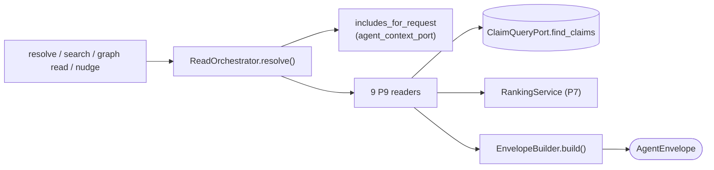

# Querying / Reading the Context Graph

> Status: reflects code on `main` @ `8dd175bc`, last reviewed 2026-06-29.

This doc owns the **read side** of the Context Graph: how an agent or human pulls
ranked, sourced evidence out of project memory. Writing is covered in
[`writing.md`](./writing.md); the static contract those reads are shaped by (entities,
predicates, subgraphs, views, truth classes) lives in [`ontology.md`](./ontology.md);
the full command/flag reference lives in [`cli-flow.md`](./cli-flow.md).

The governing principle, true on every read path: **Potpie returns ranked evidence,
never a synthesized answer.** The agent reasons over the evidence. There is no
server-side answer summary anywhere in the read trunk.

---

## 1. Two altitudes, one data plane

There are two read surfaces, and they sit at different altitudes over the **same**
service and the **same** canonical claim store. Both are shipped today (the data
plane is `GRAPH_CONTRACT_VERSION="v1.5"`, `ONTOLOGY_VERSION="2026-06-graph"`).

| Altitude | Surface | Who | Commands |
|---|---|---|---|
| **4-tool agent contract** | MCP `context_*` tools (`adapters/inbound/mcp/server.py`) bound by `AgentContextService` (`application/services/agent_context.py`) | harnesses over MCP | `context_resolve`, `context_search`, `context_record`, `context_status` |
| **Graph Surface Lite** | the `potpie graph …` workbench (`adapters/inbound/cli/commands/graph.py`) over `DefaultGraphService` | humans + harnesses over the CLI | `graph catalog/read/search-entities/neighborhood/describe/status/history` (+ the write/inbox/quality commands in [`writing.md`](./writing.md)) |

The MCP surface is **exactly four tools** — `context_record` is its only write. The
richer workbench is **CLI-only**; it is not mirrored onto MCP. `resolve`/`search`/
`record` on `AgentContextService` delegate straight to `GraphService`; only `status`
is composite (data-plane status + `PotManagementService` + a `SkillManager` install
nudge). Both altitudes are implemented by `DefaultGraphService`
(`application/services/graph_service.py`) over a swappable `GraphBackend`.

> The old framing of `resolve`/`search`/`record` as "Graph V1" and the workbench as a
> "future Graph V2" is wrong: both ship now. The string `"v2"` survives **only** as the
> workbench *envelope* version (`GRAPH_WORKBENCH_CONTRACT_VERSION`), not as a separate
> product. See [`architecture.md`](./architecture.md) for the composition roots.

---

## 2. The single read trunk (P8/P9)

Every read — MCP `resolve`/`search`, `graph read`, named views, and the zero-token
nudge ([`ingestion-nudge.md`](./ingestion-nudge.md)) — collapses onto one path:



`ReadOrchestrator.resolve()` (`application/services/read_orchestrator.py`) does four
things:

1. **normalize `intent` → include families** via `includes_for_request`
   (`domain/agent_context_port.py`);
2. **route each include to its P9 reader** through a `_routing` dict of **9 readers**;
3. **run each reader over the canonical `ClaimQueryPort`** (no reader touches storage
   directly);
4. **hand `(include, ReadResponse)` pairs to `EnvelopeBuilder.build()`** → one
   `AgentEnvelope`.

`DefaultGraphService.resolve()` and `.search()` both call the orchestrator (`search`
forces `intent="unknown"` and sets `metadata.search=True`). `mode` and `source_policy`
ride only in `metadata` — in V1.5 they do **not** change the read path, the readers, or
the ranking. They are advertised for forward-compatibility, nothing more.

### Anti-phantom-vocabulary rule

The trunk never returns a silent zero for a vocabulary mismatch:

- an advertised include with **no implemented reader** → `UnsupportedInclude(reason="not_implemented")`;
- an include **not in the vocabulary at all** → `unknown_include`.

A coherence guard requires `READER_BACKED_INCLUDES` (the advertised set) to mirror
`ReadOrchestrator.backed_includes` (the runtime registry) exactly; a mismatch fails
startup. So "I asked for X and got nothing" is always distinguishable from "X is not a
real family."

---

## 3. The AgentEnvelope

`AgentEnvelope` (`domain/agent_envelope.py`) is the **one** read-result shape:

| Field | Meaning |
|---|---|
| `items` | ranked `EvidenceItem`s: `include`, `candidate_key`, `score`, `payload`, `coverage_status`, ranker `breakdown` |
| `coverage` | per-include `CoverageReport`: `status ∈ {complete, partial, sparse, empty}` + `candidate_pool` |
| `unsupported_includes` | the not_implemented / unknown includes from the anti-phantom rule |
| `overall_confidence` | a **coverage rollup**, not a trust score (see below) |
| `as_of` | read timestamp |
| `metadata` | search flag, mode/source_policy echo, match_mode, etc. |

`EnvelopeBuilder` sorts items **cross-include by descending ranker score** and rolls up
coverage. `overall_confidence` (`derive_overall_confidence`) is computed off the **worst
per-include coverage tier** — `complete→high`, `partial→medium`, `sparse/empty→low`. It
is a measure of *how much of what you asked for was found*, **not** a model trust or
per-claim probability. Per-claim trust is carried on each item as the ranker `score`,
`breakdown`, `truth`, and `evidence_strength`. (When surfaced through `graph read`,
`overall_confidence` reappears as `quality.confidence`.)

---

## 4. Reader pattern and the 9 readers

Each P9 reader (`application/readers/`) is small and uniform. Shared scaffolding lives
in `_common.py`: `ReadRequest`/`ReadResponse`, `make_task_context`,
`coverage_status_from_count`, `rank_candidates`, `claim_payload`, `dedupe_claim_rows`,
`scoped_entity_keys`/`service_anchor_keys`, `row_in_anchor_set`, plus the `depth`/
`direction` Traverse controls. A reader: picks a predicate set → calls
`ClaimQueryPort.find_claims` (passing `fact_query` as the semantic anchor) → computes a
use-case-specific `scope_overlap` → builds `Candidate`s → delegates ranking to the
shared `RankingService`.

The 9 readers map one-to-one onto the 9 named views (§8):

| Reader (`include`) | Predicates it reads | Notes |
|---|---|---|
| `coding_preferences` | `POLICY_APPLIES_TO` | hierarchical/containment overlap over `code_scope`; a hard-zero overlap drops the row |
| `features` | `PROVIDES`, `IMPLEMENTED_IN` | anchored on service/repo, expands to feature keys (`traversal` view) |
| `infra_topology` | `DEFINED_IN`, `DEPLOYED_TO`, `DEPENDS_ON`, `USES`, `USES_ADAPTER`, `CONFIGURES`, `DEPLOYED_WITH`, `HOSTED_ON`, `OWNED_BY`, `PROVIDES`, `IMPLEMENTED_IN` | the **in-view Traverse axis**: bounded BFS (`depth` capped at 4, `direction` out/in/both) with environment-qualified edge filtering |
| `timeline` | `MENTIONS`, `TOUCHED`, `PERFORMED`, `AUTHORED` | `Activity` rows touching scope inside a `since/until` window (`occurred_at`, fallback `valid_at`); dedupes edges per activity into one event |
| `prior_bugs` | `RESOLVED`, `ATTEMPTED_FIX_FAILED`, `VERIFIED`, `REPRODUCES` | expands the bug/fix neighborhood, folds `VERIFIED` into fix corroboration, labels failed attempts, hides narrower-scope bugs from broader queries |
| `decisions` | `DECIDED`, `AFFECTS` | active/superseded decisions for a scope |
| `owners` | `OWNED_BY`, `MEMBER_OF` | ownership by scope/path |
| `docs` | `Document RELATED_TO scope` | scoped document context |
| `raw_graph` | every live `:RELATES_TO` edge (incl. generic `RELATED_TO`) | unscoped, for the explorer UI — **not** an agent retrieval family |

> Known spec/reader drift: the `service_neighborhood` view spec
> (`domain/graph_views.py` `inline_relations`) advertises `EXPOSES` where the reader
> actually traverses `IMPLEMENTED_IN` (`application/readers/infra_topology.py`
> `_INFRA_PREDICATES`). The table above documents what the reader reads.

The vocabulary single source of truth is `domain/agent_context_port.py`: it owns
`CONTEXT_INTENTS` (11), `READER_BACKED_INCLUDES` (9), `CONTEXT_INCLUDE_VALUES` (derived
from the ontology's `advertised_include_families()`), `PLANNED_INCLUDES`
(advertised-but-unbacked → surfaced as `not_implemented`), `DEFAULT_INTENT_INCLUDES`, and
`CONTEXT_RESOLVE_RECIPES`. `context_port_manifest()` is the stable agent-facing
instruction blob.

---

## 5. The recall mechanism: `ClaimQueryPort` + `fact_query` → `semantic_similarity`

`ClaimQueryPort.find_claims(ClaimQueryFilter)` (`domain/ports/claim_query.py`) is the
single read seam under every reader. The filter carries the **hard axes** as a query
(pot, `predicate_in`, subject/object/claim_key/subgraph/mutation_id/source_ref/
source_system, subject/object label, validity window, `as_of`, `include_invalidated`,
`limit`) plus **one semantic anchor**, `fact_query`.

When `fact_query` is set, the backend ranks rows and stamps
`row.properties["semantic_similarity"]`, which the reader reads into
`Candidate.semantic_similarity`. The match strategy is surfaced on every read as
`match_mode` so empty results are debuggable:

- **`vector`** — with an `EmbedderPort` wired, real cosine over the persisted
  `fact_embedding` (embedding the retrieval card on the fly for rows that lack one).
  The bundled local embedder ships by default, so semantic search needs no API key.
- **`lexical`** — with no embedder, token-overlap scoring (`embedding_score` in
  `canonical_claim_query.py`).

Hard filters live in the **query**, not the ranker. `ClaimRow` carries the V1.5
first-class claim metadata as typed fields (`claim_key`, `subgraph`, `truth`,
`confidence`, `description`, `environment`, `observed_at`, `valid_until`, `mutation_id`,
`source_refs`, `evidence`, contract/ontology version, `fact_embedding`); `properties`
holds only non-contract extras.

---

## 6. Ranking (P7)

One uniform `RankingService` (`domain/ranking.py`) ranks every reader's candidates.
Score = **weighted arithmetic mean** of six factors, each clamped to `[0,1]`, a missing
factor defaulting to a neutral `0.5`:

| Factor | Weight |
|---|---|
| `semantic_similarity` | 1.3 (primary recall) |
| `strength` | 1.2 |
| `scope_overlap` | 1.1 |
| `recency` | 1.0 |
| `corroboration` | 0.8 |
| `coverage_quality` | 0.5 |

The arithmetic mean **deliberately replaced** the old weighted geometric mean, whose
floor let a single zero factor veto an otherwise strong candidate. `strength` comes from
`_STRENGTH_TO_SCORE` (deterministic 1.0 / attested 0.8 / stated 0.6 / inferred 0.45 /
speculative 0.2) — the same vocabulary a claim's **truth class** maps onto
(`TRUTH_TO_EVIDENCE_STRENGTH`, see [`ontology.md`](./ontology.md)), so the truth tier
drives rank weight without the ranker learning a second vocabulary. `recency` is
exponential decay with a 30-day half-life shifted by freshness preference;
`corroboration` is diminishing returns on source count. Every `RankedItem` keeps a
per-factor `breakdown` for explainability.

(Doc nit preserved from code: the module docstring still uses `×` shorthand even though
`_combine` is a weighted sum.)

### The retrieval card (R2)

`build_retrieval_card` (`domain/retrieval_card.py`) is the **single** builder for the
text a claim is embedded and searched as — shared by the embed-on-write path and the
read path so the two never drift. It concatenates, in order: the agent-authored
`description`, then `fact`, the humanized subject key, predicate, object key, object
value, **key-sorted** scope values, and extra terms, joined by `" • "`. Scope is sorted
so equivalent scopes embed identically. This is why skills insist the `description` is a
**retrieval card** (symptoms + synonyms + the scope a future searcher would type), not a
display string — recall quality is retrieval quality, and it lives almost entirely in
this card plus the ranker.

---

## 7. The 3-axis query model (all three shipped)

Every agent question reduces to one of three composable, typed, pot-scoped,
backend-portable axes — never the raw store or its query language. **All three are
first-class today**; Traverse is no longer "buried inside a view."

| Axis | Command | Service path | Answers |
|---|---|---|---|
| **Retrieve** | `graph read --subgraph <s> --view <v>` | `DefaultGraphService.read()` → read trunk | "What preferences apply here?" "Has this symptom been seen before?" "What changed recently?" |
| **Filter** | `graph search-entities` | `DefaultGraphService.search_entities()` → `claim_query.find_claims` **directly** | "Which adapter is wired in prod?" "List active decisions for this repo." Identity resolution before a write. |
| **Traverse** | `graph neighborhood` | `backend.inspection.neighborhood` | "What depends on `payments-api`, two hops out?" "Walk this bug to its fix and the PR that shipped it." |

**Retrieve** goes through the read trunk over a named view. **Filter** does *not* hit the
read trunk — it queries `claim_query.find_claims` with structured filters (type/predicate/
subgraph/scope/truth/source_system/source_family/environment/external_id/source_refs/
since/until), aggregates claim rows **per entity** (best `semantic_similarity` + optional
supporting claims), resolves display labels, and returns ranked `GraphEntityCandidate`s;
its stated purpose is "narrow entity/claim lookup for identity resolution before a write."
**Traverse** is `backend.inspection.neighborhood` — a bounded, depth-limited,
predicate-typed, direction-aware walk; `graph inspect <key>` is a legacy alias that warns
toward `neighborhood`. The same `depth`/`direction` controls are plumbed through
`ReadRequest` into `InfraTopologyReader`, so the `infra_topology.service_neighborhood`
view's in-view traversal and the standalone op share semantics.

> Edge qualifiers are part of identity. A relation's `environment` qualifier joins the
> edge identity key `(subject, predicate, object, environment)`, so prod and staging
> coexist rather than supersede each other; the `service_neighborhood` view enforces
> `environment_filter` (default `qualified_only`). Filter and Traverse both depend on
> this. Full identity rules: [`ontology.md`](./ontology.md).

> **Boundary:** arbitrary cross-predicate shortest path, centrality/PageRank, cycle
> detection, and unbounded recursive aggregation are deliberately **out of scope** on the
> agent surface. This is a project-memory graph for retrieval-into-context, not a graph
> analytics engine.

---

## 8. Named views & `GraphViewSpec`

The default read unit is a **named view**, not arbitrary traversal. A view is a
declarative `<subgraph>.<view>` contract (`GraphViewSpec`, `domain/graph_views.py`):
`v1_include` (which reader family backs it), `backed` (**derived** from
`READER_BACKED_INCLUDES`), `inputs`, `inline_relations`, `ranking_inputs`, and a
`traversal` flag. An import-time guard (`_check_views_coherent`) asserts every
`v1_include ∈ CONTEXT_INCLUDE_VALUES`.

There are **8 subgraphs** (`debugging`, `recent_changes`, `infra_topology`, `decisions`,
`features`, `code_topology`, `knowledge`, `admin`) and **9 views**:

| Subgraph | View | Backing reader | Use when |
|---|---|---|---|
| `decisions` | `preferences_for_scope` | `coding_preferences` | What preferences/policies apply to this scope. |
| `decisions` | `active_decisions` | `decisions` | Checking architectural/user decisions for a repo/service/feature. |
| `debugging` | `prior_occurrences` | `prior_bugs` | Debugging a recurring symptom; prior bugs, fixes, failed attempts, verifications. |
| `recent_changes` | `timeline` | `timeline` | What changed recently, and why. |
| `infra_topology` | `service_neighborhood` | `infra_topology` | Runtime service/environment/dependency context. |
| `features` | `feature_context` | `features` | Feature summary, ownership, implementation links. |
| `code_topology` | `ownership_by_path` | `owners` | Who owns a path/module. |
| `knowledge` | `document_context` | `docs` | Scoped document/runbook context. |
| `admin` | `inspection_slice` | `raw_graph` | Operator/explorer raw slice. |

> Note the corrected names: the prior-occurrences view is under subgraph **`debugging`**
> (not `bugs` — `graph read --subgraph bugs …` fails with "unknown graph subgraph"), and
> the only features view is **`features.feature_context`** (there is no
> `features.implementation_map`).

`graph read` resolves the named view, validates `required_any_scope` + `supported_filters`
against the view's `ViewContract` (returning `missing_required_scope`/`unsupported_filter`
**instead of** running a malformed read), then routes `spec.v1_include` through the same
orchestrator with `intent=None`. If the view declares `inline_relations`,
`_assemble_inline_relation_items` reshapes flat ranked claims into `entity + relations[]`
payloads (`read_shape="entity_relations"`). `timeline recent` and
`graph read --subgraph recent_changes --view timeline` are the **same path**.

### Example: read response (`debugging.prior_occurrences`)

```json
{
  "subgraph": "debugging",
  "view": "prior_occurrences",
  "read_shape": "entity_relations",
  "match_mode": "vector",
  "subgraph_versions": {"_global": 8814},
  "items": [
    {
      "include": "prior_bugs",
      "candidate_key": "bug_pattern:refunds-api:partial-capture-refund-failure",
      "score": 0.91,
      "breakdown": {
        "semantic_similarity": 0.88,
        "strength": 1.0,
        "scope_overlap": 0.9,
        "recency": 0.6,
        "corroboration": 0.7,
        "coverage_quality": 0.5
      },
      "truth": "source_observation",
      "evidence_strength": "deterministic",
      "payload": {
        "entity_key": "bug_pattern:refunds-api:partial-capture-refund-failure",
        "entity_type": "BugPattern",
        "description": "Refund fails on partial captures; partial-capture refund error; refunds-api",
        "relations": [
          {
            "type": "RESOLVED",
            "subject": "fix:refunds-api:retry-partial-capture",
            "object": "bug_pattern:refunds-api:partial-capture-refund-failure",
            "valid_at": "2026-06-01T10:00:00+05:30",
            "valid_until": null
          },
          {
            "type": "VERIFIED",
            "subject": "activity:github:acme/payments:pr-812",
            "object": "fix:refunds-api:retry-partial-capture",
            "valid_at": "2026-06-01T11:30:00+05:30",
            "valid_until": null
          }
        ]
      },
      "source_refs": ["linear:ENG-241", "github:pr:acme/payments:812"]
    }
  ],
  "coverage": [
    {"include": "prior_bugs", "status": "complete"},
    {"include": "recent_changes", "status": "partial"}
  ],
  "quality": {"status": "good", "confidence": "high", "backend": "falkordb_lite"},
  "unsupported": [],
  "as_of": "2026-06-29T12:00:00+05:30"
}
```

Note the real shape, corrected from the old docs: debugging relations are
`REPRODUCES`/`RESOLVED`/`ATTEMPTED_FIX_FAILED`/`VERIFIED` (there is no `FIXES`
predicate); normalized relations use `valid_at`/`valid_until`; PRs/commits/issues/
deployments collapse to a single `Activity` entity (key prefix `activity`); and
optimistic-concurrency versioning is coarse — `subgraph_versions` is only
`{"_global": <total pot claim count>}`, not per-subgraph counters (see
[`writing.md`](./writing.md)).

---

## 9. Read CLI commands (summary)

Full flag lists live in [`cli-flow.md`](./cli-flow.md); this is the read-side orientation.

| Command | Role |
|---|---|
| `graph status` | data-plane status for the active pot |
| `graph catalog [--subgraph] [--profile full\|read]` | **contract discovery** — returns `GraphCatalogResult`: versions, commands, truth classes, mutation ops (+ empty review/deferred), source authorities, `match_mode`, views, public entity types & predicates. Derived entirely from the ontology + view map + constants ("no docs needed"). `--task` is **accepted but ignored in V1.5**. |
| `graph describe [subgraph] [--view] [--examples]` | in-process `describe_contract()` (not a host call); returns a subgraph and optionally one view. |
| `graph read --subgraph <s> --view <v>` | **Retrieve** axis (§7/§8); `--detail compact\|full`, `--relations summary\|full`, `--query`, `--scope k:v`, `--since/--until`, `--depth/--direction`, `--limit`, `--sort`, `--format`. |
| `timeline recent` | sugar for `graph read --subgraph recent_changes --view timeline`. |
| `graph search-entities` | **Filter** axis (§7); structured typed lookup for identity resolution. |
| `graph neighborhood --entity <key>` | **Traverse** axis (§7); `graph inspect <key>` is a legacy alias. |
| `graph history` | mutation/claim/entity history (audit trail). |

At the MCP altitude, `context_resolve`/`context_search` cover Retrieve, and
`context_status` is the composite readiness/nudge tool. There is no `context_neighborhood`
or `context_search_entities`; the workbench Filter/Traverse axes are CLI-only.

---

## 10. The legacy `ContextGraphQuery` model

`ContextGraphQuery`/`ContextGraphResult` plus the `ContextGraphGoal`/`ContextGraphStrategy`
enums and `preset_*` helpers (`domain/graph_query.py`) are a **legacy/compat request
model**, not the canonical in-process read DTO. The canonical DTOs are `ResolveRequest`/
`SearchRequest` (`domain/ports/agent_context.py`) and `GraphReadRequest`.
`adapters/outbound/graph/context_graph_service.py` translates
`ContextGraphQuery → ResolveRequest → GraphService.resolve()` and carries `goal`/`strategy`
only in `metadata`. `ContextGraphGoal` now has only `RETRIEVE`/`TIMELINE` (`ANSWER`/
`INVESTIGATE` were removed); **`ContextGraphStrategy` (AUTO/SEMANTIC/EXACT/HYBRID/
TRAVERSAL/TEMPORAL) is consumed by nothing in the active read trunk — it is vestigial.**
This model survives only for the benchmark harness and a legacy port; the HTTP routers
return "unsupported legacy ContextGraphQuery endpoint." Do not treat the strategy enum as
a live read knob.

---

## See also

- [`ontology.md`](./ontology.md) — entities, predicates, subgraphs/views, truth classes, identity & the environment qualifier.
- [`writing.md`](./writing.md) — the write stack, propose→commit, coarse `_global` concurrency, the read-back verify path that reuses these readers.
- [`cli-flow.md`](./cli-flow.md) — full command and flag reference.
- [`architecture.md`](./architecture.md) — the read trunk's place in the hexagonal layering and composition roots.
- [`ingestion-nudge.md`](./ingestion-nudge.md) — the zero-token nudge model, which composes this read trunk over named views.
