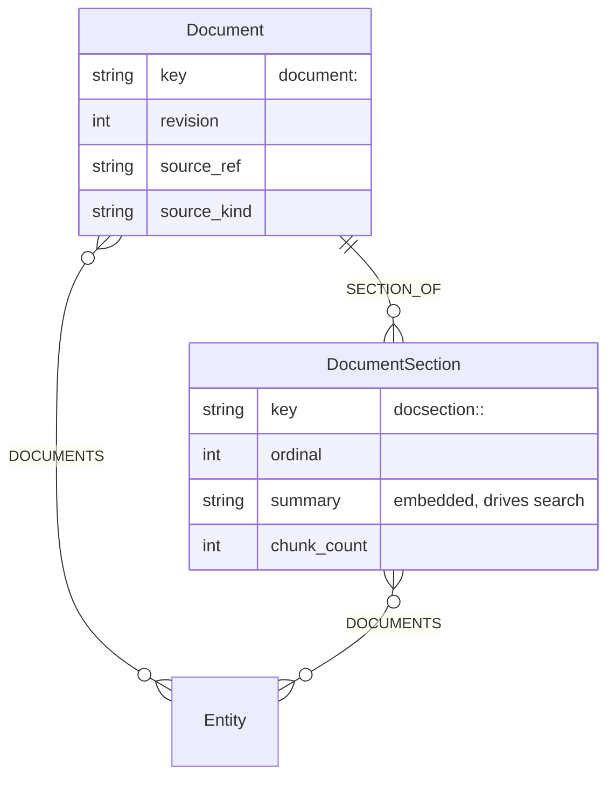

# Resource Store: where document payloads live

| Status | Date | Owner | Code |
|--------|------|-------|------|
| Complete (P1–P5, P7–P9) | 2026-08-06 | nndn | `context-core/ontology.py`, `context-core/ports/resource_store.py`, `context-core/resource_to_semantic.py`, `context-engine/.../adapters/outbound/resources/`, `.../application/readers/docs.py`, `.../application/services/pot_management.py`, `.../host/shell.py`, `cli/commands/resource.py`, `cli/commands/pots.py`, `cli/source_kinds.py`, `.../graph/document_key_repair.py`, `cli/templates/*/skills/potpie-resource-*/`, `.../application/services/envelope_builder.py`, `.../adapters/outbound/graph/{canonical_claim_query,falkordb_reader,neo4j_reader}.py` |

Every planned phase has landed; **P6 (export/import round-trip) is dropped** — resource bytes are
deliberately outside the graph snapshot, see [Non-goals](#non-goals). The end-to-end path
works: `potpie resource import` writes bytes to the local store *and* the document's structure
to the graph, so an imported document is findable by search and by
`graph neighborhood --entity document:<slug>`, and `resource get` resolves a chunk id with no graph query.
Pot teardown (`pot reset` / `pot archive`) purges the resource tree with the graph, and
`resource rm` retracts section claims (P5). The per-format extraction skills landed as P7:
`potpie-resource-pdf` / `-spreadsheet` / `-markdown` in both skill bundles, with the shared
flow (resolve-before-import, script-emitted chunk directory, two-pass summaries, `DOCUMENTS`
linking) pinned by content-contract tests. Section claims use their own `documents` fact
family and are demoted / excluded from project-memory reads (P9). P8 closed the two doors
that let a document go somewhere useless: `source add` now dispatches on a closed kind
table and sends document kinds to `resource import`, and the raw-episode ingest endpoint
is deleted rather than left as a fourth way in.

## Problem

The graph stores claims and pointers, never payloads — [vision.md](./vision.md) says so at line 33, and "No full source payloads in the graph" is a listed anti-goal. But there is no store the pointer can point *into*. A source ref today names something outside Potpie (a PR URL, a path on someone's laptop) that may move, change, or vanish. So when a user hands Potpie a PDF or a spreadsheet, the content has nowhere to go: `potpie record` accepts only `--summary`, entity summaries are cut at 320 chars (`graph_entity_summary.py:7`), and `Document` is a `public=False` fallback label with no edge types at all — an orphan. Nothing enforces the anti-goal either: agent-supplied entity properties pass through unfiltered (`semantic_mutation_lowering.py:637`), so the first agent that pastes a document body into a node property will succeed, silently and permanently.

## Solution

Split a document into two halves that each live where they belong. The **bytes** become chunk files on disk, pot-scoped, behind one port so cloud can swap disk for S3. The **structure** goes into the graph: a `Document` entity owning `DocumentSection` entities, one per real division of the source (heading, sheet, chapter). Sections are the searchable unit — each carries an agent-authored summary that becomes a claim, so the existing embedding and retrieval path *is* the index, with no new search machinery. Chunks stay off the graph: a section names its chunk IDs, each sized to fit one tool-call response. The agent never pipes chunk text through its own output — a per-format skill teaches it to write an extraction script, the script emits the files, and one `resource import` absorbs the directory.

## Requirements

| # | Requirement |
|---|---|
| R1 | Payloads never enter the graph; the graph holds structure and pointers only. |
| R2 | A document is named by the agent, and its identity resolves through normal graph identity. |
| R3 | Large documents split on their own structure into sections; sections are searchable. |
| R4 | Every chunk fits one tool-call response, enforced at write time. |
| R5 | Chunk text never passes through the agent's output tokens. |
| R6 | Ingest is atomic — a crashed run leaves no partially-visible document. |
| R7 | Re-import replaces cleanly and invalidates claims from the prior revision. |
| R8 | Everything is pot-scoped, and pot teardown removes resources with the graph. |
| R9 | Storage is swappable (local disk now, S3 later) behind one port. |
| ~~R10~~ | *Dropped.* `graph export`/`import` does not round-trip resources — the snapshot stays graph-only ([Non-goals](#non-goals)). Numbering is kept so R11–R14 references stay stable. |
| R11 | `resource get` is fast: no graph query and no embedding on the read path. |
| R12 | Every section carries a retrieval-grade summary — it is the only index into its chunks. |
| R13 | An agent can reach chunk text in two calls, and fetch several chunks in one. |
| R14 | Re-import re-summarizes only the sections whose content changed. |

## How it works

```mermaid
flowchart LR
    agent["coding agent<br/>+ per-format skill"]
    script["extraction script"]
    dir[/"chunk dir<br/>sections + meta.json"/]
    imp["potpie resource import"]
    disk[("&lt;home&gt;/resources/&lt;pot_dir&gt;/")]
    graph[("Document + Section<br/>nodes, claims")]
    get["potpie resource get"]

    agent -->|"writes"| script
    script -->|"splits by section"| dir
    imp -->|"reads + validates"| dir
    imp -->|"1. stores bytes"| disk
    imp -->|"2. upserts structure"| graph
    graph -.->|"chunk ids"| get
    get -->|"reads by path"| disk
```

Ingest: the agent picks the skill for the format, writes a script that walks the document's own structure, and emits one directory per section plus a `meta.json`. `resource import` reads that directory on the caller's side and ships its contents with the call (`files`, keyed by relative path), so the host never needs a view of the caller's filesystem — a detached daemon has its own working directory and a managed service is on another machine. The store materialises the files into a scratch directory, validates sizes and slugs exactly as it would a path, writes chunks to a temp dir and atomically renames it into place, then upserts the Document and its Sections in one mutation batch. Bytes land before graph state on purpose — a failed graph write leaves orphan bytes that the next import overwrites, whereas the reverse order would leave live claims pointing at files that do not exist.

Find, then fetch: an agent searches as usual. Section summaries are embedded like any claim, so semantic search lands on a section; `DOCUMENTS` edges answer the structural version ("what documentation covers `service:payments-api`"). Either path yields chunk IDs, and `resource get` resolves the ID straight to a file path — no graph round-trip on the hot path.

Re-import replaces: the same slug deletes the old chunk set, writes the new one, bumps `revision`, and invalidates claims from the prior revision using supersession the claim store already has. `revision` advances only when the section set actually moved (something added, changed, or removed) — re-importing a byte-identical directory is a genuine no-op, because R7 hangs prior-revision invalidation on this counter and a number that ticks on no-ops cannot say which revision a claim was made against.

## Contracts



Chunks are files, not nodes: a 500-page PDF becomes ~40 section nodes, not ~400 chunk nodes.

```
resource id    potpie://res/<doc>/<section>/<seq>     seq zero-padded; section is "body" when the source has none
disk path      <home>/resources/<pot_dir>/<doc>/<section>/<seq>.txt
pot_dir        <sanitized pot_id>-<sha256(pot_id)[:16]>  pot ids are opaque; the digest keeps the mapping injective
chunk size     target 4,000 chars, hard cap 8,000     rejected at import, never clamped at read
summary/title  hard cap 2,000 / 200 chars             R1's gate: these become node properties
slugs          <doc> and <section> must match _SLUG_BODY_RE (identity.py:57)
```

**Ontology changes** (`context-core/ontology.py`): `Document` is promoted from `public=False`/`CONTENT_HASH` to a public `SLUG_ALIAS` entity; `DocumentSection` is new, also `SLUG_ALIAS`. Two new public edges, since none of the 26 existing predicates accepts a Document endpoint — `SECTION_OF` (`DocumentSection → Document`, `singleton=True`) and `DOCUMENTS` (`Document|DocumentSection → *`, the reference-material link). The `knowledge.document_context` view already exists (`graph_workbench_ontology.py:720`) and becomes the reader for both.

The directory an extraction script produces, and `import` consumes:

```
<dir>/<section>/0000.txt, 0001.txt, …
<dir>/meta.json   { source_ref, source_kind,
                    sections: [{ slug, title, summary, ordinal, content_hash,
                                 chunks: [{seq, label, page?, offset?}] }] }
```

`slug` is supplied by the agent, not derived from heading text, so a retitled heading does not mint a new node; `import` reports `sections_added / kept / removed` so drift is visible. `content_hash` lets re-import mark only changed sections for re-summary (R14) — and a *kept* section keeps the summary it already had whenever the directory supplies none, because a re-run of the script emits summaries empty and blanking the index for content that did not change is the one thing R14 exists to prevent. `label` is required, not optional — it is the agent's only signal for choosing among a section's chunks, and a script can derive it from the leading heading or line. **Sections should be 1–5 chunks**; a section that needs more is too coarse and must be split into sub-sections, or the agent lands on it holding one summary and a dozen indistinguishable chunks.

Summaries are written by the agent, not the script — a script can split but cannot judge. Because the summary is the entire index (R12), ingest is a two-pass flow: the script emits sections and chunks, then the agent reads each section and writes its summary. Sections may be imported with `summary_pending` and filled by a later pass, so a large document becomes usable incrementally instead of blocking on a full read.

```bash
potpie resource import <dir> --doc <slug> [--source-ref <uri>] [--source-kind <fmt>]  # atomic; replaces on re-import
potpie resource get <id> [<id>...] [--with-neighbors] [--json]   # hot path — batched, file read only
potpie resource list --doc <slug> [--section <slug>]             # returns chunk ids + labels
potpie resource rm <slug> --confirm                              # destructive; --confirm per CLI contract
```

`get` returns `{resource_id, doc, section, seq, text, chars, revision, source_ref, page?, offset?, requested}` — `requested` is false on a chunk that `--with-neighbors` pulled in. Neighbors resolve *host-side*, so a neighbor-expanded read is still one daemon round trip. In human mode `get` prints the stored text verbatim rather than through the shared block formatter, which drops blank lines: a command whose job is returning evidence must not edit it.

`import` reports `sections_added / kept / changed / removed`, where **changed** is what is left after the other three — the answer to "what needs re-summarizing" (R14), derived by the CLI so no caller repeats the subtraction.

All commands use the `contract()` boundary: stable `--json` fields, errors carrying `code`, `message`, `detail`, `recommended_next_action`, and exit codes `0/1/2/3/4` per [cli-flow.md](./cli-flow.md). Store failures report their own stable code (`resource_chunk_too_large`, `resource_not_found`, …) rather than a flat `validation_error`, because an agent retries a bad slug and an oversized chunk differently; all of them exit `1`, since every one is a caller mistake and not an unavailable dependency. The code survives the daemon hop through `error_code` on the RPC error payload. There is no `resource manifest` command — the manifest is the graph: `graph neighborhood --entity document:<slug> --detail full` returns the document node carrying `revision`, `source_ref`, `source_kind`, and `section_count`, with one `SECTION_OF` edge per live section. (`graph describe` takes a *subgraph* name, not an entity key, and rejects one; `graph inspect` also resolves an entity key but self-describes as legacy and points at `neighborhood`.)

The graph write is `resource_to_semantic.py`: one `upsert_entity` for the document (carrying `revision`, `source_ref`, `source_kind`), one `assert_claim`/`SECTION_OF` per section whose description *is* its summary and whose evidence is that section's chunk ids, and one `retract_claim` per section the prior revision had and this one does not. Import emits semantic ops and hands them to `GraphService.mutate` rather than lowering a `MutationBatch` itself, so a document is validated, risk-classified, and embedded by exactly the path an agent's own write takes; the request is pre-approved (`approved_by="resource_import"`) because a re-import's retractions are medium-risk and dead-ending them would leave the graph describing sections whose chunks were just deleted. **R1 is structural here**: the module reads a manifest, which holds slugs, titles, summaries, hashes, and chunk ids — no chunk text is in scope to leak. The `graph` block in `import`'s payload reports `written` / `status` / `entity_key` / `claim_keys`, and a graph write that did not apply becomes a warning, because bytes-without-structure is otherwise silent: `get` keeps working while search returns nothing.

Chunk IDs reach claims through `SourceReferenceRecord.retrieval_uri` with `fetchable=true`, `source_type="resource"` (`source_references.py:46-68`), unchanged. A section's summary claim carries **that section's chunk IDs** in its source refs, so a search result already contains everything `resource get` needs — search then get, with no `list` hop in between (R13). `DocsReader` surfaces them as a named `chunk_ids` field so an agent need not know which of a claim's source refs is the fetchable one, and returns `SECTION_OF` claims directly on an unscoped read (under a scope they cannot match: their object is the parent document, never a service). `ResourceStorePort` (`context-core/ports/resource_store.py`) promises `import_dir(pot_id, slug, source_dir | files, source_ref, source_kind) -> DocumentManifest` (exactly one of `source_dir`, a path the store can read, or `files`, the directory's contents — the form the CLI always sends; `read_import_files` / `import_source` in the same module are the two halves of that transport), `get(pot_id, resource_id) -> Chunk`, `get_many(pot_id, resource_ids)`, `list(pot_id, slug, section=None)`, `delete(pot_id, slug)`, `purge_pot(pot_id)`, and `status(pot_id=None) -> ResourceStoreStatus` — the last one exists because a store nobody can write to is otherwise invisible until an import fails, and an import is an expensive way to discover it. `HostShell.resources` is a `ResourceFacade` over the port and the graph service: everything passes straight through except `import_dir`, which writes both halves and returns a `ResourceImportResult`, and `get`, which resolves `--with-neighbors` before the single batched read. Both exceptions exist for the same reason — one user action must not become two daemon round trips it can die between.

## Decisions

| Decision | Alternative rejected | Why |
|----------|----------------------|-----|
| Sections are graph nodes; chunks are not | A node per chunk | Section granularity keeps a big PDF at tens of nodes instead of hundreds, and the section is the unit a human would name. Chunk bookkeeping is storage detail. |
| Split on the document's own structure | Fixed-size sliding window with overlap | Headings and sheets are boundaries the author already chose; a window cuts mid-argument and forces overlap to compensate. Scripts read structure for free from most formats. |
| The index is section summaries as claims | A separate document/passage vector index | Claim embedding, the retrieval card, and ranking already exist and are tuned; a second index needs its own build, refresh, and drift story. |
| Documents are first-class graph entities | Keep resources entirely outside the graph | Document identity is what `graph search-entities` and the alias table already solve; keeping it out grows a second identity system and lets slugs sprawl. |
| Manifest lives on the graph nodes | A per-doc `manifest.json`, or the local state store | Two manifests means two things to keep in sync and a migration when the flat-file store becomes SQLite. Disk holds bytes, graph holds structure. |
| Section slug is agent-supplied | Derive the slug from the heading text | A retitled heading would orphan the section node and every claim citing it. |
| Re-import replaces the chunk set | Immutable content-addressed versions | Versioning made re-ingest an unbounded append needing its own GC; replacement plus a `revision` bump reuses existing claim supersession. Cost: history may cite a chunk whose text was replaced. |
| Bytes written before graph state | Graph first, or one transaction | No cross-store transaction exists. Bytes-first fails to orphan files (harmless, overwritten); graph-first fails to dangling refs (corrupt). |
| Agent writes a script; CLI imports a directory | `resource put` per chunk with text as an argument | Per-chunk text would pass through the agent's output tokens — expensive on a large PDF. A directory import is also atomic, so a crashed ingest leaves nothing half-written. |
| Per-format skills teach extraction | Potpie ships PDF/spreadsheet parsers | Keeps `pypdf`/`openpyxl`/`unstructured` out of the dep tree (none present today) and honors "no Potpie-owned LLM/reconciliation agent". |
| Pot-scoped storage under `<home>/resources/<pot_dir>/` | One flat global `/resources` | `pot_id == group_id` is the hardest invariant and cross-pot federation is an anti-goal; a flat store leaves `reset_pot` unable to clean up. Cost: the same file in two pots is stored twice. |
| `import` goes through `graph.mutate` | Direct graph writes | Keeps `apply` the single write door, so a document is validated, risk-classified, and embedded by exactly the path an agent's own write takes. |
| `graph export` stays graph-only | Bundle the pot's chunk tree into the snapshot | A snapshot is a graph artifact; bundling bytes gives it a second format, a size class, and a partial-restore story. Re-running `resource import` rebuilds both halves from the source directory, which is the real recovery path. Cost: chunk refs in a restored snapshot dangle until re-import — `resource get` answers `resource_not_found`, loudly and per-chunk. |
| Reject oversized chunks at import | Clamp at read | Clamping hides the problem until an agent hits it; rejecting keeps every stored chunk uniformly safe to read. |
| Two-pass ingest; summaries may be deferred | Summaries emitted by the script at split time | A script can split but cannot judge, and a document larger than the agent's context cannot be summarized in one pass. Deferring makes a big document usable section by section. |
| Batched `get` and section chunk IDs on the claim | One `get` per chunk, `list` between search and fetch | A daemon round-trip measures ~0.7s, so a naive search → list → get ×5 costs ~5s of pure overhead before any reading happens. |

## Non-goals

- No chunk-level vector index. Embeddings stay one-per-claim-edge on `RELATES_TO.fact_embedding`; sections are the finest searchable grain.
- No binary, image, or audio payloads.
- No cross-pot sharing or dedup, and not a general file server: the store holds ingested source evidence, not uploads or build artifacts.
- **No resource portability.** `graph export`/`import` carries claims, never chunk bytes, and there is no `resource export`. A snapshot restored into a pot with no store behind it keeps its `Document`/`DocumentSection` structure and its section summaries — the searchable half — while `resource get` on those chunk ids returns `resource_not_found`. Re-running `resource import` from the source directory is the way to restore bytes.

## What determines quality

Simulating a 120-page contract and a 50-document corpus, these dominate — in order:

1. **Summary quality is retrieval quality.** The summary is the only index into a section's chunks, so a weak one makes that content permanently invisible and nothing reports the failure. Cheap partial defense: section *titles* come free from structure and carry real signal (`12. Limitation of Liability`), so title-only sections still retrieve somewhat.
2. **Section size caps the last hop.** Search resolves to a section; from there the agent picks a chunk by label alone. Big sections mean guessing. This is why 1–5 chunks is a rule and `label` is required.
3. **Round trips, not bytes.** ~0.7s per daemon call means the call *count* dominates, not chunk size. Two calls to text is the design target; batching keeps a multi-chunk read at two.
4. **Scoping at ingest decides structural discoverability.** A document with no `DOCUMENTS` edge is findable only by semantic luck, so import counts the live scope claims on the document *and its sections* — the skills teach section-level links — and recommends one only at zero. A nudge that fires on every import cannot tell a linked document from an unlinked one, which is the only thing it is for.
5. **Section claims compete with project memory.** Fifty documents put thousands of section claims into the same embedding space as decisions, bugs, and preferences. Sections use their own `documents` fact family; the `docs` include is demoted in mixed envelopes; non-docs readers exclude the `knowledge` subgraph and over-fetch ANN candidates when predicates are selective — so a document corpus cannot crowd out `prior_bugs` / debugging memory.
6. **Structured sources retrieve badly as text.** Chunked spreadsheet rows match poorly on natural-language queries. For sheets the *claims* must carry the derived facts, with chunks as backup evidence — otherwise ingestion looks successful and silently answers nothing.
7. **Boundary loss is silent.** With no overlap by design, a fact spanning two chunks is retrieved in halves. Splitting only on paragraph boundaries plus `--with-neighbors` covers most of it.

## Implementation plan

P1 and P2 are independent and can land in either order; everything after depends on both.

| Phase | Work | Depends on |
|---|---|---|
| **P1 — Ontology** | Promote `Document` (public, `SLUG_ALIAS`); add `DocumentSection`, `SECTION_OF`, `DOCUMENTS`. Update the classifier's property signatures, satisfy `context-core/coherence.py`, wire `knowledge.document_context` to the new labels. Migration for existing `CONTENT_HASH` Document nodes. | — |
| **P2 — Port + local adapter** | `ResourceStorePort` + `Chunk`/`Manifest` DTOs under an RPC-allowlisted module. `LocalResourceStore`: temp-dir write + atomic rename, slug validation via `_SLUG_BODY_RE`, size enforcement, `purge_pot`. Conformance suite run against `LocalResourceStore` and an in-memory stub. | — |
| ~~**P3 — Host + CLI**~~ *(landed)* | `HostShell.resources` (`ResourceFacade`), `resources` in `_ALLOWED_RPC_SURFACES`, `cli/commands/resource.py` with `import/get/list/rm`, `--confirm` on `rm`, `contract()` boundary and `--json` shape. `doctor` reports store readiness. Added along the way: `ResourceStorePort.status`, host-side neighbor resolution, and `error_code` on the daemon's validation payload so store codes survive the hop. | P2 |
| ~~**P4 — Graph integration**~~ *(landed)* | `resource_to_semantic.py` maps a manifest to semantic ops (Document upsert + `SECTION_OF` claim per section + `retract_claim` per removed section); `ResourceFacade.import_dir` applies them through `graph.mutate`, so `apply` stays the single write door and import never lowers a `MutationBatch` itself. `DocsReader` returns section claims with a `chunk_ids` field on an unscoped read. | P1, P2, P3 |
| ~~**P5 — Pot lifecycle**~~ *(landed)* | `LocalPotManagementService.reset_pot` / `archive_pot` and `hard_reset_pot` call `purge_pot` after a successful graph reset (graph writers stay graph-only; orchestration owns the second store). `resource rm` retracts `SECTION_OF` claims via `resource_delete_to_semantic_request` before deleting bytes. **`source remove` ignores resources** — registration only; there is no source→document FK (`source_ref` is a free URI), so cleanup is `resource rm` or pot teardown. | P2, P4 |
| ~~**P6 — Export/import**~~ *(dropped)* | Bundling the chunk tree into `graph export` is not planned. The snapshot stays graph-only; re-import is the recovery path. See [Non-goals](#non-goals). | — |
| ~~**P7 — Skills**~~ *(landed)* | `potpie-resource-pdf` / `-spreadsheet` / `-markdown` in `claude_plugin` + `agent_bundle` (byte-identical; the bundle catalog auto-registers them for `skills install`): script-writing, stable section slugs, the 1–5 chunk rule, the two-pass summarize flow, resolve-before-import, and — for spreadsheets — deriving facts as claims with chunk-id evidence. Existing skills updated in step: `potpie-graph` v6 (find-then-fetch read path), `potpie-source-ingestion` v2 (payload routing), `potpie-cli` v3 (`resource` group), plus AGENTS.md/CLAUDE.md routing. Content contract pinned in `tests/unit/test_agent_templates_v15.py`. | P3, P4 |
| ~~**P9 — Section fact family**~~ *(landed)* | `Document` / `DocumentSection` use `fact_family=documents`; `docs` is demoted in `EnvelopeBuilder` cross-include ranking; non-docs readers pass `subgraph_not_in=("knowledge",)`; selective vector queries over-fetch ANN candidates so section embeddings cannot starve `prior_bugs`. | P4 |
| ~~**P8 — Deprecations**~~ *(landed)* | `source add` dispatches on a closed kind table (`cli/source_kinds.py`): git hosts canonicalize to `repo`, document kinds exit 1 toward `resource import`, unknown kinds exit 1, `--default` is repo-only. `POST /api/v1/context/ingest` and `submit_raw_episode.py` are deleted, with the client's `ingest()` and the `ingest_episode` policy action; the `raw_episode` ingestion kind stays so historical rows still read. | P7 |

## Verification

```bash
# R2, R3 — named doc, structural sections, graph identity
potpie resource import ./out --doc q3-review --source-ref file:///q3.pdf --json
potpie graph neighborhood --entity document:q3-review --detail full --json   # revision 1, section_count, source_ref
potpie graph search-entities --query "q3 review"       # resolves document:q3-review

# R3, R11 — section search finds it; get does no graph work
potpie graph read --subgraph knowledge --view document_context --scope service:payments-api --json
potpie resource get potpie://res/q3-review/capacity/0000 --json    # text + chars

# R4 — oversized chunk is refused at import, with the standard error contract
potpie resource import ./oversized --doc big --json     # exit 1, code=resource_chunk_too_large, no partial write

# R6 — atomicity: kill mid-import, nothing partially visible
potpie graph neighborhood --entity document:killed --json   # 0 nodes, 0 relations; no orphan sections

# R12, R13 — search result already carries chunk ids; multi-chunk read is one call
potpie search "liability cap" --json                    # section claim, source_refs = chunk ids
potpie resource get <id-a> <id-b> --with-neighbors --json

# R7, R14 — replacement, supersession, and incremental re-summary
potpie resource import ./out-v2 --doc q3-review         # revision 2; old chunks gone
potpie graph history --entity document:q3-review        # prior-revision claims invalidated
potpie resource import ./out-v2 --doc q3-review --json  # unchanged sections: kept, not re-summarized

# R8 — pot scoping and teardown
potpie pot use other && potpie resource get potpie://res/q3-review/capacity/0000   # not found
potpie pot reset --confirm && potpie resource list --doc q3-review                 # empty
```

**R1** is verified by test, not command: assert no mutation produced by `import` carries chunk text in any entity or claim property. **R5** is verified by skill review — the per-format skills must instruct the agent to write and run a script, never to emit chunk text; that review is pinned as content-contract tests in `tests/unit/test_agent_templates_v15.py`. **R9** is the conformance suite passing against both `LocalResourceStore` and the stub. **R8** is covered by `test_reset_pot_leaves_no_files_under_the_pot_resource_tree` — after `reset_pot`, nothing remains under the pot's `<home>/resources/` subtree.

## Risks & open questions

- **Content nobody claimed stays unreachable.** A section whose summary omits what a user later asks about is dead storage — there is no lexical fallback by design. Decide whether that is accepted or needs a `resource grep` escape hatch.
- **Replacement makes history partly lossy.** A claim invalidated by re-import keeps its chunk ID but the text is gone. Acceptable only if `graph history` shows the revision a claim was made against.
- **Promoting `Document` is a real migration.** Identity moves from `CONTENT_HASH` to `SLUG_ALIAS`, so existing soft-fail `Document` nodes get different keys, and coherence guards fail import on catalog drift.
- **Concurrent imports to one doc.** The daemon serializes RPC behind `rpc_lock` (`daemon/main.py:122`), which covers local use; the cloud adapter will not have that lock and needs its own guard. `LocalResourceStore` no longer *corrupts* under a race — scratch directories are swept by age, never by name, so one import cannot delete another's staging tree — but two concurrent imports of one doc are still last-writer-wins.
- **A summary written to the graph does not reach the disk manifest.** Two-pass ingest fills `summary_pending` sections through the graph write door; `meta.json` keeps the empty copy `list` returns. P4 left this as-is rather than adding a second write path: the graph is the manifest of record (there is no `resource manifest` command for exactly this reason), and `resource list` reporting `summary_pending` for a section the graph has summarized is a stale *display*, not stale data. It is only a real problem for the re-import diff, which keys on `content_hash` and not on the summary. The fix, when it is worth it, is `ResourceStorePort.set_section_summary` — not narrowing `meta.json`, which `list` needs offline.
- **`source remove` ignores resources (decided in P5).** A registered source's `location` is not a foreign key into the resource store — documents carry a free-form `source_ref` URI — so remove cannot know which documents came from it. Purge with `resource rm`; wipe a pot with `pot reset` / `pot archive`.

## Map

| Path | What lives there |
|------|------------------|
| `potpie/context-core/src/potpie_context_core/ontology.py:624` | `Document` spec to promote; `DocumentSection`, `SECTION_OF`, `DOCUMENTS` to add |
| `potpie/context-core/src/potpie_context_core/ports/resource_store.py` | `ResourceStorePort` + DTOs (RPC-allowlisted prefix, `daemon/rpc.py:19`) |
| `potpie/context-core/src/potpie_context_core/resource_to_semantic.py` | manifest → semantic ops, delete retractions, and `ResourceImportResult`; the R1 boundary |
| `potpie/context-engine/src/.../application/services/pot_management.py` | pot reset/archive teardown calls `purge_pot` |
| `potpie/context-engine/src/.../application/readers/docs.py` | `DocsReader` — section claims and their `chunk_ids` |
| `potpie/context-engine/src/.../adapters/outbound/resources/` | `LocalResourceStore` now, `S3ResourceStore` later |
| `potpie/cli/commands/resource.py` | the `resource` group, mounted in `cli/main.py` |
| `potpie/cli/source_kinds.py` | the closed `source add` kind table; document kinds route here |
| `potpie/cli/templates/claude_plugin/skills/potpie-resource-*/` | per-format extraction skills; byte-identical copies in `agent_bundle/.agents/skills/`, which the bundle catalog scans |
| `potpie/context-core/src/potpie_context_core/identity.py:57` | `_SLUG_BODY_RE` — the `--doc`/`--section` grammar, reuse it |
| `potpie/context-core/src/potpie_context_core/graph_workbench_ontology.py:720` | `knowledge.document_context` — the existing reader these nodes feed |
| `potpie/context-core/src/potpie_context_core/source_references.py:46` | `SourceReferenceRecord` — the linkage fields, already present |
| `potpie/daemon/main.py:35`, `.../host/shell.py` | the `resources` RPC surface and `ResourceFacade` on `HostShell` |
| `potpie/context-engine/src/.../adapters/outbound/pots/local_pot_store.py:24` | `default_home()` — the canonical root resolver; do not add a fourth copy |
| `potpie/context-engine/tests/conformance/` | where the shared resource-store conformance suite goes |

## See also

- [ontology.md](./ontology.md) — the entity/predicate catalog these changes land in.
- [cli-flow.md](./cli-flow.md) — output contract, exit codes, destructive-command rules.
- [vision.md](./vision.md) — "claims, not payloads"; [architecture.md](./architecture.md) — layers, pot scoping, extension points.
