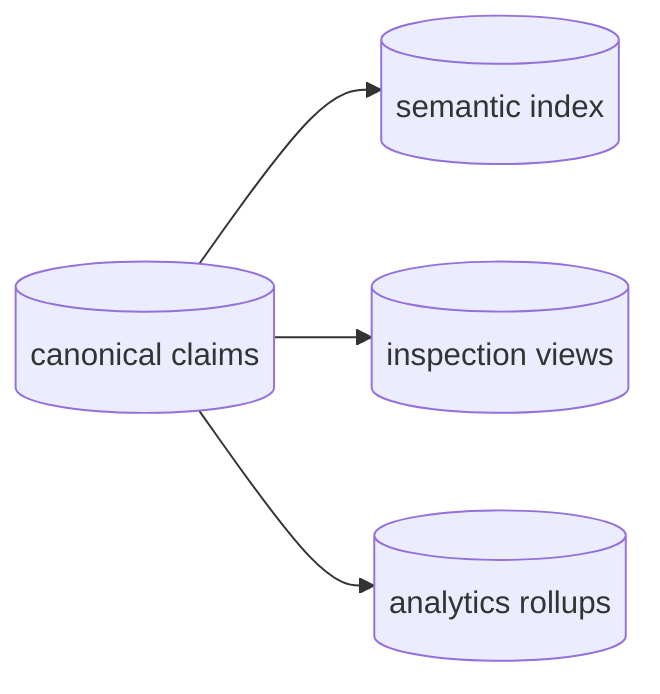

# Context Graph Vision

Last reviewed: 2026-05-29.

The Context Graph is the shared project memory agents use before, during, and
after work. It stores compact, sourced facts about a project so agents do not
rebuild context from raw code, PRs, tickets, docs, and chat every time.

## The Problem

Project context is scattered:

- decisions live in PRs, ADRs, Slack threads, and tickets;
- ownership and topology live in repo files, dashboards, and tribal memory;
- prior bugs and fixes are hard to retrieve by symptom;
- agents start each task with no durable memory of what previous agents learned.

Potpie should hold that context once, keep it fresh, and expose it through a
small stable surface.

## Product Shape

```mermaid
flowchart TB
  sources["code, docs, PRs, tickets, ops events"]
  ledger["Event Ledger<br/>managed or self-hosted source events"]
  graph["Context Graph<br/>compact claims + source refs"]
  agent["agent<br/>resolve/search/record/status"]

  sources --> graph
  sources -. "webhooks / polling" .-> ledger
  ledger -. "pull / consume" .-> graph
  agent --> graph
  graph --> agent
```

There are three product boundaries:

| Boundary | Description |
|---|---|
| Local OSS self-serve | Installed with the Potpie CLI. A local daemon hosts Pot Management, Graph Service, GraphBackend, and Skill Manager on local stores. State stays local by default. |
| Managed Potpie graph | Managed API server hosts the same Pot Management, Graph Service, and Skill Manager modules on hosted stores, with hosted auth and collaboration controls. |
| Event Ledger | Managed or self-hostable source-event service for webhooks, integration polling, replayable event history, and cursors. Local or managed graphs pull/consume from it. |

Local and managed graph profiles are deployments of the same graph model, not
separate products. The Event Ledger is adjacent infrastructure for source events,
not another graph model.

## Core Model

| Concept | Meaning |
|---|---|
| Pot | Unit of isolation and context. First local setup creates an active `default` pot. |
| Entity | Stable project object such as a service, feature, decision, issue, owner, runbook, or incident. |
| Claim | Canonical fact about an entity or relationship, with provenance and time fields. |
| Source ref | Pointer back to evidence: file path, PR, ticket, doc URL, alert, deploy, scanner output. |
| Record | Agent-facing durable write that lowers into claims. |
| Event | Source-system change captured by an Event Ledger, then reconciled into records/claims. |

The graph stores compact facts and references, not full PR diffs, document
bodies, chat transcripts, logs, webhook payload archives, or telemetry streams.

## Agent Surface

Agents get four operations:

| Tool | Role |
|---|---|
| `context_resolve` | Primary task-context read. |
| `context_search` | Targeted follow-up lookup. |
| `context_record` | Durable project memory write. |
| `context_status` | Readiness, capability, freshness, and skill nudge. |

New use cases become parameters, include families, readers, record types, or
skills. They do not become new public tools.

## Storage Principle

The graph model is the invariant. Physical storage is an adapter.



The canonical claim store is the source of truth. Semantic indexes, traversal
views, and analytics are rebuildable projections.

## Anti-goals

- No separate local and cloud graph models.
- No new public agent tools beyond the four.
- No source-provider credentials in the local daemon by default.
- No full source payloads in the graph.
- No Event Ledger as the graph source of truth.
- No hidden cloud dependency for local graph use.
- No mandatory Docker, Neo4j, Postgres, or cloud embedding service for OSS V1.
- No daemon shell as a dumping ground for business logic.
- No cross-pot federation in this design.

## Direction

Local OSS should feel like one command after install:

```bash
potpie setup --repo . --agent claude --scan
```

After setup, agents can resolve context, record durable memory, and rescan when
sources change. Managed graph hosting adds collaboration without changing the
graph contract. Managed or self-hosted Event Ledger deployments add integration
events that local and managed graphs can consume explicitly.
