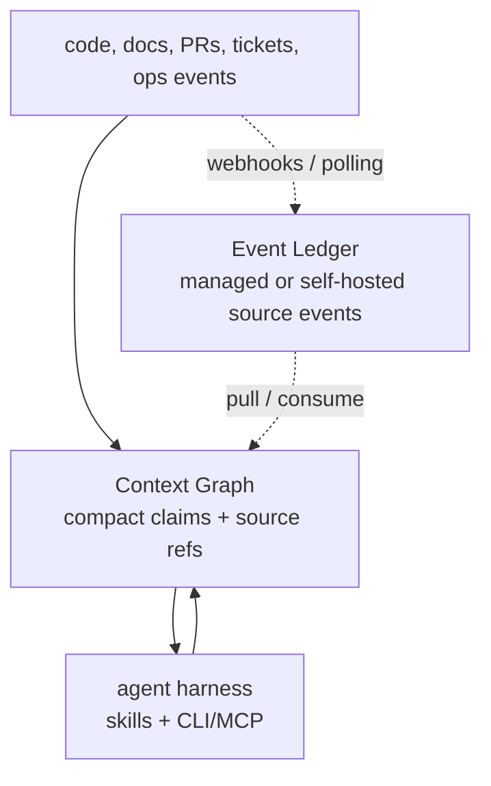
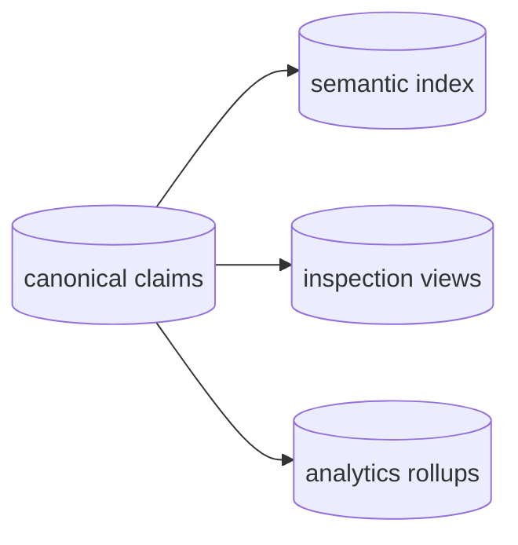

# Context Graph Vision

Last reviewed: 2026-06-08.

The Context Graph is the shared project memory agents use before, during, and
after work. It stores compact, sourced facts about a project so agents do not
rebuild context from raw code, PRs, tickets, docs, and chat every time.

## The Problem

Project context is scattered:

- decisions live in PRs, ADRs, Slack threads, and tickets;
- ownership and topology live in repo files, dashboards, and tribal memory;
- prior bugs and fixes are hard to retrieve by symptom;
- agents start each task with no durable memory of what previous agents learned.

Potpie should hold that context once, keep it fresh, and expose it through a
small stable surface.

## Product Shape



There are three product boundaries:

| Boundary | Description |
|---|---|
| Local OSS self-serve | Installed with the Potpie CLI. `potpie setup` installs/starts a local daemon; the daemon-hosted setup flow provisions config, local stores, the active pot, source registration, and skills. State stays local by default. |
| Managed Potpie graph | A managed backend API hosts the same Pot Management, Graph Service, and Skill Manager modules on hosted stores, with hosted auth and collaboration controls. `potpie login` authenticates to this backend; the backend URL can point at Potpie managed or a compatible self-hosted backend. |
| Event Ledger | Managed or self-hostable source-event service for webhooks, integration polling, replayable event history, event query/filter, and event-page replay tokens. Local or managed graphs pull/consume from it and track their own enqueue/apply/retry state. |

Local and managed graph deployments share the same graph model; they are not
separate products. The Event Ledger is adjacent infrastructure for source events,
not another graph model.

## Core Model

| Concept | Meaning |
|---|---|
| Pot | Unit of isolation and context. A pot can live in the local daemon or a managed backend; CLI commands address both through the same pot surface. First local setup creates an active local `default` pot. |
| Entity | Stable project object such as a service, feature, decision, issue, owner, runbook, or incident. |
| Claim | Canonical fact about an entity or relationship, with provenance and time fields. |
| Source ref | Pointer back to evidence: file path, PR, ticket, doc URL, alert, or deploy. |
| Semantic mutation | Agent-facing structured write proposal that lowers into validated graph mutations. |
| Inbox item | Pending graph work captured when the agent or user is not ready to choose an ontology update. |
| Event | Source-system change captured by an Event Ledger, then processed by ingestion into semantic proposals or claims. |

The graph stores compact facts and references, not full PR diffs, document
bodies, chat transcripts, logs, webhook payload archives, or telemetry streams.

## Agent Surface

The current implementation target is Graph V1: agents may still use the
existing `context_*` MCP tools and top-level CLI wrappers, but those surfaces
must act as compatibility adapters over forward-compatible graph internals. The
intelligence lives in the user's harness through Potpie graph skills.

Graph V1 keeps:

| Surface | Role |
|---|---|
| `context_status`, `potpie status` | Discover readiness, active pot, source/skill/backend status, and suggested next action. |
| `context_resolve`, `potpie resolve` | Query compact context through `intent`, `include`, `scope`, `mode`, and `source_policy`. |
| `context_search`, `potpie search` | Narrow follow-up lookup. |
| `context_record`, `potpie record` | Convenience capture/write wrapper over validated semantic mutations or inbox items. |

Graph V2 later exposes the same internals through the workbench surface:

| Command Family | Role |
|---|---|
| `status`, `catalog`, `describe` | Discover readiness, subgraphs, views, identity rules, and mutation policies. |
| `search-entities`, `read`, `history` | Retrieve bounded graph views with provenance, truth class, and version metadata. |
| `propose`, `commit`, `inbox` | Create inspectable semantic mutation plans, apply validated plans, or capture pending graph work. |

V1 compatibility writes must not bypass validation. If a request is too
ambiguous to become a safe canonical fact, Potpie should create an inbox item or
a low-authority observation for a harness skill to process.

## Storage Principle

The graph model is the invariant. Physical storage is an adapter.



The canonical claim store is the source of truth. Semantic indexes, traversal
views, and analytics are rebuildable projections.

## Anti-goals

- No separate local and cloud graph models.
- No long-term second graph agent surface after the workbench ships.
- No shortcut write path that bypasses semantic validation and commit.
- No Potpie-owned LLM/reconciliation agent as the canonical source of graph
  intelligence.
- No source-provider credentials in the local daemon by default.
- No full source payloads in the graph.
- No Event Ledger as the graph source of truth.
- No hidden cloud dependency for local graph use.
- No mandatory Docker, Neo4j, Postgres, or cloud embedding service for OSS V1.
- No daemon shell as a dumping ground for business logic.
- No cross-pot federation in this design.

## Direction

Local OSS should feel like one command after install:

```bash
potpie setup --repo . --agent claude
```

After setup, agents can discover graph views, read bounded context, propose
durable semantic updates through skills, commit low-risk validated updates, and
ingest source links/docs/history through harness-led semantic writes. Graph V2
makes the discovery/read/propose/commit workflow explicit in the CLI workbench.
Managed graph hosting adds collaboration
without changing the graph contract: users run `potpie login`, then can
`potpie use` either a local pot or a managed pot. Managed or self-hosted Event
Ledger deployments add integration events that local and managed graphs can
consume explicitly.
