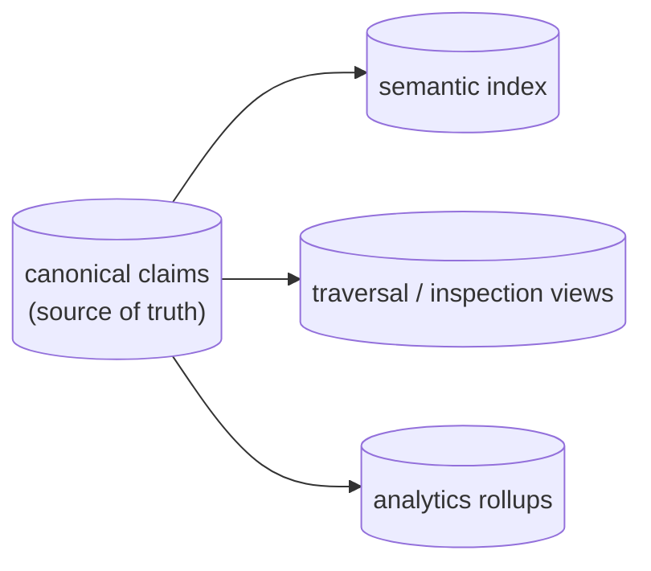
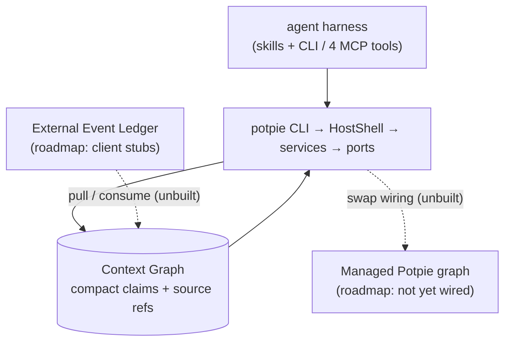

# Context Graph Vision

> Status: reflects code on `main` @ `8dd175bc`, last reviewed 2026-06-29.

The Context Graph is Potpie's **durable, shared project memory for AI agents** — a
compact, sourced store of facts about a project (decisions, ownership, topology,
prior bugs and fixes, conventions, features) so an agent does not rebuild context
from raw code, PRs, tickets, docs, and chat on every task. The root README frames
it as turning "your codebase and software development lifecycle into a living
context graph for AI agents."

This doc covers **what the Context Graph is and why it exists**. The mechanics live
in sibling docs: layers and composition roots in [architecture.md](./architecture.md),
the vocabulary in [ontology.md](./ontology.md), reading in [querying.md](./querying.md),
writing in [writing.md](./writing.md), how raw events arrive and the nudge model in
[ingestion-nudge.md](./ingestion-nudge.md), and the harness skills in
[skills.md](./skills.md).

## The Problem

Project context is scattered:

- decisions live in PRs, ADRs, Slack threads, and tickets;
- ownership and topology live in repo files, dashboards, and tribal memory;
- prior bugs and fixes are hard to retrieve by symptom;
- agents start each task with no durable memory of what previous agents learned.

Potpie should hold that context once, keep it fresh, and expose it through one
small, stable surface that both humans and agents use.

## Claims, not payloads

The graph stores **compact claims plus source references, never the payloads
themselves**. It deliberately does *not* hold full PR diffs, document bodies, chat
transcripts, logs, webhook archives, or telemetry. A *claim* is a sourced,
time-stamped fact about an entity or a relationship; a *source ref* points back to
the evidence (a file path, PR, ticket, doc URL, deploy).

The canonical claim store is the single source of truth. Everything else —
semantic search indexes, traversal/inspection views, analytics rollups — is a
**rebuildable projection** off those claims. The governing storage principle:

> The graph model is the invariant. Physical storage is an adapter.



The full vocabulary — 24 entity types, 25 public predicates plus a `RELATED_TO`
fallback, 7 truth classes — is owned by [ontology.md](./ontology.md). PRs, commits,
issues, incidents, and deployments all collapse to a single timeline `Activity`
entity; an entity exists only if an edge needs it as an endpoint.

## One CLI surface for humans and agents

There is **no separate human-vs-agent API**. Both users and agents talk to the same
`potpie` CLI, described in its own spine (`potpie/cli/main.py`) as
"the architecture's single spine": every command routes `CLI → HostShell →
service(s) → ports`.

Agents reach the same system two ways:

- **Directly via the CLI**, including the full `potpie graph …` workbench.
- **Via the in-process MCP tools** — exactly four: `context_resolve`,
  `context_search`, `context_record`, `context_status` (`context_record` is the
  only MCP write). These are compatibility adapters over the *same* graph
  internals, not a second engine.

The richer **Graph Surface Lite** (`potpie graph catalog/read/search-entities/
propose/commit/…`) is **CLI-only**; the MCP/agent surface stays at exactly four
tools. Read mechanics live in [querying.md](./querying.md); write mechanics in
[writing.md](./writing.md); the full command reference in [cli-flow.md](./cli-flow.md).

## Harness-owned intelligence

The intelligence lives in the **user's coding harness** (Claude Code, Codex,
Cursor, OpenCode), taught via **Potpie skills** — not in a Potpie-owned
reconciliation or LLM agent. Skills teach an agent how to use the CLI; they are not
graph facts and not new tools. The anti-goal is verbatim: *"No Potpie-owned
LLM/reconciliation agent as the canonical source of graph intelligence."*

The code honors this:

- The **nudge brain is deterministic** (`NudgeService`, wired in `host_wiring.py`;
  no model on this path).
- Retrieval ships a **bundled local embedder by default**, so semantic search needs
  no API key (disable with `CONTEXT_ENGINE_EMBEDDER=none`).
- A service-side reconciliation agent exists only as an optional extra on the HTTP
  ingestion-server path, and it is **off by default**
  (`reconciliation_flags.agent_planner_enabled()` returns `False`).
- Writes never bypass validation: an ambiguous request becomes an **inbox item or a
  low-authority observation** for a harness skill to process, never an unsafe
  canonical fact.

See [skills.md](./skills.md) for the skill catalog and the read/write loop the
skills teach.

## Product Shape



There are three intended product boundaries. Only the first is shipped today.

| Boundary | Status | Description |
|---|---|---|
| **Local OSS self-serve** | **Shipped (V1.5)** | Installed with the CLI. `potpie setup` provisions config, local stores, the active `default` pot, source registration, the daemon, and skills. State stays local by default. Default backend `falkordb_lite` (no Docker/Neo4j/cloud needed). |
| **Managed Potpie graph** | **Roadmap** | A managed backend API hosting the *same* service modules on hosted stores with hosted auth/collaboration. The graph model is identical — `HostShell` "swaps the wiring without changing the facade." |
| **Event Ledger** | **Roadmap** | A separate managed-or-self-hostable source-event service (webhooks, polling, replay cursors) that local or managed graphs *pull* from; it is never the graph source of truth. |

> **Roadmap (not yet wired):** Managed routing is designed and wired-for but not
> functional — `potpie use --managed`, `pot list --managed`, and the entire `cloud`
> command group raise `CapabilityNotImplemented`. The external Event Ledger clients
> (`managed_client.py` / `self_hosted_client.py`) are TODO stubs, so `potpie ledger
> pull/query` is non-functional against any real provider. The live "ledger" today
> is the internal Postgres event store used by ingestion — see
> [ingestion-nudge.md](./ingestion-nudge.md) for the two-ledger distinction.

Local and managed share **one graph model** ("no separate local and cloud graph
models"). The Event Ledger is adjacent infrastructure for source events, not a
second graph model.

## Pots as tenancy

A **Pot is the unit of isolation and tenancy** — every query, source, inbox item,
claim, semantic mutation, and graph operation is scoped to exactly one pot. The pot
id **is** the storage `group_id` stamped on every entity node and relationship edge
(`reset_pot` is a `MATCH (n {group_id:$gid}) DETACH DELETE n`). A pot can be local
or managed; the active pot determines routing. First local setup creates an active
local `default` pot. **Cross-pot federation is an explicit anti-goal.**

## Core Model

| Concept | Meaning |
|---|---|
| **Pot** | Unit of isolation and tenancy; `pot_id` is the storage `group_id`. A pot lives in the local daemon or (roadmap) a managed backend; the CLI addresses both through the same pot surface. First local setup creates the active `default` pot. |
| **Entity** | A stable project object — e.g. a `Service`, `Feature`, `Decision`, `Dependency`, `Person`/`Team`, or a timeline `Activity` (PRs/commits/issues/incidents/deployments collapse here). One of 24 catalog types; minted only when an edge needs it as an endpoint. |
| **Claim** | A canonical, sourced, time-stamped fact about an entity or relationship, carrying a truth class and provenance. The single source of truth. |
| **Source ref** | A pointer back to evidence: file path, PR, ticket, doc URL, or deploy. The graph holds the ref, not the payload. |
| **Semantic mutation** | An agent-facing structured write proposal (flat ops over a small DSL) that validates and lowers into graph writes. |
| **Inbox item** | Pending graph work captured when the agent or user is not yet ready to commit an ontology update; never a fact until processed. |
| **Event** | A source-system change (merged PR, ticket update, deploy). Raw events land in an internal event store and are turned into claims by ingestion — they are not stored verbatim. |

## What's shipped now (V1.5)

The single biggest historical drift in these docs framed the `potpie graph …`
workbench as a future "Graph V2." **That is wrong: the workbench is shipped today
as V1.5.** Both the legacy V1 wrappers (`resolve` / `search` / `record`) *and* the
full workbench are registered in `potpie/cli/main.py` right now.

Concretely, the live contract constants are:

| Constant | Value | Meaning |
|---|---|---|
| `GRAPH_CONTRACT_VERSION` | `v1.5` | the data plane (what's shipped) |
| `ONTOLOGY_VERSION` | `2026-06-graph` | the catalog/vocabulary version |
| `GRAPH_WORKBENCH_CONTRACT_VERSION` | `v2` | **only** the workbench *envelope* version string — not a separate, unshipped product |

So "v2" survives solely as the envelope version on workbench responses. What ships:

- **Reads:** the 4-tool MCP contract *and* `potpie graph catalog/read/search-entities/
  neighborhood/history` over the single read trunk; reads return ranked evidence
  (an `AgentEnvelope`) — **there is no server-side answer synthesis**, the agent
  reasons over the evidence ([querying.md](./querying.md)).
- **Writes:** the canonical write door is **`graph propose` → `graph commit
  --verify`**. `graph mutate` is a **legacy wrapper** that internally calls
  propose+commit; `record` / `context_record` remain live as the only MCP write
  path ([writing.md](./writing.md)).
- **Defaults:** `falkordb_lite` embedded backend, a detached `daemon` host mode, the
  bundled local embedder, installed skills, and the zero-token nudge hooks — all
  with no mandatory Docker, Neo4j, Postgres, or cloud service.

The canonical local first-run is one command (note `--scan` is **opt-in**, off by
default — `setup` does not scan the working tree unless asked):

```bash
potpie setup --repo . --agent claude   # add --scan to ingest the working tree
potpie status
```

After setup, an agent discovers the contract (`graph catalog`), reads bounded views
(`graph read`), resolves identity (`graph search-entities`), and writes durable
learnings (`graph propose` → `graph commit --verify`). See
[cli-flow.md](./cli-flow.md) for the full surface.

## Anti-goals

- No separate local and cloud graph models.
- No second long-term agent surface beyond the workbench.
- No write path that bypasses semantic validation and commit.
- No Potpie-owned LLM/reconciliation agent as the canonical source of graph
  intelligence.
- No source-provider credentials in the local daemon by default.
- No full source payloads in the graph.
- No Event Ledger as the graph source of truth.
- No hidden cloud dependency for local use.
- No mandatory Docker, Neo4j, Postgres, or cloud embedding service for OSS.
- No daemon shell as a dumping ground for business logic.
- No cross-pot federation in this design.

## See also

- [architecture.md](./architecture.md) — hexagonal layers, composition roots, the daemon, backends.
- [ontology.md](./ontology.md) — the 24 entities / 26 predicate keys / truth classes / contract constants.
- [querying.md](./querying.md) — the two read altitudes, the read trunk, ranking, retrieval cards.
- [writing.md](./writing.md) — the semantic DSL, propose→commit, the legacy `mutate` wrapper, inbox.
- [ingestion-nudge.md](./ingestion-nudge.md) — how raw events arrive, the two ledgers, the nudge model.
- [skills.md](./skills.md) — harness-owned intelligence and the skill read/write loop.
- [cli-flow.md](./cli-flow.md) — the full `potpie` command reference.
