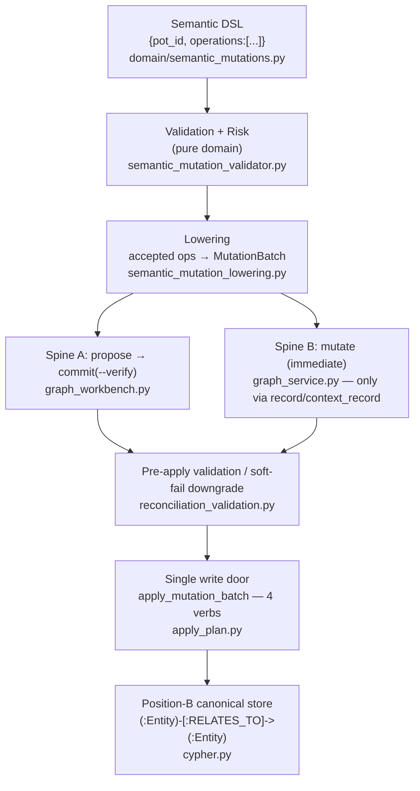

# Writing the Context Graph

> Status: reflects code on `main` @ `8dd175bc`, last reviewed 2026-06-29.

How facts get *into* the graph. Reads are covered in [querying.md](./querying.md); the
static contract (entities, predicates, truth classes, ops) lives in [ontology.md](./ontology.md);
the full command/flag surface is in [cli-flow.md](./cli-flow.md). This doc owns the **write
path**: the tiered stack, the flat semantic DSL, the two write spines, the single backend
write door, the inbox, coherence, and quality scoring.

Two framing rules up front:

- **The `potpie graph …` workbench is shipped today** as V1.5
  (`GRAPH_CONTRACT_VERSION="v1.5"`, `ONTOLOGY_VERSION="2026-06-graph"`; the workbench *envelope*
  stamps `graph_contract_version="v2"` only as a transport version string). There is no
  "future Graph V2" write surface — propose/commit are live.
- **The canonical write door is `graph propose` → `graph commit --verify`.** The
  old `graph mutate` command is removed; the immediate-apply service path is
  reached only through `record` / `context_record`.

---

## 1. The tiered write stack

Every write — whether authored by a harness skill, the `record` bridge, or the (off-by-default)
server-side reconciliation agent — funnels through the same tiers. Agents emit *semantic*
operations; Cypher and structural edge/entity DTOs are internal.



| Tier | Module | Responsibility |
|---|---|---|
| Semantic DSL | `domain/semantic_mutations.py` | Parse flat JSON ops into frozen DTOs |
| Validation + risk | `application/services/semantic_mutation_validator.py` | Pure-domain checks; per-op `MutationRisk`; batch decision |
| Lowering | `application/services/semantic_mutation_lowering.py` | Accepted ops → `MutationBatch` + provenance; stamp claim props |
| Spine A (canonical) | `application/services/graph_workbench.py` | propose → persist plan → commit(--verify) |
| Spine B (immediate) | `application/services/graph_service.py` | `mutate()` — validate→lower→apply now (record bridge only) |
| Pre-apply gate | `application/services/reconciliation_validation.py` | Caps, canonicalization, soft-fail downgrade |
| Write door | `adapters/outbound/graph/apply_plan.py` | `apply_mutation_batch` — 4 verbs, idempotent fingerprint |

---

## 2. The semantic DSL (flat ops)

Agents emit a batch-shaped payload — never Cypher, never `EntityUpsert`:

```json
{ "pot_id": "<pot-id>", "operations": [ { "op": "...", ... }, ... ] }
```

`SemanticMutationRequest.parse` / `SemanticMutation.parse` (`domain/semantic_mutations.py`) turn
this into frozen DTOs. A single-op alias `{ "op": "...", ... }` (also accepts `"operation"`) is
normalized to a one-element batch at parse. `--pot` on the CLI overrides any baked-in `pot_id`.
Structural parse failures raise `SemanticMutationParseError` (these are *shape* errors only;
ontology/authority checks happen in the next tier).

### 2.1 The 10 operations — all `APPLICABLE`

`SemanticMutationOp` (`domain/graph_contract.py`) defines exactly ten ops, and
**`APPLICABLE_MUTATION_OPS` is all ten**. There is no `reconcile_snapshot` op — that name is
fictional (it survives only as a stale comment in `domain/reconciliation.py`).

| Op | Use for | Lowers to |
|---|---|---|
| `upsert_entity` | Stable entity metadata (name/summary/description/properties) | `EntityUpsert` only |
| `link_entities` | Authoritative typed relationship | `EdgeUpsert` |
| `assert_claim` | Evidence-backed inference (the default agent write) | `EdgeUpsert` (value → synthetic `Observation`) |
| `append_event` | Timeline activity (PR/commit/deploy/incident) | `Activity` anchor + PERFORMED/TOUCHED/MENTIONS edges |
| `end_relation_validity` | Soft-end a relation with `valid_until` | `InvalidationOp` |
| `retract_claim` | Invalidate a claim (needs `reason`) | `InvalidationOp` |
| `supersede_claim` | Replace a claim, preserving history | replacement `EdgeUpsert` + `InvalidationOp(superseded_by_key)` |
| `merge_duplicate_entities` | Identity cleanup | merge props + a `RELATED_TO` merge-record edge |
| `patch_entity` | Small property update (field allow-list) | entity-only `EntityUpsert` |
| `transition_state` | Lifecycle field change (state machine) | lifecycle props + minted `Activity` MENTIONS edge |

> **Crucial:** there is no op partition for review. `REVIEW_REQUIRED_OPS` and `DEFERRED_OPS`
> are **both empty tuples**. Review/blocking is decided **at runtime** by `MutationRisk`
> (low/medium/high) — see §3 — not by which op you used. Old docs that called `supersede_claim`
> or `merge_duplicate_entities` "usually review-required" are wrong: they auto-apply when
> `--allow-review-required` and `--approved-by` are supplied, otherwise they return
> `review_required` because of their runtime risk.

### 2.2 Op fields are FLAT

Every field is **top-level on the operation** — there are no nested `{"event":{…}}`,
`{"claim":{…}}`, or `{"field"/"from"/"to"}` wrappers. Nested shapes (as in the old `graphv2.md`
examples) **will not parse**.

The flat field set: `op`, `subject`, `predicate`, `object`, `value`, `truth`, `confidence`,
`evidence[]`, `description`, `environment`, `valid_from`, `valid_until`, `observed_at`, `reason`,
`superseded_by`, `patch`, `expected_entity_version`, `from_state`, `to_state`, `external_ids`.
`append_event` adds `verb`, `occurred_at`, `actor`, `targets[]`, `mentions[]`. `subject` and
`object` may be a bare key string or an object carrying `key`/`type`/`name`/`summary`/
`description`/`properties` (so a single op can mint the endpoint and assert about it at once).

A real bug→fix proposal (matches `graph mutation-template --kind bug-fix`):

```json
{
  "pot_id": "<pot-id>",
  "idempotency_key": "bug-fix:<bug-slug>:<fix-hash>",
  "created_by": { "surface": "cli", "harness": "claude" },
  "operations": [
    {
      "op": "assert_claim",
      "subject": {
        "key": "bug_pattern:<bug-slug>",
        "type": "BugPattern",
        "summary": "<one-line symptom>",
        "description": "<retrieval card: error text, symptoms, synonyms, where it shows up>"
      },
      "predicate": "REPRODUCES",
      "object": { "key": "service:<service-slug>", "type": "Service" },
      "truth": "agent_claim",
      "confidence": 0.8,
      "description": "<how the bug manifests>"
    },
    {
      "op": "assert_claim",
      "subject": { "key": "fix:<fix-hash>", "type": "Fix", "summary": "<one-line fix>" },
      "predicate": "RESOLVED",
      "object": { "key": "bug_pattern:<bug-slug>", "type": "BugPattern" },
      "truth": "agent_claim",
      "confidence": 0.8,
      "description": "<retrieval card: what fixed it, files touched, verification>"
    }
  ]
}
```

A timeline event (`append_event`, flat verb/occurred_at/actor/targets):

```json
{
  "pot_id": "<pot-id>",
  "operations": [
    {
      "op": "append_event",
      "verb": "merged_pr",
      "occurred_at": "2026-06-05T01:35:00+05:30",
      "description": "<what changed, source title, regression keywords — written for timeline recall>",
      "actor": { "key": "person:<handle>", "type": "Person" },
      "targets": [ { "key": "service:<service-slug>", "type": "Service" } ],
      "mentions": [ { "key": "feature:<feature-slug>", "type": "Feature" } ],
      "evidence": [ { "source_ref": "github:pr:acme/payments:812", "authority": "external_system" } ]
    }
  ]
}
```

`graph mutation-template --kind <repo-baseline|feature|preference|preference-policy|infra-snapshot|bug-fix|decision|timeline-event|timeline-change>`
prints a schema-only skeleton (placeholders only — it never reads the repo or infers facts).

The internal structural tier (`domain/graph_mutations.py`: `EntityUpsert`, `EdgeUpsert`,
`EdgeDelete`, `InvalidationOp` + `ProvenanceRef`/`ProvenanceContext`) is what these flat ops
*lower into*; agents never author it directly. Those compose a `MutationBatch`
(= `ReconciliationPlan`, `domain/reconciliation.py`).

---

## 3. Validation + risk

`validate_semantic_request(request) -> SemanticMutationPlan`
(`application/services/semantic_mutation_validator.py`) is **pure domain** — it reads the
ontology/contract and never touches a backend. Per-op checks:

- op is known; (a live but **dead** `deferred` branch, since `DEFERRED_OPS` is empty);
- truth class is valid; `confidence ∈ [0,1]`; timestamps are ISO-8601; evidence authorities valid;
- per-op structural rules: claim endpoints via `edge_spec.allows`; `append_event` needs an
  `Activity` anchor + PERFORMED/TOUCHED/MENTIONS endpoints; retract/supersede need a target
  identity; `patch_entity` enforces a field allow-list (rejects state fields) and a
  retrieval-grade description; `transition_state` validates the lifecycle state machine; merge
  requires distinct keys, same type, and `external_ids`.

The **evidence-or-low-authority** rule: only `authoritative_fact` and `source_observation`
claims must carry evidence; `agent_claim`/`quality_finding` are explicitly soft and need none.
A **missing `description` is only a warning, never a reject** — but recall depends on the
agent-authored retrieval card, so skills treat it as mandatory.

Each op becomes a `LoweredOperation` with a status (`accepted | review_required | deferred |
rejected`) and a `MutationRisk` (low/medium/high). The batch-level `_decide`:

- any error → whole batch `rejected`;
- any review op → `review_required`;
- medium/high-risk accepted ops auto-apply **only** with `allow_review_required AND approved_by`,
  otherwise `review_required`.

**Atomic batch semantics:** if *any* op can't auto-apply, the **whole batch is `review_required`
and nothing writes.** Subgraph routing (`_subgraph_for` / `subgraph_for_predicate`) maps each
predicate to its named slice. (Because the op partitions are empty, the validator's
`review_required`/`deferred` op branches are currently dead code — review is always the runtime
risk decision above.)

---

## 4. Lowering

`lower_semantic_request(request, plan)`
(`application/services/semantic_mutation_lowering.py`) lowers **only accepted ops** into
`plan.batch` + `plan.provenance`. Highlights:

- claims emit an `EdgeUpsert`; a `value` literal mints a synthetic `Observation` carrying the
  literal — "never an authoritative fact from raw text";
- `append_event` anchors an `Activity` and emits PERFORMED/TOUCHED/MENTIONS edges;
- `retract_claim`/`end_relation_validity` → `InvalidationOp`; `supersede_claim` writes the
  replacement claim **and** an invalidation stamped with `superseded_by_key`;
- `merge_duplicate_entities` stamps merge props + a `RELATED_TO` merge-record edge;
  `patch_entity` is entity-only; `transition_state` stamps lifecycle props and mints an Activity
  MENTIONS edge.

`_claim_properties` stamps the **full V1.5 claim metadata** onto every edge: `claim_key`,
`subgraph`, `truth`, `evidence_strength`, `confidence`, `fact`, `description`, `source_refs`/
`evidence`, `valid_at`/`valid_from`, `observed_at`, `created_by`, contract/ontology version,
`idempotency_key`, the `identity_key` tuple, `environment`, `code_scope`, and structured fields.
Entities are deduped by key (`_ensure_entity`); summaries are derived only from authored material
(`compact_entity_summary`), so a bare re-reference of an entity never clobbers a stored summary.

---

## 5. Spine A — propose → commit (the canonical door)

`GraphWorkbenchService` (`application/services/graph_workbench.py`) implements the two-phase door.

**`propose(payload, pot_id, ttl)`** — snapshot `current_versions`, compute `expected_versions`,
detect a version conflict, then parse → validate → (unless invalid/conflict) lower → build a
`GraphMutationDiff` + `claim_keys`, and persist a **`GraphMutationPlanRecord`** (its lowered
batch, provenance, expected/current versions, TTL expiry, warnings, rejected ops). Status is one
of `validated | invalid | conflict | review_required`. Returns a `GraphMutationProposal`.
**No graph write happens here.**

**`commit(plan_id, pot_id, approved_by, verify)`** — load by id; reject if not found / terminal /
expired; **re-check the version conflict**; enforce approval (medium/high risk needs
`--approved-by`); then call `backend.mutation.apply(record.lowered_batch, …)`. The agent does
**not** resend the mutations — commit replays the server-persisted plan. On success it persists
status `committed` with the `mutation_id` and final versions and emits a `history_pointer` +
`audit_ref`.

`--verify` runs `_verify_ingestion_commit`: it reads the committed `claim_keys` back through
`claim_query.find_claims` (flagging `missing_claim_keys`), takes before/after quality snapshots,
and **downgrades** the result to `degraded` / `partial` / `watch` on missing readback, an
unavailable backend, or a quality regression. Skills always commit with `--verify`.

### 5.1 Plan states

`GraphMutationPlanStatus` (`domain/graph_plans.py`): `validated`, `invalid`, `conflict`,
`review_required`, `approved`, `committed`, `expired`, `abandoned`, `error`.
`TERMINAL_PLAN_STATUSES` blocks re-commit. Plans persist in
`adapters/outbound/graph/plan_stores/local_json.py` (`~/.potpie/graph_plans.json`, atomic
tmp-replace, keyed pot → plan_id).

### 5.2 Optimistic concurrency is COARSE

`_subgraph_versions()` returns **`{"_global": <total pot claim count>}` only** — there are **no
per-subgraph versions** (despite old `affected_subgraphs.{features,bugs,…}` examples). A conflict
fires only if the pot's *total* claim count changed between propose and commit. The conflict
result carries `expected_version` / `actual_version` and a "reread and re-propose" recommendation.

> **Roadmap (not yet wired):** true per-subgraph version tracking. Today concurrency is a single
> global counter, so unrelated concurrent writes to the same pot can spuriously conflict.

### 5.3 The diff shape

`GraphMutationDiff.to_dict()` emits exactly these keys (not the old `entities_created/…`):

```text
entity_upserts · edge_upserts · edge_deletes · invalidations ·
claims_asserted · claims_retracted · claim_keys
```

### 5.4 Bulk

`graph bulk apply` chunks an NDJSON/JSON stream of plans (`--chunk-size`, `--start-chunk`,
`--continue-on-error`, `--manifest`, `--idempotency-key`, `--verify`) over the same propose+commit
machinery for large baseline/ingestion writes. Full flags in [cli-flow.md](./cli-flow.md).

---

## 6. Spine B — direct mutate (record bridge only)

`DefaultGraphService.mutate(request)` (`application/services/graph_service.py`):
validate → (reject early) → lower → if `dry_run` return preview counts → if `review_required`
return without writing → else `backend.mutation.apply(plan.batch, …)` **immediately**. No plan
persistence, no TTL, no version-conflict guard. Returns a `SemanticMutationResult`
(`applied | validated | rejected | review_required | error`).

**What reaches Spine B today:**

- the **`record` / `context_record`** bridge (`application/services/record_to_semantic.py`), and
- `ingestion_submission_service` (the `context_record` deterministic path).

`record_to_semantic` maps each `record_type` to fixed semantic op(s): preference/policy →
`assert_claim POLICY_APPLIES_TO` (truth=preference, `decisions` subgraph); bug_pattern/fix →
REPRODUCES + RESOLVED/ATTEMPTED_FIX_FAILED (`debugging`); verification → VERIFIED;
decision → DECIDED (+AFFECTS, truth=user_decision); unknown types → free-form `RELATED_TO`. It
sets `allow_review_required=True, approved_by="context_record"` so a deliberate record write
(including medium-risk decisions) auto-applies; it never generates supersede/merge.
`context_record` is the **only MCP write tool** (`potpie/mcp/server.py`); the MCP surface
stays at exactly four tools (see [querying.md](./querying.md)).

`DefaultGraphService.mutate` is reached only through `record`/`context_record`;
there is no direct CLI mutation command.

---

## 7. The single backend write door

All applies — from both spines — converge on `apply_mutation_batch`
(`adapters/outbound/graph/apply_plan.py`, alias `apply_reconciliation_plan`). The sync
`GraphMutationPort.apply(...)` bridges to this async function via a loop-aware `asyncio.run` in
each backend. It:

1. runs `validate_reconciliation_plan` (the pre-apply gate, §8);
2. mints a per-apply `mutation_id` (uuid4);
3. builds a `ProvenanceRef` — for event-less batches it uses
   `ProvenanceContext.source_event_id` or a **stable blake2b content fingerprint of the whole
   batch** (`_stable_batch_source_id`), *never* the per-apply uuid, so retries stay idempotent and
   do not mint duplicate edges;
4. runs the **four verbs, in order**, on `GraphWriterPort`:
   `upsert_entities → upsert_edges → delete_edges → invalidate`;
5. returns a `MutationResult` (ok, `mutation_id`, summary counts, downgrades).

Below this sits the **Position-B canonical writer** shared by both the Neo4j and FalkorDB writers
(`adapters/outbound/graph/cypher.py`): claims are
`(:Entity {group_id, entity_key})-[:RELATES_TO {name, source_ref, valid_at, invalid_at, …}]->(:Entity)`.
The MERGE key *includes* `source_ref` so corroborating writes from different sources don't
collide; bitemporal stamps separate event time (`valid_at`/`invalid_at`) from system time
(`created_at`); `_supersede_singleton_predecessors` stamps `invalid_at` on prior disagreeing live
singleton claims (`OWNED_BY` is the only singleton). Backend coverage and the `GraphWriterPort`
shape are detailed in [architecture.md](./architecture.md).

---

## 8. Pre-apply validation / soft-fail downgrade

`validate_reconciliation_plan(batch, expected_pot_id)`
(`application/services/reconciliation_validation.py`) is the last gate before the writer:

- canonicalize the plan; enforce **hard caps** (5000 entities / 10000 edges / 2000 invalidations,
  duplicate-key detection, ISO temporal checks);
- optional canonical-label enrichment; backfill required properties.

With `CONTEXT_ENGINE_ONTOLOGY_SOFT_FAIL=1` (and not strict) it **downgrades instead of failing**:
drops unknown labels, falls ADR → Document/Observation, coerces invalid lifecycle to `unknown`,
backfills missing edge temporal anchors with `now()`, rewrites unknown edge types → `RELATED_TO`
(confidence 0.3), and drops endpoint-mismatched edges. Each downgrade is recorded and may attach a
`QualityIssue` node. A final `validate_structural_mutations` + invalidation check raises
`MutationBatchValidationError` (structured issues) when the plan is still invalid. Material plans
with no provenance get a non-blocking evidence warning.

This is per-write **structural** integrity. It is distinct from the import-time ontology coherence
guards in §9.

---

## 9. Coherence invariants

`domain/coherence.py` keeps the unified ontology vocabularies aligned so the write DSL can never
drift from the catalogs it lowers against. `_run_import_time_checks()` runs at module load and
**fails startup fast**: identity labels ⊆ `ENTITY_TYPES`; every `RECORD_TYPES` `anchor_label` ⊆
`ENTITY_TYPES`; every `emits_predicate` ⊆ `EDGE_TYPES`; every `reader_include` advertised;
`STRUCTURAL_INCLUDES` disjoint from record includes; each `payload_schema` has a builder.
`assert_runtime_coherence(reader_backed_includes)` (called from bootstrap once readers exist)
asserts the live reader registry equals advertised `READER_BACKED_INCLUDES` and that event-playbook
prose names only canonical labels/predicates. Failures raise `OntologyCoherenceError` — the rule is
"align the declaration, don't relax the check." This is **ontology-vocabulary** coherence; the
catalogs themselves are owned by [ontology.md](./ontology.md).

---

## 10. Inbox

Inbox items are **pending graph work that intentionally never become facts** until a harness
processes them (read/search → propose → commit). `domain/graph_inbox.py` +
`adapters/outbound/graph/inbox_stores/local_json.py`; methods on `GraphWorkbenchService`
(`inbox_add/list/show/claim/mark_applied/mark_rejected/close`). States:
`pending → claimed → applied/rejected/closed` (`TERMINAL_INBOX_STATUSES`). `mark_applied` requires
a linked `plan_id` or `mutation_id`. Persisted in `~/.potpie/graph_inbox.json` keyed by pot. The
inbox store port is optional — absent wiring raises `CapabilityNotImplemented`.

CLI: `graph inbox add | list | show <id> | claim <id> | mark-applied <id> [--plan|--mutation] |
mark-rejected <id> [--reason] | close <id>`.

---

## 11. Quality scoring (diagnostic only)

Quality never writes — it surfaces findings and recommends propose/commit corrections or inbox
items. Two layers:

1. **Resolve-time** `assess_graph_quality(refs, coverage, fallbacks)` (`domain/graph_quality.py`)
   → a `GraphQualityReport` (`good/watch/degraded/unknown`) from source-reference freshness
   (TTL from the ontology fact-family), verification gaps, source-access gaps, and coverage.
   `detect_family_conflicts` finds contradicting live `RELATES_TO` edges per predicate-family +
   subject and classifies contradiction / supersession_pending / overlap (this feeds
   auto-supersede and conflict findings).
2. **Workbench read-only** `GraphWorkbenchService.quality(report=…)` scans `ClaimRow`s via
   `backend.claim_query` to emit `GraphQualityFinding`s for `summary | duplicate-candidates |
   stale-facts | conflicting-claims | orphan-entities | low-confidence | projection-drift`
   (status ok/watch/degraded). The same summary snapshot powers `commit --verify` regression
   detection (§5).

CLI: `graph quality <summary|duplicate-candidates|stale-facts|conflicting-claims|orphan-entities|
low-confidence|projection-drift> [--threshold 0.5] [--subgraph] [--limit]`.

---

## 12. Write commands (summary)

Full flags live in [cli-flow.md](./cli-flow.md); the write loop discipline is taught by the
`potpie-graph` skill (see [skills.md](./skills.md)).

| Command | Spine / role |
|---|---|
| `graph propose --file mutation.json [--ttl 1h]` | Spine A — validate + persist plan (no write) |
| `graph commit <plan_id> --verify [--approved-by]` | Spine A — apply persisted plan, read-back verify |
| `graph bulk apply --file <ndjson> [--chunk-size] [--verify]` | Spine A — chunked multi-plan apply |
| `graph mutation-template --kind <…>` | static schema-only skeleton (no host call) |
| `record --type … --summary …` / MCP `context_record` | Spine B — record→semantic bridge (only MCP write) |
| `graph history [--entity\|--claim\|--plan\|--mutation\|--subgraph]` | committed-write audit trail |
| `graph inbox …` / `graph quality …` | pending work / diagnostics (§10–11) |

Canonical loop: discover the contract (`graph catalog`) → read (`graph read`) → resolve identity
(`graph search-entities`) → `graph propose` → `graph commit --verify` → capture uncertainty
(`graph inbox add`) → check `graph quality`.

---

## See also

- [ontology.md](./ontology.md) — entities, predicates, truth classes, the 10 ops, identity keys.
- [querying.md](./querying.md) — the read trunk, the 4-tool MCP contract, the AgentEnvelope.
- [cli-flow.md](./cli-flow.md) — the full command/flag surface.
- [ingestion-nudge.md](./ingestion-nudge.md) — how raw episodes/events enter; the nudge model.
- [architecture.md](./architecture.md) — backends, the GraphWriterPort, the shared engine room.
- [skills.md](./skills.md) — the harness-taught propose/commit write discipline.
