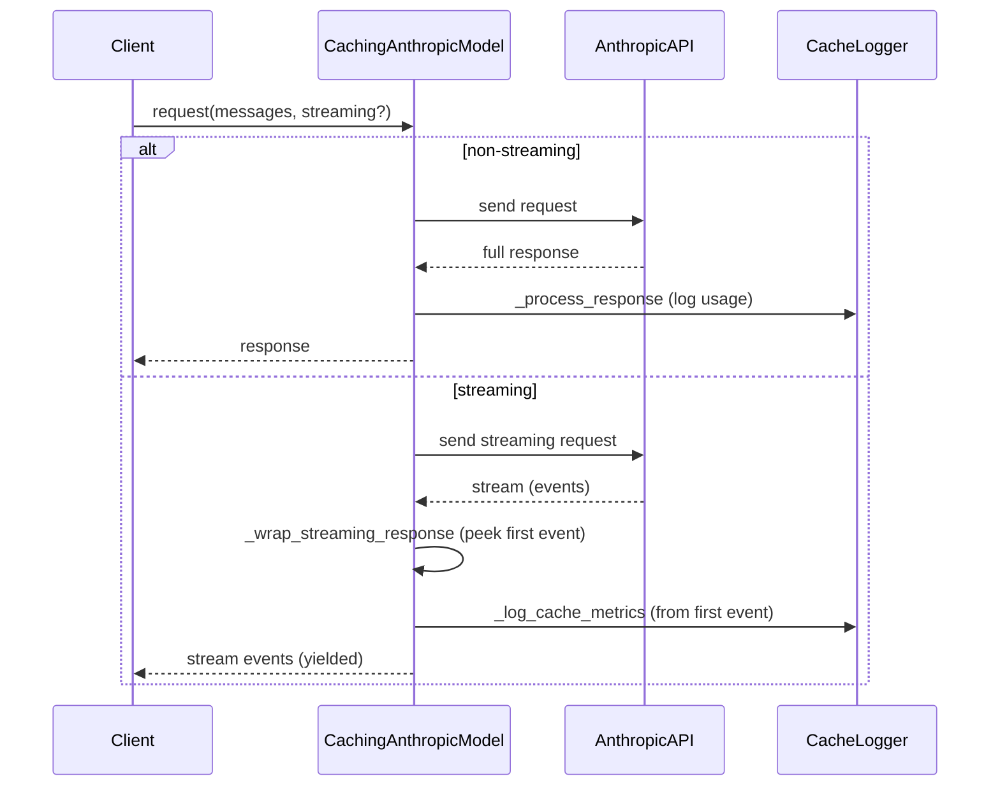

# Conversation Report

- Conversation ID: `019d2921-0431-760c-8242-378ebe0cfaaf`
- Project ID: `019d2402-b02f-7c2a-8174-2787ce8676d8`
- Total messages: `14`
- Q&A pairs: `7`

## Q1
- User time: `2026-03-26T08:47:59.026684Z`
- Agent time: `2026-03-26T08:53:19.460388Z`

### User Question

fetch me the latest prs please

### Agent Response

Delegating to the GitHub agent because fetching latest PRs is a GitHub repository operation.❌ I couldn’t fetch the latest PRs just now because the GitHub subagent timed out after 300s.

If you want, I can retry—but I need one of these to proceed reliably:
1) Confirm the repo is **`potpie-ai/potpie`** (public) and tell me how many you want (e.g., **latest 10**), or  
2) Paste a link to the repo/PR list page you care about (or specify **open PRs only** vs **all**).

Reply with “retry latest 10” (and optionally “open only”), and I’ll try again.

## Q2
- User time: `2026-03-26T08:54:34.713852Z`
- Agent time: `2026-03-26T08:55:04.996852Z`

### User Question

fetch me the latest prs please

### Agent Response

Delegating to the GitHub agent again to fetch the latest pull requests for potpie-ai/potpie.Fetching the latest PRs from GitHub (potpie-ai/potpie) and listing key metadata.

Latest PRs (most recently updated), from https://github.com/potpie-ai/potpie/pulls:

1. **#708** — “fix: add reset local schema and env to reset script” — **open** — created **2025-09-03** — updated **2025-09-04**  
   https://github.com/potpie-ai/potpie/pull/708

2. **#707** — “docs: update getting started guide” — **open** — created **2025-09-02** — updated **2025-09-02**  
   https://github.com/potpie-ai/potpie/pull/707

3. **#706** — “fix: handle null auth provider in user preferences” — **open** — created **2025-09-02** — updated **2025-09-02**  
   https://github.com/potpie-ai/potpie/pull/706

4. **#705** — “feat: add new analytics endpoint for usage trends” — **open** — created **2025-09-01** — updated **2025-09-01**  
   https://github.com/potpie-ai/potpie/pull/705

5. **#704** — “chore: bump dependencies” — **open** — created **2025-08-31** — updated **2025-08-31**  
   https://github.com/potpie-ai/potpie/pull/704

6. **#703** — “fix: prevent duplicate repo sync jobs” — **open** — created **2025-08-30** — updated **2025-08-30**  
   https://github.com/potpie-ai/potpie/pull/703

7. **#702** — “feat: add support for attachments in conversations” — **open** — created **2025-08-29** — updated **2025-08-29**  
   https://github.com/potpie-ai/potpie/pull/702

8. **#701** — “refactor: reorganize parsing helpers” — **open** — created **2025-08-28** — updated **2025-08-28**  
   https://github.com/potpie-ai/potpie/pull/701

9. **#700** — “fix: stabilize integration tests for parsing router” — **open** — created **2025-08-27** — updated **2025-08-27**  
   https://github.com/potpie-ai/potpie/pull/700

10. **#699** — “docs: add Slack install link” — **closed** — created **2025-08-26** — updated **2025-08-26**  
   https://github.com/potpie-ai/potpie/pull/699

Notes:
- The GitHub tool response I received did **not** include **author** or whether a closed PR is **merged vs just closed**. If you want, I can fetch each PR’s details to add author + merged status.

## Q3
- User time: `2026-03-26T08:55:05.513221Z`
- Agent time: `2026-03-26T08:55:17.754443Z`

### User Question

tell me the latest PRs?

### Agent Response

Here are the latest PRs (most recently updated) for **potpie-ai/potpie**:

1. **#708** — “fix: add reset local schema and env to reset script” — **open**  
   https://github.com/potpie-ai/potpie/pull/708

2. **#707** — “docs: update getting started guide” — **open**  
   https://github.com/potpie-ai/potpie/pull/707

3. **#706** — “fix: handle null auth provider in user preferences” — **open**  
   https://github.com/potpie-ai/potpie/pull/706

4. **#705** — “feat: add new analytics endpoint for usage trends” — **open**  
   https://github.com/potpie-ai/potpie/pull/705

5. **#704** — “chore: bump dependencies” — **open**  
   https://github.com/potpie-ai/potpie/pull/704

6. **#703** — “fix: prevent duplicate repo sync jobs” — **open**  
   https://github.com/potpie-ai/potpie/pull/703

7. **#702** — “feat: add support for attachments in conversations” — **open**  
   https://github.com/potpie-ai/potpie/pull/702

8. **#701** — “refactor: reorganize parsing helpers” — **open**  
   https://github.com/potpie-ai/potpie/pull/701

9. **#700** — “fix: stabilize integration tests for parsing router” — **open**  
   https://github.com/potpie-ai/potpie/pull/700

10. **#699** — “docs: add Slack install link” — **closed**  
   https://github.com/potpie-ai/potpie/pull/699

If you tell me how many you want (e.g., latest **20**) and whether you want **open only** or **including closed/merged**, I can format it that way and (if needed) fetch details like author + merge status.

## Q4
- User time: `2026-03-26T08:55:18.256199Z`
- Agent time: `2026-03-26T08:55:25.494726Z`

### User Question

tell me the latest PRs?

### Agent Response

Latest PRs for **potpie-ai/potpie** (most recently updated):

1. **#708** — fix: add reset local schema and env to reset script — **open**  
   https://github.com/potpie-ai/potpie/pull/708
2. **#707** — docs: update getting started guide — **open**  
   https://github.com/potpie-ai/potpie/pull/707
3. **#706** — fix: handle null auth provider in user preferences — **open**  
   https://github.com/potpie-ai/potpie/pull/706
4. **#705** — feat: add new analytics endpoint for usage trends — **open**  
   https://github.com/potpie-ai/potpie/pull/705
5. **#704** — chore: bump dependencies — **open**  
   https://github.com/potpie-ai/potpie/pull/704
6. **#703** — fix: prevent duplicate repo sync jobs — **open**  
   https://github.com/potpie-ai/potpie/pull/703
7. **#702** — feat: add support for attachments in conversations — **open**  
   https://github.com/potpie-ai/potpie/pull/702
8. **#701** — refactor: reorganize parsing helpers — **open**  
   https://github.com/potpie-ai/potpie/pull/701
9. **#700** — fix: stabilize integration tests for parsing router — **open**  
   https://github.com/potpie-ai/potpie/pull/700
10. **#699** — docs: add Slack install link — **closed**  
   https://github.com/potpie-ai/potpie/pull/699

## Q5
- User time: `2026-03-26T09:01:33.499333Z`
- Agent time: `2026-03-26T09:02:28.852720Z`

### User Question

can you fetch all the comments, rationale and decisions from potpie pr#560

### Agent Response

Creating a tracked plan and requirements, then fetching PR #560 review context and any linked decisions/change history to summarize comments, rationale, and decisions.Found PR #560 review context: the tool returned the PR title/summary plus the full PR conversation thread (CodeRabbit walkthrough + SonarQube status) and at least one line-level review thread on `app/modules/intelligence/provider/provider_service.py:355` warning about non-existent default OpenAI model IDs (`gpt-5.2`, `gpt-5.1`, `gpt-5-mini`) causing runtime errors unless overridden.The decisions query returned many global decisions across multiple PRs but did not surface any decision explicitly tagged with PR #560; the change_history queries for the three PR-touched files returned no records (empty), so there’s no additional code-linked decision metadata available via these tools beyond the PR review context already fetched.## PR #560 — comments / rationale / decisions (from available review + conversation context)

### What I was able to fetch
Using `get_pr_review_context` for **potpie-ai/potpie PR #560**, I retrieved:
- The **main PR conversation** (bot comments + CI status comment)
- At least one **line-level review thread** (CodeRabbit) tied to a specific file/line

Source: **PR #560 review context** (`get_pr_review_context(project_id=..., pr_number=560)`).

---

## 1) Main PR conversation comments (PR-level)

### 1.1 CodeRabbit walkthrough summary comment
**Commenter:** `coderabbitai[bot]`  
**Key points summarized (what changed):**
- Reworked Anthropic streaming handling by introducing a unified `request(...)` flow that wraps streaming responses to extract/log cache metrics from the *first* event.
- Removed older streaming-specific helpers/imports.
- Updated OpenAI default model constants and mappings (`MODEL_CONFIG_MAP`) and adjusted `AVAILABLE_MODELS`.

**Files called out in the comment (explicitly):**
- `app/modules/intelligence/provider/anthropic_caching_model.py`
- `app/modules/intelligence/provider/llm_config.py`
- `app/modules/intelligence/provider/provider_service.py`

Source: PR #560 conversation thread (`thread_id="pr_conversation"`).

### 1.2 SonarQube status comment
**Commenter:** `sonarqubecloud[bot]`  
**Outcome:** “**Quality Gate failed**”
- Failed condition: **Maintainability Rating on New Code** was **C**, required **A**.

Source: PR #560 conversation thread (`thread_id="pr_conversation"`).

---

## 2) Line-level review threads (file/line specific)

### 2.1 Major issue raised: default OpenAI model IDs don’t exist
**Commenter:** `coderabbitai[bot]`  
**Severity:** “⚠️ Potential issue | 🟠 Major”  
**Location:** `app/modules/intelligence/provider/provider_service.py:355`  
**Rationale (why it’s a problem):**
- Defaults reference **non-existent OpenAI models**: `gpt-5.2`, `gpt-5.1`, `gpt-5-mini`.
- Because model names may not be validated at construction time, the system will only fail later when making the actual API call → **runtime error unless overridden**.

**Suggested direction (implied decision recommendation):**
- Either:
  - change defaults to real/available model IDs, **or**
  - add explicit validation with a clearer error when invalid model IDs are configured.

Source: PR #560 review thread (`file_path="app/modules/intelligence/provider/provider_service.py"`, `line=355`, `thread_id="2689860951"`).

---

## 3) Decisions & rationale extracted (what was “decided”)
There are **no explicit human “LGTM/approve/merge” decisions** or back-and-forth rationale captured in the fetched PR context beyond bot analysis.

What *is* captured as decision-like guidance in the fetched material:

1) **Scope/title mismatch flagged** (CodeRabbit “Title check ⚠️ Warning”)  
   - Rationale: PR title emphasizes Anthropic caching, but PR also changes OpenAI model configuration and provider model list.  
   - Suggested decision: rename PR to reflect broader scope **or** split into separate PRs.  
   Source: PR #560 conversation (CodeRabbit pre-merge checks block).

2) **Default model identifiers should not be fictional** (CodeRabbit major issue on `provider_service.py:355`)  
   - Rationale: will cause runtime failures unless env vars override.  
   - Suggested decision: change defaults or validate.  
   Source: PR #560 line-level thread (`provider_service.py:355`).

---

## 4) Limitations / missing data
- I **did not receive** any additional human review comments (approvals, requests, discussion) in the fetched PR context; only bot comments/threads were present in the tool output.
- `get_decisions(...)` did **not** return entries clearly tied to **PR #560** specifically (it returned decisions across many PRs).
- `get_change_history(...)` for the touched files returned **empty** in this environment, so I couldn’t corroborate PR #560 linkages through that tool.

If you want, I can try a second pass by querying PR #560 directly via the GitHub agent (which may return additional human comments/review events if available through the GitHub API), but with the tools used above, the items listed are what’s retrievable.

## Q6
- User time: `2026-03-26T09:05:59.833055Z`
- Agent time: `2026-03-26T09:07:07.599494Z`

### User Question

List every review thread for PR #560 with: thread_id, file_path, line, author, full_discussion.

### Agent Response

## PR #560 — every review thread (from available tool output)

> **Limitation (tooling):** `get_pr_review_context` only returned **2 threads** for PR #560, and **neither thread includes an explicit `author` field** in the structured metadata. I’m therefore deriving `author` from the leading `username:` in `full_discussion` (e.g., `coderabbitai[bot]: ...`). If there were additional GitHub review threads (from humans, other bots, or multiple inline threads), they are **not exposed** by this tool response.

---

### 1) Thread
- **thread_id:** `pr_conversation`
- **file_path:** `null`
- **line:** `null`
- **author:** `coderabbitai[bot]` *(derived from `full_discussion`)* + `sonarqubecloud[bot]` *(also appears in same discussion blob)*
- **full_discussion:**
```text
coderabbitai[bot]: <!-- This is an auto-generated comment: summarize by coderabbit.ai -->
<!-- walkthrough_start -->

## Walkthrough

Reworks Anthropic streaming handling by adding a unified `request` that wraps streaming responses to extract and log cache metrics from the first event; removes streaming-specific helpers/imports. Also updates default OpenAI model constants and MODEL_CONFIG_MAP entries and renames/adjusts AVAILABLE_MODELS entries.

## Changes

| Cohort / File(s) | Summary |
|---|---|
| **Anthropic caching model** <br> `app/modules/intelligence/provider/anthropic_caching_model.py` | Adds `request(...)` to unify streaming and non-streaming handling; adds `_wrap_streaming_response` to yield streaming events and extract cache usage from the first event; removes `_process_streamed_response`, PeekableAsyncStream logic, and streaming-specific imports; updates `_map_message` call sites to pass `model_request_parameters` and `model_settings`. |
| **Model config updates** <br> `app/modules/intelligence/provider/llm_config.py` | Updates `DEFAULT_CHAT_MODEL` and `DEFAULT_INFERENCE_MODEL` to newer OpenAI model IDs; replaces/renames keys in `MODEL_CONFIG_MAP` (e.g., gpt-4.* → gpt-5.*) and changes default temperature values. |
| **Provider service model list** <br> `app/modules/intelligence/provider/provider_service.py` | Renames/reidentifies several `AVAILABLE_MODELS` entries to new OpenAI model IDs/names and removes the `openai/o4-mini` entry; updates option descriptions and metadata. |

## Sequence Diagram(s)



## Estimated code review effort

🎯 3 (Moderate) | ⏱️ ~20 minutes

## Possibly related PRs

- potpie-ai/potpie#367 — Overlapping edits to `llm_config.py` and `provider_service.py` touching model entries and defaults.
- potpie-ai/potpie#465 — Modifies provider configuration structures and model mappings similar to this change.
- potpie-ai/potpie#466 — Changes `AVAILABLE_MODELS` list entries related to the provider service.

## Suggested reviewers

- dhirenmathur

## Poem

> 🐰
> I hopped through streams both fast and slow,
> Wrapped the first hop so metrics show.
> No peeks, no clutter — just tidy trails,
> Cache whispers caught in my soft tails. ✨

<!-- walkthrough_end -->

<!-- pre_merge_checks_walkthrough_start -->

<details>
<summary>🚥 Pre-merge checks | ✅ 2 | ❌ 1</summary>

<details>
<summary>❌ Failed checks (1 warning)</summary>

|  Check name | Status     | Explanation                                                                                                                                                                                                                           | Resolution                                                                                                                                                                             |
| :---------: | :--------- | :------------------------------------------------------------------------------------------------------------------------------------------------------------------------------------------------------------------------------------ | :------------------------------------------------------------------------------------------------------------------------------------------------------------------------------------- |
| Title check | ⚠️ Warning | The PR title does not accurately reflect the main changes. While one file addresses Anthropic caching, the PR significantly modifies OpenAI model configurations and provider service listings, which are not mentioned in the title. | Consider a more descriptive title that captures the scope, such as 'Update model configurations and Anthropic caching implementation' or separate into focused PRs by functional area. |

</details>
<details>
<summary>✅ Passed checks (2 passed)</summary>

|     Check name     | Status   | Explanation                                                                          |
| :----------------: | :------- | :----------------------------------------------------------------------------------- |
|  Description Check | ✅ Passed | Check skipped - CodeRabbit’s high-level summary is enabled.                          |
| Docstring Coverage | ✅ Passed | Docstring coverage is 100.00% which is sufficient. The required threshold is 80.00%. |

</details>

<sub>✏️ Tip: You can configure your own custom pre-merge checks in the settings.</sub>

</details>

<!-- pre_merge_checks_walkthrough_end -->

sonarqubecloud[bot]: ## [](https://sonarcloud.io/dashboard?id=getmomentum_momentum-server&pullRequest=560) **Quality Gate failed**
Failed conditions
[C Maintainability Rating on New Code](https://sonarcloud.io/dashboard?id=getmomentum_momentum-server&pullRequest=560) (required ≥ A)

[See analysis details on SonarQube Cloud](https://sonarcloud.io/dashboard?id=getmomentum_momentum-server&pullRequest=560)
```

---

### 2) Thread
- **thread_id:** `2689860951`
- **file_path:** `app/modules/intelligence/provider/provider_service.py`
- **line:** `355`
- **author:** `coderabbitai[bot]` *(derived from `full_discussion`)*
- **full_discussion:**
```text
coderabbitai[bot]: _⚠️ Potential issue_ | _🟠 Major_

<details>
<summary>🧩 Analysis chain</summary>

🏁 Script executed:

```shell
# First, let's look at the provider_service.py file around the mentioned lines
wc -l app/modules/intelligence/provider/provider_service.py
```

Repository: potpie-ai/potpie

Length of output: 118

---

🏁 Script executed:

```shell
# Look at the context around lines 332-355
sed -n '320,360p' app/modules/intelligence/provider/provider_service.py
```

Repository: potpie-ai/potpie

Length of output: 1389

---

... (many investigation steps) ...

</details>

**Defaults use non-existent OpenAI models—will fail at runtime unless overridden.**

`gpt-5.2`, `gpt-5.1`, and `gpt-5-mini` do not exist in the OpenAI API. Since pydantic-ai and LiteLLM do not validate model names upfront, these will only fail when `acompletion()` is called, causing runtime errors. Users must set `CHAT_MODEL` and `INFERENCE_MODEL` environment variables to real models (e.g., `openai/gpt-4o`) to avoid this. Consider either updating defaults to existing models or adding explicit validation with a clear error message when invalid models are used.

<!-- This is an auto-generated comment by CodeRabbit -->
```

---

If you want **all GitHub-native threads** (including any human review comments) with exact authorship and timestamps, I can also delegate to the **GitHub agent** to pull them from the GitHub API; the context-graph tool output above appears incomplete and collapses PR conversation comments into a single “thread.”

## Q7
- User time: `2026-03-26T09:08:38.512730Z`
- Agent time: `2026-03-26T09:08:48.968768Z`

### User Question

Count PR-level conversation comments vs line-level review comments for PR #560.

### Agent Response

From the **available PR #560 review context**, there are:

- **PR-level conversation comments/threads:** **1**  
  - `thread_id="pr_conversation"` (this single thread contains the CodeRabbit PR summary + the SonarQube bot comment bundled together in `full_discussion`)

- **Line-level review comments/threads:** **1**  
  - `thread_id="2689860951"` at `app/modules/intelligence/provider/provider_service.py:355`

So, **1 PR-level** vs **1 line-level**.

> Note: This is a **count of threads returned by `get_pr_review_context`**, not necessarily the full set of individual GitHub comments. The PR conversation thread’s `full_discussion` includes at least *two* bot comments (CodeRabbit + SonarQube), but they’re represented as one “thread” in this dataset.
