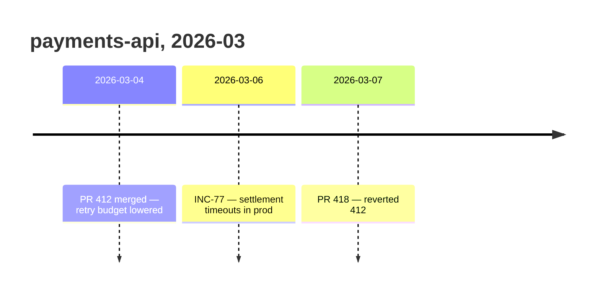

# Potpie Change Timeline

Use this skill when the user asks what changed, when debugging a possible
regression, or when ingesting source history from GitHub, Linear, Jira, docs, or
deployment records.

## Fast Path

A pot is the project boundary and can contain multiple repos, so do not narrow
to the current repo unless the user asks. Take the window from the question and
read once; do not start at seven days and widen.

```bash
potpie resolve "<the question, e.g. what changed in checkout in the last month>"
```

`resolve` infers the `operations` intent from words like *changed / recent /
since / when* and returns timeline rows as `activity TOUCHED service · fact`.
For the full ordered list, one bounded read with the window the question
implies — no hint means 30 days. `--detail full` keeps each fact whole;
compact rows cut it at about 120 characters, where the root cause usually sits:

```bash
potpie graph read --subgraph recent_changes --view timeline --format table --detail full --time-window 30d --limit 50
```

Use the user's exact dates when provided:

```bash
potpie graph read --subgraph recent_changes --view timeline --format table --detail full --since 2026-06-01 --until 2026-06-15 --limit 50
```

Only narrow when the user gives a service, environment, or topic. A `--query`
re-ranks the rows inside the window and never empties it (`--query-threshold`
does nothing here), so read the scores:

```bash
potpie graph read --subgraph recent_changes --view timeline --format table --detail full --scope service:<service-name> --query "<symptom feature deployment>" --time-window 30d --limit 50
```

Pass `--pot local:<name>` once the first read has named the pot.

## Apply Results

Timeline context is correlation, not proof. Use it to choose files, PRs, tickets,
or deploys to inspect, then verify the source ref before blaming a change.
Timeline reads do not include uncommitted local work unless it was recorded.

## Report Back

Show the `graph read` you ran with its window and `--limit`. A timeline is only
as complete as its bounds, and "nothing changed since March" reads very
differently once the reader can see you asked for fifty rows in a 30-day window.

When the answer is a sequence — a regression window, a release train, an
incident and the deploys around it — draw it:



Use the recorded `occurred_at` dates, not your reading order, and keep the source
ref in the label so each row stays checkable. Two events in a row do not need a
picture. Correlation stays correlation on a diagram: adjacency is not causation,
so do not draw an arrow from a deploy to an incident you have not verified.

## Record History

For GitHub, Linear, Jira, docs, and similar sources, hydrate records with the
agent's integration tools/connectors first. Do not use Potpie CLI queue
ingestion as the source-history path.

Timeline events are not a `potpie record` type; write them as a plan after
reading the source:

```bash
potpie graph mutation-template --kind timeline-change
potpie --json graph propose --file mutation.json
potpie --json graph commit <plan_id> --verify
```

The template carries the operation shape and required properties; `propose`
validates and names any rejected op by index. Omit `graph_contract_version`
from the payload. `commit --verify` prints the plan id, readback and quality
status, so `graph history --plan <plan_id>` is only for later inspection.

Use the source event time for `occurred_at`, not ingestion time. Add fixes,
decisions, bug patterns, or infra links only when the source explicitly supports
them.

Timeline capture is harness-led. Do not use scanner-driven graph updates or turn
source titles into facts without reading the source.
