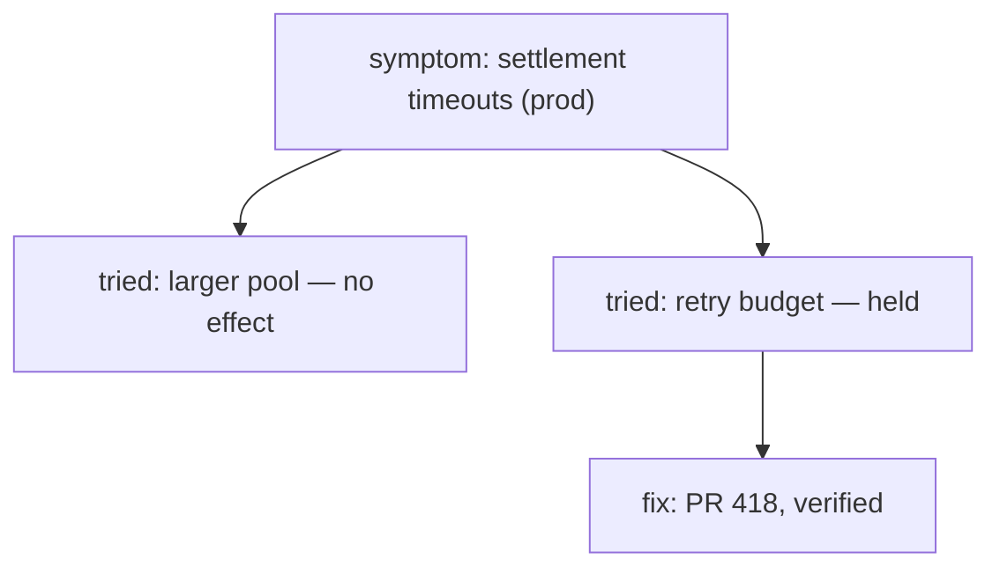

# Potpie Debug Memory

Use this skill before digging into a failure so prior symptoms, known fixes, and
failed attempts can guide the investigation.

## Fast Path

Search by symptom, not just component name: exact error text, failing test,
command, environment, service, dependency, and synonyms. One call first — the
intent is inferred from words like *why / broken / stale / failing / error*, so
prior bugs, the timeline and infra all come back as triples:

```bash
potpie resolve "<symptom in the user's words, plus the exact error text>"
```

Runbooks and their recovery steps live in ingested documents, which
`prior_occurrences` never returns. Ask for them in the same call, or read the
matching section and fetch its text in one batched call:

```bash
potpie resolve "<symptom>" --include prior_bugs,docs,timeline
potpie graph read --subgraph knowledge --view document_context --query "<symptom>" --limit 5
potpie resource get potpie://res/<doc>/<section>/0000 --with-neighbors
```

Go to the named view only when `resolve` is thin. Expand the query there with
synonyms and the exact error text; the view ranks its pool and returns up to
`--limit` rows however weak (`--query-threshold` does nothing here), so judge
each row by its score and text — an exact hit sat at 0.55 in testing:

```bash
potpie graph read --subgraph debugging --view prior_occurrences --query "<expanded symptom query>" --scope service:<service-name> --limit 12
```

If no service is known, omit `--scope`. Pass `--pot local:<name>` once a
header has named the pot. Read infra (`service_neighborhood --depth 2
--direction both`, no `--environment`) only if the cause is still open.

## Apply Results

Treat prior fixes as leads. Check whether the same symptom, environment,
version, dependency, data shape, command, or test path matches this incident.
Failed prior attempts are useful because they prevent repeated work.

## Report Back

Show the reads you ran and, above all, the query text you searched with. The
wording is what decides whether a prior occurrence surfaces at all, so a reader
who can see your phrasing can hand you the one that actually hits — and a search
that returned nothing is a finding worth one line, not a step to omit.

When prior attempts matter as much as the fix, draw the path through them:



The dead ends are the reason to draw it; a picture of one occurrence and one fix
is a sentence with boxes around it. Keep the verification status on the fix node
so an unverified lead is never mistaken for a settled one.

## Record Debug Memory

Record after the investigation when the learning is reusable: bug pattern, fix,
verification, failed attempt, incident summary, runbook note, or setup gotcha.

A fix is one call, and the bug pattern it resolves is minted with it:

```bash
potpie record --type fix --summary "<symptom → fix, in the words a searcher would type>" --detail root_cause="<cause>" --detail fix_steps="<step one>" --detail fix_steps="<step two>" --detail verification_status=verified --scope service:<service-name>
potpie record --type bug_pattern --summary "<distinctive symptom>" --detail kind=<kind> --scope service:<service-name>
potpie record --type verification --summary "<what was checked>" --detail target_ref=<fix-key> --detail outcome=<worked|didnt_work|partial>
```

A repeated `--detail` key builds a list; `--type` help names the keys each
type requires. The `fix` and `bug_pattern` keys are minted from the whole
summary, so keep it short and lead with the distinctive symptom, and
`--scope` should be a key a read already returned.

The plan flow is for a multi-op batch — a fix plus the attempts that failed
plus the verification edge:

```bash
potpie graph mutation-template --kind bug-fix
potpie --json graph propose --file mutation.json
potpie --json graph commit <plan_id> --verify
```

Omit `graph_contract_version` from the payload; `commit --verify` prints the
plan id, readback and quality status.

Good debug memory includes the distinctive error text, repro signal, root cause
or uncertainty, fix steps, verification status, scope, truth class, evidence, and
a retrieval-grade description with symptom synonyms.

If the source may matter but the canonical update is uncertain, use
`potpie --json graph inbox add` instead of committing a weak fact.

Debug memory is harness-led: investigate and verify before writing. Do not use
scanner-driven graph updates or record a bug/fix from filenames or logs alone.
