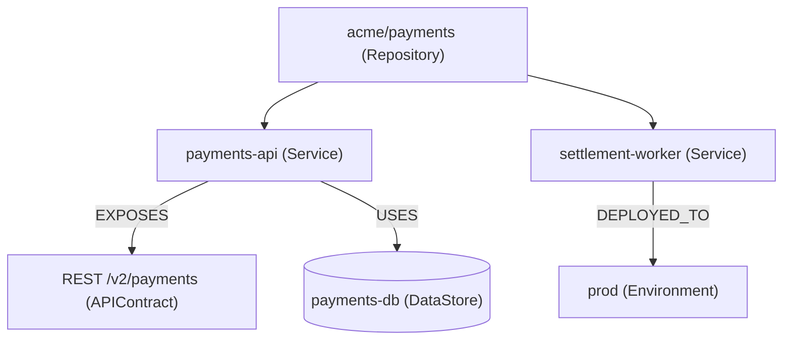

# Potpie Repo Baseline

Use this skill when the user asks to ingest, refresh, establish, or deeply
understand what a repository is and how it works.

## Procedure

1. Check the pot and register the source:

```bash
potpie status
potpie source add repo .
```

`potpie status` names the pot a read will hit, its claim and entity counts and
open quality findings. `source add repo .` records metadata only — it does not
ingest or scan — and sets the repo-local default pot; add
`--pot <pot-id-or-name>` only when the repo must land in a non-default pot.
Every later read repeats the pot in its header, so do not pre-read `pot info`,
`source list` or `graph status`.

2. Take the write shapes from the templates, not from contract discovery:

```bash
potpie graph mutation-template --kind repo-baseline
potpie graph mutation-template --kind feature
potpie graph mutation-template --kind infra-snapshot
```

The templates carry the entity keys, predicates and required properties;
`propose` validates the rest and names any rejected op by index. Run the text
`potpie graph catalog` only if `propose` rejects an operation you believed the
contract allowed. `graph describe --examples` has no mutation example.

3. Create todos for the baseline lanes: docs/product, repo map,
   runtime/deploy, API/data/integrations, preferences/workflows, synthesis,
   identity resolution, write, verify.
4. Read authored sources first, then inspect source files that are authoritative
   for durable facts: routes, service clients, adapters, deployment targets,
   API contracts, model/datastore usage, and test/workflow commands.
5. Resolve identity before writing — one untyped search per entity you intend
   to link and have not already seen in a read (a wrong `--type` guess returns
   nothing):

```bash
potpie graph search-entities "<repo service feature>" --limit 10
```

6. Write one or more semantic mutation batches:

```bash
potpie --json graph propose --file mutation.json
potpie --json graph commit <plan_id> --verify
```

Omit `graph_contract_version` from the payload; `pot_id` is overridden by the
CLI's resolved pot. `commit --verify` reads the claims back and runs the
quality checks, printing the `plan_id`, readback and quality status, so
`graph history --plan <plan_id>` is only for later inspection.

## Deep Baseline Mode

Use this mode whenever the user says "ingest repo", "deeply understand",
"baseline this repo", or asks for broad repo memory.

1. Product and docs:
   - README, docs, ADRs, runbooks, contributing guide, package metadata,
     public docs, linked websites.
   - Capture purpose, app type, domain vocabulary, explicit features,
     decisions, preferences, and workflows.
2. Repo map:
   - Manifests, top-level apps/packages, framework config, route/API
     entrypoints, generated API specs, tests.
   - Capture services/modules only when a source clearly supports them.
3. Runtime and deploy:
   - Dockerfiles, compose, Kubernetes, Terraform, CI workflows, deploy scripts,
     environment templates, feature flags.
   - Capture environments, deploy shape, config variables, release/test
     workflows, and ownership when explicit.
4. API, data, and integrations:
   - Service clients, adapters, auth providers, queues, datastore/model usage,
     external API clients.
   - Capture APIContract, DataStore, Adapter, Dependency, and integration facts
     with file/doc evidence.
5. Preferences and local workflows:
   - Contribution docs, lint/test configs, Makefiles, package scripts,
     PR templates, code comments that explicitly state policy.
   - Record only reusable explicit preferences.
6. Synthesis:
   - Build an evidence matrix before writing. Split high-confidence facts from
     uncertain observations. Use inbox for useful but weak findings.

## Source Priority

1. README and authored docs.
2. ADRs, runbooks, architecture docs, deployment docs.
3. Package/app manifests and top-level workspace definitions.
4. CI/deploy workflows and environment templates.
5. Framework config and route/API specs.
6. Visible route/API entrypoints.
7. Service clients/adapters, only to confirm topology.
8. Datastore/model usage, only to confirm durable infra facts.
9. Tests and fixtures, only to confirm workflows, API behavior, or feature
   intent that is otherwise explicit.

## Baseline Memory

Record source-backed repository purpose, app type, features, deployable services
or modules, environments, deploy shape, dependencies, adapters, datastores,
API contracts, important integrations, ownership, local workflows, and explicit
coding preferences.

Use canonical entity families when writing: `Repository`, `Service`, `Feature`,
`Environment`, `DataStore`, `APIContract`, `Dependency`, and `Preference`.
Represent capabilities as `Feature` entities; link repos or services with
`PROVIDES`, and use `IMPLEMENTED_IN` when a source locates implementation.
Use topology relations such as `DEFINED_IN`, `DEPLOYED_TO`, `DEPENDS_ON`,
`USES`, `EXPOSES`, `USES_ADAPTER`, `CONFIGURES`, and `OWNED_BY` only when the
source supports the relation. Link explicit preferences with
`POLICY_APPLIES_TO`.

Use `authoritative_fact` for explicit source-of-truth evidence, such as docs,
deployment config, API specs, or source files that define behavior. Use
`source_observation` for direct observations that are not necessarily policy.
Use `agent_claim` for lower-authority synthesis. Every entity and claim needs a
compact summary, retrieval-grade description, confidence, truth class, source
authority, and source refs when available.

## Report Back

A baseline that lands only in the graph has not been delivered — the person who
asked for it needs to check it. Show the reads and the write flow you ran, and
name the plan id from `graph commit` so the whole write is inspectable with
`graph history --plan <plan_id>`.

The map of what you found is a shape, so draw it once at the end:



Use the canonical entity families as node labels so the picture and the graph
say the same thing, and draw only relations a source supported — a baseline
diagram that quietly asserts an unverified dependency is the fastest way to make
a wrong fact look settled. Environments, features, and ownership go in prose or
a table; they flatten a topology diagram without adding to it.

## Mutation Requirements

Before proposing:

- Resolve existing repository, service, feature, dependency, and owner entities.
- Prefer updating/linking existing entities over creating near-duplicates.
- Include evidence for `authoritative_fact` and `source_observation`.
- Keep one mutation file to one coherent family or source slice when possible.
- Put low-confidence but useful findings into `graph inbox add`.

After committing, `commit --verify` is the gate. Only when it warns or fails,
drill down with the affected read and the quality report it named:

```bash
potpie graph read --subgraph features --view feature_context --scope anchor_entity_key:<repo-key> --limit 50
potpie graph read --subgraph infra_topology --view service_neighborhood --scope service:<service> --depth 2 --direction both --limit 50
potpie --json graph quality duplicate-candidates --limit 20
potpie --json graph quality low-confidence --limit 20
```

## Boundaries

Baseline capture is harness-led. Do not run scanner-driven graph updates or
legacy ingestion commands to invent modules, services, features, or
dependencies. Do not record dependencies just because a lockfile mentions them.
Do not infer baseline architecture from PR titles or issue status; change
history and change-history facts belong in `potpie-change-timeline`.
Local file inspection is allowed and expected, but the harness must read,
interpret, and cite the evidence before writing semantic facts.
