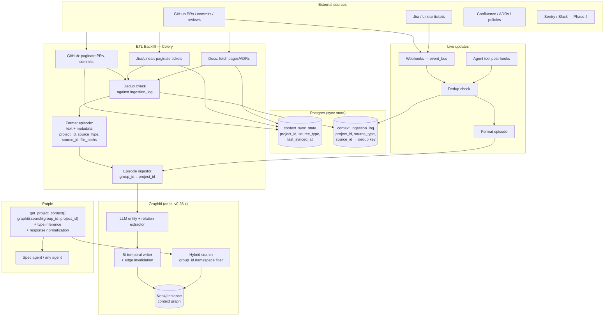

# Context Graph Architecture Plan

## 1) Objective

Give agents **project memory** — not just code structure, but *why* code changed, *who* changed it, what constraints exist, and what happened recently. Today agents start every session from scratch. With a context graph, they can reason like an engineer who's been on the project.

---

## 2) Core idea: Graphiti as-is (no fork)

We use **[Graphiti](https://github.com/getzep/graphiti)** (Zep's temporal knowledge graph, v0.28.x) **as-is** as the context store. No fork. Our code is responsible for:

- **Formatting episodes** — we turn PRs, tickets, commits, and agent actions into consistent episode text. Project isolation is enforced by Graphiti's native **`group_id` namespacing** (our `project_id` = Graphiti's `group_id`), not text search.
- **Sync state tracking** — a small Postgres table (`context_sync_state`) tracks `last_synced_at` per project and source type, and a `context_ingestion_log` tracks every episode sent so deduplication is deterministic.
- **Two write paths** — ETL backfill and live triggers send episodes to Graphiti with deduplication checks.
- **One agent tool** — `get_project_context(project_id, file_paths?, query?, limit?)` calls `graphiti.search(query=..., group_id=project_id)` — a hard namespace filter, not text matching.

Graphiti gives us: bi-temporal modeling, hybrid retrieval (semantic + BM25 + RRF reranking), edge invalidation, and sub-second search. We use a **separate Neo4j instance** for Graphiti so it never clashes with the existing code graph.

```
ETL (backfill history)  ──┐
                           ├──→  Graphiti (group_id = project_id) → Neo4j (context)  ←──→  get_project_context() → Agent
Triggers (live updates)  ──┘
      ↕
 Postgres (context_sync_state + context_ingestion_log)
```

---

## 3) Two-graph system in Neo4j

Potpie already has a **code graph** in Neo4j. We add a **context graph** in a **separate Neo4j instance** so the two never mix.

| | Code Graph (existing) | Context Graph (Graphiti) |
|---|---|---|
| **Purpose** | Structure: what exists, who calls whom | History: what happened, what was decided |
| **Neo4j** | Existing instance (Community Edition) | Separate instance for Graphiti |
| **Schema** | Our schema (NODE, FILE, etc.) | Graphiti's schema (EntityNode, EpisodicNode, CommunityNode) |
| **Scoping** | `repoId` = project_id | **`group_id` = project_id** — native graph namespace, not text filter |
| **Write path** | Parsing pipeline (CodeGraphService) | ETL backfill + live triggers → episode formatter → dedup check → Graphiti |

### Project isolation: CONFIRMED

Graphiti's `group_id` is a **first-class namespacing feature** ([docs](https://help.getzep.com/graphiti/core-concepts/graph-namespacing)):
- `add_episode(..., group_id=project_id)` — namespaces episode and all extracted entities.
- `search(query=..., group_id=project_id)` — restricts search to this namespace only.
- Designed for multi-tenancy. No metadata filter workaround needed; this is native isolation.

**Known Graphiti bugs to track:**
- **#1012**: `group_id` doesn't work with `AnthropicClient` LLM provider (still open). Potpie defaults to OpenAI, so not a blocker. If switching to Anthropic, verify this is fixed first.
- **#1249**: BM25 search with *multiple* `group_ids` only filters by the last one. Not relevant — we always query with a single `group_id`.

### Neo4j cost: two instances vs one

Neo4j Community Edition (which we use) does **not** support multiple named databases. Graphiti's schema (`EntityNode`, `EpisodicNode`, `CommunityNode`) would collide with our code graph schema (`FILE`, `CLASS`, `FUNCTION`) if co-located in the same DB.

**Decision:** Two separate Neo4j instances for Phase 1 (safe, isolated). Evaluate at Phase 3 whether migrating to Neo4j Enterprise (multi-database support) or a lighter graph DB (FalkorDB, which Graphiti also supports) reduces cost.

### Multiple branches: same graph, branch in episode text

**Yes — all branches update the same graph.** We use a single `group_id = project_id`, so:

- Commits from `main`, `feature/foo`, `develop`, etc. all go into the same project namespace.
- PRs (each has source and target branch) also go into that same namespace.
- There is no branch-level isolation in the graph.

**Implications:**

| Aspect | Effect |
|--------|--------|
| **Deduplication** | Commit `source_id = commit_<sha>` is repo-wide unique, so we never ingest the same commit twice. PR `source_id = pr_<n>_merged` is repo-wide unique. No double-ingestion across branches. |
| **Cross-branch mixing** | Search results can mix context from different branches (e.g. a commit on `feature/oauth` and a PR merged to `main`). The agent sees “all project context” unless we narrow it. |
| **Contradictory facts** | Different branches can imply different truths (e.g. “AuthService uses JWT” on main vs “AuthService uses OAuth” on a feature branch). Graphiti’s temporal invalidation is time-based, not branch-aware, so it may treat two episodes from different branches as contradicting and expire one. Acceptable for MVP if we bias toward default/main branch context. |

**Design choice (Phase 1):**

- **Keep one graph per project.** Do not split by branch (no `group_id = f(project_id, branch)` for now) to avoid namespace proliferation and unclear rules for PRs (e.g. which branch “owns” a merged PR).
- **Put branch in the episode text** for commits and PRs so it’s searchable, e.g.:
  - Commits: *"Branch: main. Commit \<sha\>. Message: …"* or *"Branch: feature/foo. Commit …"*
  - PRs: *"PR #42 merged from feature/foo into main. Title: …"*
- **Optional branch filter in `get_project_context`:** add a `branch` (or `branches`) argument. If provided, append e.g. `"branch: main"` (or the given branch name) to the search query string so results are biased toward that branch. This is soft (semantic/BM25) filtering, not a separate namespace.
- **ETL scope:** Phase 1 can sync commits from the **default branch only** to keep the graph aligned with “canonical” history and avoid noisy contradictions from many feature branches. Optionally add “all branches” or “branch filter” in a later phase.

**If branch-specific isolation is needed later (Phase 3+):** consider `group_id = f"{project_id}:{branch}"` for the default branch (and optionally one “aggregate” project graph), with clear rules for which branch gets a given PR/commit. Document as a possible evolution, not required for MVP.

---

## 4) Architecture diagram



---

## 5) Postgres sync state (new — required)

Two small Postgres tables handle sync state and deduplication. These replace the "checkpoint" concept that previously had no defined home.

### `context_sync_state`

Tracks ETL progress per project and source.

| Column | Type | Purpose |
|---|---|---|
| id | SERIAL PK | |
| project_id | TEXT FK → projects | |
| source_type | TEXT | `github_pr`, `github_commit`, `jira_ticket`, `linear_issue`, `confluence_doc` |
| last_synced_at | TIMESTAMP | Cursor for incremental sync |
| status | TEXT | `idle`, `running`, `failed` |
| error | TEXT (nullable) | Last error if failed |
| updated_at | TIMESTAMP | |

### `context_ingestion_log`

Tracks every episode already sent to Graphiti, for deduplication.

| Column | Type | Purpose |
|---|---|---|
| id | SERIAL PK | |
| project_id | TEXT | |
| source_type | TEXT | |
| source_id | TEXT | External ID (PR number, ticket ID, commit SHA, etc.) |
| graphiti_episode_id | TEXT | ID returned by Graphiti on ingest |
| ingested_at | TIMESTAMP | |

**Unique index on `(project_id, source_type, source_id)`** — before sending any episode, check this table. If already present, skip. This prevents duplicate ingestion from ETL re-runs and concurrent webhook fires for the same event.

---

## 6) How we use Graphiti without forking

| Concern | Approach |
|---|---|
| **Project isolation** | `group_id = project_id` on every `add_episode()` and `search()`. Native graph namespace — **confirmed working** with Neo4j driver + OpenAI LLM client. |
| **File-scoped context** | Include file paths in the episode text ("Files changed: auth_service.py, payment.py"). At query time, include file paths in the search text. This is fuzzy text matching, not exact graph traversal — acceptable for MVP. |
| **Consistent episode format** | Fixed text schema per source type (see §7). Key facts (source_id, source_type, files, title, summary) are always in the text. `group_id` handles project scoping. |
| **Type inference** | Phase 1: infer `type` from the `source_type` string in episode text. Phase 2: use Graphiti's **custom entity types** (Pydantic models) for typed extraction and `node_labels` filtering. |
| **Entity updates** | Treat significant state changes as **new episodes** with versioned `source_id` (e.g., `pr_42_opened`, `pr_42_merged`). Graphiti's edge invalidation handles temporal evolution; node upsert gives latest summary. |
| **Agent-facing API** | `get_project_context` calls `graphiti.search(query=..., group_id=project_id)`, normalizes results, returns a capped, typed list. |
| **Graphiti deployment** | Graphiti is used as a Python library (`graphiti-core` pip package) embedded in Potpie's Celery workers and FastAPI. Not a separate service. Uses OpenAI by default (configurable). |
| **Rollback** | Query `context_ingestion_log` for episode UUIDs → `graphiti.remove_episode(uuid)` per episode → delete log rows → reset sync state. Episode-by-episode; no bulk group delete API. |

---

## 7) Episode format

Each episode has: **text** (for Graphiti's LLM extraction and hybrid search), a **`group_id`** (`project_id` for namespace isolation), and a **`source_description`** (for provenance).

The `source_id` used for dedup in `context_ingestion_log` is versioned for state changes (e.g., `pr_42_merged` is a separate episode from `pr_42_opened`).

| Source | `source_description` | Episode text | `source_id` (for dedup) |
|---|---|---|---|
| **GitHub PR (opened)** | `github_pr` | "Branch: \<source_branch\> → \<target_branch\>. PR #\<n\> opened. Title: \<title\>. Description: \<desc\>. Files: \<paths\>. Author: \<author\>." | `pr_<n>_opened` |
| **GitHub PR (merged)** | `github_pr` | "Branch: merged from \<source_branch\> into \<target_branch\>. PR #\<n\> merged. Title: \<title\>. Summary: \<summary\>. Files: \<paths\>. Review: \<key points\>. Author: \<author\>. Merged: \<date\>." | `pr_<n>_merged` |
| **GitHub commit** | `github_commit` | "Branch: \<branch_name\>. Commit \<sha\>. Message: \<message\>. Files: \<paths\>. Author: \<author\>. Date: \<date\>." | `commit_<sha>` |
| **Jira ticket** | `jira_ticket` | "Jira ticket \<id\>. Title: \<title\>. AC: \<acceptance_criteria\>. Status: \<status\>. Priority: \<priority\>." | `jira_<id>_<status>` |
| **Linear issue** | `linear_issue` | "Linear issue \<id\>. Title: \<title\>. \<description\>. Status: \<status\>." | `linear_<id>_<status>` |
| **Confluence / ADR** | `confluence_doc` | "Document: \<title\>. Type: \<ADR/policy\>. \<summary bullets\>." | `doc_<page_id>` |
| **Agent action** | `agent_action` | "Agent \<action_type\>: \<summary\>." | `agent_<uuid>` |

- **Branch in text:** Commits and PRs include the branch name (and for PRs, source → target). Enables soft branch filtering by appending e.g. "branch: main" to the search query. Phase 1: no branch-level graph partition.
- **ETL scope for commits:** Phase 1 can restrict commit sync to the **default branch** only to reduce cross-branch noise; optional "all branches" in a later phase.
- File paths in text for fuzzy search; `group_id` for project scoping.

---

## 8) Two write paths

### 8.1 ETL backfill (Celery)

- **Triggered** by: project first set up, or an explicit admin/API trigger for existing projects. A one-time migration job can queue all existing projects on rollout.
- **Commits:** Phase 1 can sync only the **default branch** to avoid cross-branch noise; include branch name in episode text. PRs are repo-wide (branch info in text).
- Read `last_synced_at` from `context_sync_state` for this (project_id, source_type); fetch only items newer than that cursor.
- For each item: build versioned `source_id` (e.g., `pr_42_merged` for a merged PR, `commit_<sha>` for a commit — SHA is unique across branches).
- Check `context_ingestion_log` by `(project_id, source_type, source_id)`; skip if already ingested.
- Format episode text; call `graphiti.add_episode(name=..., episode_body=text, source=EpisodeType.text, source_description=source_type, reference_time=event_time, group_id=project_id)`.
- For large backfills: use `graphiti.add_episode_bulk()` (skips edge invalidation, but fine for initial load).
- On success: write to `context_ingestion_log` with `graphiti_episode_id`; update `last_synced_at` in `context_sync_state`.
- On failure: mark `context_sync_state.status = failed`; retry via Celery retry policy.

**LLM extraction cost note:** Graphiti runs an LLM call per episode on ingest. For large backfills (e.g. 500 PRs, 2000 commits), this adds up. Batch ETL runs during off-peak hours; use `gpt-4o-mini` (or similar small model) in Graphiti's LLM config; rate-limit the ingestion Celery queue.

### 8.2 Live triggers

- **Webhooks** (existing `event_bus`): on PR merged, ticket updated, etc. → build versioned `source_id` → check `context_ingestion_log` → format episode → `graphiti.add_episode(..., group_id=project_id)` → log to `context_ingestion_log`.
- **Agent tools**: after `create_jira_issue`, `update_linear_issue`, `create_pr` succeed → format agent-action episode with `source_id=agent_<uuid>` → send to Graphiti → log.

State changes (e.g., ticket moved from "in progress" to "resolved") produce new episodes with versioned `source_id` (e.g., `jira_TICKET-123_resolved`). Graphiti's edge invalidation automatically handles the temporal evolution.

---

## 9) Agent tool: `get_project_context`

**Signature:** `get_project_context(project_id, file_paths?, query?, branch?, source_types?, limit=10)`

**Implementation:**
```python
# Build search text: optional branch bias + query + file_paths
search_text = " ".join(filter(None, [
    f"branch: {branch}" if branch else None,  # soft filter when user works on a specific branch
    query,
    " ".join(file_paths) if file_paths else None,
]))
results = await graphiti.search(
    query=search_text,
    group_id=project_id,     # native namespace filter — hard isolation
)
```

- **Namespace isolation**: `group_id=project_id` — all branches live in the same graph; isolation is by project only.
- **Optional `branch`**: When provided (e.g. user is on `main` or `feature/oauth`), prepend "branch: \<name\>" to the search text so results are biased toward that branch. Soft (semantic/BM25) filtering only.
- If `file_paths` given: add them to the search text (fuzzy text search, MVP limitation).
- If `query` given: include in the search text.
- **Type inference**: Phase 1 — parse `source_description` from episode results. Phase 2 — use `node_labels` filter with custom entity types.
- Cap results at `limit`. Graphiti's search supports `limit` parameter (max 50).
- Return: `[{ type, title, summary, source_url, occurred_at }]`.

**Integration into SpecGenAgent (3 touchpoints):**
1. **Tool implementation**: new file `app/modules/intelligence/tools/context_tools/get_project_context_tool.py` — a `StructuredTool` wrapping Graphiti search.
2. **Registration**: add to `ToolService._initialize_tools()` as `"get_project_context"`.
3. **Agent prompt + tool list**: add `"get_project_context"` to `SpecGenAgent._build_agent()` tool list (alongside existing tools like `ask_knowledge_graph_queries`). Add a prompt step: *"Call `get_project_context` to understand recent PRs, tickets, and design decisions before asking MCQs."*

**Known MVP limitation on file-scoping:** File-path matching is fuzzy text search. "auth_service.py" may return context mentioning similar paths. Acceptable for MVP; custom entity attributes with file_paths can improve this in Phase 2.

**Example response:**
```
1. [github_pr] "Add rate limiting to payment API" (merged 3 days ago)
   Summary: Added 100 req/min limit. Reviewer flagged N+1 query risk.

2. [jira_ticket] "FE-456: Payment timeout on high load" (resolved 1 week ago)
   Summary: Users hitting 504s during peak. AC: p95 < 500ms.

3. [agent_action] "Created ticket FE-789: Add OAuth" (2 days ago)
   Summary: Created during previous spec gen session.
```

---

## 10) Phases

| Phase | Scope |
|---|---|
| **1** | `pip install graphiti-core`. Create `context_sync_state` + `context_ingestion_log` Postgres tables (Alembic). Stand up separate Neo4j instance for Graphiti. Episode format + dedup + ingest for GitHub PR (opened/merged) and commit, using `group_id=project_id`. ETL backfill Celery job (with one-time trigger for existing projects). Webhook handler for PR merge events. `get_project_context` tool with `group_id` namespace filter. Add tool to spec gen agent. |
| **2** | Episode formats and ETL backfill for Jira/Linear and Confluence/docs. Agent tool post-hooks (create/update ticket or PR → agent-action episode). **Custom entity types** (Pydantic models: PullRequest, Ticket, Document) for typed extraction and `node_labels` filtering. |
| **3** | Tune search quality, recency bias, caps. Observability (what context is returned, latency, cost per episode ingest). Evaluate Neo4j cost: Enterprise multi-DB vs FalkorDB (which Graphiti also supports) vs keeping two instances. |
| **4** | Sentry/Slack episodes. Redis cache for hot project context. Custom edge types for cross-source linking (PR resolves Ticket). Evaluate forking Graphiti only if file-path traversal or bulk operations need it. |

---

## 11) Investigated questions and answers

These were investigated by reviewing Graphiti's documentation, source code, API schema, open issues, and the potpie codebase.

### Q1: Does Graphiti support project isolation?
**YES — `group_id` is native graph namespacing.** Our `project_id` maps to Graphiti's `group_id`. It's a first-class feature with dedicated [documentation](https://help.getzep.com/graphiti/core-concepts/graph-namespacing) and a multi-tenant example. No workaround, no fork needed.

### Q2: How do entity updates work?
**Nodes: destructive upsert (latest wins). Edges: bi-temporal with invalidation.** When a PR goes from open to merged, we ingest a second episode (`source_id=pr_42_merged`). The entity node for "PR #42" gets its summary updated (latest state — desirable). Any contradicting edges (e.g., "PR is open") get `expired_at` set and facts rewritten to past tense by Graphiti automatically.

### Q3: Will `context_ingestion_log` grow too large?
**No — well within Postgres comfort zone.** ~700-2750 rows per project, ~200 bytes per row. Even at 1000 projects = ~2.75M rows (~550MB). Unique index on `(project_id, source_type, source_id)` keeps dedup lookups O(1). No partitioning needed until millions of projects.

### Q4: What's the rollback story?
**Episode-by-episode deletion via `graphiti.remove_episode(uuid)`.** Cascading: nodes/edges removed if no other episodes reference them. Query `context_ingestion_log` for the bad batch → delete each episode → wipe log rows → reset `context_sync_state`. No bulk "delete by group_id" API — slow for large projects but acceptable for admin/recovery operations.

### Q5: How does `get_project_context` plug into spec gen?
**3 touchpoints:** (1) New tool file implementing `StructuredTool` wrapping `graphiti.search()`. (2) Register in `ToolService._initialize_tools()`. (3) Add to `SpecGenAgent._build_agent()` tool list + prompt step saying "Call `get_project_context` to understand recent changes before asking MCQs." Project ID flows via existing `ChatContext`.

### Q6: Can we use one Neo4j instance for both graphs?
**Not with Community Edition.** Neo4j Community doesn't support multiple named databases. Graphiti's schema (`EntityNode`, `EpisodicNode`, `CommunityNode`) would collide with our code graph schema (`FILE`, `CLASS`, `FUNCTION`). **Decision: two instances for Phase 1.** Evaluate Enterprise multi-DB or FalkorDB (which Graphiti also supports) at Phase 3.

### Q7: Should we use custom entity/edge types?
**Yes, but Phase 2, not Phase 1.** Graphiti supports Pydantic-model entity types (e.g., `PullRequest(pr_number, author, status)`) and edge types (e.g., `Resolves`). These enable `node_labels` / `edge_types` search filtering. Phase 1 uses plain episodes with `source_description` for type inference. Phase 2 adds typed entities for richer extraction and filtering.

---

## 12) Known limitations

- **Multiple branches → same graph** — All branches write to one namespace (`group_id = project_id`). No branch-level isolation. Cross-branch facts can co-exist or conflict; Graphiti’s invalidation is time-based, not branch-aware. Mitigation: include branch in episode text; optional `branch` in `get_project_context` for soft filtering; Phase 1 ETL can sync default-branch commits only.
- **File-path scoping is fuzzy** (text search, not exact graph traversal). Improve via custom entity attributes with `file_paths` field in Phase 2.
- **LLM extraction cost at write time** — Graphiti runs an LLM call per episode. Mitigated by: small model in Graphiti config (e.g., `gpt-4o-mini`); off-peak batching; dedup prevents re-ingestion.
- **Node temporal versioning absent** — Graphiti node attributes are destructive upsert ([Issue #1166](https://github.com/getzep/graphiti/issues/1166)). Acceptable: latest summary is what we want; edge history captures temporal evolution.
- **No bulk delete by `group_id`** — rollback is episode-by-episode. Acceptable for admin operations.
- **Anthropic LLM client bug** — `group_id` doesn't work with Anthropic ([Issue #1012](https://github.com/getzep/graphiti/issues/1012)). Not a blocker (we default to OpenAI). Track for resolution.

---

## 13) Risks

| Risk | Mitigation |
|---|---|
| Project isolation failure | `group_id` = native namespace. Confirmed working with Neo4j driver + OpenAI client. |
| Duplicate episodes | `context_ingestion_log` with unique index on (project_id, source_type, source_id). Versioned source_id for state changes. |
| LLM extraction cost (backfill) | Small model in Graphiti config; off-peak batch ETL; rate-limited Celery queue; dedup prevents re-ingestion. |
| Stale data | Live triggers + versioned source_id for state changes. Graphiti edge invalidation for superseded facts. |
| API rate limits (ETL) | Incremental sync via `context_sync_state.last_synced_at`; backoff; failure state tracking. |
| Two Neo4j instances = 2x cost | Evaluate Enterprise multi-DB or FalkorDB at Phase 3. |
| Backfill not triggered for existing projects | One-time migration job queues all existing projects on rollout. |
| Rollback complexity | `context_ingestion_log` serves as episode manifest for targeted deletion. |
| Anthropic provider incompatibility | Default to OpenAI for Graphiti LLM. Track bug #1012. |

---

## 14) What we're NOT doing (yet)

- No fork — use Graphiti as-is; revisit at Phase 4 only if needed.
- No context packs / Redis cache — add in Phase 4 if hot project context needs caching.
- No migration of the existing code graph — context graph is additive.
- No exact file-level graph traversal — fuzzy text for Phase 1; custom entity attributes in Phase 2.
- No Slack/Sentry/Datadog until Phase 4.
- No custom entity/edge types until Phase 2.

---

## 15) Success criteria

- Agents get PR history, ticket constraints, and policy context via one tool call, scoped to their project (no cross-project leakage via `group_id`).
- Context graph stays current via ETL backfill and live triggers with no duplicate entries.
- Spec quality improves (fewer missing constraints, better awareness of recent changes).
- Latency for context retrieval in the same ballpark as Graphiti's hybrid search (sub-second target).
- ETL extraction cost stays within budget (small model, dedup, off-peak batching).
