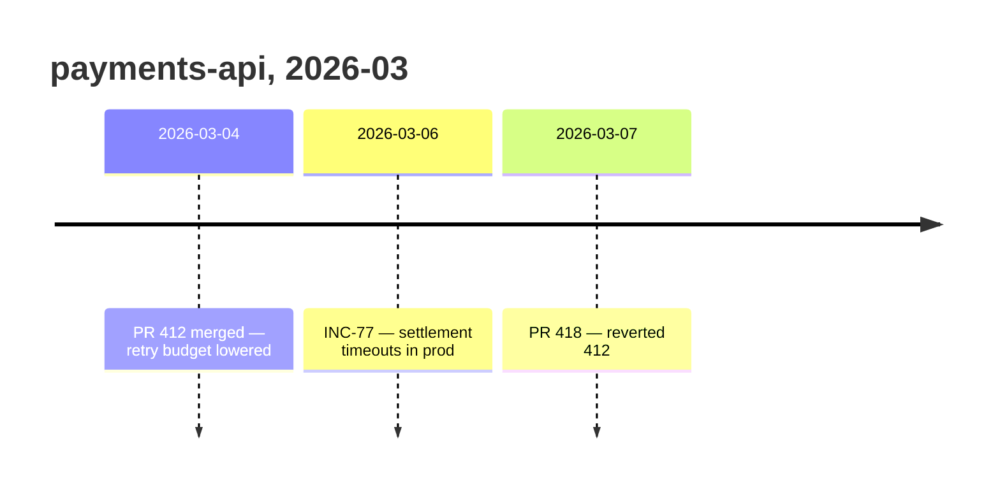

# Potpie Change Timeline

Use this skill when the user asks what changed, when debugging a possible
regression, or when ingesting source history from GitHub, Linear, Jira, docs, or
deployment records.

## Fast Path

Read the project timeline first. A pot is the project boundary and can contain
multiple repos, so do not narrow to the current repo unless the user asks.

```bash
potpie graph read \
  --subgraph recent_changes \
  --view timeline \
  --format table \
  --time-window 7d \
  --limit 20
```

Use the user's exact dates when provided:

```bash
potpie graph read \
  --subgraph recent_changes \
  --view timeline \
  --format table \
  --since 2026-06-01 \
  --until 2026-06-15 \
  --limit 50
```

Only narrow when the user gives a service, environment, or topic:

```bash
potpie graph read \
  --subgraph recent_changes \
  --view timeline \
  --format table \
  --scope service:<service-name> \
  --query "<symptom feature deployment>" \
  --time-window 14d \
  --limit 20
```

## Apply Results

Timeline context is correlation, not proof. Use it to choose files, PRs, tickets,
or deploys to inspect, then verify the source ref before blaming a change.
Timeline reads do not include uncommitted local work unless it was recorded.

## Report Back

Show the `graph read` you ran with its window and `--limit`. A timeline is only
as complete as its bounds, and "nothing changed since March" reads very
differently once the reader can see you asked for twenty rows in a 7-day window.

When the answer is a sequence — a regression window, a release train, an
incident and the deploys around it — draw it:



Use the recorded `occurred_at` dates, not your reading order, and keep the source
ref in the label so each row stays checkable. Two events in a row do not need a
picture. Correlation stays correlation on a diagram: adjacency is not causation,
so do not draw an arrow from a deploy to an incident you have not verified.

## Record History

For GitHub, Linear, Jira, docs, and similar sources, hydrate records with the
agent's integration tools/connectors first. Do not use Potpie CLI queue
ingestion as the source-history path.

Use the workbench write flow after reading the source:

```bash
potpie --json graph catalog --task "record timeline change"
potpie --json graph describe recent_changes --view timeline --examples
potpie --json graph propose --file mutation.json
potpie --json graph commit <plan_id> --verify
potpie --json graph history --plan <plan_id>
```

Use the source event time for `occurred_at`, not ingestion time. Add fixes,
decisions, bug patterns, or infra links only when the source explicitly supports
them.

Timeline capture is harness-led. Do not use scanner-driven graph updates or turn
source titles into facts without reading the source.
