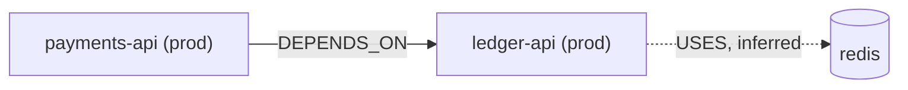

# Potpie Graph Workbench

The graph is project memory: preferences, prior bugs and their fixes, infra
topology, decisions, and a timeline of changes. You are the intelligence that reads
it before acting and writes durable learnings after. Potpie validates, lowers,
commits, audits, and ranks. It does **not** scan a repository or infer rich facts
from prose for you.

Use text output for routine context reads. Add `--json` when a workflow needs
exact machine parsing, mutation plans, commits, history verification, or full
evidence/debug payloads.

## 1. Check Status And Discover The Contract

```bash
potpie graph status
potpie graph catalog --task "<task>" --profile read
```

Returns contract + ontology versions, the readable **views**, and active
`match_mode` (`vector` vs `lexical`). Start graph-aware work here instead of
reading docs. Use full JSON catalog output when you need mutation operation
partitions, entity types, predicates, or exact machine parsing. Trust the
catalog's current operation partition over any example in a skill file.

Describe the subgraph/view before a non-trivial read or write:

```bash
potpie graph describe debugging --view prior_occurrences --examples
```

## 2. Read - `graph read --subgraph --view`

```bash
potpie graph read --subgraph debugging --view prior_occurrences --query "refund race timeout" --limit 8
potpie graph read --subgraph debugging --view prior_occurrences --query "refund race timeout" --query-threshold 0.55 --limit 8
potpie graph read --subgraph decisions --view preferences_for_scope --scope repo:acme/x,path:src/payments/client.py
potpie graph read --subgraph recent_changes --view timeline --time-window 7d --limit 20 --format table
potpie graph read --subgraph recent_changes --view timeline --source-ref <github-pr-or-issue-ref> --format table
potpie graph read --subgraph infra_topology --view service_neighborhood --scope service:payments-api --depth 2 --direction out --environment prod
potpie graph neighborhood --entity service:payments-api --predicate USES --detail summary --limit 20
```

Views and what they answer:

| View | Inputs | Answers |
|---|---|---|
| `decisions.preferences_for_scope` | `--scope repo:…,path:…` `--query` | which preferences apply to this code |
| `debugging.prior_occurrences` | `--query` (symptom), optional `--scope service:…` | "seen this before? what fixed it" (bug + fix/PR inline) |
| `recent_changes.timeline` | optional `--scope`, `--since`, `--until`, `--time-window` | recent PRs/tickets/activity for the project pot |
| `infra_topology.service_neighborhood` | `--scope service:…` `--depth` `--direction` `--environment` | dependency blast-radius, env-qualified |
| `features.feature_context` | optional `--scope anchor_entity_key:repo:…` | what a repo/service does (Feature nodes via `PROVIDES` / `IMPLEMENTED_IN`) |
| `decisions.active_decisions` | `--scope` | active decisions |
| `code_topology.ownership_by_path` | `--scope` | who owns a scope |
| `knowledge.document_context` | `--scope` / `--query` | reference docs + ingested document sections (hits carry chunk ids) |

Text reads return compact summaries for fast orientation. Timeline reads should
use `--format table` or `--format jsonl` for bounded event rows. Use
`--json --detail full --relations full --format raw` only when you need the
underlying relation payloads for debugging or exact machine processing. Inspect
`coverage`, `freshness`, and `quality` before relying on results.

### Ingested documents: find, then fetch

Ingested documents are `Document` / `DocumentSection` nodes whose section
summaries are claims, so ordinary search and `document_context` reads land on
them. A section hit already carries its chunk ids
(`potpie://res/<doc>/<section>/<seq>` in `chunk_ids` / source refs) — fetch
text with one batched call, no graph query on the path:

```bash
potpie resource get potpie://res/<doc>/<section>/0000 --with-neighbors
potpie resource list --doc <doc-slug>
```

`SECTION_OF` holds a document together; `DOCUMENTS` points a document (or one
section) at what it covers — assert it when reference material lands, so the
structural read answers "what documentation covers this service". To ingest a
new document, use the per-format `potpie-resource-*` skills (pdf, spreadsheet,
markdown/html): an extraction script emits chunks, `potpie resource import`
stores them; document payloads never enter the graph.

### Query expansion is your job

The local embedder is small; recall depends on the query. Expand the user's words
before reading: "add retry to the payments client" → also carry "timeout, flaky,
tenacity, backoff, external call". That expansion is in-session reasoning, not
something the daemon does.

## 3. Resolve identity — `graph search-entities`

**Before** linking or asserting against an existing entity, find its canonical key:

```bash
potpie graph search-entities "payments api" --type Service --limit 10
potpie graph search-entities "github issue 881" --source-ref <github-pr-or-issue-ref> --limit 10
```

Reuse the returned `key`. Inventing a near-duplicate key (`service:payments` vs
`service:local:payments-api`) fragments the graph and breaks future reads.

## 4. Write - `graph propose` then verified `graph commit`

Writes are **semantic** operations (never raw graph CRUD). First create a
server-held plan with `propose`; then commit exactly that `plan_id`.

```bash
potpie graph mutation-template --kind repo-baseline   # schema-only skeleton to fill
potpie --json graph propose --file mutation.json
potpie --json graph commit mutation-plan:01JY8T5C --verify
potpie --json graph history --plan mutation-plan:01JY8T5C
```

`mutation-template` kinds: `repo-baseline`, `feature`, `preference`,
`preference-policy`, `infra-snapshot`, `bug-fix`, `decision`, `timeline-event`,
`timeline-change` — placeholders only; you fill them from sources you actually
read. Use the use-case templates for durable memory:

- `preference-policy` writes structured policy fields (`policy_kind`,
  `prescription`, `strength`, `audience`) and can target a `CodeAsset`.
- `infra-snapshot` writes environment-qualified service, adapter, config, and
  deployment-target facts (`USES_ADAPTER`, `CONFIGURES`, `DEPLOYED_WITH`).
- `timeline-change` writes source-time activity events; `occurred_at` is the
  PR/ticket/deploy time, not ingestion time.
- `bug-fix` writes the symptom, known fix, and optional verification edge so
  `debugging.prior_occurrences` can return the fix inline.

Repo/service functionality is first-class: assert
`PROVIDES` (repo/service → `Feature`) and `IMPLEMENTED_IN` (feature → repo/
service/`CodeAsset`), each `Feature` carrying a compact `summary` and a
retrieval-grade `description`.

Payload is always batch-shaped:

```json
{
  "graph_contract_version": "v1.5",
  "pot_id": "local/default",
  "idempotency_key": "mutation:bug:settle-deadlock",
  "created_by": {"surface": "cli", "harness": "claude"},
  "operations": [
    {
      "op": "assert_claim",
      "subgraph": "debugging",
      "subject": {"key": "bug_pattern:settle-deadlock", "type": "BugPattern",
                  "properties": {"name": "settle deadlock under concurrent refund"}},
      "predicate": "REPRODUCES",
      "object": {"key": "service:local:payments-api", "type": "Service"},
      "truth": "agent_claim",
      "confidence": 0.9,
      "description": "Concurrent refund + settle on the same order deadlocks the payments DB; shows up as 'refund race timeout' / 'payment deadlock on concurrent settle' under load in prod.",
      "evidence": [{"source_ref": "github:pr:412", "authority": "external_system"}]
    }
  ]
}
```

Use only operations advertised by `graph catalog`. Common operations include
`upsert_entity`, `link_entities`, `assert_claim`, `append_event`,
`end_relation_validity`, `retract_claim`, and audited correction operations when
the catalog marks them applicable. Never hard-delete a claim: use validity,
retraction, supersession, or merge operations according to the catalog policy.

## 5. Capture uncertainty - `graph inbox`

Use the inbox when you have evidence that may matter, but you cannot safely pick
the canonical graph update yet. Inbox items are pending work only; they do not
appear in ordinary graph reads as facts.

```bash
potpie --json graph inbox add --summary "Refund retry PR may relate to the prior timeout bug" --evidence github:pr:acme/payments:955 --subgraph debugging
potpie --json graph inbox list --status pending --limit 20
potpie --json graph inbox claim graph-inbox:abc123 --by user:alice
potpie --json graph inbox mark-applied graph-inbox:abc123 --plan mutation-plan:01JY8T5C --mutation mutation-1 --by user:alice
potpie --json graph inbox mark-rejected graph-inbox:abc123 --reason "not enough evidence" --by user:alice
```

Processing an inbox item is normal graph work: inspect the catalog/contract, read
the relevant views, resolve identity with `search-entities`, propose and commit a
mutation if warranted, then mark the inbox item applied or rejected.

## 6. Inspect quality - `graph quality`

Quality reports are read-only. They surface graph maintenance work but never
repair semantic facts directly.

```bash
potpie --json graph quality summary
potpie --json graph quality duplicate-candidates --limit 20
potpie --json graph quality stale-facts --subgraph infra_topology --limit 20
potpie --json graph quality conflicting-claims --limit 20
potpie --json graph quality orphan-entities --limit 20
potpie --json graph quality low-confidence --threshold 0.75 --limit 20
potpie --json graph quality projection-drift --limit 20
```

If a finding changes canonical meaning, repair it through `graph propose` and
`graph commit --verify`. If the evidence is uncertain, create a
`graph inbox add` item instead. Reserve `graph repair` for operator projection
maintenance such as index or summary rebuilds.

### Truth classes

Pick the truth class honestly — it feeds the ranker:

`authoritative_fact` (explicit source of truth) · `source_observation` (observed
source data read by the harness) · `user_decision` (a person decided) ·
`preference` · `agent_claim` (you inferred it; default when unsure) ·
`timeline_event` (something happened) · `quality_finding`. Durable writes need
evidence **or** an explicitly low-authority truth class.

Do not use the graph as a deterministic code scanner. If a repo, PR, ticket, log,
or document should become memory, the harness reads that source, decides what is
worth recording, resolves identity, and writes a semantic mutation.

For GitHub, Linear, Jira, and similar hosted integrations, use the agent's
integration tools/connectors to pull and hydrate source records first. Do not use
Potpie CLI queue ingestion as the graph update path; after reading
the integration data, write durable facts with `graph propose` / `graph commit --verify`
or capture uncertainty with `graph inbox`.

### Retrieval-grade descriptions (the one rule that matters most)

Every entity and claim carries a `description` — a natural-language **retrieval
card** the local embedder indexes. Write it **for search, not display**: include the
**symptoms, synonyms, and scope** a future searcher would type. Validation only
*warns* on a weak description, but a vague card means the fact never resurfaces.
Compare:

- Weak: `"deadlock fix"`
- Strong: `"Concurrent refund + settle deadlocks payments DB under load; seen as 'refund race timeout' and 'payment deadlock on concurrent settle' in prod; fixed by ordering lock acquisition in services/payments/settle.py"`

## 7. Report back — the commands, then a diagram if it earns its place

Every read above is an argument for the answer you give, so put it on the page.
Show the `potpie` commands you ran **verbatim** — the subgraph, view, scope,
query, and limit included. A reader cannot re-run "I checked the graph", cannot
tell that your `--limit 5` is why the list looks short, and cannot spot that you
read `--environment staging` when they meant prod. Print the reads that returned
nothing too: an empty `search-entities` is normally the reason an answer is thin,
and silence about it reads as a confident negative.

For a write, name the `plan_id` and whether `commit --verify` passed. That is the
handle for `graph history --plan <plan_id>`, and it is the difference between
"recorded" and "recorded and checked".

Then draw the result when the result is a shape:

| The answer is | Draw |
|---|---|
| three or more entities and the edges between them | `flowchart LR` |
| an ordered run of events — deploys, PRs, incidents | `timeline` |
| a symptom moving through attempts to a fix | `flowchart TD` |



Skip the diagram otherwise. One or two entities, a single claim, a yes/no, or a
list of preferences reads faster as a sentence, and a picture that restates one
line costs the reader time instead of saving it.

A diagram is a claim and inherits the same discipline as a mutation: draw only
edges a read or a source supports, label edges with the predicate the graph
actually uses, keep environment qualifiers on the nodes that carry them, and dash
anything you inferred. Never add an edge to make the picture connected — an
invented edge in a diagram is a fact the reader will repeat.

## Responding To Nudges

A Potpie hook may call `graph nudge` and inject its result into your session. The
hook never reasons — you do.

- **`inject_context`** → treat the injected facts as graph truth for this task; they
  were ranked for your current scope, so use them rather than re-fetching.
- **`instruction`** (e.g. "you resolved `<error>` after editing `<files>` — record
  the bug+fix if non-obvious", or "capture durable learnings") → a *prompt to
  decide*, not an auto-write. Decide the truth class, resolve identity with
  `graph search-entities`, write a retrieval-grade `description`, then
  `graph propose` and `graph commit --verify`. If the learning is useful but uncertain,
  create a `graph inbox add` item instead.
  If nothing durable was learned, do nothing.

Writes are idempotent by `idempotency_key`, so a nudge-driven capture you've already
made will not duplicate.
