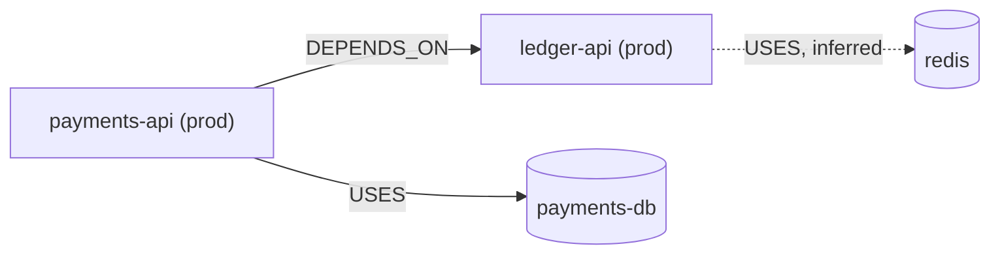

# Potpie Infra Architecture

Use this skill when the task touches environments, adapters, deployment behavior,
runtime config, service dependencies, production incidents, or architecture
changes.

## Fast Path

Share one discovery pass with other skills; reuse current reads and hook context
for the same task, pot, and scope. Run broad resolve and an untyped entity lookup
concurrently when the task names a service, environment, adapter, or dependency
whose canonical key is unknown. Skip the lookup when a key is already known.
For code changes, scoped preferences can run alongside both. Use a known
explicit pot selector; resolve ambiguous routing before scoped retrieval and
check returned pot IDs before combining results.

Broad context and conditional identity lookup:

```bash
potpie resolve "<the task, naming the service>"
potpie graph search-entities "<named service env adapter dependency>" --limit 10
```

Use the returned canonical service key for a neighborhood when the task needs
relationships or resolve leaves a gap; do not guess an anchor. For a direct
entity question, identity lookup then neighborhood can suffice without resolve.
The `service:<service-name>` below stands for that returned key. Start with
**no `--environment`**:

```bash
potpie graph read --subgraph infra_topology --view service_neighborhood --scope service:<service-name> --depth 2 --direction both --limit 20
```

The environment filter defaults to `qualified_only`: `--environment prod`
alone drops every unqualified edge — `USES`, `DEFINED_IN`, `OWNED_BY` — and
answers "talks to nothing". To exclude other environments, keep them explicitly:

```bash
potpie graph read --subgraph infra_topology --view service_neighborhood --scope service:<service-name>,include_unqualified_environment:true --environment <env> --depth 2 --direction both --limit 20
```

An empty neighborhood can mean missing relations, not a wrong key. Start with
`--depth 2 --direction both`; `--direction` accepts `out`, `in` or `both`.
Alternatively, for everything the graph holds about one service — decisions,
preferences, timeline and features beside the topology — use one flat list:

```bash
potpie graph neighborhood --entity service:<service-name> --detail summary --limit 20
```

Choose the neighborhood that answers the question; do not automatically run
both. Fetch already-discovered document chunks concurrently with neighborhood
reads, and stop expanding once the required evidence is covered. Pass
`--pot local:<name>` (or `managed:<name>`) once the pot is known.

## Apply Results

Use infra context for blast radius, where-to-look decisions, deployment changes,
adapter selection, and incident debugging. Preserve environment qualifiers; a
staging dependency is not proof of a production dependency.

Look for explicit topology facts: `DEFINED_IN`, `DEPLOYED_TO`, `DEPENDS_ON`,
`USES`, `EXPOSES`, `HOSTED_ON`, and `OWNED_BY`.

## Report Back

Show the `graph read` you ran, including the `--depth`, `--limit`, and any
`--environment` you chose. A neighborhood is only interpretable next to its
bounds: "nothing depends on it" means one thing at `--depth 2` and another at
`--depth 1`, and the reader cannot tell which you meant unless the command is on
the page.

A neighborhood is the case a diagram was made for — draw it:



Keep the environment qualifier on the node, label every edge with its predicate,
and dash any edge you inferred rather than read — a solid edge asserts the graph
says so. Blast radius is the same picture with the direction reversed. Do not
draw one dependency; say it in a sentence.

## Record Architecture

Record only source-backed topology or carefully labeled agent inferences. Use
`authoritative_fact` when evidence is an explicit source of truth such as
deployment config, service manifest, infra doc, ADR, or user statement. Use
`agent_claim` for lower-authority interpretation.

Topology edges are not a `potpie record` type; write them as a plan:

```bash
potpie graph mutation-template --kind infra-snapshot
potpie --json graph propose --file mutation.json
potpie --json graph commit <plan_id> --verify
```

Reuse the keys your reads returned. Omit `graph_contract_version` from the
payload. If `propose` answers `review_required`, re-run it with
`--approved-by <user-ref>` and commit as above; `commit --verify` prints the
plan id, readback and quality status.

A decision *about* the architecture is one call:

```bash
potpie record --type decision --summary "<the decision>" --detail rationale="<why>" --scope service:<service-name>
```

Every durable infra fact needs an environment when the fact differs by
environment, evidence when available, and a retrieval-grade description.

Architecture capture is harness-led: inspect authoritative sources and write
semantic facts. Do not use scanner-driven graph updates or infer topology from
directory names, imports, or package files alone.
